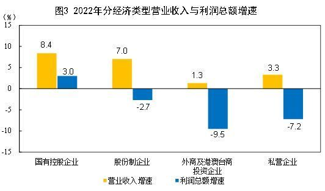

# 统计局：2022年全国规上工业企业利润下降4.0％，国企利润增3%

2022年，全国规模以上工业企业实现利润总额84038.5亿元，比上年下降4.0%（按可比口径计算）。

2022年，规模以上工业企业中，国有控股企业实现利润总额23792.3亿元，比上年增长3.0%；股份制企业实现利润总额61610.9亿元，下降2.7%；外商及港澳台商投资企业实现利润总额20039.6亿元，下降9.5%；私营企业实现利润总额26638.4亿元，下降7.2%。

2022年，采矿业实现利润总额15573.6亿元，比上年增长48.6%；制造业实现利润总额64150.2亿元，下降13.4%；电力、热力、燃气及水生产和供应业实现利润总额4314.7亿元，增长41.8%。

2022年，在41个工业大类行业中，21个行业利润总额比上年增长，19个行业下降，1个行业由亏转盈。

主要行业利润情况如下：石油和天然气开采业利润总额比上年增长1.10倍，电力、热力生产和供应业增长86.3%，煤炭开采和洗选业增长44.3%，电气机械和器材制造业增长31.2%，专用设备制造业增长3.4%，汽车制造业增长0.6%，通用设备制造业增长0.4%，农副食品加工业增长0.2%，化学原料和化学制品制造业下降8.7%，计算机、通信和其他电子设备制造业下降13.1%，非金属矿物制品业下降15.5%，有色金属冶炼和压延加工业下降16.1%，纺织业下降17.8%，石油、煤炭及其他燃料加工业下降82.8%，黑色金属冶炼和压延加工业下降91.3%。

2022年，规模以上工业企业实现营业收入137.91万亿元，比上年增长5.9%；发生营业成本116.84万亿元，增长7.1%；营业收入利润率为6.09%，比上年下降0.64个百分点。

2022年末，规模以上工业企业资产总计156.12万亿元，比上年增长8.2%；负债合计88.30万亿元，增长8.6%；所有者权益合计67.82万亿元，增长7.6%；资产负债率为56.6%，比上年上升0.3个百分点。

2022年末，规模以上工业企业应收账款21.65万亿元，比上年增长12.3%；产成品存货6.04万亿元，增长9.9%。

2022年，规模以上工业企业每百元营业收入中的成本为84.72元，比上年增加0.91元；每百元营业收入中的费用为8.20元，比上年减少0.42元。

2022年末，规模以上工业企业每百元资产实现的营业收入为92.4元，比上年减少2.9元；人均营业收入为182.7万元，比上年增加13.4万元；产成品存货周转天数为17.6天，比上年增加0.9天；应收账款平均回收期为52.8天，比上年增加3.5天。

**2022年工业企业利润结构有所改善**

**——国家统计局工业司高级统计师朱虹解读工业企业利润数据**

2022年，面对严峻复杂的国际环境和多重超预期因素冲击，各地区各部门在以习近平同志为核心的党中央坚强领导下，高效统筹疫情防控和经济社会发展，有效实施稳经济一揽子政策和接续措施，工业生产总体稳定，企业利润结构有所改善，主要呈现以下特点：

**一是工业企业营收保持增长，利润有所下降。** 2022年，工业经济运行总体平稳，工业生产销售持续增长，全国规模以上工业企业营业收入比上年增长5.9%。

受多重超预期因素影响，叠加上年同期基数较高，规模以上工业企业利润比上年下降4.0%。

其中，钢铁、石油加工及疫苗制造行业利润降幅较大，下拉作用较为明显，剔除上述行业后，其他规上工业企业利润比上年增长5.6%。

**二是装备制造业利润占比上升。**
2022年，装备制造业利润比上年增长1.7%，延续前三季度的增长态势；装备制造业利润占规上工业的比重为34.3%，比上年提高2.0个百分点，工业企业利润行业结构有所改善。

分行业看，铁路船舶航空航天运输设备行业利润比上年增长44.5%，实现快速增长；电气机械行业受新能源产业等带动，利润增长31.2%，增速连续8个月加快，是拉动工业利润增长最多的制造业行业。

**三是多数消费品行业利润有所改善。** 随着促消费扩内需政策持续显效，市场需求有所回升，消费品行业活力增强。

2022年，在13个主要消费品行业中，有8个行业利润比1—11月份改善。其中，酒饮料茶、烟草、家具、食品制造行业利润比上年分别增长17.6%、11.9%、7.9%、7.6%，保持较快增长。

**四是采矿业、电气水行业利润保持较高增速。** 2022年，采矿业利润比上年增长48.6%，电力、热力、燃气及水生产和供应业利润增长41.8%。

其中，煤炭采选业利润增长44.3%，保持快速增长；油气开采业受石油价格上涨带动，利润增长109.8%；电力行业受用电需求增加、同期基数较低等因素推动，利润增长86.3%。

**五是企业成本压力有所缓解。**
2022年，规模以上工业企业每百元营业收入中的成本为84.72元，比1—11月份、前三季度分别减少0.08元、0.13元。

12月份，企业每百元营业收入中的成本为84.01元，同比减少0.05元，年初以来首次由增转降。单位成本下降有利于企业利润恢复和改善。

**六是企业库存增速持续回落。**
2022年末，规模以上工业企业产成品存货比上年增长9.9%，增速比11月末、三季度末分别回落1.5和3.9个百分点；产成品存货周转天数为17.6天，比11月末、三季度末分别减少0.6天、0.4天。

企业库存增速持续回落，库存周转有所加快，有利于提高资金利用效率，促进工业生产恢复。总体看，尽管2022年工业企业利润有所下降，但工业企业利润上下游结构持续改善，也要看到，国内外不稳定不确定因素仍然较多，企业经营压力仍然较大，工业企业效益恢复仍面临诸多挑战。

下阶段，要全面贯彻党的二十大精神和中央经济工作会议精神，坚决落实党中央、国务院决策部署，更好统筹疫情防控和经济社会发展，大力提振市场信心，积极扩大国内有效需求，巩固工业企业效益企稳回升基础，推动2023年工业经济运行整体好转。

