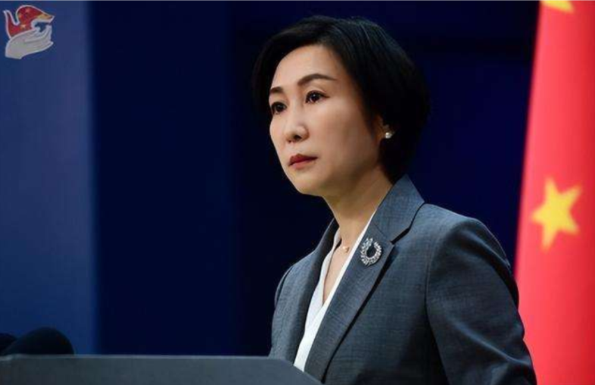

# 美国考虑切断供应商与华为的所有联系，包括英特尔和高通？外交部回应

每经编辑：李泽东

据环球时报援引美国彭博社报道，知情人士透露，
**美国政府正在考虑切断美国供应商与中国华为公司之间的所有联系，禁止包括英特尔和高通在内的美国供应商向华为提供任何产品**
。对此，中国外交部发言人毛宁31日表示，中方对有关报道表示严重关切， **我们正密切关注有关动向** 。

毛宁表示，中方坚决反对美方泛化国家安全概念，滥用国家力量无底线、无理打压中国企业。这种做法违背市场经济原则和国际经贸规则，有损国际社会对美国营商环境的信心，是赤裸裸的科技霸权。中方将继续坚定维护中国企业的正当合法权益。

荷兰禁止ASML向中企出售深紫外光刻机，外交部回应

据北京日报，1月31日，外交部发言人毛宁主持例行记者会。

_图片来源：外交部_

有记者提问，荷兰此前已经禁止了阿斯麦公司的一些产品向中国出口，现在还停止向中国出售深紫外线光刻机，请问中方对此有何评论？此举对中国和荷兰的关系有什么影响？

毛宁表示，1月30日，秦刚外长同荷兰副首相兼外交大臣胡克斯特拉通电话，就双边关系等问题深入交换了意见。秦刚外长指出，开放务实是中荷关系的最大特色，双方要共同维护国际产业链供应链稳定，维护开放而非分裂、有序而非混乱的国际贸易环境。

胡克斯特拉副首相兼外交大臣表示，荷方愿推动两国开放务实的全面合作伙伴关系不断发展，将继续以负责任的方式处理对华经贸事宜。

“我想再次强调的是，个别国家出于一己私利，不惜损友自肥，恶意封锁和打压中国企业，人为推动产业转移脱钩，有关霸凌霸道行径严重破坏市场规则和国际经贸秩序，不仅损害中国企业的合法权益，也冲击全球产供应链的稳定。”毛宁说，我们希望各方秉持客观公正立场，从自身长远利益和公平公正市场原则出发，独立自主地作出决定。

美日荷限制向中方出口相关半导体设备，外交部：损人不利己

另据北京日报，1月30日，外交部发言人毛宁主持例行记者会。据报道，美国与荷兰、日本达成一致限制向中方出口半导体相关的设备，发言人对此有何评论？

毛宁表示，美国为了维护自己霸权和私利，滥用出口管制，胁迫、诱拉一些国家组建遏制中国的小圈子，将经贸科技问题政治化、武器化，严重破坏市场规则和国际经贸秩序，中方对此坚决反对。

毛宁指出，这种做法损人不利己，破坏全球产业链稳定。国际上不乏担忧的声音。许多企业界的人士都表示，滥用出口管制将制造混乱，影响效率和创新，企图堵别人的路，最终只会堵死自己的路。

“中方将密切关注有关动向，坚决维护自身的正当权益。我们也觉得有关方面应当从自身的长远利益和国际社会的共同利益出发，审慎行事。”毛宁说。

每日经济新闻综合北京日报、环球时报

