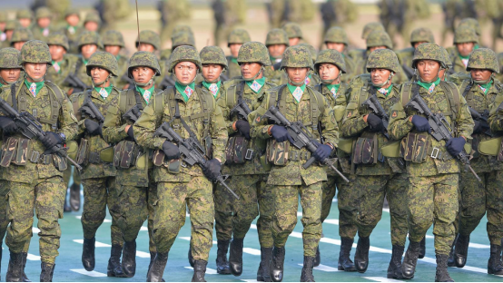

# 美想让菲律宾开放更多军事基地以进驻，美媒称“为对抗中国”

【环球网报道 见习记者
李律杉】综合美国《华尔街日报》、《华盛顿邮报》30日报道，美国官员称，美国防长奥斯汀即将访问菲律宾之际，美国希望本周达成一项协议，开放至多4个菲律宾军事基地让美军进驻。《华尔街日报》声称，美国此举旨在对抗中国。

_美国国防部长奥斯汀 资料图_

《华尔街日报》称，有美国官员透露，其中两个军事基地可能位于菲律宾北部的吕宋岛和西南部的巴拉望省。目前还不清楚另外两个军事基地的位置，也不清楚将有多少美军进驻。美军印太司令部发言人称，目前菲律宾约有500名轮值美军。

_美国海军陆战队正在进行两栖登陆演习 图源：外媒_

上述美国官员还透露称，作为回报，美国将向菲律宾方面提供包括无人机在内的军事援助。报道宣称，这些援助可以帮助“菲律宾军队监视中国在南海的活动”。

不过，《华尔街日报》援引美国官员的话说，为了与菲律宾达成这项协议，美国已经付出了长达数月的努力。甚至在最近几天，两国仍有一些细节问题需要解决。报道说，中国是菲律宾最大的贸易伙伴之一，而美国是菲律宾的“长期安全盟友”，这使得菲律宾政府不愿站在任何一边。菲律宾总统马科斯本月早些时候告诉《华尔街日报》，“这是一个非常不稳定的平衡”。

_菲律宾总统马科斯
资料图_

《华尔街日报》还说，美国推动在该地区部署规模较小的轮值部队，也是为了避免中美两国关系更加紧张，因为中国可能会将美军扩大军事基地的举动视为对其主权的直接挑衅。

对于此事，菲律宾方面的回应颇显谨慎。据《华盛顿邮报》报道，一名菲律宾国防官员表示，与美国加强军事合作“对我们的防御态势而言是个‘好兆头’”。但他表示，菲律宾加强自身安全的努力“并不针对任何特定国家”。

_菲律宾士兵
资料图_

据媒体此前报道，菲律宾宪法禁止外国在菲领土上永久驻军，也禁止外国在菲建设军事基地，但2014年4月美菲签署的《加强防务合作协议》允许美军使用菲律宾军事基地，对菲现有的军事设施进行改扩建，以及在菲存放武器弹药。在该协议框架下，首批5座基地被批准供美军使用，并进行基础设施建设。菲律宾国防部去年11月早些时候宣布，美方已同意拨款6650万美元，在未来两年内完成对5座基地的改扩建。同时，双方还在就新一批可供美军部署和建设的基地进行磋商。

《日经亚洲》网站注意到，美菲同盟关系在菲律宾前总统杜特尔特任内遭遇重挫。马科斯政府今年6月上台后，双方军事合作出现了重新升温的迹象，拜登政府也加大了对菲律宾的拉拢力度。去年11月20至22日，美国副总统哈里斯先后访问了马尼拉和巴拉望岛，重申对菲律宾的安全承诺没有任何动摇，并明确表示，寻求扩大在菲律宾的军事存在。有菲律宾专家表示，允许美军以轮换的方式进驻菲军事基地，侵犯菲主权，也违反菲宪法，菲律宾政府应该拒绝为美国提供更多的军事基地。

中国外交学院国际关系研究所教授李海东1月29日对《环球时报》记者表示，美国试图将日本、韩国和菲律宾等盟友用作与中国在亚太地区对抗的棋子。然而，美国的计划不是和平计划，而是一个容易引发冲突和战争的计划，对地区和平稳定极为不利。

