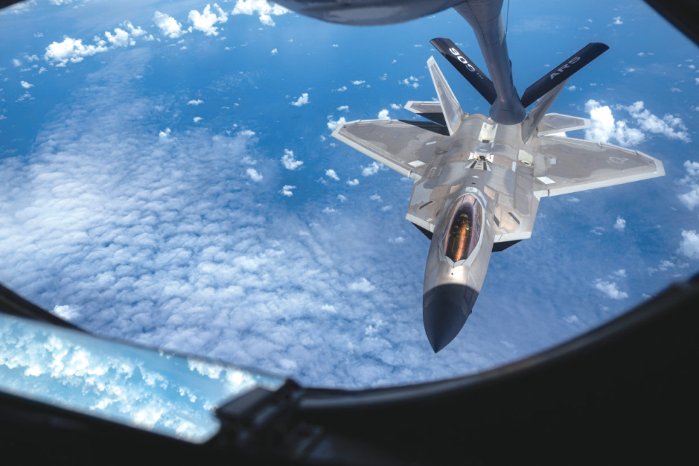

# 起底“开战论”上瘾的美司令部：不属于作战性部队，总妄想击败中国

【环球时报特约记者 张一帆 环球时报报道
记者刘扬】美空军机动后勤司令部司令迈克·米尼汉上将日前臆测美国将于2025年与中国开战的言论，引发舆论关注。这名叫嚣“与中国开战”的美军高级将领是什么背景？他所领导的美国空军机动后勤司令部负责哪些领域？这些问题的答案能为看清米尼汉煽动开战论调的意图提供线索。

**负责美全球力量投送**

美空军上将迈克·米尼汉的言论将他所在的美空军机动后勤司令部推上风口浪尖。机动后勤司令部作为美空军的九大一级司令部，尽管并不属于作战性司令部（如空中作战司令部、全球打击司令部等），而是属于支援性司令部，但该司令部的重要性却非常突出。

简单而言，机动后勤司令部掌管的机型主要有两种：运输机和加油机。从职能上来看，该司令部具有四大职能：一是空中输送，该司令部具备在数小时内将美军部队部署至全球任何地方的能力，并负责美总统和政府高层的运送任务，“空军一号”“空军二号”等均归该司令部指挥；二是空中加油，这是美空军实现“全球到达”战略的支柱；三是航空医疗后送，将战场上的受伤人员快速向后方输送救护，降低战场伤亡；四是人道主义和灾难救援，是美国对外输出“软实力”的重要工具。

可以说，快速的全球机动能力是美国执行对外战略的核心能力，缺乏力量投送能力就意味着失去常规威慑力。因此，机动后勤司令部尽管是美空军的支援性司令部，却是将作战与后勤紧密衔接起来的“纽带和工具”。该司令部目前拥有现役人员5万人、军机近500架，总部位于伊利诺伊州斯科特空军基地。C-17“环球霸王III”、C-5“银河”、C-130“大力神”等运输机以及KC-135、KC-10和KC-46等型号加油机均为机动后勤司令部指挥的重要军事资产。无论是美军近20年发动的战争和冲突，还是美军主导的各类大型演训活动，总有上述机型参加。

**推进“敏捷战斗部署”概念**

根据公开资料，此次大放厥词的美空军上将米尼汉并非军校出身，1989年，他从阿拉巴马州奥本大学毕业并获得经济学学士学位后，加入该校预备役军官训练团学习飞行。1990年他进入空军现役，成为C-130“大力神”运输机飞行员。米尼汉于2021年7月出任机动后勤司令部司令并晋升上将军衔。而此前10年，他一直在美军印太司令部服役，曾经担任印太司令部参谋长，2019年9月至2021年8月担任印太司令部副司令，搭档的司令是菲利普·戴维森海军上将。2021年3月，戴维森在出席美国会听证会时公开宣称，他预测台海冲突的爆发时间是2027年。米尼汉比戴维森的预测更加激进。

从美媒体曝光的内容看，米尼汉签发的这份备忘录实际上是向机动后勤司令部下辖的联队指挥官们发布的一份内部指示，其主旨就是要求所属部队针对可能的台海冲突提升思想上的紧迫感和战备训练的针对性。米尼汉在备忘录开篇就声称，“希望我是错的。但直觉告诉我，2025年将发生战斗”。

一位不具名中国军事专家30日对《环球时报》记者表示，就米尼汉对下属部队所做指示而言，非常具体且对华指向明确。比如，他要求所属联队指挥官必须在2月28日之前，向其本人汇报2022年度本单位在“迎战”中国方面所采取的战备措施、效果以及2023年的工作设想。他对美空军正在发展和运用的“敏捷战斗部署”作战概念非常重视。该概念核心是要求部署在大型空军基地的机群，在战时能够向美国及盟友的军用或民用机场迅速转场机动，以规避对手中远程火力的集中突击，同时依托大型基地和大量“睡莲”基地，既可从多个基地起飞后组成大编队，从正面与对手直接较量，又能以小编队多方向、多批次发动偷袭，实现机动灵活的打击模式。“敏捷战斗部署”概念是美空军专门针对与中国军事对抗开发的新型作战概念。米尼汉要求机动后勤司令部人员持续推进“敏捷战斗部署”概念在机动后勤领域的研发适用。

他宣称：“如果你正在开发的战术、技术和程序提高了机动后勤司令部在第一岛链内作战和获胜的能力，请继续。”同时，他还要求所属部队开展严格的训练和战备活动，“如果你满足于现有的训练方法，说明你没有承担足够的风险”。米尼汉在备忘录中还提及使用KC-135空中加油机发射约100架商用无人机的技战术设想。

米尼汉在备忘录中扬言，他所寻求的“终极状态”是“一支训练有素、整装待发、综合而又灵活的机动部队，随时准备在第一岛链内作战并取得胜利”。这份备忘录将是接下来8个月的第一份备忘录，他声称，将持续作出指示确保“提升我们自己和联合部队的战备水平、整合效果和敏捷能力，以威慑并在必要时击败中国”。

美国“动力”网站“战区”栏目的评论认为，米尼汉在这份备忘录中的措辞咄咄逼人，尤其是关于两年内与中国发生军事冲突的说法，可能更多的是试图向机动后勤司令部人员传达一种紧迫感，即尽可能快地在关键领域进行改进，而并非实际的威胁预测。然而，无论如何，在美军中米尼汉的论调并非唯一，一些美军将领煽动美军必须做好与中国发生战争的战备工作，并认为这样的冲突可能很快就会到来。

**宣扬战争论调有两大目的**

上述军事专家认为，米尼汉在备忘录中强调以中国为“靶标”推动美军战备建设的做法，一方面，是为了抢夺资源。“战区”栏目一针见血地指出，美空军机动后勤司令部拥有的机型和平台，大部分都是老旧机型，美军高层不断公开表达对现有空中加油能力和空运能力可能接近临界点的担忧。米尼汉希望借此制造紧张感，推动下一代运输机和加油机的采购。另一方面，米尼汉的言论符合美政府将中国定位为“步步紧逼威胁”的战略定位，显示自己的“政治正确”。

专家分析认为，米尼汉的涉华言论仅反映了美军事围堵中国的“一小步”。自从美国新版《国防战略报告》出台后，美联合盟友伙伴军事遏华制华的步伐呈加速态势。2023财年国防授权法案大幅提升“太平洋威慑倡议”预算幅度、新型B-21战略轰炸机亮相、积极推动在菲律宾扩大军事基地使用权、驻冲绳美海军陆战队改组建设“濒海作战团”提升反舰作战能力、在关岛部署从冲绳移防的海军陆战队以及美国与日澳甚至欧洲国家加速勾连等，都将对东亚地区和台海局势稳定带来负面影响。

