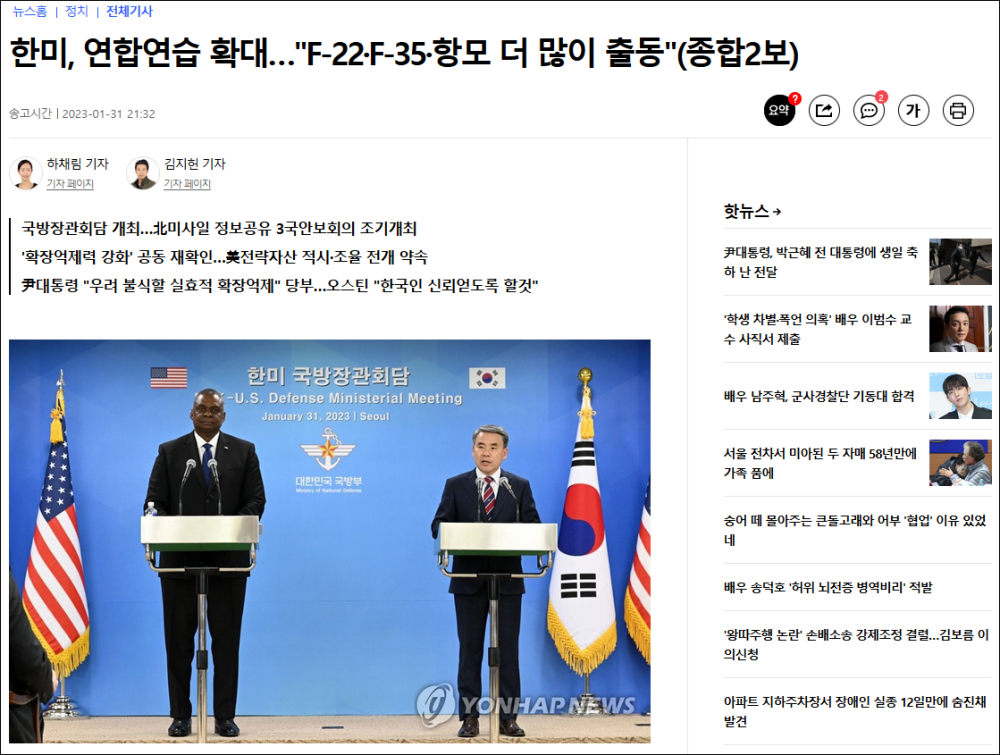
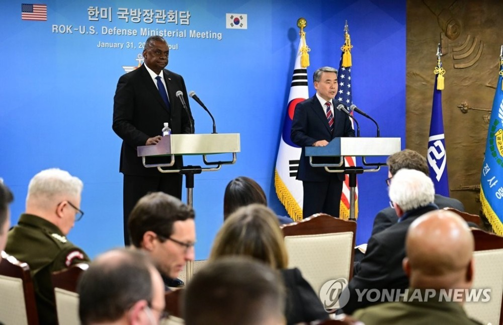

# 韩美将扩大联合军演规模，美国国防部长称将在韩国部署更多战略武器

【文/观察者网
熊超然】据韩联社当地时间1月31日报道，韩国国防部长官李钟燮当天同来访的美国国防部长奥斯汀举行会谈，双方在会后发表联合声明，并共同会见记者介绍会谈成果。这是两人在近8个月来第四次举行会谈。

报道称，韩美防长在会谈中谈到的议题包括：扩大联合军事演习规模，进一步加强美方延伸威慑承诺执行能力，争取美方适时向韩方调遣战略武器，加强韩美日三国安全合作等内容。特别是战略武器方面，奥斯汀声称“将在韩国部署更多美国的战略武器”。

_韩联社报道截图_

据报道，李钟燮和奥斯汀在记者会上不仅强烈谴责“朝鲜发起挑衅行为”，双方还决定进一步提高两国今年联合军演的规模和水平，以“有效应对朝鲜核导威胁和瞬息万变的地区安全形势”。

此外，韩美两国还将扩大今年联合野外机动演习的规模和范围，实施大规模联合火力示范演习。两位防长重申，两国将于今年2月实施韩美延伸威慑手段运用演习（DSC
TTX）。

双方一致认为，2022年年末韩美在美国战略武器出动下实施的联合空中演习，体现两国同盟具备能遏制各种威胁因素的能力，并商定将紧密协调合作，争取美方适时向韩方调遣战略武器。

奥斯汀在记者会上就此声称，美方曾向韩方调遣第五代战斗机F-22和F-35以及“罗纳德·里根”号核动力航母战斗群，并将继续出动更多类似的战略武器。奥斯汀说：“美国对韩国的防卫承诺不是喊口号而已，而是坚如磐石。”

_李钟燮和奥斯汀召开联合记者会
图自韩联社_

同时，双方决定将共同检查有关加强美国延伸威慑执行能力的一系列措施落实情况，以保证美国切实履行对韩协防承诺。两人重申，双方将争取在举行今年韩美安保会议（SCM）之前完成修改“定制型威慑战略”（TDS）。

此外，双方还探讨旨在加强地区安全合作的方案，包括韩美日安全合作。奥斯汀在记者会上强调，韩美日三国合作有利于维护各方安全。

同日，在韩访问的奥斯汀还通过韩联社发表了题为《同盟已做好准备》（The Alliance Stands
Ready）的署名文章，文章声称，美国对韩国提供延伸威慑的承诺如铁甲（ironclad）一般，“我们的敌人和竞争对手已清楚，向美韩任何一国发起挑战就等同于向美韩同盟发起挑战。”

_1月30日，在位于京畿道平泽市的乌山空军基地，奥斯汀下机后离开机场。图自韩联社_

自尹锡悦上台执政以来，韩国对朝鲜采取了强硬政策，对美国则进一步靠拢。在今年1月11日参加外交及防卫长官联合新闻发布会时，尹锡悦甚至还当场提到了韩国拥核的可能性。

“如果朝鲜的挑衅加剧，韩国有可能部署战术核武器或拥有自己的核武器。”但尹锡悦也强调，“重要的是选择现实可行的方法”，现在韩国和美国正讨论的是共享信息、共同参与、进行联合规划和联合执行。

此前，中国外交部发言人毛宁已经指出，国与国之间开展交流合作，应当有助于增进地区国家间的相互理解与信任，有助于维护世界和地区的和平稳定，不应针对第三方或损害第三方利益。亚太是合作发展的热土，不是大国博弈的“棋盘”。有关国家应顺应时代潮流，摒弃冷战思维，停止搞小圈子，防止影响亚太和平与稳定。

**本文系观察者网独家稿件，未经授权，不得转载。**

