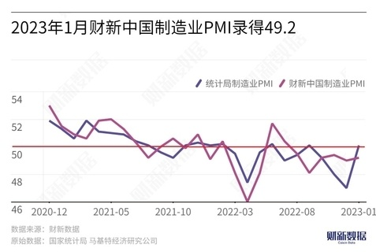

# 1月财新中国制造业PMI微升至49.2 仍低于荣枯线

随着防疫措施进一步优化，制造业景气略微回升，但仍连续第六个月低于荣枯线。

2月1日公布的2023年1月财新中国制造业采购经理指数（PMI）录得49.2，高于上月0.2个百分点，连续第六个月处于收缩区间。

这一走势与统计局制造业PMI一致。国家统计局公布的1月制造业PMI录得50.1，高于上月3.1个百分点，时隔三月重返扩张区间。

从分项数据看，在疫情影响下，2023年1月制造业生产、需求仍然疲弱，生产指数与新订单指数在荣枯线下略有回升，分别连续第五、六个月位于收缩区间。产量方面，消费品类上升，中间品类与投资品类下降。外需方面，海外经济衰退风险增加，新出口订单指数同样连续第六个月位于收缩区间，不过收缩程度趋缓。

生产和需求边际好转，带动就业指数在荣枯线下上升。受访企业反映，减员主要是由于疫情感染率上升导致人员无法到岗，以及部分企业在员工自愿离职后没有填补空缺。

受原材料特别是金属价格涨价的带动，1月制造业购进价格指数抬升并连续第四个月处于扩张区间。受制于市场景气度低迷与客户议价能力强，出厂价格指数虽然有所上升，但仍然低于临界点，只有消费品类价格轻微上涨。

随着疫情形势好转，供应链更趋稳定，1月供应商供货时间指数在荣枯线下大幅上升，这意味着供应链压力放缓，但是由于人手短缺，物流运输尚未完全正常化。

生产经营逐步恢复正常，企业对未来一年前景的信心持续回升，制造业生产经营预期指数升至2021年5月以来新高。

财新智库高级经济学家王喆表示，2023年1月疫情对经济的负面影响仍然存在，供给和需求趋弱，外需低迷，就业下降，物流亦未完全恢复，但制造业企业乐观情绪继续提升。此轮疫情冲击之后，加快恢复经济、促进社会生产生活秩序正常化将是经济工作重点，改善预期、修复信心、增加收入、扩大消费、拉动内需则是重要抓手。展望未来，疫情发展仍有较强不确定性，应做好充分准备，应对可能出现的下一波疫情冲击。疫情防控和经济社会发展，仍需高效统筹。

