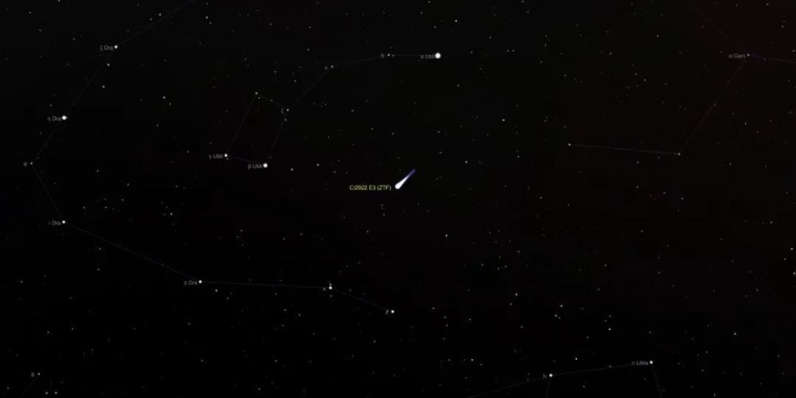
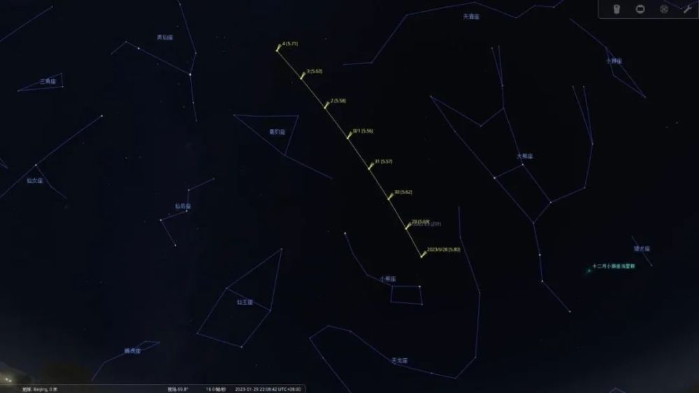
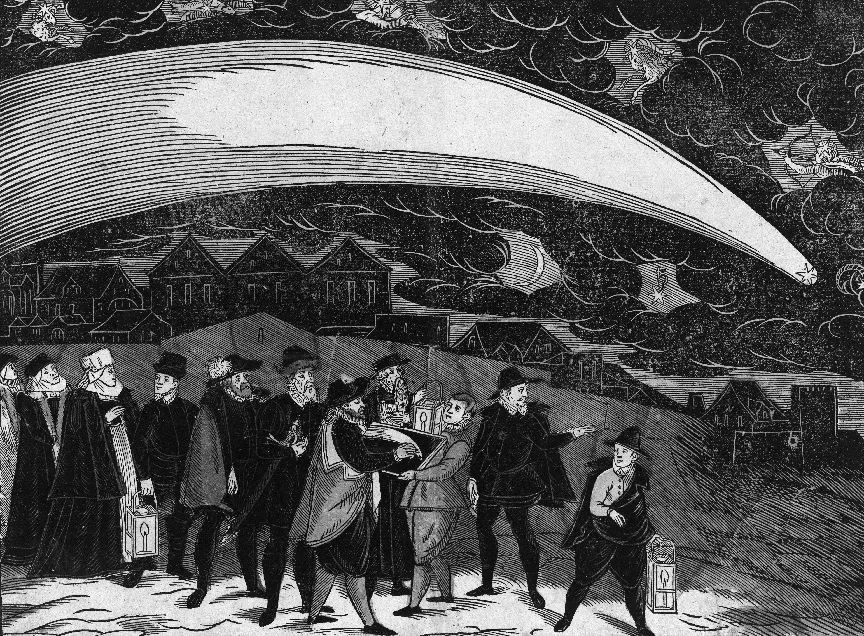

# 5万年一遇！罕见绿色彗星将于2月2日“逼近”地球，如何观测？

**撰文/记者 段然 图文编辑/陈永杰**

**新媒体编辑/吕冰心**

**采访专家：**

**寇文（北京天文馆高级工程师）**

2023年1月中下旬，在人们喜迎农历新年之际，一位不速之客悄然闯入夜空，大批天文爱好者开始闻风而动，在刺骨的寒风中携带各种设备奔赴各个观测地点，将视界锁定在预估的区域内仔细寻觅，期望能在浩渺的星空之中一睹它的倩影。他们寻找的是一颗“万年不遇”的彗星，而它的名字却只是一行单调的字符：C/2022
E3 (ZTF)。

_▲1月29日C/2022E3(ZTF)在星空中的运行位置（图片来源：theskylive.com）_

众里寻他千百度

目前公布的照片显示，这颗彗星呈翡翠绿色，彗尾明亮又宽阔。研究人员分析，它因彗核周围的尘埃云（彗发）含碳而发出绿光。它的彗核直径约1.6千米，彗尾绵延数百万千米。

根据天文学家推算，此次光临夜空的C/2020
E3（ZTF）彗星，轨道周期约为5万年——当然这只是按照目前的观测数据粗略估计。但无论如何，作为一颗长周期彗星，我们今生注定只能看到它一次而已。根据公开的观测数据，该彗星在1月12日经过近日点，2月2日将来到距离地球4200万公里（约0.28个天文单位）的近地点。

_▲运用Stellarium软件测算出的1月28日至2月4日C/2022E3（ZTF）运行轨迹（图片来源：Stellarium）_

那么届时这颗彗星会有多亮呢？人们用“星等”来衡量天体光度，数值越低，亮度越大。1986年回归的哈雷彗星最亮时星等达到3.5。相比之下C/2022E3（ZTF）彗星的亮度就逊色很多。“这颗彗星的亮度也就在5-6等之间，用双筒望远镜等设备能够看到他呈现出朦胧的云雾状。”北京天文馆高级工程师寇文介绍道。

但他认为这次彗星的观测条件还是比较乐观的：“很多彗星是出现在一早一晚，距离日出日落比较近，观测窗口期很短。目前这颗彗星处于北极星附近，夜间可观测的时间非常长，这样就可以很从容地安排观测活动。”

C/2022 E3（ZTF）彗星观测小贴士

**最佳观测日期**

北京时间 1月28日-2月4日间彗星亮度会在5等左右，其中北京时间2月2日彗星将运行至近地点，2月1日-2月2日最适宜观测。

**观测时间建议**

LHAASO探测到来自银河系内的能量1.4拍电子伏的伽马光子（拍=千万亿），这是人类迄今观测到的最高能量光子。观测彗星还需避免日光和月光的干扰，选择月落之后为宜。比如北京地区2月1日月落时间为凌晨4点左右，2月2日日出时间为7点半左右，在这个时间区间进行观测效果最佳。

**观测地点选择**

尽量避免城市光污染影响较小的远郊地区。在北京地区，十三陵思陵地区、延庆华海以及大庄科长城均是理想的观测地点。

**观测工具建议**

视自身条件而定，8-10倍望远镜即可满足一般观测需求。若进行拍照则最好选用单反+长焦镜头，由于观测当日有大风天气，建议用三脚架等器材固定观测设备。

**其他注意事项**

1月31日-2月1日北京地区将有大风降温天气，市郊普遍较冷，观测时要注意防寒保暖。

C/2022
E2(ZTF)彗星还是引起了天文爱好者们极大的观测热情。北京的一位业余天文观测者林先生就对这次观测活动进行了精心准备。林先生回忆道，他印象最深的是1997年光临夜空的海尔-
波普彗星，在经过近日点时星等达到-1.8，“基本上除了月亮，这颗彗星就是当时夜空中最‘亮‘的仔，并且持续了数个月之久”
林先生兴奋地谈道，“此后最亮的彗星就是2020年的新智彗星，我当时是大庄科长城上，在拂晓时观测到了这颗彗星，用普通长焦镜头能够清晰地拍下它的身影。”

对于想要一睹这颗彗星芳容的天文爱好者们，寇文建议道：“首先要离开城市灯光的干扰。在灯火通明的城市里能看到2-3等星都比较困难，这次彗星亮度只有5-6等，观测点必须在光污染少的地方。”
其次，寇文认为还须尽量躲开月光对观测的干扰。“因此尽量选择在郊区的月落时间进行观测，才能取得较好的观测效果。” 寇文强调道。

为了观测C/2022
E2(ZTF)彗星，林先生将明十三陵的思陵地区选为最佳观测点，这里远离市区光线干扰，是理想的观测点。他在1月29日凌晨抵达思陵墓进行首次观测，“目前彗星运行到小熊座和天龙座之间，我用普通的双筒望远镜能大概看到彗星模糊的影像，如果用20倍的望远镜能看到彗星身上的一层雾带，这基本也是普通民用观测设备的极限了。”
林先生说道。

_▲2020年7月4日在大庄科长城拍摄到的新智彗星（图片来源：林先生供图）_

尽管相比2020年的新智彗星，C/2022
E2(ZTF)要暗淡许多，但作为天文爱好者的林先生依然十分兴奋。“能被普通观测设备看到的彗星并不多见，能够捕捉到已经很让人激动了。”
林先生说道。目前这颗彗星正以极快的速度接近北极星，在2月2日左右迎来他的最亮时刻，虽然他的外表并不出众，但是作为以万年为单位的一次回眸，这一次天地间的相遇，还是值得广大天文爱好者在寒夜中期待的。

可遇而不可求的天际访客

对于彗星，大多数人也只是在书本、电视和网络上才看到过它确切的模样，而亲自用自己的双眼在夜空中一睹他们芳容的机会并不多。相对于举目可见的漫天星斗，彗星的出现却是可遇而不可求。

彗星的体量普遍不大，小的彗星核心直径仅有几百米，大的也不过数十公里，2022年NASA曾发现了一颗巨型彗星，其彗核也不过129公里。“在整个太阳系中，彗星的数量非常之多，但人类发现的彗星数量还是极少数的！”寇文说。科学家们估计太阳系存在着多达数万亿颗彗星！相比于太阳系的8大行星这类“主角”，彗星充其量只能算是“群演”。但根据国际天文学联合会（IAU）小天体中心（MPC）公布的数据：截至2023年1月27日，人类总共发现了4446颗彗星，相比于总量而言只能算是冰山一角。

_▲2022年12月24日由位于加州的ZTF设备拍摄到的C/2022E3(ZTF)彗星影像（图片来源：NASA）_

彗星的名字如何命名？

在过去，人们普遍是用发现者的名字来命名新发现的彗星。比如1998年出现的海尔波普彗星，就是以艾伦·海尔和汤玛斯·波普的姓氏命名的，但随着发现彗星数量激增，这一命名方式就显得落伍了。直到1994年，国际天文学联合会制订了新的彗星命名系统，以一串由字母和数字组成的字符来对彗星作标识。

“从彗星的编号中就能看出发现年月和种类等重要信息。”寇文对记者介绍道，“比如这次出现的C/2022
E3（ZTF），2022就代表是2022年发现的；同时将每月拆分用上下旬，用24个字母来代表，比如A代表一月上旬，B代表一月下旬，因此E就是代表是3月上旬发现的，3代表发现的第几颗。而开头的C就代表长周期或非周期彗星，如果是字母P就是代表短周期彗星。”

“除此之外彗星还会被冠以发现者或发现机构的名字。这次出现的C/2022
E3（ZTF），括号中的ZTF就是其发现机构“兹威基瞬态设施”的缩写。”寇文进一步补充道。

按照这套编号系统，所有发现并确认的彗星都有了属于自己的ID号，为彗星信息的整理工作提供了极大的便利。比如，第一颗被确认的短周期彗星“哈雷彗星”，在这套系统内的正式编号是1P/1682
Q1，其含义就是在1682年8月下旬被确认的短周期彗星。

“彗星围绕太阳运行的周期各有不同，有的短则几年，长的可能要上万年。一般而言，运行周期小于200年或者两度经过近日点均被发现的彗星，被视为短周期彗星，长于200年的就是长周期彗星。”
寇文解释道。

什么样的彗星能被我们看到？

短周期彗星的运行周期普遍在数年至数十年不等，最短的仅有3年，这些彗星主要来自太阳系的柯伊伯带。他们是太阳系的“常住居民”。

而以“C”开头的长周期彗星，目前普遍认为自更加遥远的奥尔特云，这类彗星绕日周期短则数百年，长则达上千万年，有的干脆就是以双曲线或者抛物线的轨迹闯入太阳系，在经过近日点后便被抛入深空不复返，真就成了“挥一挥衣袖，不带走一片云彩”！

“彗星的运行轨道非常特殊，多数都是扁平的椭圆形状。在运行的大部分时间里，他们都距离太阳很远，本身非常暗淡，难以观测。每年能看到的彗星数量相当有限，大概平均8-10年左右才能出现一颗比较亮的彗星出现”。寇文说道。“

除此之外，每年出现的彗星绝大多数都只是一个小暗斑。”
事实上，除了接近太阳附近时受辐射影响喷出物质，使得亮度提升以外，绝大多数时间里彗星都是太阳系里的“隐士”，能见度非常低。绝大多数彗星注定只能游离在我们的视线之外。

在闯入太阳系后，这些小家伙们除了要经历漫长的旅程，还需要在行星引力的夹缝中闪转腾挪，在险象环生中求生存，这就导致有相当数量的彗星，其运行轨迹是难以精确预计的，即便是短周期彗星，受种种客观因素的制约，人们也难以判断他们何时回归，是否能被我们看到。

比如1846年发现的布罗森彗星，原本运行周期是5年，但在19世纪后半叶就失踪了。再比如1930年发现的施瓦斯曼-
瓦赫曼3号彗星，被发现时运行周期5年，但在1995年开始解体成数块儿，逐步走向消亡。真正能穿越千难万险闯入我们视野的彗星，真的可以用沧海一粟来形容！

“凶星”？“福星”！

从人类开始有计划地观测天象的古代，彗星就已经时常出现在人们的视野中。人类对于彗星的认识经过了一个颇为漫长的历程。距今2600年前，春秋时鲁国的史官写下了“秋七月,有星孛入于北斗”的文字，从而完成了迄今为止人类对彗星的最早记录。但在缺乏科学理性的年代，古人眼中的彗星是拖着尾巴划过星空、神鬼莫测的不祥之物，因而想当然地视为灾祸即将降临的征兆。在中国古籍中有“孛星现，灾祸起”的说法。在西方，彗星也时常被视作上帝之怒甚至世界末日的预兆，作为一颗凶星根植于西方大众文化中。

颇具讽刺意味的是，原本作为“凶星”的彗星却在近代有力地推动了人类科学的发展。1682年一颗硕大的彗星闯入天际，这一壮观的天象在欧洲因此广泛的社会恐慌，但这一氛围之下，牛顿却与好友哈雷兴致盎然地对这颗彗星的运行规律进行探讨。

牛顿向哈雷详细介绍了他如何用自己发现的万有引力定律测算出该彗星的椭圆形轨道，这种方法让哈雷大为惊奇，他随后资助牛顿将他的理论写成《自然哲学的数学原理》一书，作为“彗星发烧友”的哈雷还通过检视过去三百年间的彗星纪录，运用牛顿引力定律，推测1682年出现的彗星，与1531年和1607年彗星应为同一颗，其运行周期大约是76年，并大胆预测76年后，这颗彗星将重现天空！

76年后的1758年，哈雷的预言果然应验，只是仰望彗星的人群中已经没有了牛顿和哈雷的身影，而这颗彗星正是人类彗星观测史的常客——哈雷彗星。哈雷彗星的这一次回归，不仅验证了哈雷对彗星运行轨迹的科学预测，更对牛顿经典力学体系提供了有力佐证。哈雷彗星的出现并未使灾祸降临人间，却间接将现代天体物理学的发展向前推进了关键一步，从这个角度来看，这颗彗星实际上更像是人类文明的福星。

_▲欧洲木刻版画：1577年出现在布拉格上空的大彗星（图片来源：苏黎世中心图书馆）_

在现代科学发达的今日，人类对于彗星的探索已经相当之深入。从地面的巡天望远镜捕捉这些彗星的鬼魅身影，到直接发射探测器近距离观测彗星的结构，彗星的真面目在人类的科学手段下一览无余。

哈雷彗星作为观测样本继续为人类的探索事业“发挥余热”：在1986年哈雷彗星又一次回归时，欧空局的“乔托”号，前苏联的织女1号与2号，日本的彗星号与先锋号一拥而上，争先恐后地从近距离越过哈雷彗星，收集了关于彗核的第一手资料，研究人员们发现，这是一颗长15公里，宽7-10公里形似花生的小天体，形成彗发和彗尾的喷射物质主要是水、一氧化碳和甲烷等物质的混合物，这些物质在太阳风的作用下从彗核的7个喷射孔喷涌而出——上千年以来被东西方文化视为凶兆之星的彗星，不过是由水冰、岩石和冻结气体组成的普通小天体而已。

_▲1986年回归的哈雷彗星（图片来源：britannica.com）_

除了哈雷彗星外，在此后的几十年间，人类又发射了深空-1号，“深度撞击”、“星尘”号和“罗塞塔”号等探测器，以抵近探测、撞击和着陆等方式对其他彗星进行研究，人类对彗星认知正在不断完善。

