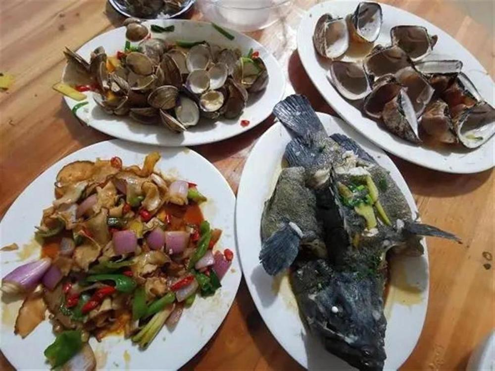
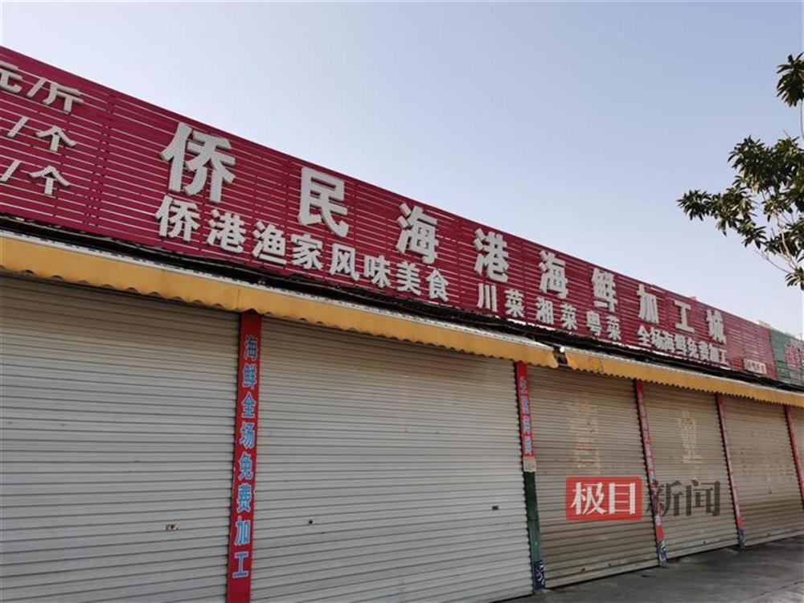
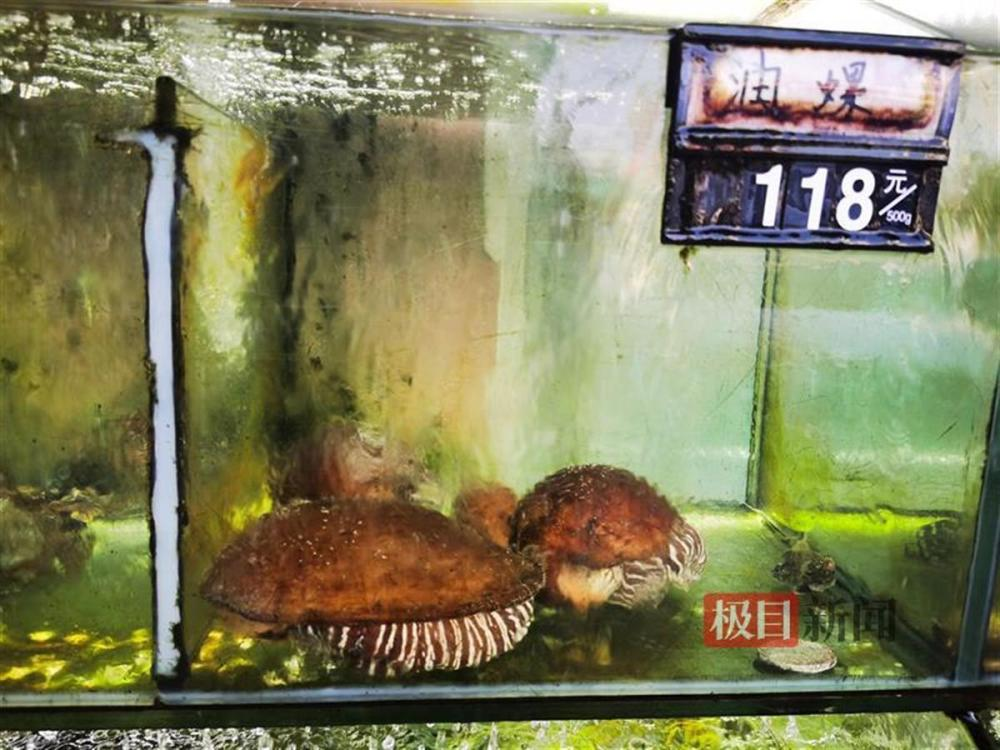
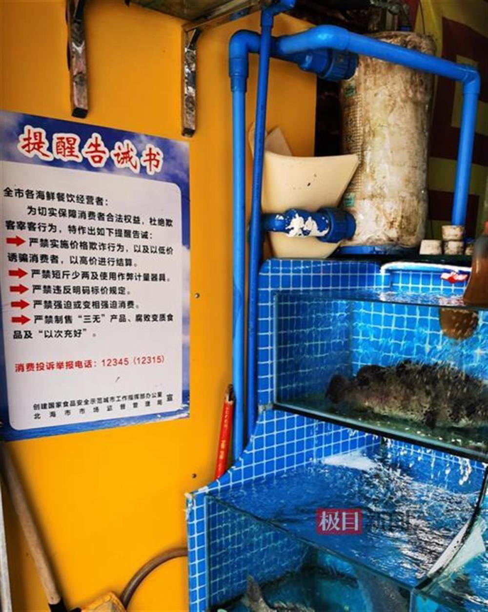
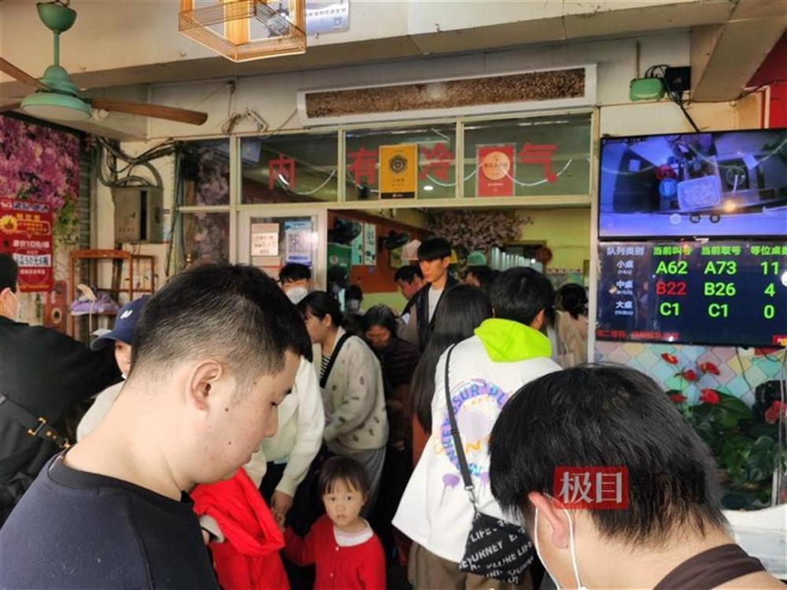

# “4个菜1500元”风波后再探广西北海：老板街头揽客承诺“不宰人”

极目新闻记者 肖名远 李杨

今年春节，广西北海的旅游市场迎来开门红。据统计，春节假期内，北海市累计接待游客186.16万人次，同比增长83.2%。

而连日来，北海“4个菜1500元”的热搜引发全国关注，给当地火爆的旅游市场蒙上一层阴影。

官方调查表示，涉事餐馆虽然秤具符合相关规范要求、海鲜明码标价，而且定价基本符合春节期间海鲜餐饮消费价格，但存在着支付出租车司机回扣招揽客人、未与消费者充分沟通即匆忙配菜下单、部分海鲜经烹饪后分量略少等问题。

极目新闻记者走访北海海鲜餐馆、市场发现，此次风波在当地造成了不小影响，大家对相关行为是否属于宰客存在一定争议。当地海鲜餐饮从业者直言，虽然个别极端现象影响了北海餐饮业的形象，但绝大多数商家都是诚信经营。

_网友称点了四道海鲜花了1500元（网络图片）_

官方表示，将进一步加大旅游消费市场秩序整顿，对欺客宰客行为零容忍。

“4个菜1500元”餐馆已停业整改

今年的春节忙碌得让北海的餐饮人有些措手不及。

“游客排着队等吃饭，店里的人手完全不够。每天忙到凌晨两三时才把碗洗完，睡不到1个小时，凌晨5时许又要到港口去买海鲜。”本地人张鑫在北海市侨港风情街有一家海鲜餐馆，店里冷清了几乎三年，今年忙得脚不沾地的他感到“累并快乐着”。

据北海市旅游文体局数据，春节假期北海市市累计接待游客186.16万人次，同比增长83.2%，与2019年同比增长34%。

然而，最近关于北海海鲜餐馆“宰客”的热搜让张鑫心里有些五味杂陈。他认为，这些热搜对北海餐饮业的声誉和生意都有些影响，也有损北海的旅游形象。

1月25日，有网友在社交平台发布自己的遭遇称，他们一行4人在1月24日傍晚被出租车司机带到北海一家名为“侨港渔村美食”的餐馆用晚餐。由于他们不了解海鲜，老板给他们推荐了油螺、贵妃螺、马蹄螺和龙趸石斑鱼4种海鲜并迅速称重宰杀，其中，油螺辣炒3.8斤，每斤168元；龙趸石斑（店家标注为“龙顶”）3.1斤，每斤168元；马蹄螺3.5斤，每斤68元；贵妃螺辣炒3.7斤，每斤48元。4个海鲜菜品共1573元，加上米饭、纸巾金额14元，实际消费共计1587元，店家实收1500元。

随后，“4个菜1500元”迅速引发网友热议，多次登上热搜。

此后，北海市市场监督管理局通报，经查明，该店资质齐全，所用电子秤经检定合格，海鲜池内的海鲜产品全部明码标价，消费者所点的四道海鲜在点菜单上的价格与海鲜池标注价格一致，定价基本符合春节期间海鲜餐饮消费价格，加工、烹饪后的价格在合理区间。但该店家存在支付出租车司机回扣招揽客人、未与消费者充分沟通即匆忙配菜下单、部分海鲜经烹饪后份量略少等问题。北海市市场监管局等相关部门已责令该店家停业整顿、限期整改并立案处罚。店家表示将向消费者致歉并退款。对涉事出租车司机，相关部门已责令出租车公司对其进行约谈、罚款和限期停运处罚。

针对此事，有网友认为，海鲜本就不便宜，节假日贵一些也算正常，该店不算宰客。也有网友表示，出租车和餐馆有利益输送，餐馆价格虚高并利用消费者不懂海鲜推荐价格昂贵、利润高的海鲜，也是坑了游客。

1月29日，极目新闻记者现场看到，涉事餐馆“侨港渔村美食”已经关门歇业。该店位于北海市区主干道边，交通便利，一旁有五星级酒店，距离银滩和侨港两个景点也不远。天眼查显示，该餐馆开业于2020年。

_涉事餐馆已关门_

极目新闻记者多次通过电话、短信和微信联系该餐馆的老板，但均未获得回应。该老板在接受媒体采访时曾表示，该店明码标价，也是和顾客确认好之后再烹饪的，海鲜价格高是因为春节海鲜价格上涨。他还表示，开店两三年以来，关于菜品价格的投诉或纠纷每年都会有几起，这次的事件感觉是有人故意为之。

春节假期结束每斤海鲜约便宜20元

“看那个4个菜1500元的新闻了吗？我们店不会宰客的。”1月30日中午，北海市侨港风情街一家海鲜餐馆门口，店主王伟强热情地招揽来往的游客。他拿起网兜，捞出一条标注为“龙顶石斑”的海鱼给客人展示，“这石斑鱼我们卖88元一斤，不会卖到168元一斤。”

王伟强是在侨港经营海鲜餐馆6年多，因为有游客看了新闻热搜后担心挨宰，他干脆主动和游客提到上述新闻，并试图解释他家餐馆和新闻里餐馆的差别。

_29日，油螺明码标价118元/斤_

1月30日中午，极目新闻记者看到，景区附近和景区内的海鲜餐馆大多正常营业，有些店未受风波影响，人气依然很旺。

来自西安的游客刘先生告诉极目新闻记者，他也看到了相关新闻，现在去吃饭都会多留个心眼，看网上的攻略或者餐馆的评价，如果有司机介绍会非常谨慎，“有时会直接团购，不够吃就再点几个菜。”

离“侨港渔村美食”约200米的一家海鲜餐馆已坐满了顾客。该店的海鲜池里，有比较常见的虾、蟹、沙虫、螺、海鱼等海鲜，未见新闻中提及的贵妃螺和油螺。同品种的龙趸石斑鱼售价则为98元一斤。

随着春节假期的结束，北海的游客逐渐减少，不少景区的海鲜店老板走上街头招揽顾客。一旦有顾客上前询问，老板便热情地介绍推荐。一名海鲜餐馆老板表示，因为假期已经结束了，海鲜的拿货价格更便宜了，与春节期间相比每斤便宜了20元左右，所以现在吃海鲜比较实惠。

极目新闻记者发现，每一个餐馆前均有较大的海鲜池，海鲜池上标注有海鲜的名称和价格。一些餐馆在海鲜池醒目位置以大字标注有消费提醒，提醒“龙虾、面包蟹、油螺、龙趸等海鲜产品价格较高，部分海鲜产品加工后脱壳缩水，可食用部分较少，请谨慎选购，理性消费”，由北海市银海区市场监督管理局印制。有商家贴有北海市市场监督管理局印发的《提醒告诫书》，称要杜绝欺客宰客行为，严禁“价格欺诈”“缺斤短两”“违反明码标价”“强迫消费”等。

_海鲜餐馆墙上张贴的告诫书_

部分餐馆则贴着“生蚝1元1个，虾18元一斤”等的广告语。但记者进去点餐后，服务员多给介绍青蟹、石斑鱼等每斤单价在100元以上的产品。当记者明确表示希望只点招牌上的虾和生蚝时，店主表示做不了。“这些都是亏本卖的，单做这个连师傅开个火的钱都不够。”该店主称。

“油螺”等多出现在招待游客的餐厅

多名北海市民告诉极目新闻记者，“4个菜1500元”中的四种海鲜，除了石斑鱼外，油螺、贵妃螺、马蹄螺等都是北海本地人不常吃的，且本地人常去的海鲜餐馆也很少见这三种海鲜，多出现在以招待游客为主的海鲜餐馆。

1月29日下午，极目新闻记者分别前往北海市贵州路海鲜市场、北海贵阳市场以及侨港智慧农贸市场探访，发现仅能找到石斑鱼、马蹄螺等产品。石斑鱼售价在每斤50元左右，马蹄螺价格则在每斤10元左右。摊主表示，相比春节假期，现在的价格已下降了不少。三家市场上售卖海鲜的档口均买不到油螺和贵妃螺。“当地人主要买车螺、带子螺、花甲螺，油螺等不常做，也就没有进。”一名摊主告诉极目新闻记者。

_北海海鲜市场_

“马蹄螺比较大，但壳重，味道比较腥。油螺一般产自深海，由于烹饪工艺比较复杂，价格也高，农贸市场很少见。但这些平常利润较高。”高一峰（化名）在北海从事海鲜批发生意多年，他介绍，北海市民在餐馆多吃车螺、带子螺、扇贝、象拔蚌和各种杂鱼，本地人常去的餐馆了解当地喜好，一般都不会进马蹄螺和油螺这类海鲜产品。

高一峰称，龙趸石斑鱼的餐馆拿货价约为每斤50元，油螺约为60元，贵妃螺约为15元，马蹄螺约为5元。按照日常的价格计算，新闻中四类海鲜产品的成本不超过500元，售卖1500元确实偏高。不过，海鲜价格随着季节波动较大，不同的餐厅在不同渠道拿货价格也有区别，而且春节期间海鲜价格确实上涨不少。“春节由于出海的船只比较少，回来的海鲜少，游客又多，导致海鲜价格高。”高一峰说。

张鑫则认为，仅针对“侨港渔村美食”中的几样海鲜而言，该店不算宰客，比如油螺常常拿货都在100元以上，平时购买这四样菜也需要1000元左右，春节期间肯定会更高一些。可能游客认为北海是沿海，以为海鲜便宜，其实当地人自己购买也是贵的。“春节期间十分忙碌，油螺等利润较高且比较好做。”张鑫称，能够理解商家推荐油螺等海鲜的行为，但商家也需要和游客换位思考，为游客多考虑一些，便能避免后面的纠纷。

吴雨霏在北海从事海鲜餐饮生意20多年，如今有了自己的海鲜酒楼，她也认为“侨港渔村美食”的价格按照春节的行情而言是基本合理的。

“因为疫情，许多餐厅春节并没有太多人手，面对突发的人气，餐馆要临时雇人，人力成本至少翻了3倍。”吴雨霏计算，一个临时聘用的服务员每天要300元，厨师带个小工要2800元一天；葱、小米椒等海鲜常用的海鲜辅料价格也翻了好几倍，“更不用说海鲜的价格涨幅，基本在20%左右，有的甚至达到50%的涨幅。”

多部门对餐馆和出租车开展整治

此次事件中，出租车与饭店合作招揽顾客拿回扣一事被大家诟病，给游客带来了不好的观感。

“有一部分车辆是这样的，不仅和餐馆合作，还和珍珠店、房地产商等合作，如果成功交易就能得到返点。”陈远洋曾在北海开滴滴快车，现在已经转行了。他告诉极目新闻记者，的确有出租车和餐馆有利益输送，“将游客带到餐馆后，我们会等到游客坐下点菜，再拍照发给老板，一般老板都会返营业额的二三成，有的店甚至返点营业额的五成。”

陈远洋表示，一般一个店有此类返点，很快许多司机都知道了，有这类想法的司机便会带游客过去消费。

1月29日至1月30日，极目新闻记者多次从北海站出发搭乘出租车，均没有发现司机有诱导消费行为。

“我不敢做这事，也不想做这事。”一名出租车司机表示，的确有一些出租车会要求返点，但比起赚钱，他更希望游客能对北海有个好印象，“也有一些乘客会咨询我，我会给他们提一些建议，告诉他们哪里是本地人常去吃的餐厅，也会告诉他们北海海鲜大概什么价位，什么海鲜好吃。”

_北海一景区海鲜餐馆依旧人气很旺_

张鑫称，他听说过一些餐馆和出租车合作返点的事情，但他的店从没有做过。“有时候，游客可能在社交软件上搜索到我们店要司机送过来，也会给司机炒个粉感谢他。”张鑫表示，北海政府打击、管控力度很大，现在这类现象少了很多。

极目新闻记者了解到，为进一步强化出租车行业服务质量提升，目前，北海市县两级交通运输部门对全市的2家网约车公司和4家出租车公司法人进行约谈，要求公司督促各运营公司与每位出租车司机签订诚信经营承诺书。

同时，相关部门督促指导出租车运营公司对驾驶员开展安全运营、服务质量、职业道德等专项培训教育。提醒驾驶员切实遵守职业道德，不诱导乘客到餐馆、酒店等相关场所消费欺客。值得注意的是，当地将持续深化出租车行业信誉管理，强化信用信息采集记录，对违规的驾驶员录入驾驶员信誉考核黑名单。

极目新闻记者注意到，春节长假前，北海市各城区便针对可能出现的海鲜餐饮消费纠纷进行了专项整治，对全市所有海鲜餐饮企业进行了约谈提醒，逐家签订《诚信经营承诺书》；对被举报欺客宰客的经营户，一经查实，依法依规从重处罚。

北海市市场监督管理局在上述通报中表示，将进一步加大旅游消费市场秩序整顿，对欺客宰客行为零容忍，严肃查处各类侵害消费者合法权益的行为，绝不姑息。绝不允许极个别不良经营户破坏北海旅游市场秩序、损害广大守法经营商户的良好口碑，全力维护城市形象。

吴雨霏称，北海那么多餐饮店，的确存在一些极端的个例，但绝大多数商家都是诚信经营，“建议游客来北海可以在市场购买海鲜，到餐馆花10元、20元来料加工；或者在社交媒体上多看看，直接选择口碑比较好的店铺。”

_游客在海鲜池前挑选海鲜_

（经受访者要求，文中姓名均为化名）

（来源：极目新闻）

