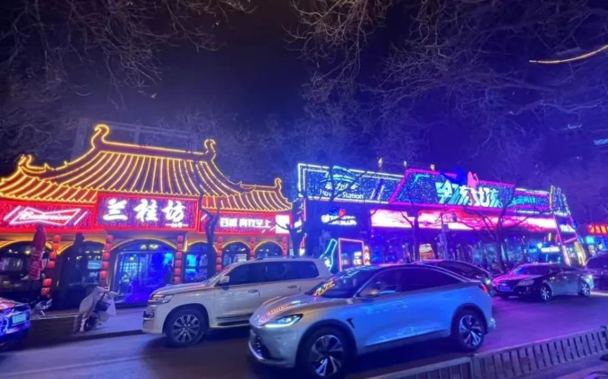
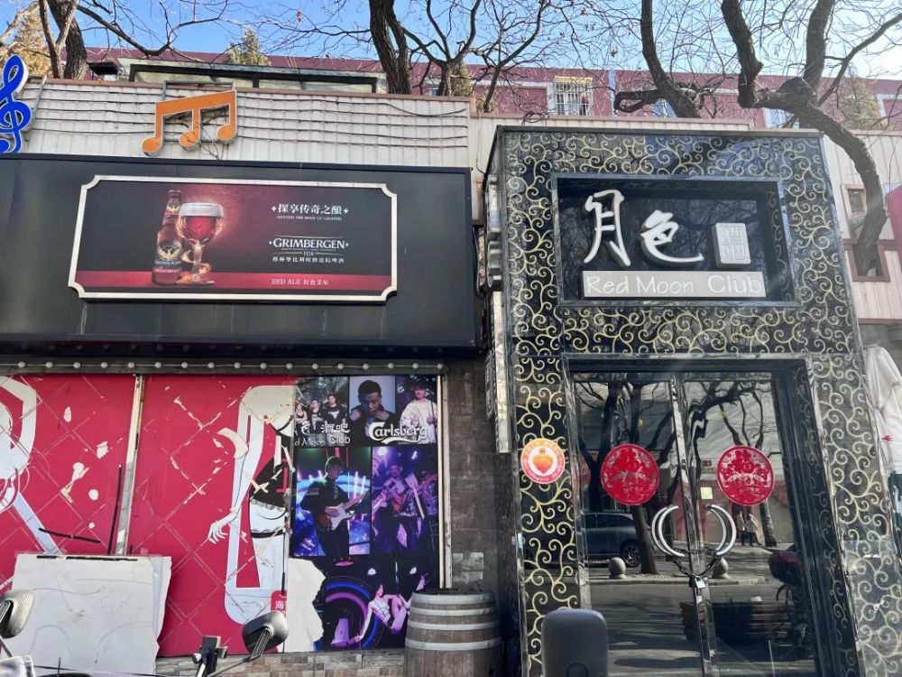
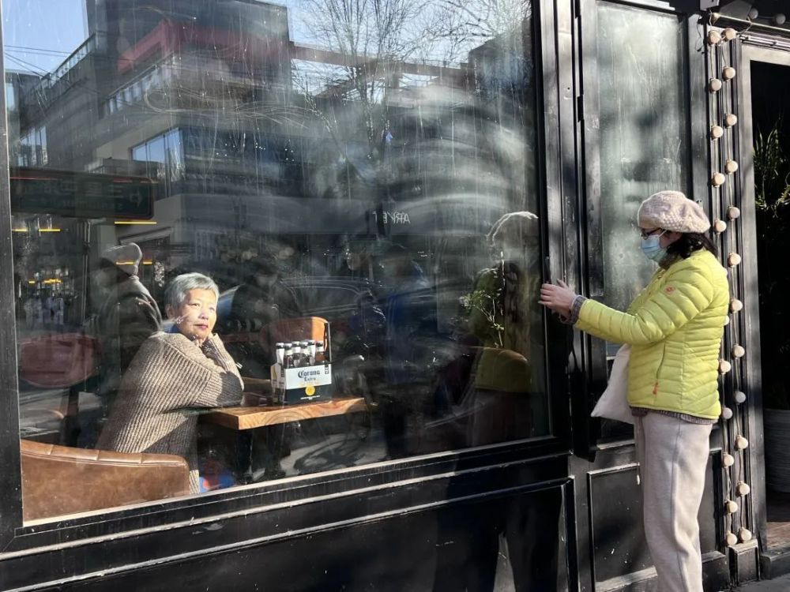
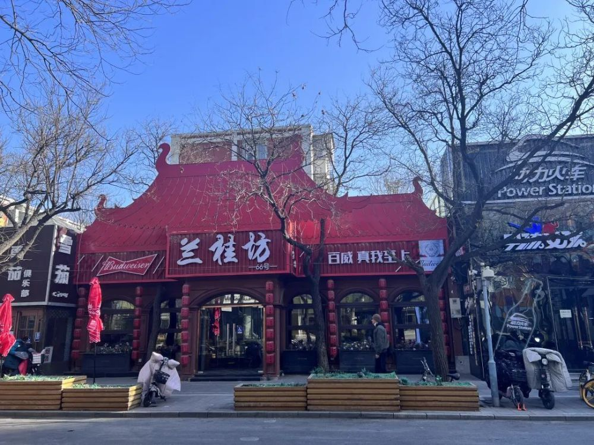
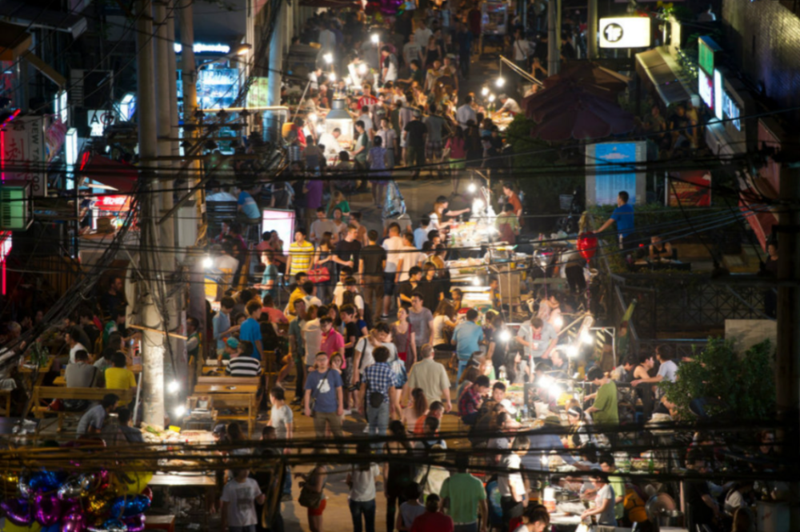

# 三里屯酒吧街的最后一天

酒吧街没有了，三里屯的人气还聚得起来吗？

昨日是北京三里屯酒吧街限期腾退的最后一天。这个承载了城市历史和许多人记忆的地方，即将落下帷幕。

2022年12月25日圣诞节，一则限期腾退房屋告知书光临三里屯。告知书上要求承租方在1月31日前清空租赁房屋内物品，并搬离房屋，原因是房屋结构安全性已不适用于经营。好不容易熬过疫情三年的酒吧街老板们，本想大干一场，然而他们就如这酒吧街一样，将迎来新的戏剧人生。

**#01**

**“被嫌弃的糟糠之妻”**

昨日下午一两点，三里屯酒吧街的客人们开始多了起来。一般夜晚才是酒吧街的高光时刻，但因为日子特殊，提前迎来了一波缅怀者。

他们当中有北京蓝色港湾等其他商圈的招商人员，也有很多混迹在三里屯二三十年的北京老炮儿们，来这里喝下最后一杯酒，缅怀过往与青春。

“不接受任何媒体采访”，这是酒吧街老板林立昨日重复最多的话。

年近50的林立，2021年受在三里屯经营了多年酒吧生意的妹妹影响，由餐饮转行到酒吧业，相中了酒吧街一黄金店铺，100平米左右的经营面积，租金一年小一百万。

不过遇到疫情反复，钱还没挣着，一纸腾退通知突然而至，林立顿时找不着北了。

据酒吧街商户介绍，三里屯酒吧街腾退范围中的酒吧有十多家，其他经营业态的各类商户七十多家。

昨日是腾退最后一日，整条街上只剩几家酒吧、咖啡厅、便利店、糖葫芦店、画廊等还在正常营业，其他不少店都已大门紧锁。

▲ 图 | 紧锁大门的酒吧

“2022年5月之后，酒吧基本就没怎么开过。”林立说。

尽管房东减免了半年的房租，但剩下的半年，对林立依旧是笔大数目。国庆、世界杯等营销节日全部错过，客流稀少，生意惨淡。

12月初，全国疫情防控政策调整，三里屯酒吧街的老板们，心头也曾涌过一股久违的热乎劲儿。

然而，一盆冷水浇头而下。

酒吧收到的政策是，可以营业但不能演出，理由为酒吧没有演出证，不符合演出要求，只能禁止。

三里屯酒吧街的特色以驻唱舞蹈表演为主，是一种“演绎吧”的文化业态。几乎每家酒吧都有歌手独立的小舞台，几根笔直矗立的钢管，歌声伴随着钢管舞共同演绎，吸引着玻璃外的顾客驻足停留。

对于演绎吧来说，没有演出就没有客流。“可以用给了甜枣又给了两巴掌形容。” 一酒吧商户说。

如果说疫情之下，酒吧街多少还能勉强度日，一纸腾退通知对不少业者来说，就像呼吸机直接拔掉了电源。

“疫情三年没说改造，放开后直接连锅端，有些太难看了。”林立的妹妹抱怨道。她在酒吧街经营着另外一家酒吧，面积较大，经营了五六年。

妹妹坦言，疫情之前确实挣了点钱，单日营业额最高的一般都在跨年夜，一晚上能挣8—10万。但疫情三年，全部赔进去了，甚至自己的两套房产也抵押给了银行。

好不容易放开，结果不让演出，跨年夜的营业额只有一万左右。如果再拆，真让人有点山穷水尽。

林立则表示：“哪怕让我们和（三里屯）街道办一起经营酒吧也可以，装修费、酒费和其他费用都可以商量。但不能一起度过了最艰难的日子，就把糟糠之妻一脚踢开。”

现在林立和其他酒吧老板都在等三里屯街道办给一个合理妥善的安置方案。

三里屯街道办宣传部一位工作人员表示，可能2月初会在酒吧街周围铺设围栏，二月中旬会开启施工。至于安置方案的问题，这位工作人员暂无相关信息。

三里屯街道办负责人表示，预计三里屯慢行系统（三里屯街区的城市更新项目）将于下周开工建设，酒吧街的改造升级计划将同步开展。

**#02**

**酒吧街，见证三里屯**

昨日下午，土生土长的北京人、如今已定居加拿大多年的刘晶来到三里屯，喝下了腾退前的最后一杯啤酒。

现年55岁的她，疫情前每年回北京后，都会来三里屯酒吧街喝上一杯，享受惬意闲适的午后时光。

在分配工作的年代，刘晶选择拒绝，自学语言出国做翻译，直到定居加拿大。“现在这种怡然自得的生活方式都是从酒吧街那里传承的，那是我混迹20多年的主场。”

据她回忆，二三十年前的三里屯，还未形成完整的酒吧街，道路上零星开着几家店铺，店内也没有固定座位。

“我们当时都是拿着酒直接坐在店外喝。转眼现在我要坐在这里，回忆我二十几岁在这里的青春。”

▲ 图 | 沉入记忆的人们

说起三里屯，可以说浓缩着中国近百多年的历史演变。

三里屯因距老北京内城三里地而得名。地名据考起源于明代，清时这里是交通枢纽，皇帝和王公大臣进出京打猎的歇脚之地。

清末，这里已变成遍地荒坟。直到上世纪五十年代，作为“十大建筑”之一的北京工人体育馆在这里建成，体育赛事才为这里带来了一点人气。随后，周边的简易楼开工建成，取名“幸福村”，寓意将来谁住谁幸福。

上世纪六十年代初，北京继建国门区域后，开始在这一带兴建第二使馆区，这奠定了现代三里屯的国际化风貌。据不完全统计，如今此地已集聚各国使馆、联合国驻华机构、配套服务机构近百家。

改革开放后，90年代为了发展街道经济，三里屯南北向的主路上建起了一排大开间的临街商铺，开始了特色市场的试验。

北面的三里屯路，由于邻近的外交公寓有大量外国人聚居，产生了社交与休闲需求。

1995年，被认为是三里屯首家酒吧的开业年，店内提供洋酒与西餐，酒吧名字与酒水单也多是英文——来这里消费的顾客中外国人占了95%。

刘晶回忆，当时的啤酒一瓶十几块，那时自己父母的工资一个月才五六十，拿出五分之一喝酒难以想象。

后来，几家标志性的酒吧陆续在三里屯开业，形成了三里屯酒吧街的商业气息。

1995年，有着“三里屯教父”之称的李亨利，当时还是一名从澳洲留学归国的年轻人，他在北街开了一家白房子，后来他又开了一家名声大噪的88号。据说，他当时开酒吧的志气是“要改变中国人朝九晚五的生活秩序”。

之后，三里屯南街也逐渐从汽配城转型，开了明大，隐秘的树等酒吧。1997年又相继开了乡谣、芥末坊。乡谣当时聚集了很多美国人，芥末坊聚集了大量的演艺人士。1998年，爱尔兰酒吧开业，成了当时三里屯酒吧南街上最大的酒吧。

▲ 图 | 白天的三里屯

酒吧既是人情人生的酒场，也是赤裸裸竞争的生意场。

做演出行业的王涛入场酒吧街，是在千禧年后的2009年-2012年间。他在酒吧街附近盘下了一家店，音乐酒吧不分家，王涛和两个歌手朋友一起经营这家店，王涛让其中一个朋友的经纪人担任酒吧店长。

可惜好景不长，店长对酒吧业务不上心，合伙人之间矛盾累积。最严重的是，在警方例行调查中，店内被查出了毒品，几个灰头丧气的老板不得不去警察局配合调查。

王涛后来分析，可能是对家故意陷害，因查获毒品的地点十分隐蔽，是在沙发缝内摸出的颗粒，如不特意放置，则很难陷到缝里。

毒品风波后，王涛决定转让酒吧，从事起演出行业。

酒吧街的记忆不能缺少音乐和歌手。刘晶回忆，那时的三里屯绝对是北京夜生活的文化符号，在还残存诗歌的八九十年代，失眠的年轻人们，会在这里畅谈人生。

1998年春节之后，当时给刘晶印象最深的是，整个三里屯酒吧街都沉浸在了王菲和那英的那首“来吧来吧，相约九八”的旋律中，似乎要相约一起走进新时代，并留下了诸多传奇。

河酒吧是野孩子乐队操办的，不插电民谣，后来主唱小索离世，酒吧转让；明大里面有名的不只有酒水，还有飞镖；陈羽凡、吉克隽逸都是从酒吧街走出去的。

进入21世纪，三里屯区域的酒吧开始变得圈子化、私人化。王朔在这开了“王吧”，这里成了文学愤青、艺术愤青畅谈理想的根据地。“王吧”旁边是“蒋酒”，也成了影视和戏剧愤青的啸聚场所。

时隔多年，三里屯与北京后海、五道口等酒吧相比，依旧保有着自身的独特气质。王思聪在这附近出没，外地游客在这里探奇，大爷不喝酒、拿着长枪短炮街拍美女，北漂在这里一夜饮酒释放。

不过这里的内在也一直在变化，只不过北京太忙，此前三十年，大家一直在往前赶路。

**#03**

**酒吧街的未来**

酒吧街拆除消息一出，网上便很快形成了多元意见。

对于一些人来说，三里屯是北京繁华夜生活的代名词，北京本不算热闹，怕再拆迁，连最后几块难得的烟火气、杂糅感也没了，全部变成了单一的高大上。

不过也有人觉得没什么。

市民杨瀚铭没有对三里屯酒吧街留下好印象，这源于多年前他和一群朋友来这里玩，店门口的小哥吆喝“青岛啤酒35元一瓶”，一想不贵就邀请朋友一起进去了，直到结账时才发现凭空多出了250块，原来那是一小碟花生的价钱。

“250元也没什么，毕竟现场也看了钢管舞表演，但提前告知多好。”这一件事让杨瀚铭从此再没进过酒吧街的门。

这种意见在网络上也不难听见。在一些不了解酒吧街前世今生的外地游客看来，三里屯酒吧街消费不透明，让人不敢进。

其实三里屯酒吧街也不是今日才开始变的，它一直存在于北京的老城改造、街区更新，以及新的城市定位的洪流中。

早在2001年北京申奥成功后，三里屯酒吧街便开始了大规模的改造计划。当年三里屯北街西侧、南街东侧所有酒吧开始拆迁。酒吧街不再是三里屯的单一象征，取而代之的是“打造国际文化时尚区”的新身份。

2004年，三里屯南区开始进行拆迁；2008年起，太古里正式入驻三里屯；2013年，三里屯VILLAGE更名为三里屯太古里，同时推出新品牌定位“Let’s
Play Fashion”并沿用至今，这块商业地也成了三里屯多年来的新地标。

2017年，三里屯的“脏街”被拆除。混迹于三里屯10多年的老炮儿们当时感叹，三里屯这次是死透了。

在老炮儿们眼中，脏街有种迷人的烟火气，它才是百姓生活最真实的写照，是被汗水、眼泪、汽油甚至创业的血液浸泡得油腻腻的柏油马路。

▲ 网络图 | 三里屯曾经的脏街

时间到了2021年，“2025年前三里屯将大变样”，这是三里屯当地街道负责人在接受媒体采访时说的一句话。

这两年，北京提出了向国际消费中心城市迈进的目标，三里屯的定位也再一次发生了变化。按照官方的说法，潮流将不再是三里屯的唯一标签，文化和国际化将成为三里屯的两张新名片，更多首店、奢侈品店、国际公寓将入驻三里屯。

至于酒吧街，按照最新的消息是，未来将继续保留酒吧街品牌，同时引入轻食、咖啡等更多新业态。

这让不少人纳闷，酒吧街品牌在以后是否只会成为一种代指，一种空洞的标签和符号，但实际内容却与原来的历史内核无关。

作为老炮儿，刘晶认为，“虽说很难过，但这没办法，所有的商圈业态都是要适应改变的。但同时也要关注我们这种有钱有闲的中年人消费需求，我们的回忆只有这一条酒吧街，现在又要改掉去迎合年轻人，但相比于我们，年轻人真的有时间去消费吗？”

不过作为首都居民，她也看得开。

“三里屯酒吧街完成了它的历史使命，将名声打出去，把三里屯推到万众瞩目的镁光灯下，虽然自己将黯然离场，但大家也都期待他能全新回归。”

不知不觉，黄昏之后，又一日的夜色降临三里屯。

一位七八十岁的老人走进林立的酒吧，她是附近居民，从没来过酒吧，听说要拆除了，希望能拍照留念。

▲ 应受访者要求，图中林立、刘晶、王涛、杨瀚铭为化名

撰文 | 王枻坤

编辑 | 龚 正

