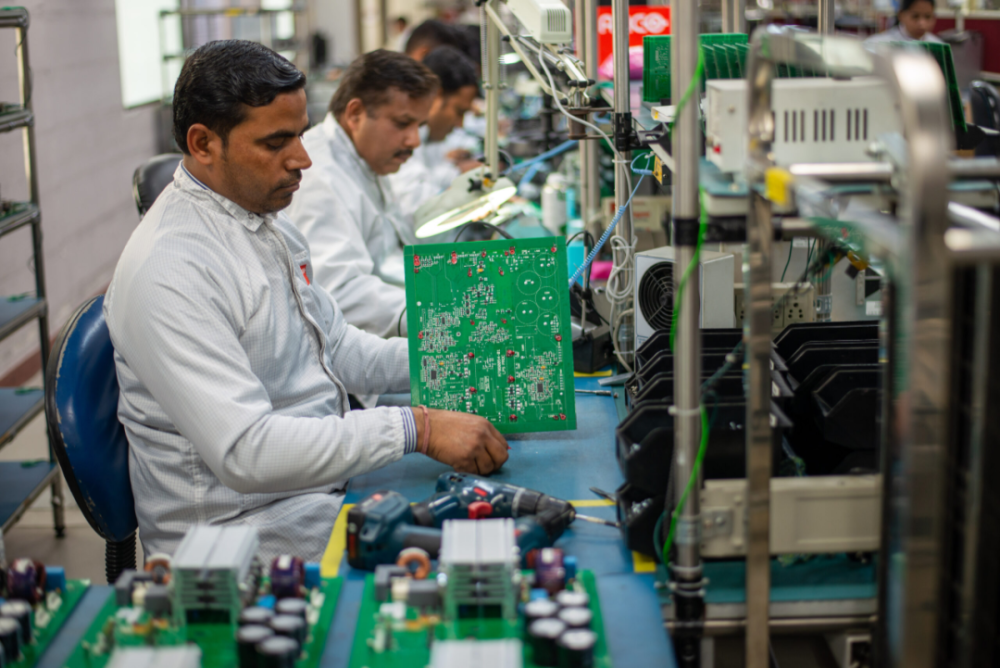

# 与日荷联手“围堵中国”，美国接下来又要拉印度入伙

**这真的能够给印度带来好处吗？**

据路透社援引知情人士的话报道，美国拜登政府正在考虑切断美国供应商与中国华为的所有联系，禁止包括英特尔和高通在内的美国供应商向华为提供任何产品。

美方还在积极拉人入伙。在同荷兰、日本达成“神秘协议”限制对华出口芯片之后，美国又找上了印度。双方就在半导体等高科技领域展开合作达成一致。

美方将这描述为美印关系的“又一个重要里程碑”，而印度也有心在上述产业有所发展。但这真的能够给印度带来好处吗？

**同印度合作，美国瞄准中国**

在胁迫诱拉日本荷兰入局对华芯片出口限制后，美国又有了新动作。这一次美国试图诱导入伙的对象是印度。

据《纽约时报》报道，在华盛顿举行了为期两天的高层会议后，美国和印度官员1月31日达成一致，同意扩大两国在国防技术、半导体、人工智能等高科技领域的合作。

这一回，美国似乎很大方。同印度官员见面会谈的，除了美国国家安全顾问沙利文、商务部部长雷蒙多，还有洛克希德·马丁公司、美光科技等美国企业高管以及大学校长。

_印度国家安全顾问阿吉特·多瓦尔和美国国家安全顾问沙利文。图源：indianarrative_

据《纽约时报》报道，根据双方达成的协议，美方将努力推动印度建设先进的移动网络，并寻求在半导体生产方面的新合作，包括帮助印度加强芯片的研究和生产、解决监管障碍，以及印度人才赴美工作签证限制等。

沙利文对媒体称，继美印2016年达成核电合作协议后，此次建立技术伙伴关系将成为美印关系的“又一个重要里程碑”。

当然，美国绝不会无缘无故为印度在半导体、人工智能等领域的发展提供帮助。

《纽约时报》提及拜登政府近一段时间来对中国在芯片等诸多高科技领域的限制，指出美国出于在这些领域同中国竞争的考虑，试图将某些关键零部件的制造从中国转移至印度。“我们在这里有一个共同的目的，那就是担心中国会在所有领域吃掉我们的午餐，除非我们找到合作的领域。”美国战略与国际研究中心高级顾问理查德·M·罗索毫不掩饰地说道。

**靠美国“提携”，印度或难圆梦**

印度也确实从不掩饰渴望跻身全球芯片制造商行列、在诸多高科技领域谋得一席之位的野心。只是，美国是否会为印度的野心提供真正的帮助？

印度国内的批评者认为，美国只是想削弱中国在半导体制造等领域的主导地位，并引诱印度在这场博弈中扮演区域代理人的角色。或者说，美国同印度的“这笔交易似乎更像是一场地缘政治游戏，而不是贸易协定”。

印度孟买NMIMS大学运营与数据科学教授阿比纳夫·库马尔·沙马在接受《外交学人》杂志采访时也指出，印度目前在半导体制造业中仍处于起步阶段。虽然近年来，印度半导体产业有所发展，美方也对印度表现出期待，但美方“言辞上的保证与书面上的承诺之间似乎仍然存在差距”，美印合作关系的范围和未来仍存在诸多不确定性。而接受同美国的伙伴关系，很有可能伴随的会是华盛顿的指手画脚。更何况，美国去年出台的《芯片和科学法案》其最终的目的是要将芯片制造业带回美国，塑造以美国为核心的全球芯片产业链。而印度不过是一枚棋子。

_印度渴望在半导体领域占得一席之地。图源：techwireasia_

对于印度来说，倘若真想谋得一席之地，除了野心，还需要脚踏实地。印度国大党发言人帕万·赫拉此前就表示，印度很有可能无法为像半导体这样的复杂资本密集型行业投入所需资金。打铁必须自身硬，印度想要升级本国芯片制造业，不能寄希望于美国的“提携”，而是应当首先打好产业基础。但不管怎样，其发展终究离不开亚洲区域产业链上下游参与者的密切合作，尤其是与制造业中心的中国的合作。

**出品 深海区工作室**

**撰稿 深海三文鱼**

**编辑 深海獭 深海猪**

