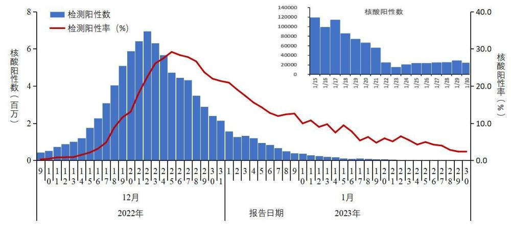
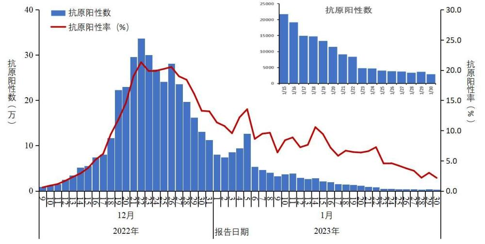
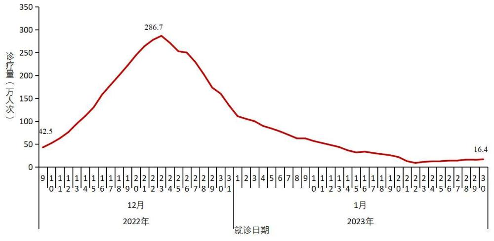
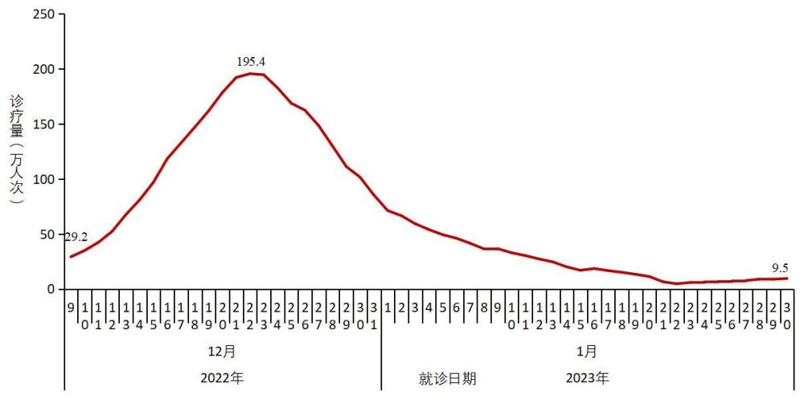
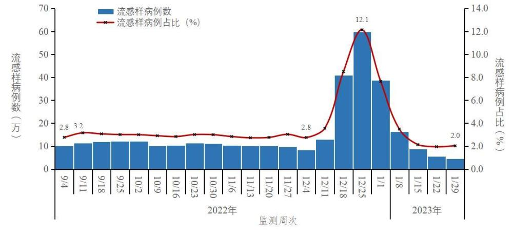
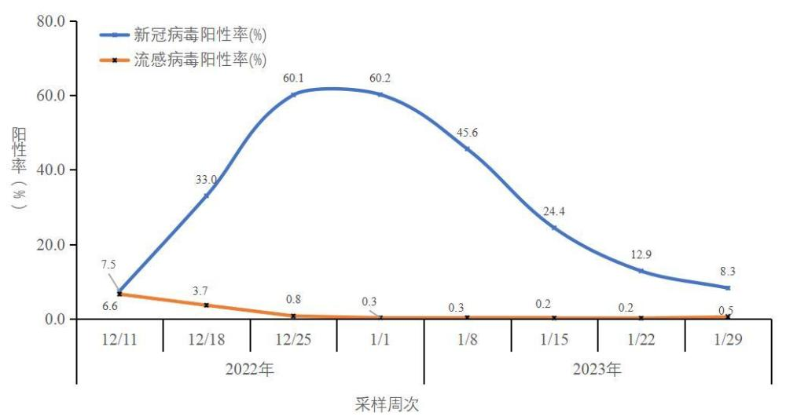
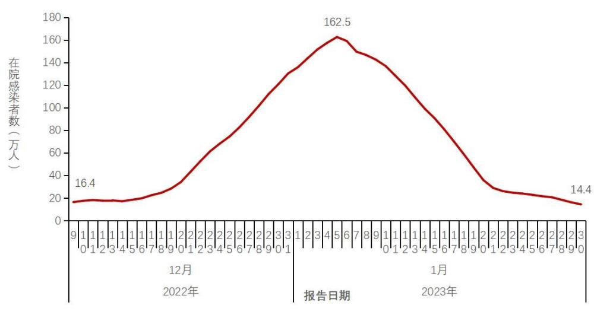
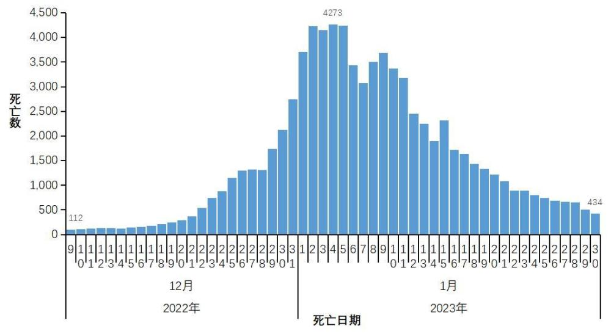
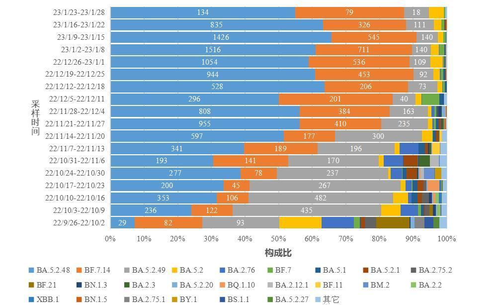
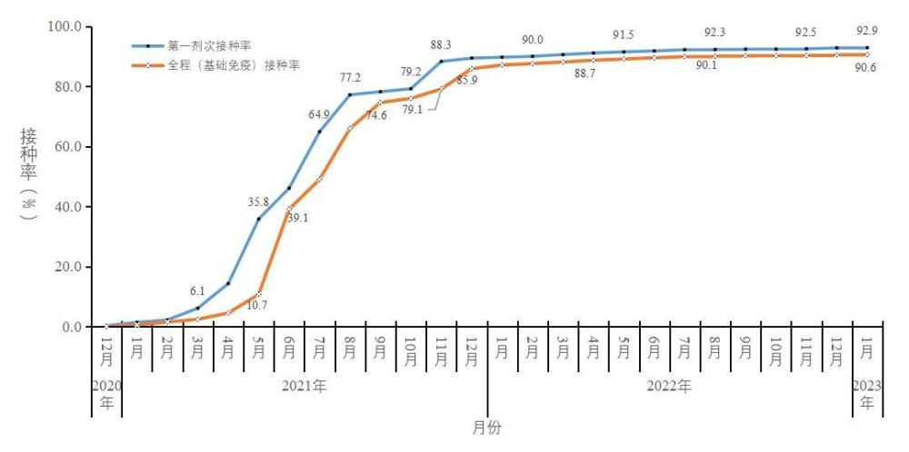

# 中疾控：在院新冠病毒感染死亡病例数于1月4日达到每日峰值4273例

2月1日，中疾控网站发布全国新型冠状病毒感染疫情情况。

**一、感染监测数据**

**（一）全国报告人群新冠病毒核酸检测结果。**
2022年12月8日以后，全国（不含港澳台，下同）不再开展全员核酸筛查，实行愿检尽检，同时部分地区对重点人群开展定期核酸检测。各省份利用已有的核酸检测信息系统，实时掌握核酸检测数据。受居民检测意愿影响，各省份核酸检测量不断减少，如12月9日检测量为1.5亿，2023年1月1日降至754万，1月23日降至最低28万后有所反弹，1月30日为97.4万。

2022年12月9日以来，各省份报告人群核酸检测阳性数及阳性率呈现先增加后降低趋势，阳性人数12月22日达到高峰（694万）后逐步下降，2023年1月23日降至最低1.5万，其后呈现低位波动，1月30日为2.4万；检测阳性率12月25日（29.2%）达高峰后波动下降，1月30日降至2.5%（图1-1）。

_图1-1全国报告人群新型冠状病毒核酸检测阳性数及阳性率变化趋势
（数据来源于31个省（区、市）及新疆生产建设兵团报告）_

**（二）全国报告人群新冠病毒抗原检测结果。**
2022年12月以来，部分省份建立居民抗原检测信息收集应用程序（APP），居民可自愿上传抗原检测结果。结果显示：各省份报告抗原检测量较低，呈现逐渐减少趋势，从2022年12月19日的最高189万下降到2023年1月23日的10.5万，其后有所反弹，1月30日为13.2万。抗原检测阳性数及阳性率自2022年12月9日快速上升，12月22日达高峰（33.7万、21.3%）后波动下降，2023年1月30日降至最低，分别为2848和2.2%（图1-2）。

_图1-2
全国报告人群新型冠状病毒抗原检测阳性数及阳性率变化趋势 （数据来源于31个省（区、市）及新疆生产建设兵团报告）_

**二、全国发热门诊（诊室）诊疗情况**

**（一）总体就诊人数结果**
。全国（不含港澳台）发热门诊（诊室）就诊人数于2022年12月23日达到峰值286.7万人次，随后连续下降，2023年1月23日后就诊人数呈现低位波动，1月30日为16.4万人次,较峰值下降了94.3%（图2-1）。

_图2-1
全国发热门诊（诊室）诊疗人数变化趋势 （数据来源于31个省（区、市）及新疆生产建设兵团报告）_

说明：自2022年12月9日起，监测二级以上医疗机构发热门诊诊疗量；12月21日起，增加监测社区卫生服务中心和乡镇卫生院发热诊室诊疗量（不含村卫生室和社区卫生服务站）。

**（二）农村发热门诊（诊室）就诊人员结果。**
全国乡镇卫生院发热诊室就诊人数于2022年12月23日达到峰值92.2万人次，随后波动下降；2023年1月23日后呈现低位波动，2023年1月30日为6.9万人次，较峰值下降了92.5%（图2-2）。

_图2-2
全国农村地区乡镇卫生院发热门诊（诊室）就诊人数变化趋势
（数据来源于31个省（区、市）及新疆生产建设兵团报告）说明：农村发热患者诊疗量为乡镇卫生院发热诊室诊疗量（不含村卫生室）_

**（三）城市发热门诊就诊人数结果。**
全国二级以上医疗机构和城市社区卫生服务中心发热门诊（诊室）就诊人数于2022年12月22日达到峰值195.4万人次，随后连续下降；1月23日后呈低位波动，1月30日为9.5万人次，较峰值下降了95.1%（图2-3）。

_图2-3
全国城市发热门诊（诊室）就诊人数变化趋势
（数据来源于31个省（区、市）及新疆生产建设兵团报告）说明：城市发热门诊诊疗量含二级以上医疗机构和社区卫生服务中心（不含社区卫生服务站）。_

。

**（四）哨点医院监测结果。**
2022年12月9日起，在我国已建立的824家流感监测网络哨点医院（包括国家级哨点医院546家、省级哨点医院278家）和402家国家级网络实验室开展新冠病毒核酸检测。结果显示：2022年9月-12月上旬，哨点医院每周流感样病例（体温≥38℃，伴咳嗽或咽痛之一）数量稳定在10万左右，至第51周（12月19日-25日）达到最高60万；流感样病例占门（急）诊就诊人数比值在2.7%-3.6%区间波动，第50周（12月12日-18日）明显上升至8.5%，第51周达到最高12.1%，第52周起快速下降；2023年第4周（1月23日-29日）已下降至2.0%，回落至本轮疫情之前水平（图2-4）。

_图2-4
全国哨点医院报告的流感样病例数及占比变化趋势 （数据来源于824家哨点医院）_

网络实验室对流感样病例标本同时进行新冠病毒和流感病毒检测，从2022年第49周（12月9日），新冠病毒阳性率开始逐渐增加，在第51和52周期间达峰值后持续下降，2023年第4周（1月23日-月29日）新冠阳性率已下降至8.3%；2022年第49周以来，流感病毒阳性率则逐步降低，至12月下旬降至极低水平，目前流感阳性率维持在1.0%以下（图2-5）。

_图2-5
全国哨点医院流感样病例新冠和流感病毒阳性率变化趋势 （数据来源于402家网络实验室）_

**三、住院诊疗情况**

**（一）在院新冠病毒感染者结果。**
全国在院新冠病毒感染者于2023年1月5日达到峰值162.5万人，随后持续下降，1月30日下降至14.4万人，较峰值减少了91.1%（图3-1）。

_图3-1
全国在院新冠病毒感染者每日变化情况 （数据来源于31个省（区、市）及新疆生产建设兵团报告）_

**（二）在院新冠病毒感染阳性重症患者结果。**
全国在院新冠病毒感染者中，重症患者数量于2022年12月27日至2023年1月3日期间每日增量近1万，1月4日增量明显下降，1月5日达到峰值12.8万，随后持续下降，1月30日下降至1.4万，较峰值下降了89.3%（图3-2）。

_图3-2
全国在院新冠病毒感染阳性重症患者变化情况 （数据来源于31个省（区、市）及新疆生产建设兵团报告）_

**（三）在院新冠病毒感染死亡情况。**
在院新冠病毒感染死亡病例数于1月4日达到每日峰值4273例，随后持续下降，1月30日下降至434例，较峰值下降89.8%（图3-3）。

_图3-3
全国在院新冠病毒感染死亡病例变化情况 （数据来源于31个省（区、市）及新疆生产建设兵团报告）_

**四、新冠病毒感染本土病例病毒变异监测情况**

我国持续开展新冠病毒变异监测，2022年12月后在每个省份选择部分哨点医院开展门（急）诊病例、重症病例、死亡病例及部分特殊人群病毒变异监测。同时开展陆路、水路和空港口岸入境人员病毒变异监测。监测结果表明，此轮疫情流行株主要为BA.5.2.48、BF.7.14和BA.5.2.49，未发现新的变异株。

**（一）总体情况。**
2022年9月26日至2023年1月30日，全国共报送20582例本土病例新冠病毒基因组有效序列，均为奥密克戎变异株，共存在73个进化分支，主要流行株为BA.5.2.48（52.1%）、BF.7.14（23.3%）和BA.5.2.49（16.0%），BA.5.2等21种进化分支构成比在0.1%-2.5%之间，49个进化分支的构成比小于0.1%（共占0.6%）（图4-1）。

_图4-1全国新型冠状病毒变异株变化趋势图
说明：1.采样日期：2022年9月26日至2023年1月28日。
2.图中标记的数字分别为BA.5.2.48、BF.7.14和BA.5.2.49进化分支有效基因组序列数量。3.“其它”指全国范围Omicron变异株构成比小于0.1%的进化分支。_

**（二）12月以来本土病例病毒变异株监测情况。**
2022年12月1日至2023年1月30日，全国共报送11878例本土病例新冠病毒基因组有效序列，全部为奥密克戎变异株，共存在26个进化分支。主要流行株为BA.5.2.48（61.1%）和BF.7.14（27.8%）（表4-1）。共发现重点关注变异株12例，其中，1例XBB.1，4例BQ.1.1，1例BQ.1.1.17，4例BQ.1.2，2例BQ.1.8。

**表4-1 全国新冠病毒变异株情况** （2022年12月1日至2023年1月30日）

**（三）新冠病毒变异分省份情况。**
总体来看，北京、天津和内蒙古以BF.7及其亚分支为优势株；江苏BF.7及其亚分支和BA.5.2及其亚分支基本持平；其他省份均以BA.5.2及其亚分支为优势株。（图4-2）。

_图4-2 各省份新冠病毒变异监测情况
说明：采样时间：2022年12月1日-2023年1月28日；2.图中标记的数字分别为BA.5.2.48、BF.7.14和BA.5.2.49进化分支有效基因组序列数量。_

**五、新冠病毒疫苗接种进展**

2020年12月15日全国启动新冠病毒疫苗大规模接种后，接种速度明显加快，5天完成1亿剂次接种，单日最高接种2474万剂次。我国积极稳妥推进接种工作，截至2023年1月30日，31个省（自治区、直辖市）和新疆生产建设兵团累计完成接种新冠病毒疫苗34.90亿剂次（图5-1）。全人群第一剂次、全程接种覆盖比例分别达到92.9%和90.6%（图5-2）。

_图5-1 分月新冠病毒疫苗累计接种剂次
（数据来源于31个省（区、市）及新疆生产建设兵团报告）_

_图5-2
分月全人群中第一剂次接种、基础免疫全程接种覆盖率 （数据来源于31个省（区、市）及新疆生产建设兵团报告）_

以2022年底全国老年人专项摸底调查人口数为基数统计，60岁以上老年人第一剂次接种覆盖人数占老年人群的96.0%，全程接种、第一剂次加强免疫接种人数分别占符合接种时间间隔老年人群的96.6%、92.2%（图5-3）。

_图5-3基于摸底人口数的60岁以上人群新冠病毒疫苗接种率
（数据来源于31个省（区、市）及新疆生产建设兵团报告）_

