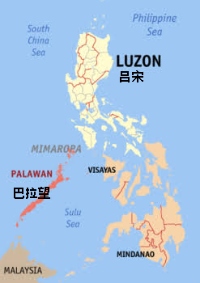

# 再要4个！美军希望菲律宾开放的军事基地，离台海更近

正在韩国访问的美国国防部长奥斯汀本周晚些时候将飞到马尼拉，会见菲律宾总统马科斯。《华尔街日报》1月31日报道说，奥斯汀希望在访菲期间达成一项协议——在菲律宾增加开放4个基地供美军进入，“这是华盛顿在该地区扩大战略足迹以应对中国威胁的最新努力”。

_《华尔街日报》1月31日报道：美国推动在菲律宾开放军事基地以对抗中国_

这4个军事基地在哪儿？《华尔街日报》引用美国官员的话说，其中一处可能在北部的吕宋岛，还有一处在西南部的巴拉望省，目前还不清楚另外两处的位置。

而《华盛顿邮报》同天的消息源称，这4个基地中，可能包括吕宋岛北部的两个基地，另两个不清楚。

看下吕宋岛和巴拉望的位置：

去年11月，美国副总统哈里斯成为有史以来访问巴拉望的级别最高的美国官员。巴拉望省狭长约200英里，紧挨中国南沙群岛，被美媒称为“菲律宾与中国海上主权争端的最前线”，哈里斯以副总统的身份登上巴拉望岛被媒体认为极具象征意义，是在向中国传递某种信号。而《华尔街日报》说，在她那次访问中，一名美国高级政府官员就暗示过可能在此地区增设供美军进入的基地，他说，两个盟国已经确定了“深化合作的新地点”。至于深化合作的项目，则包括安全合作演习、联合培训活动、人道主义救援等。美方还向这些基地投资了8200多万美元，而支持基地建设项目的大部分合同都给了菲律宾公司。

至于吕宋岛，是菲律宾距离台湾最近的大岛，与台湾相距仅195海里（约360公里）。美媒说，在这两个地区增设美军基地，可能使美军获得最优战略位置：一旦台湾海峡或南海发生冲突，美军可以从这些基地发动行动。悉尼大学美国研究中心的专家格林称，这也将有助于菲律宾确保解放军不会“直接穿过他们的群岛，攻击台湾或日本”。

就在美国军方准备扩大对菲律宾军事基地的使用权之际，本月早些时候，美国海军陆战队宣布将改造冲绳的一支部队，使其配备先进的能力，到2025年能够胜任“在严峻偏远岛屿上作战”，预备着“在台海发生冲突时可以向解放军舰只发射反舰导弹”。

2014年签署的美菲《加强防务合作协议》（EDCA），允许美军在菲律宾合法活动。该协议规定，美军可以使用菲律宾的4个空军基地和一个陆军基地，允许军队在这些基地轮换。目前有大约500名美国军事人员在菲律宾进行轮换。美媒称，美国在该国部署规模较小的轮换部队，“是为了避免与北京的紧张关系升级”。

但《华盛顿邮报》指出，之前协议中规定的5个基地都不在吕宋岛北部。

也就是说，这次美国希望开放的是新的基地。一名菲律宾国防官员对该报表示，有关新增基地的协议“或多或少”已经达成，将在两国国防部长会面时正式确定。他说，最近几天，菲美两国防长办公室的助手们在持续敲定关键细节。现在还不清楚将有多少美军参与。有官员说，作为回报，美国向马尼拉提供了包括无人机在内的军事援助，这样菲律宾军队就可以“监视南海的活动”。

美国战略与国际研究中心东南亚项目主任波林说，扩大菲律宾基地使用权“是一件相当大的事情”。“不仅对台湾或南海的突发事件意义重大，而且这是一个信号，表明菲律宾正在全力推动美菲同盟的现代化，他们明白，现代化联盟意味着他们也有责任。”

很明显，美国急于在南海周边找一个支点国家，它正在把菲律宾拉下水，胁迫菲律宾出借该国的军事基地，用来威吓中国。如果类似协议真的达成，驻菲律宾美军对中国的侦查能力将会提高，将来美国在这里部署一些海空军力量、陆战队都有可能。

本月早些时候，菲律宾国防部长在和美国总统国家安全事务助理沙利文对话时表示，与美国加强军事合作“对我们的防御态势是个好兆头”。但他强调，菲律宾加强自身安全的努力“并不针对任何特定国家”。

菲律宾总统马科斯1月18日在出席瑞士达沃斯论坛时表示，他不想在中美之间选边站队。

现在就看他怎么做了。

