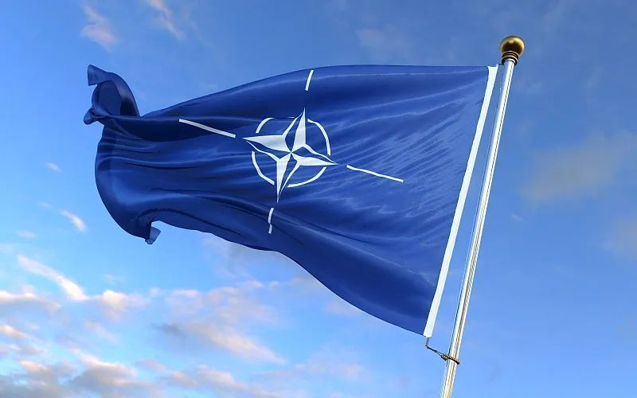
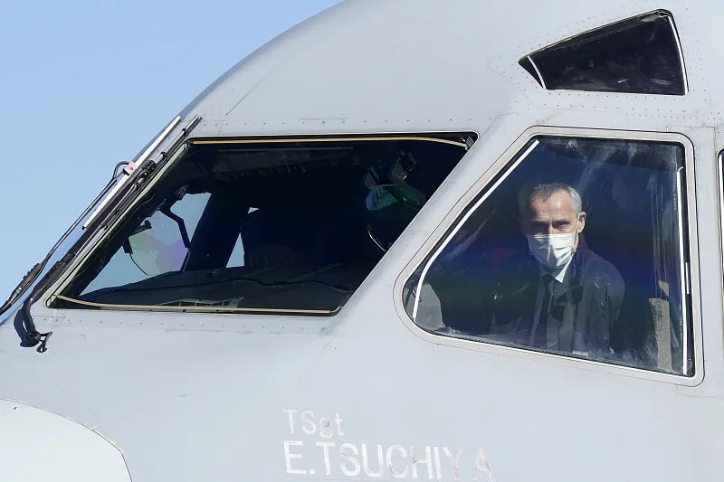
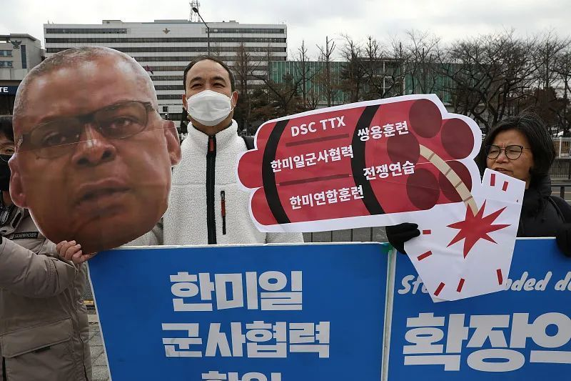

# 北约秘书长亚洲行，反复渲染“中国挑战”

1月31日，北约秘书长斯托尔滕贝格抵达其亚洲之行的第二站，与日本首相岸田文雄举行会谈并发表联合声明。声明强调双方将强化安全合作，共同应对俄乌冲突带来的挑战。

不出所料的是，声明再次提及中国，对中国正常的军事活动和军事合作说三道四，称中国“强化军力和扩大军事活动”，并对中俄联合演习表达了关切。

_日本东京，北约秘书长斯托尔滕贝格(左)与日本首相岸田文雄会谈。_

而此前一天，斯托尔滕贝格在访韩时大谈“中国挑战”。

斯托尔滕贝格称，虽然中国不是北约的“对手”，但中国在北约议程上变得重要得多。他说：“我们应该在军控、气变和其他议题上与中国接触。但与此同时，我们非常清楚，中国对我们的价值观、利益和安全构成了挑战。”

长安街知事（微信ID：Capitalnews）注意到，这是日韩两国领导人去年以观察员身份参加北约峰会后，北约领导人首次对两国进行访问。

在俄乌冲突延宕、亚太局势暗流涌动的背景下，北约秘书长此访大肆渲染“中国威胁”，无疑是以中国为借口，将北约触角进一步伸向亚太，加速打造“亚太版北约”。

强化安全合作是斯托尔滕贝格此番亚洲之行的重中之重。

在日本，双方在联合声明中称，“世界正处于二战结束以来最严峻、最复杂的安全环境中，处于历史转折点。”

声明指出，北约将加强日本与北约在海上安全、军备控制、网络空间和打击虚假信息等领域的合作。

“欢迎北约加深对印太地区事务的参与。”日本首相岸田文雄表示，将探讨定期参加北约决策机构“北大西洋理事会”会议。

当天早些时候，斯托尔滕贝格还前往日本航空自卫队入间基地，参观日本产C-2运输机，考察爱国者PAC-3防空导弹，并感谢日本对乌援助。

_斯托尔滕贝格坐在日本航空自卫队C-2运输机的驾驶舱里。_

1月30日访韩时，斯托尔滕贝格高度评价了韩版“印太战略”，并表示北约将努力加强与韩方在网络防卫、新技术等领域的合作，称最近韩国与北约成员国深化军工合作值得肯定。

斯托尔滕贝格同时要求韩国加强对乌克兰的军事支持，建议韩国重新考虑不向冲突中国家出口武器的政策。

北约加速“亚太化”的背后，美国的“黑手”不断浮现。

斯托尔滕贝格30日刚离开韩国，美防长奥斯汀就于当天下午搭乘有“末日飞机”之称的“E-4B”空中指挥机抵达韩国。该飞机可指挥洲际导弹、核轰炸机、核潜艇等美国所有核战斗力和陆海空部队。

_1月31日，韩国首尔，当地民众参加抗议集会，反对美国国防部长奥斯汀访问韩国。_

奥斯汀抵韩后，与韩国防长李钟燮举行了近8个月来的第4次会谈，双方同意扩大联合军演规模，进一步加强美国“延伸威慑能力”，争取美方适时向韩方调遣战略武器，并加强韩美日三国安全合作。

值得注意的是，“延伸威慑”是指美国将在盟国遭到核威胁或攻击时提供“核保护伞”，动用常规武器和导弹防御系统，像保卫本土一样保卫盟国。

尹锡悦评价奥斯汀此访进一步巩固了“全球全面战略同盟”的韩美同盟地位，奥斯汀则称韩美同盟的力量“比任何时候都要强大”，美国将全力加强与韩国的联合防卫态势。

由此可见，北约加速“亚太化”，与美国大力推进“印太战略”密不可分。有分析指出，美国自去年以来明显加快了亚太安全架构布局的节奏，在渲染“中国挑战”舆论氛围的同时，推动亚太盟友尽快与北约对接，形成遏制中国的区域乃至全球安全架构。

美国和北约不断将“黑手”伸向亚太，已引起地区国家高度警惕。

朝中社30日发表评论称，北约秘书长此行是“欲给亚太地区带来‘新冷战’乌云的对抗之行、战争的前奏曲”。

俄罗斯外交部长拉夫罗夫此前表示，数十年来亚太地区形成了一个包容、开放、平等的安全与合作框架，但美国正试图通过将亚太地区军事化来扩大北约的势力。

而针对北约反复渲染所谓“中国挑战”，中国外交部发言人毛宁30日表示，“中国是世界各国的合作伙伴，而不是挑战。”

毛宁强调，北约一面声称其作为区域性、防御性联盟的定位没有变化，一面不断突破传统防区和领域，不断加强与亚太国家军事安全联系，有关动向应引起地区国家高度警惕。北约应该放弃冷战思维阵营对抗的理念，为欧洲和世界安全稳定多做一些有利的事。希望地区国家坚守亚太合作正道，为维护和促进世界和平稳定与发展繁荣发挥建设性作用。

图源：视觉中国

