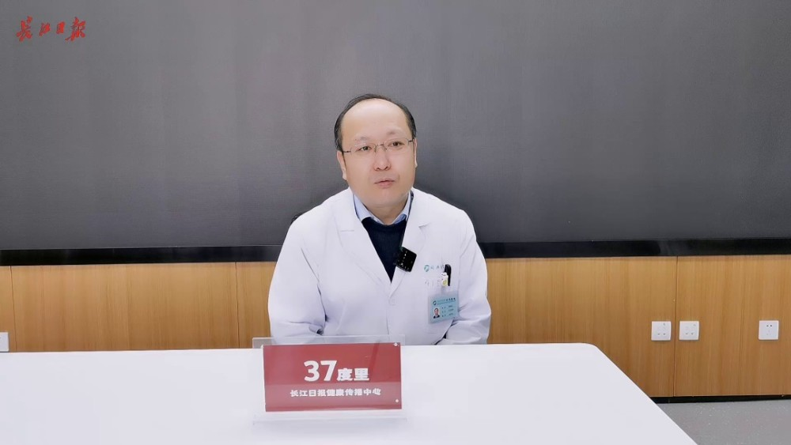

# 新冠病毒“传”不动了？同济专家：第二轮感染高峰可能会在3-5月

近日有一条热搜引起大众关注专家称新冠病毒有点“传”不动了。是病毒变弱了吗？还会不会有下一轮感染高峰？我会二次感染吗？

1月31日下午3时，长江日报“春节健康团圆不容‘疫’”公益科普直播邀请到华中科技大学同济医学院附属同济医院感染科主任医师邢铭友教授，针对大家关心的问题，一一作出解答。

_邢铭友教授直播解答网友关注的问题。记者刘派
摄_

**感染率下降是病毒“传”不动了？**

中国疾控中心近期发布全国新型冠状病毒感染疫情情况显示，新冠病毒感染率呈下降趋势。刚刚过去的春节，疫情并未有明显反弹。为什么大家回乡探亲或者走亲访友，疫情却没有加重？

邢铭友教授表示，感染率下降并不是指病毒变弱了，实际病毒在我们生活中还是存在的。造成病毒“传”不动的原因是，绝大多数人都已经“阳过”了，体内有抗体，
**形成了群体免疫屏障** 。

其次，随着病毒流行的进展， **病毒毒性、致病性在慢慢变弱**
。公众个人自觉戴口罩、保持社交距离等各种防护措施的加强，短期内新冠病毒传播速度会变慢，感染人数会下降。

**专家预测第二轮感染高峰在3-5月**

从病毒学的角度和流行病学的角度来看，“阳康”后体内抗体水平会维持3到6个月比较高的峰值，短时间内再感染的人只有2%的概率。但是我们国人口基数非常大，从去年12月开始，再过3到6个月，我们的抗体水平慢慢下降以后，这时候如果有新的病毒变异株，我们再次感染后出现临床症状的可能性非常大，仍有可能出现高峰。

直播中 **邢铭友教授给出预测，第二轮感染高峰可能会在3-5月到来，但这次高峰民众可能感觉不那么明显。**
由于大家感染的时间先后有差异，再加上我们第二次感染以后，由于有一个基础抗体水平的存在，
**第二轮感染的人数、感染症状的轻重，以及时间集中的幅度都会比第一次要弱得多。**

**“阳康”后如何预防二次感染？**

“新冠病毒主要通过呼吸道飞沫传播， **预防二次感染，口罩戴牢仍然是最重要的个人健康防线。**
”邢铭友教授提醒，特别是在人群较密集的公共场合，必须规范佩戴口罩。普通民众常规出行规范佩戴医用外科口罩就足够。从事一些高风险岗位和环境下，感染概率增加需要佩戴N95口罩。

由于“阳康”后6个月，我们第一次感染以后产生的抗体已经消失殆尽，这时候补种加强疫苗非常有必要。接种后可以推迟感染的时间，或者说减少感染的概率。

**3类人群建议优先接种：**
一、从事高风险岗位工作如医生、快递员等；二、有基础疾病的老年患者如糖尿病、高血压、有肿瘤或者是透析做过移植的这些患者；三、在第一次感染中出现了肺炎的表现，症状较重住院治疗过的人群，
**在第一次“阳康”以后6个月一定要接种加强疫苗** 。

此外，每个人做好自己健康的第一责任人，保持社交距离，养成良好的卫生习惯，很大程度上还是可以预防第二次感染。如果二次感染，邢铭友教授强调，一定不要在家硬扛，及早就诊避免发展成重症。

（来源：37度里丨长江健康融媒）

【来源：37度里丨长江健康融媒】

