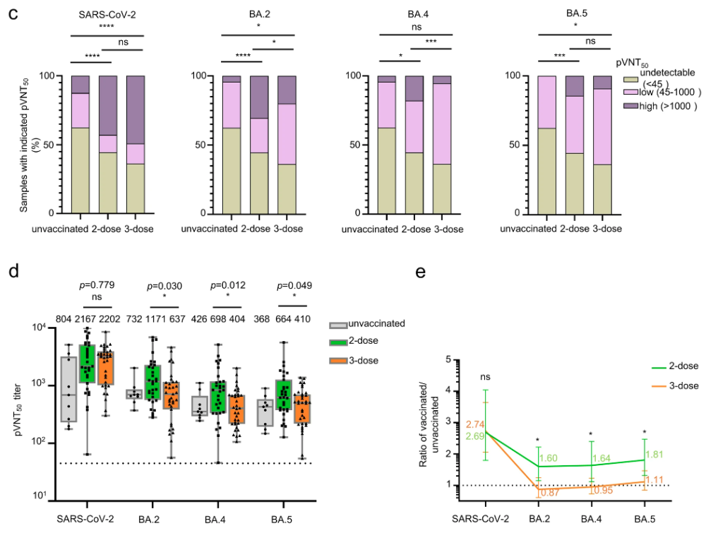
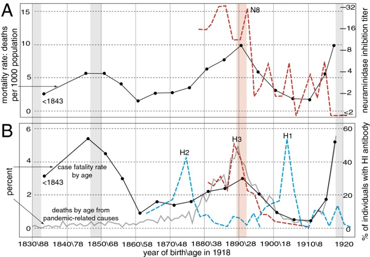
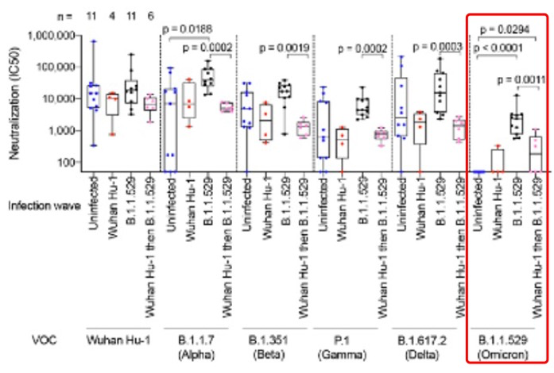
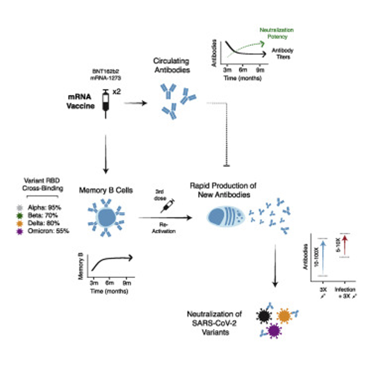

# 最新研究：接种三针灭活疫苗，Omicron 中和能力反而降低？

2023 年 1 月 25 日，这项题为 Repeated vaccination of inactivated SARS-CoV-2 vaccine
dampens neutralizing antibodies against Omicron variants in breakthrough
infection 的研究以 Letter 形式发表于 Cell Research 上。

研究收集了来自上海的 135 份 BA.2 感染者血清样本，其中 24 人从未接种新冠疫苗，56 人接种 2 剂灭活疫苗，55 人接种 3 剂灭活疫苗。

结果显示，与接种 2 剂新冠疫苗的人相比，接种 3 剂的「高抗原始毒株中和抗体」水平更高，但「高抗 Omicron 突变株中和抗体」水平却下降了。

同时，与接种 2 剂新冠疫苗的人相比，接种 3 剂的抗 BA.2、BA.4 和 BA.5 中和抗体几何平均滴度均显著下降。

图源：参考资料 1

研究团队认为，这些结果表明， **重复接种疫苗可能会唤起对原始毒株的强烈免疫反应，但同时也会抑制对新突变株的免疫反应。**
这一现象在免疫学中被称为免疫印记（immunological imprinting），或抗原原罪（original antigenic sin）。
**抗原原罪：新的抗原激活老的免疫** 抗原原罪指的是
**当免疫系统对某个抗原建立免疫记忆后，再遇到一个类似但稍有不同的新抗原时，会优先激活针对最初抗原的免疫反应。**
但是，新的抗原与原始抗原本身还是存在一定区别，因此，这样的受原始抗原「影响」的免疫反应在应对新抗原时就不是「最优」的了，故有「原罪」一说。抗原原罪这个概念最早在流感中出现。20
世纪 60 年代时有科学家提出，人体针对流感产生的抗体主要取决于第一次接触的流感病毒株，以后再感染时，
**哪怕病毒株已经因为突变产生了「抗原漂变」、与原来的病毒株有了差异，人体产生的免疫反应还是以针对最早接触的流感病毒株为主。**
目前，抗原原罪已被认为与登革热病毒、流感病毒、HIV 病毒有关。一个可能的例子是 1918 年 H1N1 西班牙流感大流行，当时，分年龄阶段的死亡率在 28
岁段达到峰值。而这个年龄段对应的出生年份是 1880 年，彼时正是 H3Nx 俄罗斯流感大流行时期。有推测认为，之所以在 28
岁出现死亡率峰值，这是因为这个年龄段的人群在幼儿时期对 H3Nx 产生了强大的免疫记忆，到了二十多年后，再次暴露于 H1N1
时，新的抗原激活了老的免疫，但产生的免疫应答无法很好地抵御 H1N1，因此死亡风险增加。

图源：参考资料 2

登革热的例子则更为极端。

登革热病毒有四个主要的血清型。只要感染过其中一种，或者如果以一种血清型的病毒制作疫苗进行接种，抗原原罪的反应程度就足以强到今后遇到其它任何一个血清型，产生的抗体主要是针对最初那个血清型的，而对其它血清型无效。

在新冠疫情中，也有一些研究观察到了抗原原罪现象。

如 2022 年 6 月，Science 一篇题为 Immune boosting by B.1.1.529 (Omicron) depends on
previous SARS-CoV-2 exposure 的论文发现，接种三针 mRNA 新冠疫苗后， **早期曾感染过原始毒株的人，再感染了
Omicron 后，针对 Omicron 的中和抗体虽然相对未感染或只感染原始毒株的有一定增加，但却要明显低于没有感染过原始毒株只感染了 Omicron
的人群。**

图源：参考资料 3

原始病毒株的感染史，同样「干扰」了人体对于 Omicron 感染的常规免疫反应诱导。这一现象也证实了新冠病毒感染中抗原原罪现象的存在。

那么，抗原原罪的存在是否意味着既往感染和疫苗接种失效？

**实际上，抗原原罪带来的实际影响因病原体的不同而有所区别，可能只是影响免疫反应的程度，而并非让免疫反应完全失效** ，像登革热的极端现象并不普遍存在。

更多真实世界的数据显示，过往感染以及疫苗接种对 Omicron
的重症保护作用仍然良好。同时，还有一些研究显示，在接种完疫苗后人体对新冠的免疫识别广度也在增加，这个过程会在接种完疫苗后的好几个月里持续发生。

Cell 上的一篇论文显示，接种完两种 mRNA
疫苗后，虽然中和抗体滴度随时间下降，但中和抗体本身的中和能力却随时间在提升。接种完第三针增强针后，那些能识别包括 Omicron 在内各种突变株的记忆 B
细胞又被迅速激活，产生大量中和效率非常高的抗体。

图源：参考资料 4

另一篇研究 Omicron 突破性感染后记忆 B 细胞变化的论文则发现，发生突破性感染后，记忆 B
细胞的应对也是非常讲究「策略」，主要扩增了那些识别各突变株的保守区域的记忆 B 细胞。

以上的研究相互佐证： **人体对新冠的免疫识别具有高度灵活性，即便最初接触的抗原是原始病毒株或某个突变株，最终的免疫记忆却能有很好的广度。**

而在此次发表于 Cell Research 的最新研究中，研究团队同样指出，与 2 剂疫苗组相比，3 剂疫苗组对 Omicron
突变株的中和抗体活性虽然降低了，但这两组之间的临床症状相似，并且接种 3 剂疫苗已被证明能够降低感染后的重症和死亡风险。

研究团队强调， **这项研究仅限于接种疫苗后的突破性感染者，对于大多数人而言，仍然强烈建议进行新冠疫苗加强接种以预防重症。**

**二价疫苗引争议：什么样的加强针更好？**

关于抗原原罪，还有一些声音表达了对 Omicron 突变株疫苗的担心：接种过原始毒株疫苗的人再去接种针对 Omicron
设计的疫苗，是否也会存在抗原原罪？针对 Omicron 设计的疫苗还会有保护作用吗？

一项来自哥伦比亚大学的研究收集了 40 人的血清样本，这些人接种了三剂单价 mRNA 疫苗及第四剂（二价或单价疫苗）。比较发现，针对原始毒株和
Omicron BA.4/BA.5 等亚株，与使用原始单价疫苗进行第四针加强相比，使用二价疫苗没有引发显著优越的病毒中和抗体反应。

另一项发表于 NEJM 的研究观察了 33 名疫苗接种者针对 BA.5 的免疫原性，结果接种单价和二价 mRNA 疫苗加强针后，针对 BA.5
的中和抗体滴度中值相似。

**两项研究均提出，抗原原罪现象可能成为二价疫苗的阻碍。**

费城儿童医院的疫苗专家 Paul Offit 引用上述研究数据认为，二价疫苗不一定优于原始单价疫苗。在 FDA
疫苗与相关生物制品咨询委员会（VRBPAC）中，Offit 也是投票反对二价加强针的专家之一。

他还引用了此前辉瑞针对 BA.1 研发疫苗的数据，其中，相比较低剂量的二价疫苗（30 微克），单价 BA.1 疫苗或更高剂量（60
微克）的二价疫苗显示出更强的 BA.1 特异性中和抗体反应。 **据此，Offit 建议，单独使用 BA.4/5 mRNA
疫苗成分可能会引起更符合预期的免疫反应。**

不过，也有不少专家支持二价加强针的使用。

Scripps Research 分子医学教授 Eric Topol
认为，大量数据表明二价加强针的表现要好于预期。他引用四项使用活病毒评估中和抗体反应的预印本研究，数据表明，与原始疫苗相比，更新后的二价疫苗针对 BA.5
的中和抗体增加了 2～8 倍，针对 XBB 的中和抗体增加了 2～6 倍。

同时，Topol 还指出，几项真实世界研究也表明了二价加强针的有效性。如以色列一项针对超过 700,000 名 65
岁及以上参与者的研究发现，接受二价加强针的人新冠住院的风险降低了 81%，死亡风险降低了 86%。同样，美国 CDC 一项研究发现，65
岁及以上人群接种新的加强针后，住院风险降低了 73%～84%。

2022 年 6 月 17 日，WHO 在研究了 Omicron 感染以及 Omicron 版疫苗研发的数据后建议，在现有疫苗完成基础免疫后，可以用
Omicron 版疫苗作为增强针。

刚刚过去的 2023 年 1 月 26 日，FDA 疫苗与相关生物制品咨询委员会（VRBPAC）以 21:0 通过一项决议，
**支持将现行的「基础针+加强针」的新冠疫苗注射流程，优化为每年只需接种一剂二价新冠疫苗（原始毒株 + Omicron BA.4/BA.5 毒株）** 。

不过，也有一些专家对此表示了担忧。有学者指出，双价疫苗作为初免疫苗的有效性数据还很少， **而由于抗原原罪现象的存在，加入原始毒株可能会削弱疫苗对
Omicron 突变株的有效性。**

FDA 表示，专家组将在 5 月或 6 月再次召开会议，讨论是否正式决定更改疫苗配方，及更新后的疫苗应该只包含一种新冠毒株，还是包含多种新冠毒株。

2022 年 12 月 4 日，北京神州细胞生物研发的二价（Alpha/Beta 变异株）S
蛋白疫苗被纳入紧急使用，这也是我国目前唯一纳入紧急使用的多价新冠疫苗。
**中国疾控中心流行病学首席科学家曾光也公开呼吁，「第四针一定要变换疫苗，不能再用灭活疫苗了」。**

此外，神州细胞的四价（Alpha/Beta/Delta/Omicron 变异株）S 蛋白疫苗也正在研发中，国药中生针对 Omicron BA.1
的广谱重组疫苗也已进入 III 期临床。

什么样的疫苗更适合作为加强针？什么样的接种方案能够提供更好的免疫？抗原原罪对新冠的影响程度究竟如何？这些问题都还需要大量免疫学研究、疫苗有效性追踪等数据来验证，进而启发如何设计更广谱更高效的疫苗。（策划：z_popeye｜监制：gyouza）

**致谢：本文经 中国科学院微生物学博士、知名科学博主 @二手的科学家 专业审核**

感谢 周叶斌 对本文做出的贡献

题图来源：论文截图

参考资料：

[2]https://www.ncbi.nlm.nih.gov/pmc/articles/PMC4050607/

[3]https://www.science.org/doi/10.1126/science.abq1841

[4]https://www.cell.com/cell/fulltext/S0092-8674(22)00456-1

[5]https://www.nejm.org/doi/full/10.1056/NEJMc2213907?query=featured_home

[6]https://www.nejm.org/doi/full/10.1056/NEJMc2213948

[8]https://www.medpagetoday.com/infectiousdisease/covid19vaccine/102604

[9]https://www.advisory.com/daily-briefing/2023/01/17/covid-immunity

