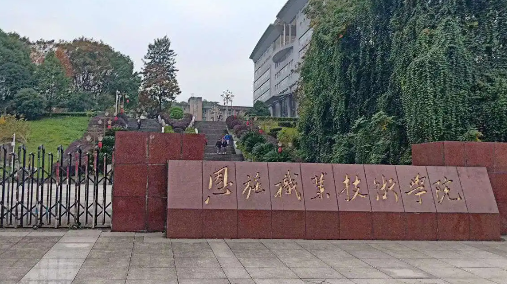

# 湖北恩施一院校学生返校需出具肺结核筛查报告，当地曾是结核病高发区

据湖北恩施职业技术学院网站消息，恩施职业技术学院办公室1月28日发布《2023年春季学期学生返校入学须知》，要求所有返校入学中高职学生提供所在地市县级及以上医院出具的肺结核筛查报告。

恩施职业技术学院2023年春季学期返校入学对象为， **2021级、2022级中高职全体在校学生**
（不含实习学生）；“一村多大”学生本次暂不返校，返校时间以教务处通知为准。学校实行分时段、分校区错峰返校入学，全体学生2月13日正式上课。

恩施职业技术学院2023年春季学期返校入学条件为：（一）按学校统一要求，在规定时间内返校入学，不得无故提前。（二）返校入学途中全程佩戴口罩，注意手卫生，当好自身健康第一责任人。（三）恩施州内外学生返校入学进入校园时须测量体温，发现发热症状学生及时采取留观等措施。返校入学前有发热、干咳、乏力、咽痛等症状学生，不得带病到校学习，待症状痊愈后再返校。（四）所有返校入学中高职学生均需提供所在地市县级及以上医院出具的肺结核筛查报告。

恩施职业技术学院规定，学校不再开展全员核酸筛查，对校内重点人员按照有关规定开展核酸或抗原检测。除跨地区返校入学外，学校师生出入校门和校园公共区域不要求提供核酸证明（其他外来人员“非必要不进校”，确需进入校园须提供48小时核酸阴性证明）。

据恩施土家族苗族自治州政府网站2022年3月信息，恩施州是结核病高发地区，自1998年起每年肺结核病的发病人数和发病率一直居全州报告的甲乙类传染病首位，自2007年以来恩施州结核病发病率位居湖北全省第一位，2019年起每年发病人数位居第二，仅次于武汉市。2021年全州结核病报告发病率107.98/10万，距离2035年终结结核病报告发病率10/10万以下的目标还有不小距离。

恩施州委、州政府始终高度重视结核病防治工作，开展重点人群结核潜伏感染筛查工作，扎实做好学校结核病防治工作，将结核病筛查作为全州各级各类学校学生、教职员工
**每年秋季开学前常规体检必检项目** 。

澎湃新闻注意到，秋季新生入学筛查肺结核是国家规定。原国家卫生计生委办公厅与教育部办公厅《关于印发学校结核病防控工作规范（2017版）的通知》（国卫办疾控发【2017】22号）中，附件《新生入学和教职员工常规体检结核病检查方案》要求：

一、幼儿园、小学及非寄宿制初中入园（入学）新生体检应当询问肺结核密切接触史和肺结核可疑症状，对有肺结核密切接触史者开展结核菌素皮肤试验。

二、高中和寄宿制初中的入学新生应当进行肺结核可疑症状筛查和结核菌素皮肤试验；对肺结核可疑症状者和结核菌素皮肤试验强阳性者需要进行胸部X光片检查。

三、大学入学新生采用肺结核可疑症状筛查和胸部X光片检查，重点地区和重点学校也可同时开展结核菌素皮肤试验。

除了将结核病筛查作为每年秋季开学前常规体检必检项目外，恩施州 **恩施市还要求非义务制教育阶段学生寒假期间自行去县级及以上医疗机构进行结核病筛查** 。

恩施州教育局2018年7月在答复州政协八届二次会议《关于加强恩施州学校结核病防治工作的建议》时透露，2017年州卫计委、州教育局联合下发《关于建立高中以上阶段学校结核病筛查制度的通知》，恩施市、利川市、咸丰县、来凤县、鹤峰县认真贯彻落实。其中，恩施市要求非义务制教育阶段学生寒假期间自行去县级及以上医疗机构进行结核病筛查，共筛查学生44605人，查出患者61例；咸丰县筛查6447名学生，发现结核病患者7例。来凤县筛查学生2110人，未发现结核病患者；利川市共计筛查学生16816人，确诊学生肺结核病人13例，结核性胸膜炎3例；鹤峰县筛查学生2700人，查出结核病患者8名。2018年，截至5月底，全州学生报告确诊肺结核病162例。

恩施职业技术学院位于湖北省恩施市学院路，在校学生20000余人。恩施职业技术学院是经湖北省人民政府批准、教育部备案的全日制公办高职院校，学校由原恩施教育学院、恩施财校、恩施农校、恩施工校、恩施林校和恩施供销学校合并组建而成，其后，州机电工程学校、州民族体校、州艺术学校、州交通技工学校、州卫生学校、州商校相继并入。

