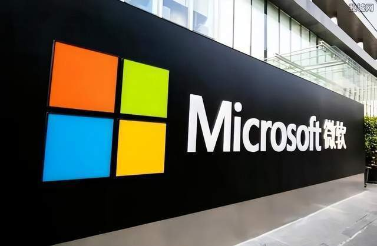
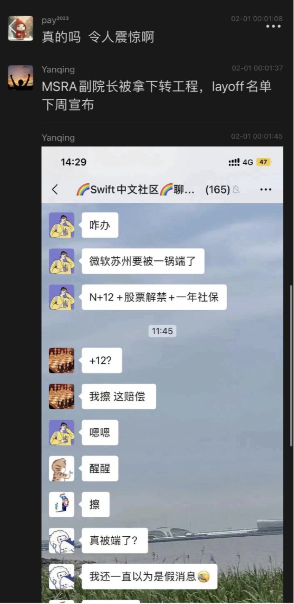

# 网传微软苏州大裁员：赔偿N+12个月工资，股票解禁，一年社保

Tech星球2月1日消息，近日网上流传一张截图，内容透露微软苏州大裁员，赔偿N+12个月工资，股票解禁，一年社保。截图还称，MSRA副院长被拿下转工程，layoff名单下周宣布。

此前微软公司宣布，由于经济形势不佳且客户需求变化，将于3月底前在全球裁员1万人，约占员工总数的5%。裁员及相关变动将导致该企业2022年第四季度收益损失12亿美元。

微软公司说，裁员是为回应“宏观经济形势和客户优先考虑事项变化”。此外，公司还将调整一系列硬件系统并整合租用的办公地点。

