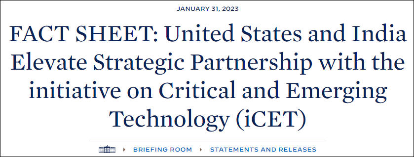

# 美印在AI等领域达成新合作倡议，外媒：将联手对抗中国

（观察者网讯）

当地时间1月31日，经过美国与印度高级官员连续两天的洽谈，美国白宫当天公布了旨在提升美印战略伙伴关系的“美印关键和新兴技术倡议”（iCET），其中强调双方政府、企业界和学术界将致力于在人工智能（AI）、通信、半导体、航空航天等六大领域展开密切合作。

美国总统国家安全顾问沙利文31日受访时承认，美印新倡议有“与中国进行地缘政治竞争”的背景，并渲染中国在经济、军事上的发展给美印带来很大挑战。《华盛顿邮报》、路透社等媒体同日纷纷解读称：美印倡议是“在人工智能等领域与中国竞争”，美印将联手对抗中国。

_白宫网站截图_

据白宫网站消息，1月30日，美印双方40多位高级官员、企业领袖、知名学者在白宫举行圆桌会议，共同商讨“美印关键和新兴技术倡议”（iCET）相关事宜。美国商务部长雷蒙多、美国总统国家安全顾问沙利文与印度总理国家安全顾问阿吉特·多瓦尔等与会。

1月31日，沙利文与阿吉特·多瓦尔在华盛顿共同举行了“美印关键和新兴技术倡议”（iCET）第一次正式会议。白宫网站于会后发布了倡议说明书，指出美印将在六大领域展开合作。

六大领域包括：加强两国间的创新生态系统（人工智能、量子技术等）；国防工业与技术；建立有韧性的半导体供应链；太空合作；科学、技术、工程和数学人才培养；下一代通信（5G、6G技术）。

实际上，早在2022年5月，美国总统拜登与印度总理莫迪就宣布启动了“美印关键和新兴技术倡议”，但迟至今年1月31日才举行第一次正式会议。下一次会议预计今年晚些时候在印度新德里举行。

白宫在说明中并未提及中国，不过沙利文在31日对媒体透露，美印倡议是为了与中国竞争。

_路透社报道截图_

综合《华盛顿邮报》、路透社，沙利文承认，“过去十多年来，与中国的地缘政治竞争背景一直是美印关系中的一个特点”，本次倡议也不例外。他还渲染，“中国带来很大的挑战”，它的经济实践、军事行动以及在未来产业、供应链方面的努力都给印度的思想带来深远影响。

对此，路透社在报道中解读称，美国与印度的新倡议正在瞄准人工智能（AI）与武器制造等领域与中国竞争。英国《金融时报》31日也称，美印这一系列雄心勃勃的技术、太空、国防倡议的目标是在“印太地区”对抗中国，同时摆脱印度对于俄罗斯进口武器的依赖。

《华盛顿邮报》分析说，印度向来是一个不与任何国家结盟的大国，但随着中国在该地区的优势变得越来越大，印度与美国的利益开始趋同。

不过，报道也指出，美印这两个“脾气不太好的”民主国家并不总是步调一致。卡内基印度研究中心负责人鲁德拉·乔杜里（Rudra
Chaudhuri）说：“成果需要时间才能发挥其全部潜力……这还需要两国的私营部门、学术界、智库和思想领袖更加努力地加速新兴技术合作。”

近年来，美国和印度出于对中国崛起的担忧而关系日近。印度加入了意在对抗中国的美日澳印“四方安全对话”（QUAD），炒作所谓“印太经济框架”，而且频频与美国等在中国周边举行联合军演。

对此，俄卫星社曾发表评论文章提醒印度，美国正在哄骗印度“一起做朋友、抗衡中国”，看起来美印似乎都希望遏制中国，但印度的对华立场与美国有着本质区别。印度并不谋求全球霸权，同时中国是印度重要邻国。印度真正需要做的是与中国发展多元化和密切的关系，而不是听信一些鼓吹印度转向西方的人煽动。

关于美印等国近年一些针对中国的所谓“合作”，早在2021年3月，外交部时任发言人赵立坚在回应美日澳印“四方安全对话”首次峰会时就已指出，一段时间以来，个别国家热衷于渲染煽动所谓的中国挑战，挑拨地区国家间，特别是他们同中国的关系，但他们的所作所为逆转和平发展合作的时代潮流，违背地区国家和人民的共同心愿，既不受欢迎，也不会得逞。

赵立坚强调，国家间的交往合作应有助于增进地区国家间的相互理解与信任，而不应针对第三方或损害第三方利益。有关国家应该摒弃陈旧过时的冷战思维和意识形态偏见，不搞封闭排他的小圈子，多做有利于地区国家团结合作和地区和平稳定的事。

**本文系观察者网独家稿件，未经授权，不得转载。**

