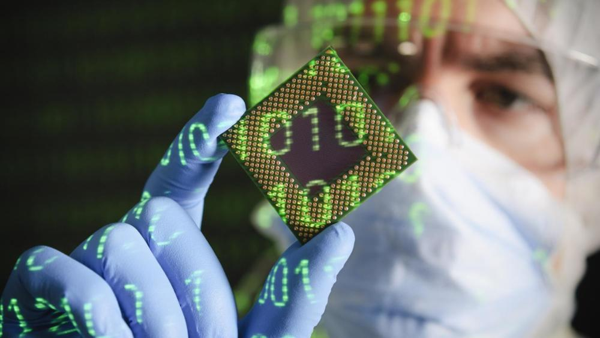
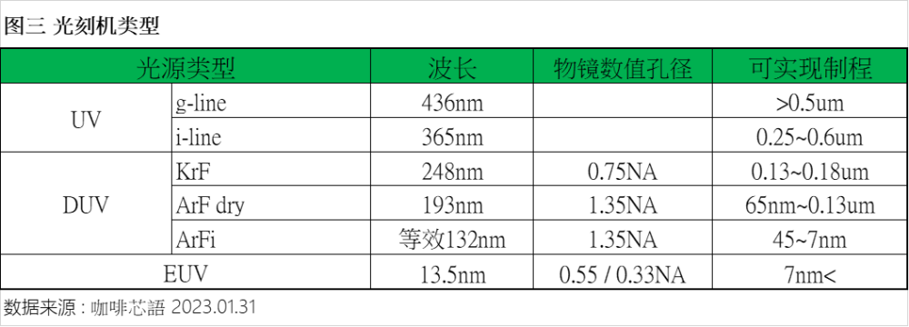
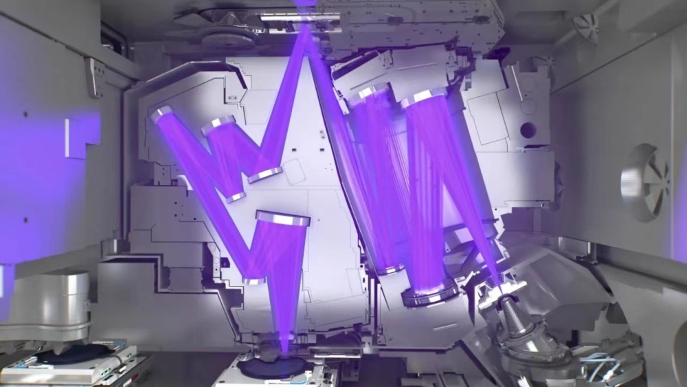
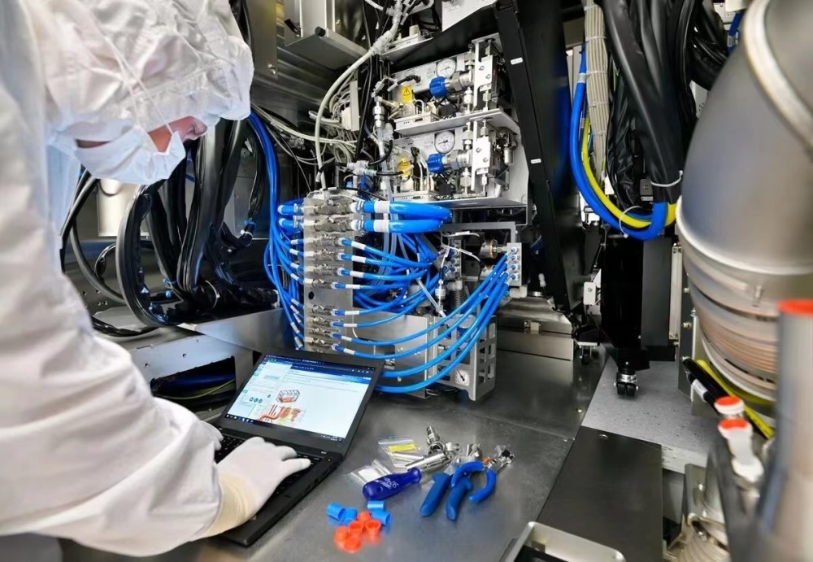
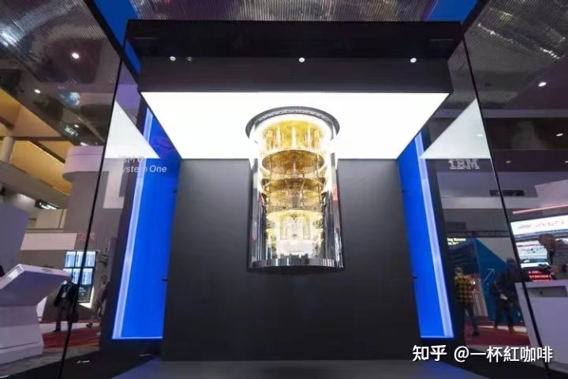

# 美国梭哈，日荷跟进，中国芯片奋力一搏还是盖牌走人？

**划重点：**

  * _1_ 尼康可以生产浸没式光刻机，TEL更是取代美国AMAT，LAM关键设备的唯一厂家。利用荷兰与日本构建的非美产线是可以规避美国技术封锁的办法，很显然美国也意识到了这一点，所以才会有这次的美日荷三方会议。
  * _2_ 这两年国内半导体行业很大部分是构建非A芯片产线,以缓解美国对国内芯片制裁的压力，而现在美日荷三方协议达成则正式宣布非A产线的大门正式关闭。未来芯片的先进制程设备只剩下国产这一条路，没有其他方法。
  * _3_ 整个芯片工艺最困难的除了光刻机以外，还有薄膜沉积、刻蚀、量测检测、离子注入、涂胶显影这几个关键环节目前国产完全无法突破，差距较大。
  * _4_ icp、cvd、量测、电子束、inline等环节最快五年打通28nm全国产，算上光刻机，也就是说以目前倾全国之力，一切顺利的情况下，我们将在7年后也就是2030年“有机会”用全国产设备生产28nm的芯片。

**以下为正文：**

一场针对中国芯片设备出口限制的会议于1月27号在华盛顿结束谈判,美日荷三国就对限制中国先进设备出口限制达成协议。

该会议结束后一天，荷兰光刻机制造商ASML随即罕见的发布声明，“据我们了解，政府之间已采取措施达成协议，该协议将专注于先进的芯片制造技术，而且不只是先进的光刻工具被限制。”

一直以来ASML对涉中相关言论都是谨言慎行，甚至在三天前ASML CEO Peter Wennink才刚说，
“你给中国施加的压力越大，他们就越有可能加倍努力打造可以媲美ASML的光刻机。尽管这需要时间，但最终他们会达到目标。”

Peter Wennink说，总体而言，出口管制将“造成一定程度的破坏，影响效率和创新，这会波及到我们所有人。”

荷兰首相吕特27号表示，新的半导体出口限制是一个敏感话题，与美国谈判多时,即便有了成果，也不会对外界公开太多。欧盟执委布雷顿在27号当天也直接表示他完全同意剥夺中国获取最先进新片的战略。

如此看来，欧盟与荷兰政府对该国企业的呼吁无动于衷,ASML罕见的声明预示着美日荷三方对中限制协议正式落地。

作者于去年12月美荷开始第一轮谈判即发文表示此事的严重性，因为这两年国内半导体行业很大部分是构建非A芯片产线,并在这两年建立起几条非A产线，以缓解美国对国内芯片制裁的压力，而现在美日荷三方协议达成则正式宣布非A产线的大门正式关闭。未来芯片的先进制程设备只剩下国产这一条路，没有其他方法。

国产芯片设备情况到的如何?

目前中国芯片制造在几个领域是没办法国产的，我们以2022年最新装机的fab中芯京城28nm产线为例，第一期的国产化率也仅仅只有25%，即便门坎最低的清洗，去胶设备目前也只能做到50%的国产化率,清洗及去胶最关键的环节还是得用迪恩士，迪士科等进口设备，其他设备就更不用说了。

整个芯片工艺最困难的除了光刻机以外，还有薄膜沉积、刻蚀、量测检测、离子注入、涂胶显影这几个关键环节目前国产完全无法突破，差距较大。

作者提供的讯息是目前业内的真实现况，与自媒体或某些国产设备商发布的这里突破封锁，那里又攻关完成，国产芯片设备似乎只差光刻机一个环节完全不一样，事实上每个环节的关键国产无一例外完全无法取代，即便是门坎最低的环节。

以目前推进国产设备最积极的中芯国际为例，2021年的新厂中芯京城国产化率只有25%，经过这几年花大力气帮所有Vendor做认证，因为要采购国产设备，得先经过大量测试，认证合格才能采购，而这两年几乎所有Fab都将认证标准大幅度降低，2023年的新招标，在政府的要求之下最多也只能将国产化率拉到45~50%，而这50%都属于相对容易攻克的部分。作者可以很负责任的说，目前国产设备中最的最好的环节是去胶设备，国产某唐的去胶机，性能已经接近Disco与LAM，但即便如此也只能拉高到70%，剩下的3成我们还是做不到。

国内Fab在官方要求下，尽量拉高国产化率，这是需要付出很大代价的，就是良率大幅度下降，良率拉升时间也需要更多的时间，以中芯国际为例其28nm含美线良率再85%左右，25%国产化率的非美线不到7成，最终估计可以拉到75%，但也落后含美的85%，可想而知，如果国产化率进一步提升到5成，良率大概率会落在60%左右，作为对比的是台积电28nm良率96%。

我们得明白一般Fab需要达到8成良率才能损益平衡，国产化带来的是国内Fab在28nm以下先进制程，长期会再亏损线之下，当然目前国内Fab接受政府许多的补贴以及大量政策扶持的贷款以维持现金流与利润，但这并非常久之计。

单单以28nm来说，先扣除目前完全无法做的光刻机以及部分高门坎设备，将CVD、ETCH、量测检测、离子注入、涂胶显影、CMP、炉管、清洗、去胶等国产设备能做的拉高到50%的国产化率，个人预估良率最终会落在65%，然后经过几年的优化与设备一代一代的更迭，
3年后50%国产化率的28nm产线估计能达到85%。

如果光刻机那些原本无法做的设备，我们又攻关成功持续加入进来这将是一个需要非常漫长的过程，大概率这条28nm产线,需要十年甚至更多的时间才可能达到100%的国产化率以及超过损益平衡的良率，而这十年需要国家不断的补贴，才能存活，然而我们刚刚谈的只是28nm，未来14、10、7、5nm我们还得重复这些过程，当然这些追赶过程是动态的，技术攻关也是同时进行的，如果全国产设备能实现100%国产，后续的追赶时间必然能大大缩短。

作者的比喻最重要的是想大家明白，目前国产芯片设备绝非媒体或者设备商自己宣传那般乐观，比如中微宣传的刻蚀已经能做到5nm，而这5nm只是刻蚀的其中一环CCP介质刻蚀里的十多种设备中最容易的普通通孔刻蚀，
整个芯片不论前后道制程ICP与CCP一共接近30种刻蚀设备，中微与北方华创无一例外，只能做最容易的那1/4，其中最简单的确实能做到5nm，剩下门坎较高的一律还是LAM、AMAT、TEL所垄断，没有任何例外，而这就是设备商的宣传套路。

刚才提到的是无到有的阶段，也就是设备至少能做的出来，经过基本测试通过，再上线去跑片，刚才我们提到国产化率越高良率越低，这需要不断累绩经验，一代又一代的优化与更迭，才能达到进口设备的良率，所以从无到有是一个艰难的过程，从有到符合基本良率也是一个困难的过程，从达到基本良率到很好良率同样是一个不容易台阶，现在全球芯片领域能达到目前水平，是无数世界最顶级工程师，数十年来从Fab从芯片制造过程累积经验，不断修改完善，不断更迭更新而来的，即便如此，诸如我们熟知全球最牛的光刻机设备商ASML，其不只是再研发最先进的光刻机，他们前几代的老旧产品同样是在不断更迭，通过与现场生产工程师的问题发现，不断去优化，每年再这些老旧设备上的软件代码都是大量的增加中，这完全只能再生产中累积的经验才是最宝贵的。

当然现在国内的芯片产业最重要的是先解决无到有的问题，先有了才可能优化，作者只是希望大家能理解这过程，而不是今天某些厂家高调宣布出了样机就以为能进Fab生产芯片了，这是一个很大的误解。

为甚么是日本与荷兰?

正是因为目前国产芯片制造设备能力还未达到先进水平,所以一直以来国内芯片制造还是以进口设备为主，2020年开始美国对中国的限制越来越大,被美国纳入实体列表的中芯国际跟华为则利用日本以及荷兰的设备构建了数条非美产线。

非美产线中除了我们熟知的荷兰ASML光刻机以外，日本也非常关键,因为尼康也能生产浸没式光刻机，TEL更是取代美国AMAT，LAM关键设备的唯一厂家。所以利用荷兰与日本构建的非美产线是可以规避美国技术封锁的办法，很显然美国也意识到了这一点，所以才会有这次的美日荷三方会议。

_2021年全球芯片设备商TOP20_

美日荷到底达成了什么协议?

这次美日荷协议基本上还是围绕2022年美商务部BIS在10/7出台的新规,限制中国对FinFET，GAA技术的芯片制造设备取得，而BIS
10/7新规的漏洞也就是我们一直仰赖的去美化设备在1月27号这次美日荷协议中全部堵死。

去年美BIS出台的新规原文是针对FinFET，GAA等先进芯片技术的设备对中禁止出口，而FinFET技术就是指16/14nm以下的工艺节点，
所以针对16/14nm以下的美国芯片设备全部对中禁运，但国内芯片业主还能从日本荷兰购买取代美国的芯片设备
,这次美日荷三方协议重点就是光刻机的ASML与Nikon以及具备全环节技术的日本最大芯片设备商东京电子TEL这三家顶尖的芯片设备企业。

这其中最具争议的就是大家所瞩目的光刻机，因为光刻机的工艺节点并不是以多少nm来界定，我们以浸没式光刻机来说，它能涵盖45~7nm的工艺节点。

ArFi的DUV光刻机的工艺节点显然与美BIS针对14nm以下对中限制的规定出现了争议，该设备如果禁止,那国内的所有45nm以下芯片等同宣告无法生产，这比美BIS的限制还高出一大截，这就是这次美日荷谈判的重点之一，明确对中限制范围以及相关作法。

荷兰与日本显然无法接受比美国还高的对中限制，根据作者与设备商的确认，目前国内某Fab的28nm光刻机交货不受影响，也就是说这次的美日荷协议,基本就是按照2022年美BIS的新规,这次协议没有加码，28nm不受限制，只限制16/14nm以下。

为何同样都是193nm ArFi光刻机,又是如何区分28nm与14nm呢?
其实ASML是有对应型号的，ASML可以根据型号来出货，当然这里面有许多通用的硬件与软件，ASML在交货前会拿掉相关功能以确保该设备未来不会拓展到更高的工艺制程。

中芯国际于去年底刚刚采购的30多台用于28nm以上的NXT1970以及1965CI的DUV浸没式光刻机将会于2024年陆续到货不受影响。这30多台光刻机也就是中芯京城,中芯东方,深圳与天津四个新建Fab所需要的设备。

从图四我们根据ASML的数据可以看出,有DUV光刻机可以做到7~5nm，其实7nm以下的制程是EUV+DUV完成的并不是由EUV单独完成，EUV在7nm以下主要是刻最困难的金属层，其他层还是由DUV来完成,5nm以及3nm还需要再加上SADP的双重甚至多重曝光技术。

除了ASML的光刻机，这次谈判也将Nikon纳入重点，因为Nikon也具备ArF
immersion的出货能力,其2020年浸没式光刻机有14台订单，2021年7台,2022年4台,这20多台浸没式光刻机的主要客户就是Intel
，SMIC与华为.

这次美日荷谈判以后,不论ASML还是Nikon一律禁止再向中国出口14nm以下光刻机，由于目前国产光刻机进度落后，所以未来很长的一段时间,国内将面临无先进光刻机可用,也就是说未来数年中国最先进的芯片工艺将很长时间停留在7nm。
2021年在中芯南方交货的2台ASML
NXT2050CI将成为中国芯片最先进工艺的独苗,全国所有需求都将仰赖这两台最多1K的产能来制造7nm芯片,这样的产能当然是远远不够,要知道单单台积电一家的7nm产能超过140k。

针对此次美日荷的三方协议，作者从多方讯息了解,基本可以肯定就是日荷跟进美BIS去年10/7的新规,并不作加码，而且BIS新规中美籍公民不得向中国先进新片技术提供支持这条规定不会出现在美日荷协议中，也就是日荷籍的个人并不受限制。相关法规条款将会在几个月内形成法律用以来规范日荷的相关企业，但在协议还没落实为法案之前,ASML,Nikon,TEL均会明确告知客户不再接单，其实从去年10/7
BIS新规开始,日荷的设备商均以告知中国客户14nm以下的设备不再出货。这一次就是把这些落实为法律,让其相关单位有法可循。

有一点作者要明确说的，其实一直以来所有进口设备商都是想尽办法在帮忙中国客户的，尤其是近两年日荷设备商的协助，中芯国际去年底的30多台光刻机是在11月份也就是美BIS新规之后下的订单,ASML狂顶美国压力接单，Nikon这两年大力发展原本快要放弃的浸没式光刻机最大的原因也是因为中国市场，日本设备商因为几乎没有美国技术,在这两年的非美线搭建上给足了相当大的支持.
甚至去年10/7新规之后,美国设备商也是尽可能的协助中国客户，这些进口设备商们态度基本都是一致的,只要没形成法律，他们都会寻求自身利益最大化
因为这是它们本身的权益，只要没形成法律，日荷政府也无法干预他们的企业，政府没有法律以外的权力.

所以将相关协议落实成为法案就是美日荷对中国芯片围堵的最后一步。

_ASML EUV光刻机_

去年美国一系列的连环制裁手段，让我们连喘口气的机会都没有，从10/7的BIS新规到12/15将国内唯一承担光刻机攻关的单位上海微电子纳入实体清单，到今年美日荷三方对中限制协议达成。

光刻机原本就是国产芯片设备所有环节中的最短版，美国直接把SMEE纳入实体清单，这无疑是让我们的短版，短上加短，对于芯片全国产化来说无疑是个沉重的打击。

不过美国这次的打压也是一面照妖镜，退潮时就能知道谁在裸泳。这几年资本市场大炒特炒的国内半导体设备商们，检验你们真章的时刻到了。

经历2022年美国一系列目不暇给的制裁，作者回想刚来大陆的那时候，国内半导体行业一路走来，不知不觉已经取得如此大的成就，现在被美国视为眼中钉肉中刺，也是另类的一种实力证明。

2000千禧年开局，中国迎来了半导体工厂的疯狂建设潮，在此之前，我们半导体行业已经与世界脱节了几十年，世界主流的芯片制造技术，2000年的中国几乎为零。

从99年的上海与日本合作的华虹NEC开始，到00年张汝京的世大被台积电并购后，带了百来号台积电工程师在上海创立中芯国际，随后短短数年，曹兴诚的苏州和舰，王文洋的上海宏力，天津摩托罗拉MOS-17、台积电松江厂
几乎在同一时间在祖国大地上拔地而起，数千名小岛子工程师来到大陆。

这几个来自日美台的8寸厂成为了火种，上千名来自小岛、几十个来自日本美国的工程师带领着本土新人，筚路蓝缕手把手的从无到有建立起了中国半导体行业，一步一步开支散叶，后来陆续有学有所成的海外华人回国加入国内半导体的建设大潮，经过这些人的努力，一直发展到现在中国半导体在世界的一席之地。

即便20年后的今天依然有上万名小岛工程师，在中国各半导体企业的重要位置上发光发热，为祖国科技领域添砖加微，比如带领中国半导体突破finfet先进制程的梁孟松跟创办国内最大芯片龙头企业中芯国际的张汝京先生。

Richard当初创办的世大半导体是作者踏入半导体行业的起点，后来并入台积电，他带了许多岛子工程师来大陆创办中芯国际，成为了所谓中国半导体教父。

作者记得第一次踏上祖国土地的2001年，在苏州工业园，望着一望无际的土地，即便荒芜的啥都没有，但纵横交错的道路都早已建好，整个工业园一片欣欣向荣，准备好迎接着来自全世界诸如三星AMD这些顶尖企业，至今我仍然记得，当时和舰半导体建厂小组组长跟我说，你目光所及这一片望不到头的土地都是批给和舰的，当时我心中的震撼，记忆犹新。

一切都是新奇与对未来的满满憧憬。

沧海桑田谓世事之多变，smic跟宏力落地的上海张江、和舰的苏州工业园，如今与当初的荒凉相比，翻天覆地的变化简直让人无法置信。

而如今物是人非，当初的合作无间，现在却成了剑拔弩张，另人唏嘘。

好了不缅怀历史，那是一段相当有意思的过去，现在想着都还是觉得好玩，这一路的演变与发展，作者有机会另开篇幅聊聊。

2022年面对美国商务部bis的连环制裁，国内芯片行业如丧考妣，愁云惨雾，但即便如此每一家企业都不会轻易认输，每个企业每个人都在想办法。但真正的突破之道只有靠自己，自立自强。

国产光刻机能否成为中国芯片产业的救赎?

半导体行业最难跨越的喜马拉雅山“光刻机”，目前只有一家单位在攻克光刻机那就是上海微smee，与其他设备或多或少有样机在demo的情况不太一样，光刻机至今为止都没有样机，包含能做到65nm的ArF
dry 与能做28、14、10nm的ArFi 光刻机全部没有，甚至在上一代的248nm的krf光刻机也难寻踪影。

很多业外甚至厂商自己小圈子说样机在哪小试中试等谣言，我可以很负责的说，以产业而言，可试的样机一台都没有，很多只是他们小圈子里认为而已，拼装起来连跑都跑不了只是做样子的设备，以产业的角度来说不叫样机。

作者相信smee或许很快就会出ArFi的样机，但大家别高兴太早，因为事实或许跟你想的有天壤之别。

对于国产光刻机，国内自媒体尽是故弄玄虚，什么利益相关，上下游相关的，也有科研系统的，各种云里雾里，我先说一下，我们的光刻机不需要任何保密，落后技术数代的技术要保什么密？如果我们193nmArF光刻机搞出来了，美国还是一如既往的封杀，我们做出来或做不出来，对米国来说不影响他们的步调，而且咱们真做出来了，需要去fab试生产，需要在fab跟所有美国设备一起生产芯片，用美国设备检测量测，所以这一切都逃不过美国，这才是重点。

光刻机不是核弹，只是有或者无的区别。光刻机做出来得先从试验机经过一代一代的改良变成量产机，这些步骤不可能秘密进行，因为都是需要与产线相结合的试生产，才能调适与改进，没有可能忽然宣布我们有一台量产没毛病的光刻机，这是不可能的事，最多就是宣布我们的试验机已经做出来或者通过验收。但大家得明白宣布样机成功与量产还有好几年的路要走。不是宣布了就有设备能用在产线上。

所以只要在行业内，这些讯息都是对美国单向透明的，在网上谈保密实在是令人啼笑皆非，咱们也得明白，我们国产光刻机里面的零配件大部分都得进口。重申一下，绝大部份零配件都是进口，这些零配件同样以美日为主。

国产光刻机，落后数代的技术没有保密的需要，美国知道会比咱们网上讨论的更精细一百倍，所以更没有保密的必要。

去年10/7新规之后的此时此刻，smic、ymtc、北方华创，中微正开放自己的工厂以及数据，让美bis检查有没有违规，smee也一样，用以自证清白，希望能从
uvl
、实体清单中剔除自己或者避免自己变成实体清单，基本上都是查个底朝天，而网民们竟然在网路上谈保密？在这种说法在业内眼中，简直不可思议，这只能表明我们的舆论对这些行业常识，或者国际商务的基本认知识极度缺乏的。

我希望此回答能端正视听，那些玄乎的云里雾里到，添油加醋的，盲目乐观的，从其他上下游相关自己臆测的，能尽量减少，我们需要正确的专业与正常的舆论。

几年前smee那台号称90nm的ssx600通过验收合格，然后这一大帮人欢欣鼓舞媒体大书特书，紧接着这群人立马订定下一个更先进的目标，直接攻关193nmArF准分子激光浸润式光刻机，02专项继续风风火火大跃进攻关，形势一片大好。

然而事实是那台ssx600把所有utility接上，除了认证那会开机跑了起来，至始至终躺在那，怎认证通过到咱们就不说了，你没跑产线，没有量测，没有上下道的工艺配合，最后芯片合格率、良率到底行不行，全部都没有，这样就验收了？敢情这是能开机就可以验收是吗？

当初在长光所的国科验收的NA0.75级镜头，某科院自己订一些指标，造本宣科走个流程就验收了，长光所上光所的院士们，难道你们擅长的就是立项与验收？你们会关心能在量产线上使用不？你知道能达到量产化指标吗？还是你们没有这能力？你们只会搞实验装置？又或者你们想说时间不够，先达成初步指标后面在慢慢优化？然而你们有去优化吗？技术能力欠缺没关系，但东西出来不继续优化改良，这显然是一个明摆的大问题，不是吗?

这通过验收的所谓光刻机根本无法在量产线上跑，也从来没有跑过！而你们现在正大跃进式的想功克下一代193nm ArFi
也就是媒体所谓的28nm光刻机，这不是天大的笑话吗？90nm都没正儿八经的跑过产线，90nm你都做不明白，竟然妄想去搞28nm？其实别说90nm，我们现在连更上一代的248KrF都没跑过，更遑论90nm。

全球任何一家的前端半导体设备都是经过无数顶尖工程师，长时间不断的累积经验，不断的改善问题，不断的优化才达到今天的地步，你们这样就验收，完全不需要积累生产经验，然后攻关下一个技术？

即便世界最牛的asml数千台设备在全世界各fab跑了好几年，他们至今还是有大量工程师在不断优化这些前几代的光刻机，这些设备通过与无数客户工程师，出现问题解决问题，每年软件的代码都不断的大量增加。

再说一遍，设备真正在生产线跑，是全世界无数顶尖工程师，数十年不断优化来的，而我们一台设备验收了，就再也没人管。

有人总是说业内太悲观，敢情完全违背科学常识的才叫不悲观？验收以后就扔在一旁，不进行优化不进行经验累积，这是属于悲观跟乐观的问题吗？这只是常识问题好吗！咱们再努力再厉害也得讲最基本的科学常识不是吗？并不是无脑吹捧才叫正常才叫不悲观。

至于193nmArF准分子激光浸润式光刻机，也就是smee宣称能用在28nm的SSX800，也别说2022年底能不能出样机，现在都2023年了，我就问问，华卓的twinscan
emc兼容解决了吗？国望的NA1.35镜头八字有一撇没？科益的40w 4kHz ArF的光源intensity解决没？啥时候能达到60w
6kHz能用的标准？启尔机电的浸液系统温控宣称达到0.001度，请问如何取样的?是全系统任何位置的DI Water都能达到0.001度还是只有传感器周围呢?
能长时间稳定维持吗? 这温控是在不停曝光的生产环节中取的还只是在启尔自己的车间达成的?
如果是后者那将与未来的生产条件有天壤之别，而这所谓温控只是千千万万的问题之一而已。

这些问题有没有长光所或上述单位的人来说说。别在以什么企业秘密来说搪塞，这些完全是国际落后技术，更不涉及米BIS的限制（差好几代），跟秘密能扯上边吗？以前都是还不能量产就先放消息各种突破，锣鼓喧天，怎现在反倒变成公司秘密不能说了？难道美bis没有去你们公司调查吗？你们没有拿出一切证据来证明自己没违规吗？既然你们都敞开了让美国商务部调查，怎转过身来跟民众说这是秘密呢？所谓企业秘密难道只是你们的遮羞布？

目前光刻机的关键子系统中，物镜是由中科院上光所成立的国望负责NA1.35的物镜，光源是由中科院光电所以及微电子所主导的科益虹源负责，负责双工件台的华卓精科是清华IC装备团队，负责浸液系统的是浙江大学所孵化的启尔机电。

作者在芯片产业界20多年，一直认为学术界与我们产业界有相当大的鸿沟，国内科研体系似乎不太在意所谓量产，很大原因是科研系统的自成一派，依靠项目补贴就能很好的获取不斐的收入，与产业界需要把产品真正做出来，并销售出去以赚取利润不同，想要赚钱必须把产品做到最好，获取客户认同，而科研系统的大神们似乎更关注有与无，东西能不能做出来，做出来达到设定的标准即可，而经过作者这20多年的观察，我认为所谓指标大部分都是与产业界脱节的，所谓通过验验收的东西，可以说几乎都是无法量产的。

当然或许科研系统或许只需要关注能不能做出来，后续的优化交由商业公司来做，但事实上我并没有看到有任何所谓后续的优化，这是最大的问题。作者与台湾工研院,台交大也有接触，他们科研人员并没有依赖政府补贴的底层思维，可能因为补贴补本身不多，他们的思考逻辑都是如何做出比市场上有优势的好产品,新技术产品,取代性产品，因为单纯只是把东西做出来，对他们来说并不代表成功，而国内科研系统自成一派的高墙，作者一直以来难以理解

smee的光刻机目前是所有国产设备最拉胯的，与其他设备或多或少都积极的demo不同，smee现在连拼凑无法用的样机都难产，我相信smee还快会推出样机来交差，并且锣鼓喧天国产光刻机终于出来了，我想应该今年怎样也得出来宣传一波，但这根本毫无意义，fab连demo都没办法的，一切都还是在他们小圈子里自嗨，重复之前那些套路而已。

作者以一切都是顺利来评估，5年是最快的时间，加上我们的刚才说的icp、cvd、量测、电子束，inline最快五年打通28nm全国产，但这还没有包含光刻机，全国产还得算上光刻机，也就是说以目前倾全国之力，一切顺利的情况下，我们将在7年后也就是2030年“有机会”用全国产设备生产28nm的芯片。

前几年我们利用美国并没有完全限死，用非A设备来过渡以生产芯片，目前国内fab手上的A与非A设备可以很容易生产14nm甚至10nm、7nm，但这里咱们谈的是全国产，如果真要全国产，在经过多年倾全国一切资源的不懈努力之下，在2030年我们将不进反退，直接退到28nm。

试问2030年全世界至少都用上了台积电的A14，我们还在生产28nm！我们举全国之力耗费一切资源所完成的壮举，到那时候还有多大作用？而完成这一切并非终点，后面紧接着还有EUV这一座喜马拉雅山还得攻克。

美囯的封锁确实能加速我们的科技研发，但如果放任这种无知的战狼思维继续影响社会，最终真演变到不可收拾的地步，那对我们将是灭顶之灾，想掀桌子没问题，但也得先看看自己目前几斤几两，还需要靠别人奶说这话纯属无知，在还不具备实力的情况下应该是韬光养晦，假以时日，才能给予对方痛击，一剑封喉，这才是可能的成功之道。

即便中国芯片在未来几年有所重大突破，但以一己之力对抗全球所有顶尖科技郭嘉的联手封锁，路只会越来越难，而不是突破之后就是一片坦途与光明。

所谓突破只是保命，而非超越，但脱钩的最终影响可以预见的是双方技术差距扩大，而非缩小，目前内网所有讯息只放在突破这个点上，业内业外全部努力在寻求破解之道，但突破了之后呢？这同样是我们应该了解的，而非走一步算一步，无厘头的横冲直撞，全网我们几乎看不到有人说突破之后的道路会是如何？

我们现在所谓的突破也就是芯片设备全国产化也就是5年左右的事，快则3年慢则8年不一定，但不论3年还是8年都是这几年就能突破的事，但突破以后的追赶甚至并驾齐驱则是需要耗费几十年，大家没想到吧！突破后的追赶才是真正费劲的，而非大家现在盯着的突破。

整个封锁、突破以及追赶的过程可能是如此：突破前这几年双方扩大差距到最大，然后再缓慢微幅的拉进，在未来虚无缥缈的几十年的时光里，我们或将有可能追平然后超越。

如果要量化来说，大概会是以下这样的。

2022年，双方差距3代（中7nm，西方3nm），但这是建立在中国使用美国或非美的日荷设备的基础上，未来数年国产设备有所突破，也就是2027年（估算）国产芯片设备打通28nm包含光刻机在内的全部环节，双方差距变成6代（中28nm，西方2nm）。

打通全环节国产设备之后，我们尽全力追赶，3年左右推进到14、10、7nm，也就是说2030年差距双方差距拉进到5代（中7nm，西方A14）

此时我们将面临EUV的阻碍，在提前研发与应对的情况下，3年后国产EUV真正商业化量产，2033年双方继续维持5代差距（中5nm，西方A10），在此之后，因为A10以下芯片开发难度上升，西方每拖推进一代变成4年，甚至更長
，中方推进一代两年，五代的差距，将在20年后追上，也就是2053年双方技术差距抹平。而到那时候硅基芯片还在不在，或者还剩下多少应用，没人能预估的出。

其实目前业界能能确定的芯片世代推进至少还有15年左右，未来摩尔定律的推进并不再依赖线宽的微缩，而是建立在新的堆叠技术，材料技术以及chiplet、先进3d封装，各种新技术的叠加相乘，摩尔定律的推进在未来15年内毫无问题，15年后必然也会有目前不知道的新技术产生，至于15年后硅基芯片会不会被取代，那就是后话了，本估算暂不考虑这一点。

_未来芯片推进的技术路线，gaa之后的FS、CFET技术将芯片带到A2世代_

以上的预估为作者个人推算，或许能快一点，也可能比作者预估的更慢，这是依照芯片发展规律以及科学常识所推演的，即便很多变量作者没有纳入，但怎变都是万变不离其宗，误差几年肯定有，但七七八八差不了太多。

这就是未来我们芯片追赶西方的真实情况，此时此刻是差距最小的（3代），短期「2年」差距拉大（4代），中短期「5年」差距拉到最大（6代），中期「10年」差距开始微幅缩小（5代），中长期「15年」差距继续微幅缩小（4代），大约20年以后双方差距可以重新拉近到现在2022年的3代差距，在折腾20年以后回到原本起跑点，大约30年以后有望双方追平。

当然以上时间都是作者的大概推估，或许会比作者预估的快几年或者慢几年，但一切脱离不了基本科学或违背常识，短时间是不可能，即便这几年我们还是会听到各种这突破那突破的，但也都只能是宣传套路，当然作者也希望真正突破的那一天，如果有新的消息，我也会第一时间更新，让大家明白真实现况。

2030年量子计算或许都可能准备最初步的商用了，或许量子并非取代传统计算，但最后的演变肯定会有大量的替代应用。而2030年我们才刚刚生产有能力落后的硅基芯片，大费周章终于能生产，马上又出现全新的应用技术？又或者现在我们把时间与数万亿的资金放在很快淘汰的硅基芯片上而不是放在很快就能商用的量子计算上，这正确吗？

_ibm量子运算原型机_

这一切应该要有个周详且考虑实际的实用的计划，目前都是相关利益方（业内、官员、媒体）的各种互相吹捧，互相打掩护，谋划各种大饼，老百姓听到这些雄图大业集体高潮，认为不论花多少钱都值得，紫光与大基金殷鉴不远，如果大家不觉醒，紫光这些破事只会不断的重复又重复。

作者认为现在如此危机之时，中国半导体行业不能再这样下去，首先必须要把问题全部掀开来，尽管满目疮痍，疮疤都没怕疼而没勇气去揭，那如何治疗？

从14年大基金成立以来，我们一直高喊的国产，取代外企，解决卡脖子问题，快十年了，真正解决的卡脖子问题有几个？行业里整天好消息满天飞，飞了快十年了，市场一片期待，所有人信心满满，连小将们都高喊你米国越制裁越好，我们只会更快造出来，我们不需要任何协助，自己的全国产设备很快就能横空出世。

**而今这些设备在哪呢？**

每每想到几年前这些设备商的所作所为，作者总是不能自己，忿忿不平，但是有一说一，这两年国产设备商确实有较大的进步，但也是从2020年华为的逼不得已才开始有大的进步，中央跟地方gov花了两万亿以上，还没算上设备商接受的政策性贷款以及ipo或者a股增资圈的钱，如此大的代价，近十年的时间，这点成绩根本微不足道，大部分的钱被挥霍了。

作者非常支持现阶段得通过大力补贴才可能有所突破，但作者从台湾工研院的科研产学模式，与日韩当初的半导体行业补贴，都是政府用小钱来撬动整个行业，不论投入还是监督机制，都很合理，资金也非常高效的被利用，就连目前美国出台史无前例最大手笔的520亿美金芯片扶持计划，这笔世界历史上最大手笔在我们的芯片补贴面前根本是小巫见大巫，即便现在还属于一事无成，我们已经花了两万亿以上的民脂民膏，未来还得花更多，补贴是必须的，但无尽的浪费是不应该的。

咱们的资金效率太低太低，别人都是几百亿就搞的飞起，我们几万亿却跟打水漂没区别，钱到底跑哪去了，这才是重点。

原本2020年底传出的半导体万亿大补贴政策，现在胎死腹中，根本原因就是gov没钱，现在压根筹不出那么多钱，许多人以为郭嘉的钱是无穷无尽的，但根本不是如此，这些钱全部都是民脂民膏，都是民众血汗钱，这里补贴多了，其他地方就少了，这里浪费掉了，其他人就分不到，如果都是优先重点确保这些，那民众势必只能继续卷的飞起，下一代继续卷，因为未来也一定还有其他重点要投入，一样还会是怪乎民族复兴的头等大事。

所以我们一定得关心这些钱的用处，让钱用在实处，不能再随便浪费，更不要一句爱锅就可以不计代价的随便挥霍。

大鸡金去年抓了多少人，全部子孙公司以及项目负责人无一幸免全抓了，但有用吗？土壤没变，一切都将是空中楼阁，不断重复以前的问题而已。

眼看着现在这种局面，并不是作者想数落，更不是看行业笑话。现在应该如何处理，未来如何发展作者再去年BIS新规之后也写了超过五万字的建言，得到了无数业内的认可与打气，作为一个从行业内半退休人员，作者自然愿意发挥自己的余热，但每每想到行业做的一切，以及现在无知且跑偏的主流舆论，心理真的是特别憋屈。

舆论应该是发挥尖督作用，吹捧只会宠坏了行业内的企业，让这些不良厂家更加猖獗，劣币驱逐良币。大基金、紫光的事历历在目，为啥打着爱锅旗号就能赚大钱？因为大家支持，没人觉得不妥，更没人监督这些不肖企业。

写这篇文章的用意是想阐述目前真实情况，并非悲观，更不是投降，而是希望大家全面清楚了解我们的处境，先有正确的认知，干活才可能事半功倍，如果任由无知的战狼思维占据社会舆论，那未来我们将会跟现在一样陷入一种无用功的状态，业内一直在努力干活，而社会舆论一直添乱拖后腿，这绝非一个好的状态。

文章许多看法是这20年来作者所见所闻的总结，比如科研体系的所作所为跟产业脱节，但他们毫不在乎，因为他们的圈子跟产业根本不需要挂钩，自成一道高墙，再来就是产业界的骗补，官方不受监管的补贴，更严重的是产官学三界的联合忽悠，加上媒体的推波助澜，社会舆论的吹捧，误锅误民的战狼风气等等。

作者目前已离开行业，目前在家带带小孩，辅导功课，离开行业之后，作者才能畅所欲言的说真话，有国内设备商联系我别再写，但被我拒绝，我认为这是作为一个人的基本正义感，如果还在业内我肯定还是会为了五斗米折腰。对于中国芯片行业，作者非常愿意提供自己的一份心力，发挥余热，更希望未来我们的芯片或者科技能真正超越对手，期盼我用心写的文章能端正社会对行业的认知，对行业发展起到一点正面作用。

对于目前到中国半导体行业，作者以为，之前的积极进取有作用，但韬光养晦亦有大用，任何事并不是只有进攻，啥时候进攻啥时候防守，攻防有序才是正道。ㄧ昧进攻而不得，最后将耗尽体力，功败垂成，此时此刻大家真心不要着急，不要再给不良商人钻空子，沈下心来好好想想。

国运之争亦如人生亦似茶，沈时坦然，浮时淡然，静心以对，沉淀方澈！

未来，谁主沉浮犹未可知？

