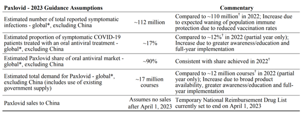

# 辉瑞创千亿美元营收纪录：新冠相关药物贡献过半，未来业绩恐面困境

腾讯财经 纪振宇 1月31日发自硅谷

辉瑞31日发布了2022年第四季度及全年财报，这家医药巨头在去年获得了创纪录的超过1000亿美元收入，值得一提的是，在这1000亿美元中，有567亿，也就是超过一半的收入，是由新冠疫苗和药物Paxlovid所贡献的。

这是一份极为特殊的财报，特殊之处在于，由于新冠疫情在全球的大流行，对于新冠疫苗和药物的需求猛增，但是随着新冠疫情在全球范围内逐步淡化，刚刚创下全年收入历史纪录的辉瑞，对于2023年甚至2024年的业绩预期却并不乐观，对于这一并不意外的情况，投资者也早已做出了布局。去年12月以来，辉瑞股价持续下挫，创下2009年以来最差月度表现。

新冠相关类药物销售走弱还仅仅是辉瑞未来业绩面临的诸多麻烦的其中之一，接下来几年，辉瑞将面临许多旗下药物专利到期，为其经营业绩嗲来更多压力。

**2022年过半收入由新冠疫苗和药物贡献**

为了体现出新冠相关疫苗和药物对财务业绩的影响，辉瑞在此次财报中几乎每一个重要指标项目，都分别列出了包含新冠疫苗和药物的销售情况，以及剔除掉新冠疫苗和药物后的收入情况。

例如：

  * _1_ 辉瑞2022年全年收入1003亿美元，运营利润增长达到30%，新冠疫苗收入378亿美元，其中美国市场88亿美元，国际市场290亿美元。
  * _2_ 新冠药物Paxlovid收入189亿美元，其中美国市场105亿美元，国际市场84亿美元，但剔除了新冠疫苗和药物Paxlovid的收入贡献后，收入增长仅为2%。

对于2023年业绩的展望，辉瑞给出了一份并不乐观的图景：剔除新冠相关的疫苗和药物产品，收入增长预期为7-9%。

辉瑞预计，2023年，新冠疫苗收入总额约为135亿美元，相比2022年大幅下滑64%，也低于华尔街预期的平均160亿美元的收入水平，

新冠药物Paxlovid，2023年预计销售收入为80亿美元，相比2022年大幅下滑58%，同样也低于华尔街预期的平均92亿美元的收入水平。

值得一提的是，辉瑞也在财报中特别指出，2023年对于新冠疫苗和药物Paxlovid的销售预计，不再基于之前已经签订的供货合约，而是根据商业市场的情况来决定。众所周知，新冠疫苗和Paxlovid研发成功初期，就和美国政府签订了供货协议，就Paxlovid而言，美国政府最初订购了106亿美元药物，2022年末又追加了20亿美元，但预计到2023年下半年，Paxlovid将不再由美国政府“买单”，而是进入传统的美国医药系统，由民众自己和医疗保险来承担相应费用。

**业绩预期暗淡 辉瑞遭投资者抛售**

辉瑞所预计的2023年新冠类药物收入超过50%的大幅下滑的情况，也反映了新冠目前在美国以及全球发展的现状，大部分国家对于新冠疫情的应对已经进入常态化，美国也即将在今年年中前后宣布新冠紧急状态终结，没有美国政府大手笔采购协议的保障，“市场化”后的新冠疫苗和药物自然会面临收入的大幅下滑。

根据辉瑞预计，2023年，全球新冠有症状感染（不包括中国），依然将达到1.12亿人，预计其中17%将接受新冠药物Paxlovid治疗，预计Paxlovid在2023年口服抗病毒药物的市场份额依然达到90%。

此前据新华社报道，辉瑞奈玛特韦片/利托那韦片组合包装（Paxlovid）未通过2022年国家医保药品目录谈判，这一点也在辉瑞发布的财报信息中有所体现，辉瑞指出，从2023年4月1日以后，Paxlovid在中国将不产生收入。

在收入大幅下滑的情况下，辉瑞预计相应的盈利也会在2022年的基础上大幅下降，每股盈利在3.25-3.45美元区间，相比2022年创纪录的每股6.58美元的盈利水平，降幅也将达到约50%。

值得一提的是，接下来辉瑞很可能将迎来一段困难时期，一方面是由于新冠疫情的消退令相关疫苗、药物收入大幅削减，另一方面，2025年至2030年，辉瑞将面临许多旗下药物专利到期，辉瑞预计这将导致约160-180亿美元的收入损失。

资本市场也早已对辉瑞未来可能面临的困境做出了提前布局。今年以来，辉瑞股价已经累计下跌15%，市值蒸发超过430亿美元，创下了自2009年以来最差月度表现。

但对于这些“已知事件”，辉瑞作为一家有着近200年历史的老牌医药巨头，似乎早已做好相应准备，去年第四季度，辉瑞CEO Albert
Bourla就对外公布了一份辉瑞2030年增长计划，这家公司在这份计划中，已经将眼光放在了“后新冠疫情”时代之上，他指出，未来辉瑞公司的收入增长，将会来自于预防和治疗溃疡性结肠炎等疾病的疫苗和相关药物。

