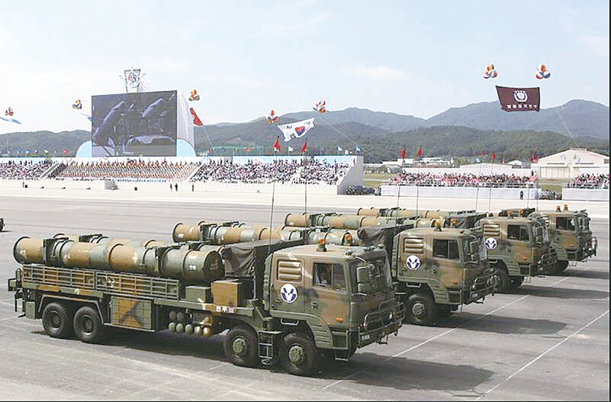

# 韩国想“独立开发核武器”，阻力不只来自美国

【环球时报特约记者
陈山】韩国总统尹锡悦1月11日首次明确宣称“韩国可能拥有自己的核武器”后，韩国社会对于“独立开发核武器”的议论持续升温。韩国《朝鲜日报》1月31日称，民调显示，76%的韩国民众表示“韩国需要独立开发核武器”。韩国对于“拥核”的支持声高涨也引起美国高度关注，一些媒体对韩国是否有能力独立研制核武器进行了详细评估。

**核计划始于朴正熙时代**

尹锡悦此前在接受采访时表示，“如果与朝鲜的紧张关系继续升级，韩国可能会用战术核武器武装自己”。他还表示，“如果发生这种情况，用不了多久，凭借我们的科学技术，随着时间的推移，我们可以很快拥有核武器。”这一表态被认为是韩国领导人“数十年来首次正式谈及用核武器武装国家”。

长期关注朝鲜半岛问题的美国“北纬38度”网站称，尹锡悦对于研制核武器的自信并非没有根据，外界普遍认为韩国具备研制核武器的基本技术。据介绍，韩国的核武器计划始于20世纪70年代。冷战初期，美军曾在朝鲜半岛部署了大量核武器。但20世纪60年代后期，陷入越战泥潭的美军被迫开始全球战略收缩。1970年7月，美军通知韩国政府将从朝鲜半岛大规模撤离后，对于失去美国保护极为担忧的韩国朴正熙政府启动了独立研制核武器的计划，并从加拿大、法国引进核反应堆和乏燃料处理技术。1975年4月，被美国抛弃的南越政权倒台后，更加大了韩国方面的焦虑。仅仅过了两个月，朴正熙就在新闻发布会上首次公开提到了“直接拥核”的意愿。尽管在美国的压力下，法国最终决定放弃向韩国交付相关设备，但韩国国内的相关研制仍然在进行。

据介绍，对于韩国这样具备强大工业实力的国家而言，要研制技术要求相对低的原子弹，最关键的难点其实是获得足够的裂变核材料。韩国早在1975年就批准了《核不扩散条约》，但在核材料浓缩领域的研究并没有完全停止。1982年，韩国原子能研究所的科学家成功提取了几毫克钚-239。对于韩国发展核武器极为警惕的美国立即要求韩国不要试图以任何方式对钚进行再加工，作为交换，美国同意转让核反应堆技术，并为韩国的核能项目提供财政援助。

2000年1月到3月，韩国科学家又至少三次利用激光浓缩技术，将200毫克铀-235浓缩至接近武器级的77%。这一事实直到2004年国际原子能机构在视察韩国原子能研究所秘密核浓缩实验设施时才被发现。韩国政府声称，相关研究是在其不知情的情况下进行的，国际原子能机构随后对韩国的核研究活动展开全面调查，并在2004年11月11日发布的报告中将此描述为“严重关切”的问题。美国科学家联合会网站称，想要制造一枚核弹头，至少需要15-25公斤武器级的铀-235或者7-10公斤钚-239。韩国事实上已经掌握了相关核浓缩技术，只是没有进行大规模生产。

**“足以制造4000枚核弹头”**

当前韩国20多座核反应堆使用的核燃料均需要由海外进口，这些民用核燃料无法直接用于制造核武器，但核电站使用后的核燃料（乏燃料）却是提取铀-235和钚-239的重要来源。美韩于1973年签署的核能协定要求“韩国对特殊核物质进行再处理或是改变核燃料的形态和内容时需事先征得美国的同意”，这被认为是美国禁止韩国对乏燃料进行研究和开发。韩国方面经过4年多的谈判，于2015年终于与美国达成了新的核能协定，其中不再包含禁止韩国进行核浓缩和乏燃料再处理的明文规定。

由于韩国在数十年间储备了数量庞大的乏燃料，美国有线电视新闻网（CNN）称，如果韩国决定建造核武器，从中提取出的武器级核材料理论上足以制造4000枚核弹头。但当前韩国还没有武器级钚或铀的库存，为此韩国首先必须大批量建造离心机进行核浓缩，“需要至少两年的时间才能生产出足够的武器级核材料”。

“北纬38度”网站称，拥有足够武器级核材料后，下一步是设计、制造和测试核武器。报道认为，韩国有足够的技术能力应对制造核弹的所有科学和工程挑战，但想要证明核武器的实际性能，必然需要进行核试验，韩国狭小的国土面积使得进行任何核试验都会遭遇国内外的强烈反对。

美国“动力”网站则表示，想要构成有效核威慑，韩国还需要把核弹头小型化，并集成到弹道导弹、巡航导弹、潜射导弹或轰炸机等运载平台。韩国拥有“玄武-2/4”系列弹道导弹和“玄武-3”巡航导弹，理论上均可以携带小型核弹头。特别是2020年首次试射的“玄武-4”弹道导弹可以携带重达2吨的战斗部，非常适合于改装为核弹头载具。但报道称，要将核弹头集成到这些武器平台上仍有大量工作要做。特别是核弹头的组装、拆卸和部署存在重大的安全和安保风险，韩国必须自行摸索，并建立一套严格的核武器指挥和控制体系。

**对于美国“核保护伞”失去信心**

按照外媒的说法，韩国在技术上距离独立研制核武器并不遥远，但面临的政治风险会很大，这将意味着它正式退出《核不扩散条约》。“北纬38度”网站称，“这将打击美国几十年来在防止核扩散方面的领导地位。华盛顿别无选择，只能强烈谴责和反对韩国制造核武器”。韩国的核技术主要来自美国的出口许可，核燃料也需要从海外进口，“如果首尔决定制造核武器，提供了韩国约1/3电力供应的核电站可能被迫全部关闭。”“动力”网站则警告说，如果韩国研制核武器，美国必然会收回对韩国的核保护承诺。“推进本土化核武器将导致韩国的安全性降低。这很可能会引起朝鲜的升级反应，首尔不得不独自面对这一威胁。”同时美媒认为，韩国和朝鲜在应对核危机方面缺乏足够的经验和沟通渠道。CNN称，米德尔伯里国际问题研究所防武器扩散专家刘易斯说：“拥有核武器并不能抵消对手的核武器。例如以色列虽然拥有核武器，但仍害怕伊朗获得核武器，因此以色列核武器根本无法抵消他们从伊朗核武器中感受到的威胁。”

但CNN注意到，尹锡悦这番表态的背后，是韩国对于美国“核保护伞”失去信心。报道称，民意调查发现，2/3的韩国民众宁愿韩国自行研制核武器，也不愿接受美国在朝鲜半岛重新部署核武器。其中40%的韩国民众明确反对美国在韩国部署战术核武器，而反对韩国制造核武器的只有26%。

