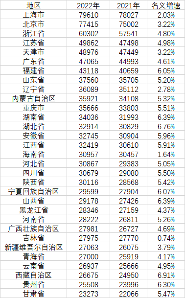

# 31省2022年人均收入公布：上海北京逼近8万元，甘肃垫底

国家统计局网站2月2日公布了31个省份去年居民人均可支配收入情况。从数据来看，有19个省份去年居民人均可支配收入超过了3万元，有7个省份超过了4万元，其中上海和北京已逼近8万元大关。

国家统计局此前1月17日发布的数据显示，2022年，全国居民人均可支配收入36883元，比上年名义增长5.0%，扣除价格因素，实际增长2.9%。分城乡看，城镇居民人均可支配收入49283元，增长（以下如无特别说明，均为同比名义增长）3.9%，扣除价格因素，实际增长1.9%；农村居民人均可支配收入20133元，增长6.3%，扣除价格因素，实际增长4.2%。

分省份来看，共有8个省份的居民人均可支配收入高于全国平均水平，分别是上海、北京、浙江、江苏、天津、广东、福建和山东，全部来自东部沿海地区。其中，前七名的省份人均可支配收入超过4万元。

数据显示，去年上海居民人均可支配收入79610元，位居榜首，距离8万元大关近在咫尺。北京以77415元紧随其后，也在逼近8万元大关。相对来说，其他省份与上海、北京均有较大差距。

上海和北京作为城市经济体，城镇化率高。近年来，我国收入最高的三个行业分别是信息传输、软件和信息技术服务业，金融业，科学研究和技术服务业。而京沪是这些高收入行业最集中的地区，因此居民平均收入也高。同时，京沪两地也是我国总部经济最为突出的两个城市。整体来说，两地高薪岗位多，吸引了大量人才集聚，居民的平均收入也高。

位居第三的浙江去年居民人均可支配收入突破了6万元大关，达到了60302元。浙江县域经济十分发达，每个县都有自身比较好的特色经济、块状经济，不仅人均收入高，而且城乡差距小。

浙江省统计局的数据显示，2022年，浙江全体及城乡居民人均可支配收入分别为60302元、71268元和37565元，比上年增长4.8%、4.1%和6.6%。城乡收入比1.90，比上年缩小0.04。

浙江之后，共有4个省份的居民人均可支配收入处于“4万元梯队”，分别是江苏、天津、广东和福建。这其中，江苏居民人均可支配收入已经达到了49862元，正在逼近5万元大关。

“3万元梯队”的则多达12个省份，从第8名的山东到第19名的陕西，其中山东居民人均可支配收入为37560元，高于全国平均水平。

在增速方面，有6个省份去年居民人均可支配收入的名义增速超过了6%，分别是西藏、湖北、山西、湖南、贵州、宁夏、福建，主要是中西部省份，只有福建是来自东部沿海发达地区。

_表：31个省份2022年居民人均可支配收入及名义增速（单位：元。来源：第一财经记者根据国家统计局数据整理）_

