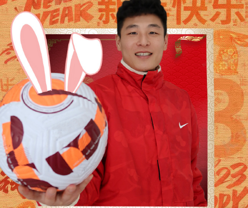
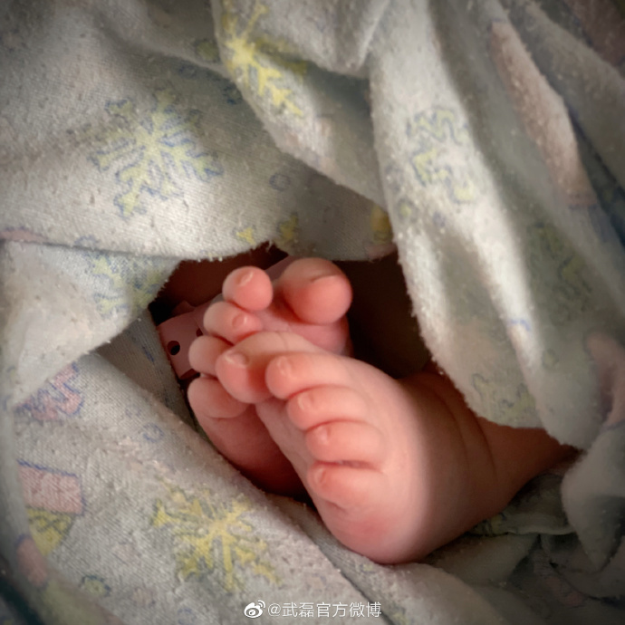
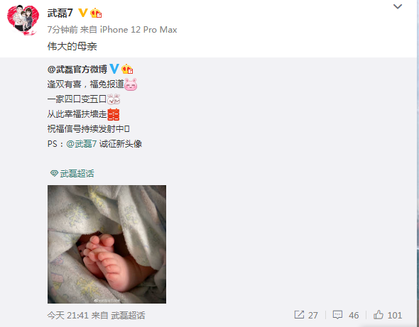

# 恭喜！国足一哥武磊官宣第3个孩子出生 被祝贺：完成帽子戏法

北京时间2月2日，中国男足核心武磊通过社媒官宣第3个孩子降生，并且武磊官微晒出了婴儿的小脚照片。如此一来，武磊有3个孩子，也是从此变为幸福的一家五口。

武磊官微先是晒出了第3个孩子的小脚照片，并且配文写道，“逢双有喜，福兔报道[兔子]。一家四口变五口[团圆兔]，从此幸福扶墙走[喜]，祝福信号持续发射中PS：武磊诚征新头像。”

随后武磊本人转发了武磊官微的动态，并且配文写道，“伟大的母亲”，一众球迷也是给武磊送上祝福。

作为如今的中国男足一哥，武磊目前31岁，他此前已经有一个儿子和一个女儿，现在迎来第3个小孩出生，让武磊也是拥有3个小孩，如此幸福的一家五口令人羡慕。

对于武磊拥有3个小孩，不少网友在祝福的同时，也是不忘调侃他完成了“帽子戏法”，无疑需要给武磊送上祝福。

（文/醉卧浮生）

