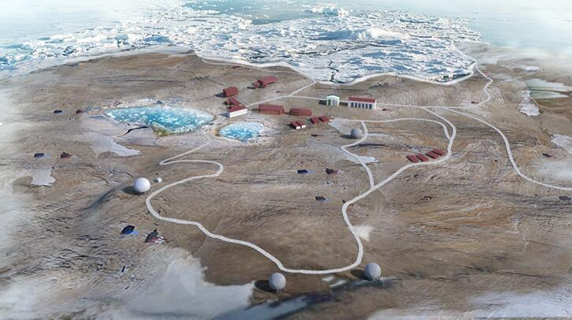

# 我国将在南极建设海外卫星地面站

【环球时报-环球网 报道 记者
樊巍】《环球时报》记者2月2日从中国航天科工集团航天建设获悉，近日，中国航天科工集团航天建设所属航天规划设计集团有限公司（以下简称航天设计）成功中标国家卫星海洋应用中心海洋观测卫星地面系统海外卫星地面站建设工程项目，该项目位于南极中山站，中标金额4395万元。

据《环球时报》记者了解，该项目是中国航天与国家卫星海洋应用中心的又一次深入合作，是航天设计深入探索海洋卫星领域的又一里程碑，也是促进海洋经济高质量发展的重要举措。

“南极项目的中标对航天设计来说既是机遇更是挑战。中山站不仅是我国南极考察的支持站点，也是我国开展南极内陆考察的大本营。”一位航天设计项目团队工作人员告诉《环球时报》记者，本项目新建12米天线基座及驱动机房，天线与站区主楼之间新建站区道路，天线和驱动机房用电由发电栋提供，通过共用桥架敷设电力和通信电缆，通信电缆接至接收机房，以满足信号接收要求。

据了解，中国南极中山站位于东南极大陆伊丽莎白公主地拉斯曼丘陵的维斯托登半岛上，经过20多年的扩建，建筑面积达到5800平方米。中山站地理坐标为南纬69度22分24秒、东经76度22分40秒，距离北京12553.160千米，与北京的方位角为32度30分50秒。中山站所在的拉斯曼丘陵，地处南极圈之内，位于普里兹湾东南沿岸，西南距艾默里冰架和查尔斯王子山脉几百千米，是进行南极海洋和大陆科学考察的理想区域。

由于南极环境恶劣，可借鉴的、针对南极地区的工程项目管理的理论研究与方法也相对较少，导致该项目实施难度较大。项目组成员曾随国家第三十五次南极考察团赴南极中山站，对大型天线建设地点“鬼见愁”和西南高地、储油罐区和码头、厂区综合管线、12个站区和周边高地、4个海岛高地等室外场地进行踏勘调查，并对气凝胶保温材料进行试验，完成了为期47天的实地考察工作，项目组从满足安全性、独立性、适用与可行性、耐久与耐候性、经济与高效性、环境保护、节约能源等原则出发，依托装配式设计减少现场作业、降低运输成本，并将航天设计自主研发的气凝胶新型清洁建筑保温材料运用到后续项目的建设过程中。

后续，航天设计还将积极运用新材料、新技术，精细设计、铸造精品，在极地世界展现航天智慧，以实际行动助力海洋强国、极地强国。

