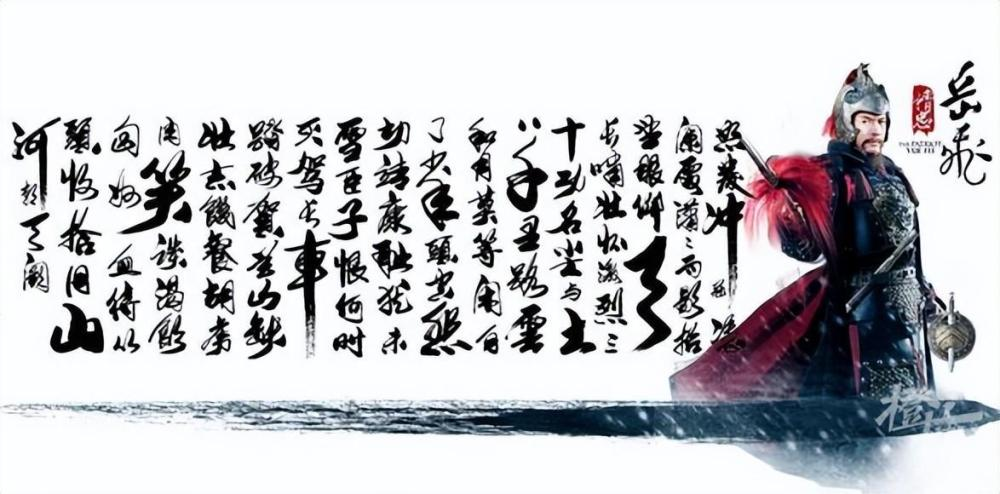

# 浙江的70后80后，你的记忆没有出错！浙江语文教材曾收录《满江红》

今年春节档次电影《满江红》太火了，再次引爆岳飞《满江红》与语文教材之间的话题。

有很多网友称语文教材出版方人民教育出版社把岳飞的《满江红》给删了，并用秋瑾的《满江红》代替。

对此，知名教育作家、全国百强名校语文教师吴小轶接受记者采访时表示，“移除课本说”根本不成立，全国通用的中学语文教材从未选编过岳飞的《满江红·怒发冲冠》（或许有少数地方版本教材选用，但使用范围和时间都有限）。

于是，“语文教材删除岳飞《满江红》？专家：从未选编！”的话题，一时间甚嚣尘上。

语文教材真的从未收录过岳飞的这首《满江红》诗词吗？

很有网友的记忆开始不淡定了！网友们展开了热烈的讨论，有人信誓旦旦地表示小时候，“学过《满江红》”、“教材里肯定有”。

大家的理由也很简单粗暴：“没学过我为啥会背？我那么懒，课本以外的文章绝对不会主动去学的，更别说背了！”

“怒发冲冠，凭栏处、潇潇雨歇。抬望眼、仰天长啸，壮怀激烈。三十功名尘与土，八千里路云和月。莫等闲、白了少年头，空悲切。”

所以，是啊，我为什么会背啊？？？

和上一轮“天将降大任于是人也”，究竟是“是人”还是“斯人”，引发的教材大探讨一样，网友们再次陷入记忆被集体篡改的“平行空间”焦虑中。

这两天，抖音上已经有网友晒出，自己坚持不懈，熬夜翻遍旧书，找到半夜十一点，终于找到在“义务教育初级中学课本语文第五册”的第200页，选编收录进了这首岳飞的《满江红》。

浙江网友半夜翻课本，翻出的正是来自浙江教育出版社的教材，也叫“浙教版”。

第五册，也就是初三上学期的语文课本。

橙柿互动记者拿着抖音上的教材封面图片及收录《满江红》诗词的内页，咨询了浙江教育出版社。

浙江教育出版社向橙柿互动确认，“这个课本确实是曾经由浙江教育出版社出版并在浙江使用过的语文教材。”

_图片来源于抖音_

那么，这本初三语文课本是哪一年出版的呢？

目前找到这本的印刷时间是1995年，不过显示不是第一版，就意味着至少在1995年前，这个课本已在浙江通行使用。

记者拿着这个封面问了身边不少同事和朋友，有的浙江70后、80后一眼就认出，这是自己小时候初中学过的课本。

一位1985年出生的朋友说，千禧年也就是2000年，自己刚好读初三，用的正是这个课本，当时身边同学差不多都是1985年、1986年出生的。

这些年，浙江初中语文教材变动比较大的，主要有两次变革。其中一次就是2003年版本的变动。2003年之前，浙江初中语文教材用的是浙教版教材，2003年之后则使用的是全国统一的人教版。

按这个时间线推算的话，如果你是1989年前出生的浙江70后、80后，应该都学过这个版本的初三语文课本。

是的，不要再怀疑了，你们的记忆没有出错！

哪有什么平行世界，你小时候真的背过《满江红》！

确认自己真的背过《满江红》后，办公室同事纷纷不淡定了，开启了另一个画风，大家争相吐槽起，那些年自己背到哭的古文。

看来，《满江红》还不是最难背的.......

那么，你呢？小时候哪篇古文让你背到怀疑人生，谁才是你最难背的古文？

欢迎留言说说。

来源：橙柿互动·都市快报记者 潘卓盈

