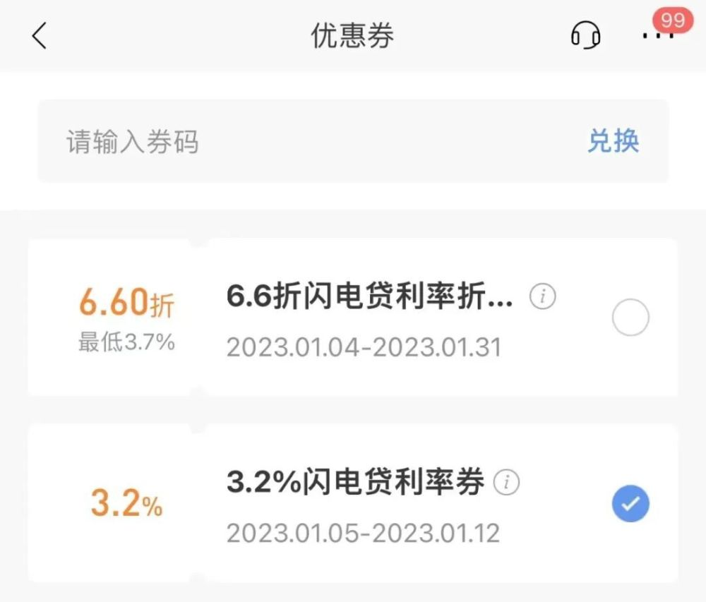

# 消费贷利率大降，20万贷3年利息才1万，不少人纠结“要不要贷点”

今年1月初，在上海工作的东先生先后收到了招商银行发送的多条闪电贷周年庆优惠活动短信。在网络平台“晒”出短信截图后，
**不少网友纷纷表示，“心动了，我也想求一个招行客户经理的联系方式。”**

**“咨询了好几家银行，3.2%的消费贷利率应该是目前业内最低了。”**
东先生告诉《金融时报》记者，“记得前段时间闪电贷利率最低还是3.7%，没想到降得这么快。”

自去年以来，《金融时报》记者对银行消费贷产品展开了持续的调研，经观察发现，从去年年中至今，消费贷产品利率持续走低，各家银行对消费金融贷款业务的创新也层出不穷。今年1月以来，不少银行加力布局消费复苏，进一步加大了消费贷产品的推广和优惠力度。

利率低至3.2% 消费贷产品“内卷”加剧

**“现在3.2%利率优惠活动已经截止了，目前最低只能做到3.4%。”**
1月31日，《金融时报》记者致电招商银行北京地区某客户经理时了解到，今年1月1日至3月31日，招商银行推出了消费贷利率优惠活动，对于符合办理资质的用户，系统会发放6.6折、8.5折、9.5折不等的利率折扣券，部分客户还可以通过客户经理申请到超低的贷款利率。

“每年春节前期是各家银行推广个人消费贷款的最佳窗口期之一，客户在这段时间办理消费贷的优惠力度往往是最大的。”某股份制银行相关工作人员向记者透露。

**除股份制银行外，各家国有大行在年初也陆续打响了消费贷的“营销战”。**

“恰逢一年一度的‘开门红’，我行在今年一季度推出了‘随心智贷’利率优惠，年利率低至3.6%，无需抵押，最长可借3年。”中国银行江苏省分行相关负责人表示。

今年以来，工商银行也在全国范围内持续开展个人信用贷款（融e借）利率优惠活动，年利率最低至3.7%；同时，农业银行网捷贷年化利率目前已经低至3.65%；建设银行建易贷产品年化利率最低降至3.60%，期限最长5年。

《金融时报》记者注意到，
**自2022年下半年以来，各家银行曾多次下调个人消费信贷产品利率。去年8月中旬，六家国有大行的消费贷最低年利率均已降至4.0%以下。**

针对一年来消费贷利率持续下行的情况，光大银行金融市场部宏观研究员周茂华接受《金融时报》记者采访时表示，“一方面，市场资金利率持续下行，带动了消费贷利率回落；另一方面，由于内外多重因素超预期冲击，宏观经济波动，消费信贷增速明显放缓，部分机构积极推动业务恢复及应对同业激烈竞争，调降消费贷利率。”

“见人下菜碟”？ 利率优惠设重重门槛

**“我们行‘融e借’产品最低年利率是3.7%，但并非所有客户都能申请到。”**
工商银行相关工作人员向《金融时报》记者透露，因为客户资质不同，每位客户能享受的利率优惠也不同。

记者在采访时发现， **不少近期办理个人信贷产品的客户纷纷表示，自己申请到的消费贷利率和各家银行宣传中所谓的“优惠利率”存在一定差距。**

这一情况在《金融时报》记者申请招商银行消费贷产品时也得到了证实。作为新用户，记者初次办理闪电贷时的可借额度仅为4.8万元，年利率高达6.12%，使用周年庆6.6折的利率优惠券后，最终申请的消费贷年利率仍在4.0%以上。

对此，招商银行信用卡部门相关工作人员告诉《金融时报》记者，“由于闪电贷属于消费信用贷款，无需抵押，所以审核的标准比较高，均由系统审核。系统会设置一个可以审核通过的参数，然后综合评估客户的个人征信、资金流水、贷款频率以及负债比率等方面。”

同时，不少国有大行还针对消费贷产品设置了企业“白名单”。“在世界500强企业、国企及事业单位工作的员工，通常能够享受较低的消费贷利率优惠和较高的贷款额度。”农业银行北京地区某理财经理表示，“在资质评定时，我们也会参考客户的公积金缴纳金额以及房贷月供等情况。”

消费者：到底要不要“薅羊毛”？

“今年以来，银行消费贷利率持续走低，明显低于往年，对有消费借贷需求的消费者来说明显利好，其消费成本将大幅下降。”周茂华告诉《金融时报》记者。

1月28日召开的国务院常务会议提到，要组织开展丰富多样的促消费活动，促进接触型消费加快恢复，合理增加消费信贷。

**面对近期消费贷低利率的诱惑，“要不要贷点”成为了当下不少人纠结的问题。**

“本来我是没有贷款需求的，但是看到银行消费贷利率优惠活动力度这么大，这时候不申请，总感觉自己吃亏了。”北京市民刘先生近日告诉《金融时报》记者,
前两天接到招商银行客户经理电话，听说闪电贷年利率降至3.2%，20万元贷款3年，利息总额才1万元，这让没有借贷想法的他也犹豫了。

“对于普通消费者来说，在享受小额消费贷带来便利的同时，需要综合考虑个人财务杠杆的可持续性，避免非理性过度负债。”周茂华受访时建议。

“近两年来，居民杠杆率有所回落，但仍处于相对较高的水平。因此， **消费信贷发展应在适度合理的范围之内，不可盲目过度增长，服务对象并非越下沉越好。**
”招联首席研究员董希淼接受《金融时报》记者采访时表示，居民个人应将自己债务水平保持在合理限度之内，一般而言，每月还贷支出不应超过家庭收入的一半。
**特别是年轻客户，不可通过“以卡养卡”“以贷还贷”等方式盲目借贷。**

