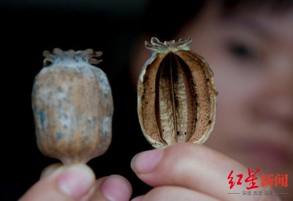
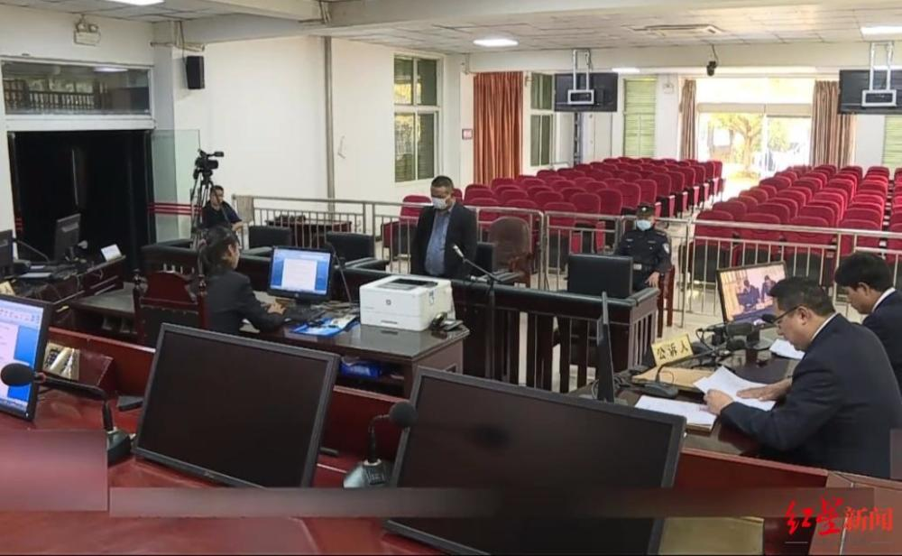
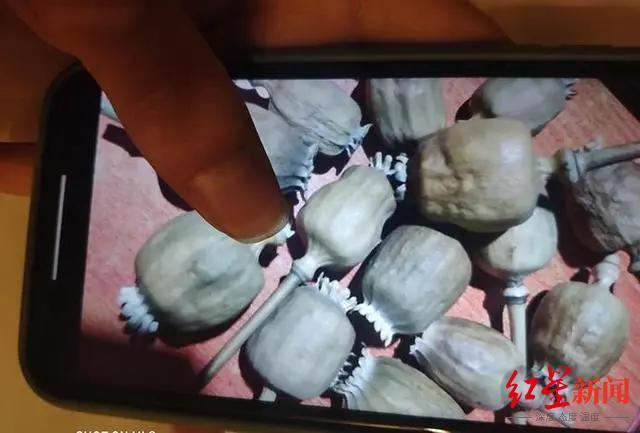
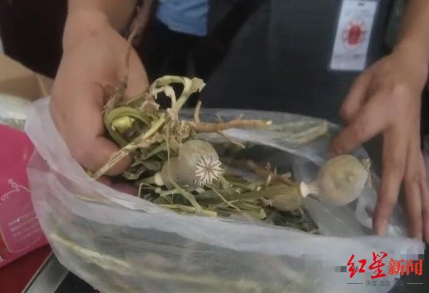

# 火锅、羊肉汤成添加罂粟壳重灾区，“舌尖上的罂粟壳”为何屡禁不绝？

在火锅汤料、卤味熟食中添加罂粟壳，几乎已成为不少餐饮从业者为吸引顾客而铤而走险的公开秘密。

2月1日，四川攀枝花市中级人民法院公布一起典型案例，米易县一家羊肉汤锅店主余某在羊肉汤里掺罂粟壳，将煮出来的羊肉卖给顾客食用。最终，法院以生产销售有毒有害食品罪，判处被告人余某有期徒刑十个月，缓刑一年。

实际上，餐饮商家因在食品中添加罂粟壳获刑的案例并不少见。
**红星新闻记者梳理100余起已判决的案例发现，火锅、羊肉汤、卤制品等都是添加罂粟壳的重灾区。多数被告人供述称，加罂粟壳在食品中是为了“提味增鲜”“吸引顾客”。**

_罂粟壳 资料图_

值得注意的是，大多数被告人系初犯，犯罪情节较轻，适用缓刑多。有专家曾发文指出，在食品中添加罂粟壳犯罪之所以泛滥，关键在于违法成本过低。那么，罂粟壳到底有没有“提味增香”功能呢？事实上，并没有可靠的科学依据。

**案例：**

**羊肉汤锅加罂粟壳，店主被判刑十个月**

40多岁的余某家住四川省米易县，他与妻子在当地经营一家羊肉汤锅店，主要售卖羊肉汤锅和羊肉米线等。2021年9月中旬，余某感觉身体不适，刚好店门口来了一位卖中草药的老人，他便叫老人配了两副中药。配完药后，老人告诉余某，在羊肉汤中加入罂粟壳，能够让羊肉汤和羊肉味道更加鲜美。

为了吸引更多顾客前来食用，他便花了30元钱，在老人那里购买了3颗罂粟壳。2021年9月21日晚，余某在准备煮羊肉的香料包时，把从老人处购买的3颗罂粟壳，用手搓碎后添加在料包里面。次日早上，他把添加了罂粟壳的料包放在锅里面和羊肉一起煮，煮出来给顾客食用。

_余某开的羊肉汤锅店_

执法人员将余某售卖的添加了罂粟壳的羊肉汤查获并送检，经国家轻工业食品质量监督检测成都站检验，余某经营的羊肉馆中的羊肉汤底料，检验出含吗啡143毫克每公斤，检测结论不合格。民警电话通知余某到派出所接受调查，到案后，余某如实供述其在羊肉汤中添加罂粟壳的犯罪事实。

余某说，他只是想让羊肉汤味道变得更加鲜美，不知道罂粟壳中含有吗啡、可待因、罂粟碱等对人体有毒有害、易成瘾的成分，现在才认识到了罂粟壳并非食品，不能添加于羊肉汤中出售给顾客食用。

到案之后，余某对自己的违法犯罪行为供认不讳，并且自愿认罪认罚。最终，法院以生产销售有毒有害食品罪，判处被告人余某有期徒刑十个月，缓刑一年，并处罚金人民币五千元；禁止被告人余某在缓刑考验期限内，从事食品生产销售及相关活动。

**梳理：**

**火锅、卤制食品是重灾区，多数人系初犯适用缓刑**

红星新闻记者梳理中国裁判文书网及媒体公开报道的100余起案例发现，餐饮商家因在食品中添加罂粟壳获刑的案例并不少见，其中火锅、羊肉粉（汤）店、小吃店、卤制食品都是重灾区。

2020年，安徽亳州李某某为使羊肉汤出味，吸引更多顾客前来食用，李某某在调味材料汤中添加罂粟壳粉末，被判有期徒刑六个月，缓刑一年；2021年6月，河南洛阳的羊肉馆店主任某在熬制辣椒油时加入了罂粟壳，之后将熬制好的辣椒油供顾客食用，被判处有期徒刑六个月，缓刑一年。

2019年上半年,河南省南阳市卤肉店主李某某从他人手中获得一些罂粟壳,后为使自己卤制的卤肉去腥、提香,便在熬制的卤汤中添加罂粟壳，被判处有期徒刑八个月，缓刑一年；2018年，山西一男子为吸引客源，将自己购买的罂粟壳放至火锅底料中熬制，最终，该男子被判处有期徒刑一年。

从判决的案例来看，均以刑法第一百四十四条生产、销售有毒、有害食品罪定性，大多数被告人系初犯，犯罪情节较轻，适用缓刑多，有期徒刑少；判处罚金数额多半为5000元及以下；禁止犯罪分子在缓刑考验期内从事食品生产销售及相关活动。

_余某在庭审中_

据案例披露的罂粟壳来源和一线禁毒民警的说法，涉案的罂粟壳多来自农村地区非法种植，而从境外地区走私流入国内的情况随着警方打击越来越严，案例数呈下降趋势。由于“严管模式”，罂粟壳获取途径走向“地下”产业链。

2021年3月底至5月中旬，据媒体赴多地调查发现，多个国内的主要中药材集散地存在罂粟壳地下交易，多个药材商称他们长期以每斤500至700元不等的价格向从事卤味熟食、小吃早餐的摊贩或门店供货。

**探因：**

**为何屡禁不止？利益驱使、违法成本较低**

据悉，罂粟壳属于国家公布的《食品中可能违法添加的非食品物质和易滥用的食品添加剂名单》中的物质，根据最高人民法院、最高人民检察院《关于办理危害食品安全刑事案件适用法律若干问题的解释》的规定，应当认定为有毒、有害的物质。

不容忽视的是，罂粟壳食用后或对人体产生危害。此前，有执法人员向红星新闻记者介绍，罂粟壳是毒品原植物，里面含有可待因、吗啡等物质，如果长期食用的话，会造成人注意力和记忆力功能衰退，严重时可能对神经系统、消化系统造成损害，出现内分泌失调，甚至导致呼吸停止而死亡。

2021年5月，四川攀枝花市西区，一家羊肉米线店为了招徕顾客，连续两天将家中存放的罂粟壳粉，添加在羊肉汤内供消费者食用，有群众吃了米线之后尿液检测呈现阳性；四川米易县，一位米粉店主为让羊肉汤味道更加鲜美，在汤内放了罂粟壳，3名顾客尿检结果呈阳性。

_QQ上的卖家均用“闪照”的形式展示罂粟壳照片，然后快速撤回
图据澎湃新闻_

违法添加罂粟壳为何屡禁不止？归根结底是利益的驱使。红星新闻记者梳理相关判例发现，多数犯罪嫌疑人的供述称，加罂粟壳在食品中是为了使其味道更好。他们之所以铤而走险添加罂粟壳，是因为听闻：“在食品中加入罂粟壳能增加食品的鲜味，甚至让人上瘾，增加回头客。”

2018年，《人民检察》发表的《在食品中添加罂粟壳犯罪问题实证分析——以40起案件数据为样本》指出，在食品中添加罂粟壳犯罪之所以泛滥，关键在于违法成本过低。司法实践中，由于“罂粟壳”案件缓刑适用率偏高，再加上判处的有期徒刑刑期有限，大大降低了行为人的惩罚成本。

**专家：**

**罂粟壳“提味增香”并无科学依据，“被过于神化”**

罂粟壳调料的销售页面大多标出“让食客流连忘返、吃了上瘾”等口号，同时也被餐饮业称为“神秘调料”。那么，罂粟壳到底有没有传说中的“提味增香”功能呢？事实上，并没有可靠的科学依据。

据媒体报道，中国农业大学食品科学与营养工程学院副教授朱毅曾专门做过一个双盲实验，分别将罂粟壳和草果等按照高低剂量加入麻辣火锅、清水火锅中烧煮半小时以上，结果试验者并没吃出味道上的差异。

朱毅表示，罂粟壳在餐饮业被过于神化，其所传言的“提香、上瘾”功效并不显著，“罂粟壳中的阿片类生物碱含量很少，吗啡含量只有0.05%-0.5%，在经过汤料稀释进入人体后，带来的效果微乎其微。”

_罂粟壳_

中国药物依赖性研究所教授陆林也曾表示，罂粟壳本身没有味道，何来“提味”一说？“有些罂粟壳甚至带有酸涩的苦味，要说提味也不会是鲜美的味道。”

针对食品中加罂粟壳，多地警方曾发文称，
**罂粟壳没有调味功能，因为它既不是调味品也不是香料，增香、提香是谣传。添加了罂粟壳的食物出现让人吃了还想吃的情况，靠的不是食物的味道，而是罂粟壳让人产生了依赖性。所以，使用罂粟壳提味增香，是徒劳无功的，而且还违法。**

红星新闻记者 江龙

责编 冯玲玲 编辑 何先锋

