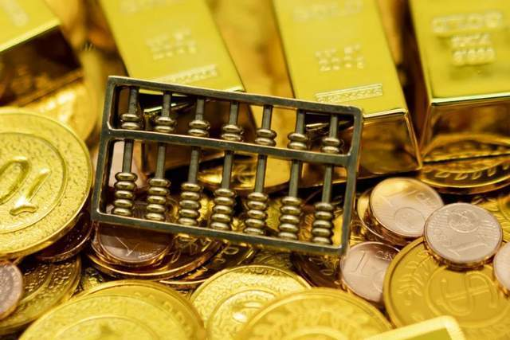
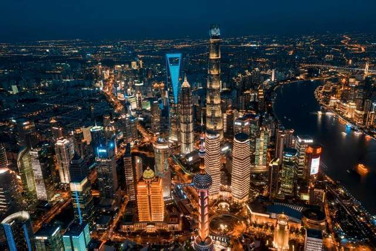
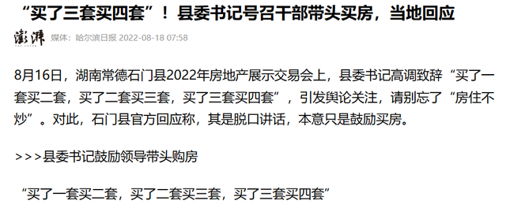
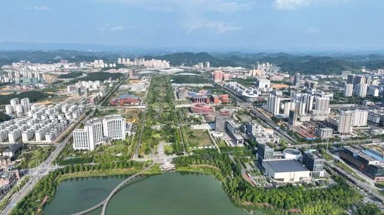
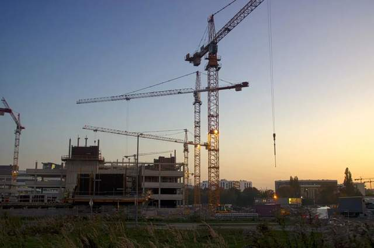

# 白菜价的三四线楼市，泡沫比北上广深大

**冰川思想库研究员丨关不羽**

2023年，房地产重回“支柱产业”行列，又打开了想象的空间。

“乐观派”的理由是三大利好：政策放宽、经济复苏和货币宽松。尤其是货币宽松的预期如此强烈，以至于有人预言超一线的房价今年还能涨个二到三成，“每平30万可期”。

真让人感叹“今夕何夕，见此良人”。

01

**滞胀是新风险**

“一直放水一直涨”的错觉，还在经济高速增长期的旧梦中。要是印钞就能高楼平地起，那全世界到处都是“宇宙中心”了。

高通胀、高增长、高房价的“三高”已经是老黄历了，目前主要风险不是通胀，而是滞胀。

1月17日，在国务院新闻办举行的2022年国民经济运行情况新闻发布会上，国家统计局局长康义称：

当前国际环境仍然在复杂演变，世界经济增长动能在趋缓，全球贸易形势不容乐观，世界经济可能面临滞胀局面。

**全球同此寒凉，谁能独善其身？** 所谓滞胀，即停滞性通胀。货币发行量增长，但是各项经济指标停滞。

货币好比是液压泵里的油，泵的动力不足，加了很多油。一开始效果不错，动力上来了。可是加了几回后，发现加油也没动力了。一种可能是油加多了，漏掉了。

还有一种可能是这个泵本来就有毛病，靠加油能掩盖住了，拖到毛病越来越大，再加油也不行了。

_图/图虫创意_

长期通胀导致滞胀的原理也类似。货币注水积累了大量无效资产，就是油漏掉了。

靠货币注水拉动经济增长，是给结构性问题开出了流动性的药方，拖延了经济结构性问题的解决，无效资产的堆积甚至加剧了结构性问题，对应的是泵坏掉了的那种情况。

中国大规模宽松货币政策始于2008年的四万亿大基建，此后的八万亿、十二万亿，货币刺激政策力度逐轮增大，房价随之节节攀升。
**因此，“放水涨房价”的观念根深蒂固。**

然而，世上哪有一直放水一直涨的好事？高通胀高增速下的楼市表现，并不适用于滞胀。

经济滞胀的楼市表现可以参考日本，主要特征是分化。

02

**楼市分化后的表现**

上世纪90年代初，日本泡沫经济崩溃直接冲击楼市，房价大跌，东京大阪房价“腰斩”，很多中小城市的房价则跌到了脚后跟。

此后日本经济以债务货币化的方式开启滞胀模式，房价的区域分化显著。东京大阪的房价经过十几年的缓慢攀升，回到了泡沫高峰时期的80%左右，但是成交量急剧萎缩。而大部分中小城市则是房价躺平，成交量躺得更平。

**如果中国经济也进入滞胀，楼市区域分化加剧的情况也会类似。**
与东京、大阪同一生态位的超一线城市，最终可能会进入价高量低的状态。这在微观经济也可以合理解释。

中国超一线城市不仅具备经济优势，同时还具备日本大都市不可比拟的政治地位，公共服务水平和其他地域的优势差距更大，经济机遇更为富集。这些构成了“宇宙中心”的房价基本支撑。

但是，大涨也是不可能的。政策放宽、经济复苏的利好因素，很难期待长期化，不可高估。

_图/图虫创意_

参考其他主要世界经济体的后疫情经济，反弹的力度和持续时间均低于预期，疫情期间各国央妈搞超宽松货币政策造成的经济内伤超乎想象。

**至于政策利好，效果也是有限。**
政策鼓励购房，也不可能“按着牛吃草”。个人购房最重要的经济考量，是收入增长预期。没有就业稳定和收入增长的稳定预期，谁敢背二三十年的按揭呢？

经济增速放缓，经济活力下降，居民失去收入增长预期。房子这样的“大物件”就很难流通，势必造成成交量下降，也就失去了价格快速上升的动力。

那么，日本进入滞胀期之前的“主动戳泡沫”会不会在2023年的中国重演，以至于大城市房价腰斩呢？

这种可能性也不大。

日本当年泡沫经济崩溃本来也不是“主动戳破泡沫”，而是官僚部门政策不协调的结果，是大幅升息迎头撞上房地产税的车祸现场。有日本血淋淋的教训在前，此后各国都避免出现这样的政策失误。
**目前，我国政府的政策定调稳楼市的定调是清晰的。**

因此，2023年中国超一线城市的房价可能会有一些市场波动，涨涨跌跌都有可能，但是幅度不会很大。大涨两三成的美梦还是早醒早好。

03

**楼市的高风险区**

比起超一线的“宇宙中心”房价，更值得忧虑的是三线以下的楼市。那些地区的房子是白菜价，却是泡沫的高风险区。

社会大众对资产泡沫普遍存在“价格误解”，总是以为价格高低是衡量泡沫的指标，实则不然。

泡沫是价格和价值的背离，反映在市场层面就是名义价格和真实交易价格的背离。

500元一克的黄金没泡沫，但是标价50块钱一把的小葱，泡沫含量爆表。“鹤岗们”上一轮棚改带动起来的房地产热，就是50块钱一把的小葱。
**这些才是中国楼市的隐藏雷点。**

判断泡沫风险的大小，还要考虑存量规模。比如说，上海市中心老洋房动辄上亿，但是总共也就那么一两百栋，挂牌的只有一两栋，有足够的稀缺性。而三线以下的“草根盘”，单价虽低，盘子却不小，严重过剩。

比如，去年石门县县委书记鼓励公务员买房，“买了一套买两套，买了两套买三套，买了三套买四套”的雷人雷语背后，就是过剩的房子。

_图/网络_

石门县50余万人口，在售楼盘多达二十多个。2021年全年，竣工住宅35.13万平方米，增长173.9%。而商品房销售面积58.25万平方米，下降13.2%。

就这房地产规模、增长速度和销售速度的夸张差距，难怪要号召“买了三套买四套”。四套都嫌少，七八套才行。卖不完的存量，石门县的楼市泡沫含量有多高？

**上一轮房地产下沉热潮，“激活”了很多地区的房地产，热火朝天的景象却是自拉自唱的“土地金融游戏”。**

比如，城投债处置被围观的遵义市，最大的房地产开发商是市属国有企业的遵义市投资（集团）有限责任公司。2021年数据显示，这家城投公司累计土地储备超4400亩，号称总资产高达670亿元。

遵义市的开发商排名靠前的，几乎都是省内企业。这种地方政府主导的“土地流转内循环”搞出来的楼市，能有多少价值支撑，可想而知。

总之，上一轮房地产下沉式开发的特点是：大量资金通过地方政府融资平台涌入，不顾当地市场的实际需求，大规模集中开发。在开发阶段完成了资金的金融闭环，但是市场销售却闭不了环。

**这些严重过剩的房子，不管建完没建完，或多或少都是经济意义的烂尾楼。**

_▲遵义市新蒲新区（图/图虫创意）_

2023年，这些过剩的房子，将何去何从？

**地方政府托市，指望不上。** 即便地方公务员“买了一套买两套，买了两套买三套，买了三套买四套”，也解决不了任何问题。

因为地方财政因债务压力吃紧，地方公务员的收入势必受到影响，一套靠积蓄，二套三套靠按揭，拿什么还呢？

财政脆弱、靠转移支付的地方折腾出的楼市，大概率就是泡沫堆。财政脆弱，多半本地经济不振，所谓楼市，本来就没有真正的“市”。

因此，就算地方政府有心托市，也难以回天。即便靠政府指导价等行政干预手段强行锁住名义价格，也很难彻底解决背后的债务危机。单单靠行政干预，总有捂不住盖子的那一天。

04

**2023年中国楼市注定不平静**

总之，中国楼市的2023年注定是不平静的。到底是暗潮涌动，还是惊涛骇浪，政策调理的技术因素会起一定作用。

但是，从“政策市”回归正常市场的大势不可阻挡， **“政策信仰”、“货币信仰”支撑的“房价永远涨”难以为继。**

那些经济薄弱、寅吃卯粮的地区，本不具备房地产大发展的基础条件，拔苗助长的“催肥”不可持续。当初怎么注水的，连本带息都会还出来。

_图/图虫创意_

中国超一线、强一线城市也不能高枕无忧。楼市的健康度归根结底取决于市场供需关系，经济表现不佳，楼市也走不远。如果大城市不能尽快恢复经济活力，那么房价的市场支撑也很难持久。

日本人均GDP接近4万美元，有长期耗着的本钱。中国经济最发达地区的人均GDP仅为2.7万美元左右，差距还是很明显的。

因此，2023年对中国经济发达地区的大城市而言，是经济发力的关键窗口期。再不拼经济，楼市的“大城市信仰”将是下一块倒下的多米诺骨牌。

