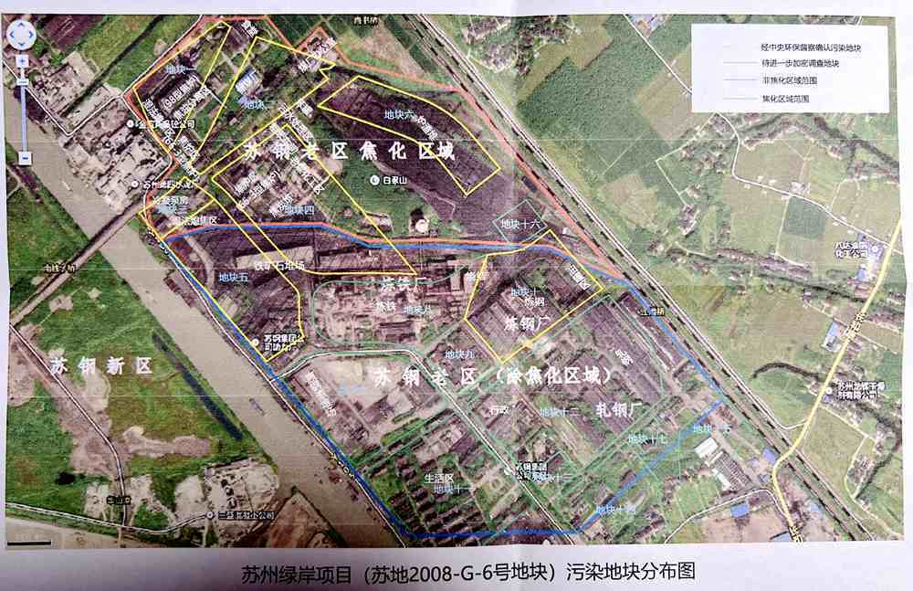
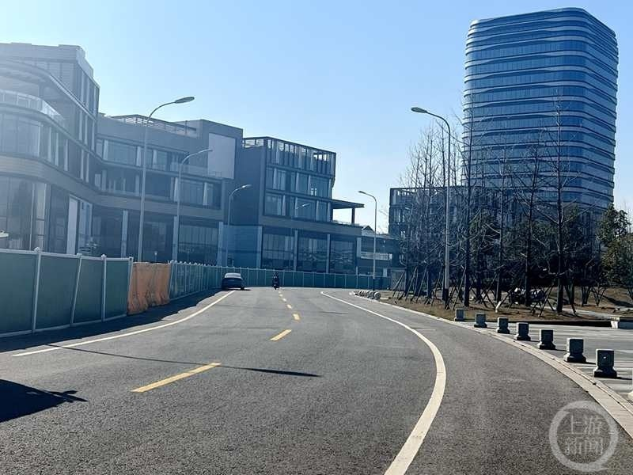
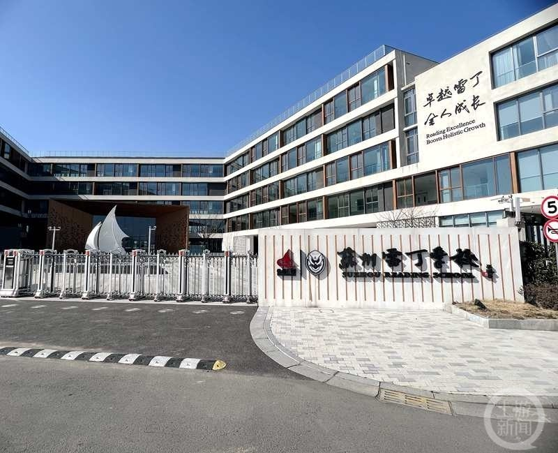
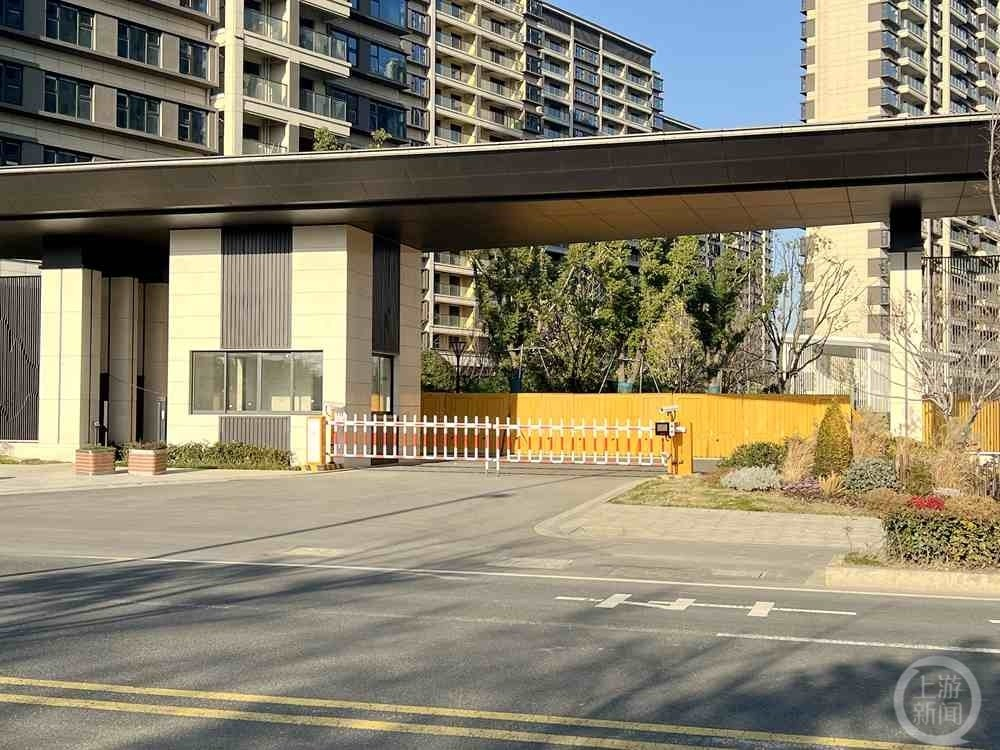
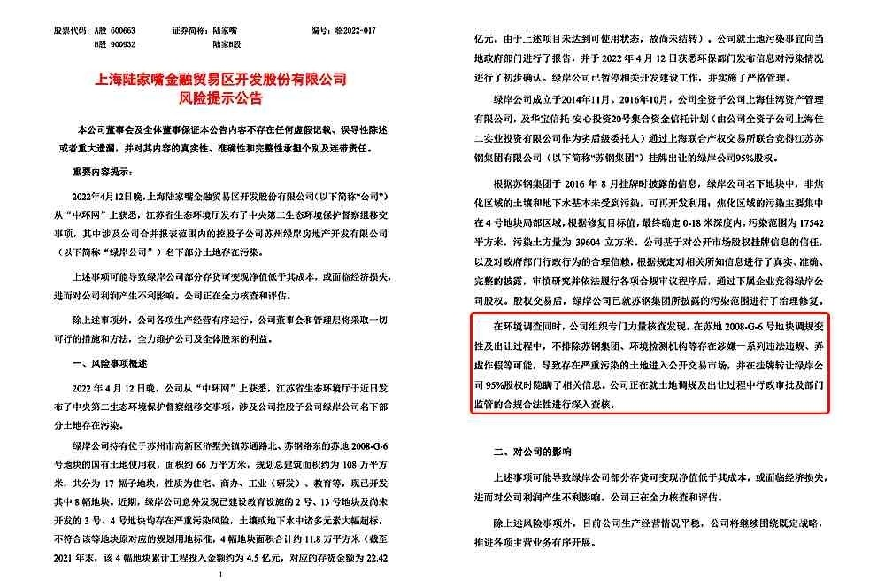

# 苏州高新区“毒地”调查：土地改变用途前未环保调查，致百万方城市综合体变空城

2月的苏州已经有些暖意，街道上人流熙熙攘攘，车辆川流不息，在集聚运河和中环等交通优势的苏州高新区浒墅关经济开发区苏州绿岸综合体区域，却是一派萧条景象：宽敞的街道上除个别保安人员外鲜有车辆、人群往来。住宅、学校、商圈、写字楼……高耸的建筑群均已空置，围墙上“本地块存在污染风险，未经许可严禁入内”的红色警示牌十分醒目。

2022年4月，该区域因土地存在污染被中央第二生态环境保护督察组点名，被指土壤、地下水中诸多元素大幅超标，不符合该地块原对应的规划用地标准。此时被指“有毒”的地块上已经建起了学校、幼儿园和高层住宅。被环保督察组点名近1年后，2月2日，针对该地块污染情况，苏州高新区管委会发布了《苏州绿岸项目2#地块土壤污染状况调查报告》其中明确提到，土地及地下水均存在污染。

_▲苏州绿岸项目污染地块分布图。图片来源/受访者供图_

一度被当地热推的项目为何在6年后因发现土地有毒而停摆？又是如何在土地“有毒”的情况下成功上市交易？近日，上游新闻记者调查发现，“涉毒”地块原为苏钢集团老区焦化区域，除被环保督察组点名的7个地块外，剩余10个地块是否存在污染仍在检测中。该块土地在挂牌出让前曾多次被改变土地性质，这一点直到2022年4月才曝出。有知情人透露，将工业用地性质改变为住宅和教育用地前，并未根据法律法规进行土地环保调查，目前已被认定交易过程中存在诸多违规行为。

开发商上海陆家嘴金融贸易区开发股份有限公司（以下简称上海陆家嘴公司）相关负责人回应表示，发现该情况后已暂停了全部销售和施工业务，后续治理情况目前从与当地沟通的情况看并不乐观。

_▲苏州绿岸项目商圈已完成，但均被围挡包围。
摄影/上游新闻记者 时婷婷_

经历222轮竞价，溢价2倍拿下股权

“先有浒墅关，后有苏州城”。浒墅关是全国七大钞关之一，已有2500多年历史，素有“江南要冲地、吴中活码头”之称。凭借着运河、京沪高速、国道等交通及高新区的发展优势，近年来浒墅关经济开发区（以下简称浒墅关）也成了不少房地产企业眼中的优质资源。

2016年10月17日，一则股权收购公告引起了地产界及苏州高新区居民的注意，上海陆家嘴公司溢价2倍，以85亿多元的价格竞得苏州绿岸房地产开发有限公司95%的股权。随后，上海陆家嘴公司发布公告称，苏州绿岸持有位于苏州市高新区浒墅关镇苏通路北、苏钢路东17块国有土地（以下简称“项目地块”）使用权，项目地块红线内使用权面积约
65.95万平方米，土地性质为住宅、商办、工业（研发）、宿舍、幼儿园、加油站等，项目地块规划总建筑面积约为108.41万平方米，其中住宅用地规划总建筑面积约66.4万平方米。项目地块的土地出让金已支付完毕并已取得全部的《国有土地使用证》。

据当时公开报道显示，这场股权竞拍共有19家企业参与，经过了222轮竞价，除上海陆家嘴公司外，还有诸多知名房地产企业也看重该地块，其中就包括苏州高新区国有独资企业苏州苏高新集团。上游新闻记者了解到，该地块之所以竞拍火爆，除交通优势外，曾是苏州房产价格洼地的浒墅关，在2015年前后曾有大批商业项目进驻，到2016年时，房产价格持续高走，多地块房产价格单平米超万元。“苏州绿岸房地产开发有限公司的资产只有这片土地，拿到了股权也就意味着拿到了土地，虽然是股权拍卖但实际上是土地出售，因此参与竞拍的多是房地产企业。”知情人士向上游新闻记者表示。

根据规划，上海陆家嘴公司将在该地块开发建设苏州绿岸项目，苏州高新区管委会官方微信公众号曾对该项目表述为，项目总占地面积约66万平方米，开发总体量（建筑面积）约157万平方米，是苏州高新区首个百万方城市区域综合体项目。项目2017年5月正式启动开发建设，整体开发周期计划为8年，预计于2025年左右基本开发成熟。除住宅外，项目中的商业地块还将成为浒墅关的重要核心商业项目。

_▲苏州高新区管委会曾发函希望中止交易，但最终还是同意该交易。图片来源/受访者供图_

85亿元拿下土地的消息还没降温，2016年10月18日、19日，上海联合产权交易所连续收到了苏州高新区管委会两份《关于商情中止项目交易的函》。据上游新闻记者获取的该函件内容显示，2016年8月29日，上海联合产权交易所发布了江苏苏钢集团有限公司（以下简称苏钢集团）委托北大医疗产业园科技有限公司向上海联合产权交易所提交转让苏钢集团全资子公司苏州绿岸房地产开发有限公司（以下简称绿岸公司）95%股权转让的公告。苏州高新区管委会发现后立即约谈苏钢集团及北大方正集团有限公司相关负责人，要求其停止有关股权的挂牌，但2016年10月17日获悉，已被摘牌，因此发函要求中止有关交易的后续签约、交割工作。

苏州高新区管委会提到，为推进苏钢集团整体转型升级以及苏钢老区改造，在苏州市政府和苏州高新区管委会的支持下，苏钢集团引入北大方正集团，共同打造“北大方正•苏州现代服务业集聚区”。绿岸公司是苏钢集团整体转型升级项目中的一个项目公司，该公司及其名下地块，不能脱离该项目独立存在。

2012年12月14日，苏州高新区管委会与北大方正集团有限公司（苏钢集团控制股东）签订了《关于北大方正苏州现代服务业集聚区项目的合作协议》。协议约定:“北大方正集团将投资100亿元建设北大方正苏州现代服务业集聚区。”协议同时围绕苏钢集团发展相关问题，就土地变性、规划调整等事项进行了约定。2013年苏州市政府批复后，同年11月18日，江苏苏钢集团与苏州高新区管委会签订了《苏钢集团转型升级及苏钢老区改造项目框架协议书》。加快打造规划内设计土地面积985.2
亩、建筑面积108.4万平方米，含教育、科研、商业、金融、 办公、住宅，北大青年城项目。2014年，989.27亩国有土地使用权，相应转移至绿岸公司。

苏州高新区管委会认为，苏钢集团及其股东北大方正集团将绿岸公司作为单纯的房地产开发企业，单独对外转让其95%的股权，严重违反苏州市政府对苏钢集团转型升级支持的初衷和要求，违背了其与苏州高新区管委会签订的一系列协议及文件规定。单独转让绿岸公司上述标的地块，作为单纯房地产项目开发，将会带来一系列问题。

苏州高新区管委会同时还提到，在本次交易挂牌中，转让方苏钢集团及其代理人隐瞒了有关项目背景和绿岸公司应当承担的义务和责任，违反了相关规定。且隐瞒了相关重要协议和文件，未尽信息披露义务，转让方涉嫌以牟利为目的非法转让土地。

虽然苏州高新区管委会发函希望中止该交易，但上游新闻记者了解到，在该函件发出后不到1个月的时间，苏州高新区管委会与上海陆家嘴公司签订了苏州绿岸地块开发项目的备忘录。

该《备忘录》中表示，苏州高新区管委会与北大方正集团、苏钢集团就苏州绿岸股权事宜达成谅解，支持上海陆家嘴公司成为新股东，并开发项目地块。高新区管委会将继续兑现此前承诺，同时妥善处理相关土地问题，并协助其尽快依法完善开发建设相关手续。欢迎上海陆家嘴公司成为苏州绿岸的主要股东主导项目地块的开发建设；高新区管委会也将于国土、规划、建设等有关部门协调，协助苏州绿岸尽快依法完善开发建设相关手续。

_▲苏州雷丁学校因土地污染已停止招生。摄影/上游新闻记者
时婷婷_

建学校做调查惊现大量“毒土地”

上海陆家嘴公司与苏州高新区达成协议后，项目如期开工建设。上游新闻记者了解到，为提升该区域的产业价值，项目在原有规划上引进了由苏州伦华教育集团与英国雷丁学校共同打造的，九年一贯制学校国际化学校苏州雷丁学校，选址为苏州绿岸项目的2号地块。上游新闻记者注意到，该学校从立项、开工建设、封顶、招生都备受关注，该校也成为国内首所雷丁学校。共招录学生200多名。

正是基于苏州雷丁学校的一次土壤污染情况调查，引发了“有毒”地块大规模调查。知情人士透露，2021年6月，苏州雷丁学校校方在办理办学许可证过程中，根据苏州高新区环保局要求，对学校所在地2号地块的土壤污染状况进行调查，上海陆家嘴公司曾委托第三方初调，发现2号地块存在验证的污染，后又经政府推荐的第三方鉴定机构调查，结果同样显示污染严重，因此苏州雷丁学校项目暂停启用，已招录的学生只能另行安排其他学校借读。

知情人透露，发现学校地块有毒后，经查询苏州绿岸项目的地块原始底图发现，17个地块为苏钢集团院焦化区和老区，均曾有过生产活动。2021年12月起，经对尚未开发的6块地块进行初步调查，发现这些地块存在严重污染风险，土壤和地下水中诸多元素大幅超标。“与2016年挂牌时披露信息及政府备案的苏钢集团土地调查报告所提供的结论不符。”知情人说。

此外，上游新闻记者了解到，因土地污染不具备建设学校条件的影响，苏州雷丁学校生化实验室的环评无法审批通过。苏州绿岸公司还曾被苏州环保部门调查。今年1月19日，依据《环境影响评价法》苏州市生态环境局对其做出了542.7万多元的行政处罚。目前正在进行行政复议，后期或将通过司法途径处理。

开发区域多个地块有毒，引起了中央环保督察组的注意。2022年4月10日，江苏省政府官网公开的《中央第二生态环境保护督察组向我省移交的第六批信访事项办理情况》中提到，苏州市高新区浒墅关苏州绿岸项目17幅土地，用地面积约66万平方米，第三方检测机构检测结果显示多处地块土壤中苯并芘、萘严重超标，不符合用地标准。2022年4月1日，苏州高新区生态环境局和浒墅关镇相关人员开展现场调查。部分地块可能存在土壤污染风险（2、3、4和13号地块部分点位存在苯并（a）芘、萘超标）。对于处理和整改情况，公开内容显示，苏州高新区管委会成立工作专班，要求苏州绿岸公司切实履行主体责任，于2022年6月底前，委托第三方机构完成土壤污染状况调查方案制定，并抓紧组织实施，后续视调查结果依法开展相关工作，期间，上述地块不得开展任何与土壤污染防治无关的活动。

今（2）日，针对该地块的土地污染调查情况，苏州高新区管委会公布了调查报告，其中明确表示，调查发现本地块部分土壤样品存在污染物含量超过《土壤环境质量建设用地土壤污染风险管控标准（试行）》，超标污染物包括苯并[a]蒽、苯并[a]芘、苯并[b]荧蒽、苯并[k]
荧蒽、二苯并[a,h]蒽、茚并[1,2,3-cd]芘、萘、苯、汞等。部分地下水样品存在关注污染物浓度超过《地下水质量标准》的情况，超标污染物包括二氯乙烷、苯、甲苯、乙苯、二甲苯、苯乙烯、萘、氰化物、汞、砷等，其中，有地下水样品含有石油烃。

环保专业相关人员向上游新闻记者介绍，这些污染物中部分元素具有致癌风险。而此时，该项目住宅、学校、幼儿园、商业体、健身公园等均已完工且达到交付标准。

_▲已达到交付条件的住宅区被禁止入内。
摄影/上游新闻记者 时婷婷_

土地变性质疑似先改后补调查

据上游新闻记者获取的苏州绿岸项目污染地块分布图显示，经中央环保督察组确认的污染地块主要分布在苏钢老区焦化区，非焦化区地块被确认的污染地块原用途为炼钢厂。

公开资料显示，苏钢集团始建于1957年，到2014年8月老厂区停止全部生产。已有50多年的生产经营历史。按原生产区域，苏钢集团老厂区地块分为焦化区及非焦化区，焦化区主要包括焦炉区、老煤化工区、污水处理区等，非焦化区主要为炼铁、炼钢、轧钢、烧结、矿石及钢渣堆场篷。

根据苏钢集团2016年8月挂牌时披露的信息，绿岸公司名下地块中，非焦化区域的土壤和地下水基本未受到污染，可再开发利用；焦化区域的污染主要集中在4号地块局部区域，根据修复目标值，最终确定0-18米深度内，污染范围为17542平方米，污染土方量为39604立方米。

50多年的生产积淀，为何仅在停产2年后就可以将曾经的工业用地更改为可用于商业开发的住宅及教育用地？又为何被环保督察组点名后，当地才披露土地存在严重污染情况？

知情人士向上游新闻记者透露，根据现有证据证实，2008年12月，原苏州市国土资源局经收储、挂牌，将苏钢集团老厂区（主要为非焦化区)部分地块用途调整为住宅、商业、商务金融用地后出让给苏钢集团，地块编号为苏地2008-G-6号，包括5个子地块，土地面积约66.4万平方米，地块一直未开发。2013-2014年期间，苏州市相关部门再次批准调整用地规划，原地块的部分区域被划出用作市政道路和公共设施，加入了大片原焦化区用地，调整后的绿岸地块被重新分割为17个子地块（约66万平方米，1000亩），土地用途变更为住宅、商办、工业（研发）、教育等，其中大量住宅用地由2008年商办、工业用地调整而来，住宅规划建筑面积由2008年的10万平方米增加至66万平方米。

2014年12月23日，原苏州市国土资源局与苏钢集团签署了关于苏地2008-G-6地块规划变更为17个子地块的《出让合同补充协议一》。2014年12月30日，苏钢团与原苏州市国土资源局签署《出让合同补充协议二》将苏地2008-G-6号地块土地用权人更名为苏钢集团新成立的全资项目公司苏州绿岸房地产开发有限公司。2015年1月，苏州高新区国土资源局核发了17个子地块的土地证。到2016年挂牌出售时，经过几次土地调规变性，土地使用用途就从原来的工业用地调整为商办及住宅、教育用地。

上游新闻记者梳理发现，在苏州高新区管委会此前向上海联合产权交易所出具的停止相关交易的函件中，曾在附件中提供了上述部分协议内容，也证实了知情人的说法。

知情人士还提到，工业用地(一般生产加工)变更为住宅用地，应当按照国家相关规定进行土壤污染状况调查。但现有证据表明，有地块在挂牌出售前的土地性质变更中疑似存在先更改性质，后对小范围土地补充调查的情况。

_▲苏州绿岸项目多个区域标有土地涉及污染的警示牌。摄影/上游新闻记者
时婷婷_

近日，上游新闻记者在苏州绿岸项目区域看到，目前项目处于停滞状态，已建成的商业区、住宅区、学校、幼儿园均已拉起了围挡并禁止人员入内。在未开发地块则悬挂着“本地块存在污染风险，未经许可严禁入内”的红色警示牌。

现场工作人员表示，因涉及污染目前均已停工，住宅两期共有2800多套，出现该情况后已暂停销售，已售出的20套中已有业主在协商退房，曾经的百万方综合体因环保问题成了一座“空城”。

对于项目停摆，上海陆家嘴公司曾发布公告称，股权交易后，绿岸公司已就苏钢集团所披露的污染范围进行了治理修复。另核查发现，在苏地2008-G-6号地块调规变性及出让过程中，不排除苏钢集团、环境检测机构等存在涉嫌一系列违法违规、弄虚作假等可能，导致存在严重污染的土地进入公开交易市场，并在挂牌转让绿岸公司95%股权时隐瞒了相关信息。

_▲上海陆家嘴公司表示，不排除存在涉嫌一系列违法违规、弄虚作假行为的可能。图片来源/上海陆家嘴公司_

此外，上游新闻记者在走访中了解到，有毒地块距离京杭大运河航道最近位置仅在30米左右，且停摆项目截至目前已投资金额近150亿元。

百万方综合体土地“有毒”项目还能否继续？知情人士表示，无论从成本还是修复方式上来说都很困难，如果彻底修复损失不可估量，消耗时间很长。目前环保督察组反馈的问题主要存在土地此前调规变性、教育用地调规变性、2016年土地挂牌出让过程等方面存在问题，但目前尚未达成解决方案。

针对此事，2月2日，上海陆家嘴公司相关负责人回应上游新闻记者表示，目前公司已主动暂停了苏州绿岸项目相关开发、建设、销售工作，并对所有污染地块实施了严格管理，未来将持续申诉、维权，坚持要求相关责任方承担责任。而调查中，上游新闻记者多次联系苏州高新区管委会、苏钢集团均未得到回应，其中，苏州高新区管委会工作人员以不清楚、不知道此事为由未对进展情况进行说明。而此前，苏钢集团曾公开表示，目前双方正在打官司。

上游新闻记者 时婷婷

编辑：杨波

责编：范永松 官毅

审核：冯飞

