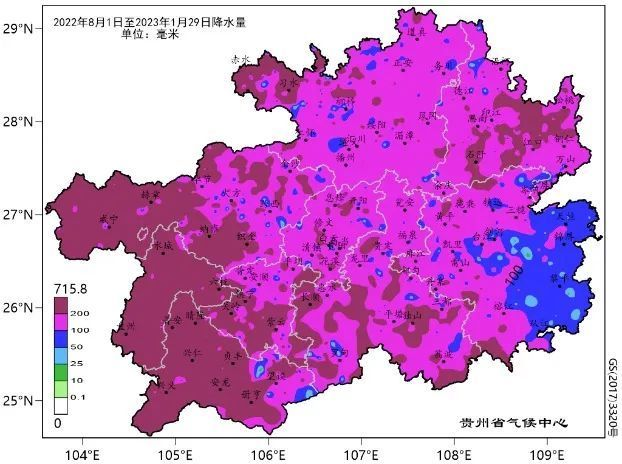
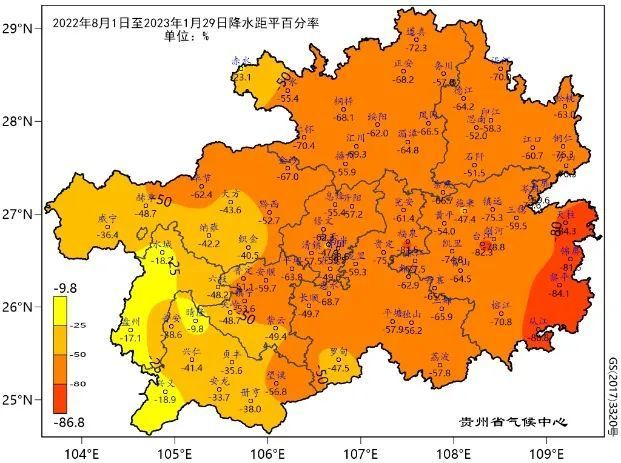
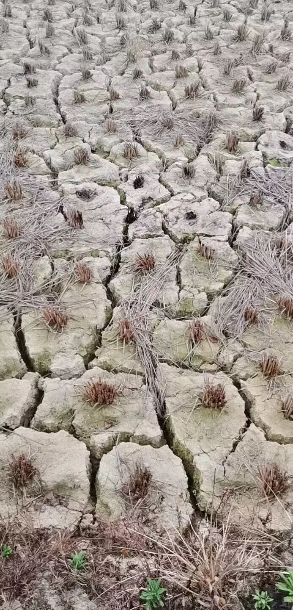
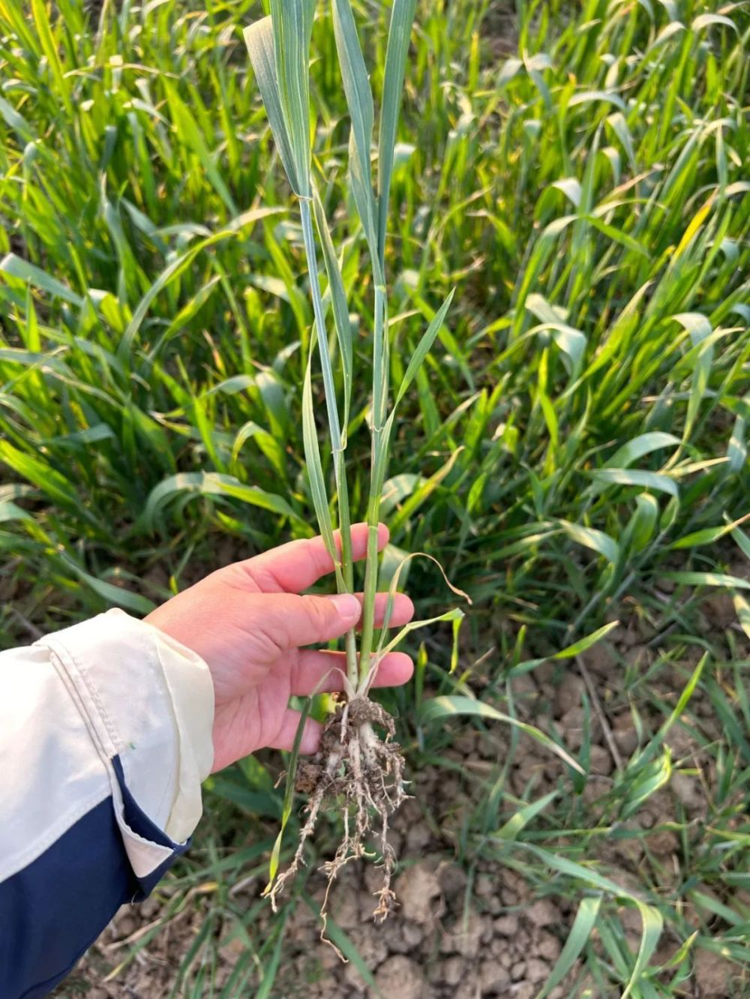

# 这个省7个月来只下过一场大雨，夏秋冬连旱强度创“历史之最”

去年夏天，一场范围波及全国的持续性高温极端天气让诸多耄耋之年的老人都惊叹“活久见”。随着天气转凉，高温的折磨已成过去。但还有很多影响仍在继续，例如干旱。

据江西日报报道，自2022年6月下旬以来，受持续晴热高温少雨、江西“五河”及长江来水偏少的共同影响，鄱阳湖相继刷新进入枯水期、低枯水期、极枯水期的纪录。

每经记者注意到在社交媒体上，有视频显示，贵州省第一大河乌江的遵义河段出现断流，河床干涸，并称当地居民表示“去年7月至今没有下过大雨”。还有视频称，贵州省沿河土家族自治县多个村寨缺水长达半年，消防车调水保障用水。

时值冬季，降水本就偏少，叠加长期干旱，其造成的影响很难被忽视。群众生活、农业及工业用水、生态环境，自然链条环环相扣，牵一发而动全身，气候是托起一切的基石。

《每日经济新闻》（以下简称NBD）先后联系到了贵州省气候中心主任严小冬和贵州省气候中心气候诊断与预测科工程师王玥彤，其就旱情现状、当前措施、干旱成因以及未来天气预测分别作出回应。

**夏秋冬连旱，强度为历史之最**

据严小冬提供的数据，从2022年8月以来，贵州平均降水量较常年同期偏少了近57%，为1961年以来最少值。夏秋冬连旱使得此次贵州干旱的强度超过2009年至2010年大旱，为历史之最。持续性的干旱也让当地水利系统工作人员长期处于紧绷的工作状态。据一位一线工作人员透露，贵州整个水利系统过年都没有休假，每天都在一线抗旱。

_贵州省2022年8月1日至2023年1月29日降水量及距平百分率分布
图片来源：贵州省气候中心_

**NBD：** 有内容称贵州有些地方从去年7月以来至今没有下雨，情况是否属实？

**王玥彤：**
从去年7月以来，全省平均降水量较常年同期偏少47.7%。也有间歇性降水，并不是一滴雨都没有下。但从统计来看，去年7月至今，贵州全省仅发生了1次区域性强降水，的确明显偏少。与常年同期相比，除西部局地正常外，全省普遍偏少。

_1月22日，贵州黔东南岑巩县某地旱情
图片来源：受访者提供_

**NBD：** 贵州持续性的干旱和去年夏天的高温有何关联吗？

**王玥彤：**
去年夏季，我国南方地区出现的持续性高温天气加剧了干旱的发展。回到成因，主要是因为赤道中太平洋发生了持续的拉尼娜事件，拉尼娜会造成我国南方地区降水偏少的概率增大。此外，印度洋海温分布特征也呈异常，两者叠加并通过海气相互作用，使得西太平洋副热带高压持续控制我国南方大部分地区，造成去年汛期和秋季的持续高温少雨天气。

在拉尼娜的持续影响下，菲律宾气旋式环流和印缅槽偏弱影响南方水汽输送，所以冬季也以少雨天气为主。这就导致了贵州出现夏秋冬连旱的情况。

**NBD：** 您自己对此次贵州的持续性干旱感受如何？

**王玥彤：**
我平时都在贵阳，贵阳地处贵州中部地区。目前的干旱情况严重区域主要集中在贵州东部和南部地区。就贵阳而言，目前在生活方面我没有感受到明显影响，但是我去其他地方的时候，还是能明显注意到，贵阳周边几个水库的水位呈明显下降状态。

_2月1日，贵州黔南惠水县好花红镇三都村小麦受干旱影响长势偏弱
图片来源：受访者提供_

**拉水送水持续近半年**

**旱情在春季或有望缓解**

2月1日贵州气象旱涝监测显示，全省出现特旱19站、重旱28站、中旱24站、轻旱10站。据上述一线工作人员，目前当地的抗旱措施主要有节约用水、高效率用水、调水、寻找新水源。“如果这些措施都还不能保证老百姓正常生活，那就由乡镇政府去给老百姓拉水送水，这几大措施已经实行了快半年。”该工作人员介绍称。

_贵州省旱涝监测空间分布图
图片来源：贵州省气候中心_

**NBD：** 短期来看，目前气候中心对旱情的未来态势预测情况是什么样的？

**王玥彤：**
根据现有的监测数据，贵州大部分地区在2月中上旬可能会出现多次降温降雨天气过程，可能会使目前的旱情略有缓解，但是想要在短期内完全解除旱情，应该不太可能。因为我刚提到的降雨天气过程主要就是普通降水，冬季出现强降雨的概率也很低。

**NBD：** 针对中长期的旱情预测呢？

**王玥彤：** 我们也针对即将到来的春季做了一些预测，也就是3月至5月的情况。目前来看，春季的降水条件还比较好，因此我们预判旱情可以在春季得到有效缓解。

但是由于气候预测在很大程度上受到海洋（海温、极冰等）和陆面（积雪等）等因素的影响，而这些因素在未来的演变及影响也存在一定的不确定性，因此我们后期也会及时滚动订正气候预测意见。

**NBD：** 目前贵州应对旱情的具体措施有哪些？

**王玥彤：** 省气象局一直密切关注天气过程，当有合适时机时，就开展空地协调、区域联动的立体人工增雨作业。

除此之外，我们也会根据预测意见对相关部门提出一些建议，比如受持续性干旱影响，森林火险等级较高，需要注意用火安全和森林防火；农业生产方面也要抓住有利时机，及时采收经济林果及蔬菜、做好山塘水库的蓄水保水工作。

**NBD：** 民间有说法称“大旱之后必有大涝”，从专业的角度，你们怎么看待旱情之后可能发生的次生灾害？

**王玥彤：**
我统计了贵州省自1981年以来的几次较强的干旱过程，在旱情后期3到6个月中确实存在降水偏多的特征，比如说2011年春季干旱后贵州初夏确实发生过旱涝急转事件，但并没有说降水偏多一定会产生洪涝灾害。因为涝是一种灾害，短时间内大量集中降水，那可能会产生旱涝急转的事件。从现在的资料来看，并没有更多的数据资料支持“大旱之后必有大涝”这种说法。

**记者|** 朱鹏 **编辑|** 梁枭 卢祥勇 杜恒峰

**校对|** 孙志成

