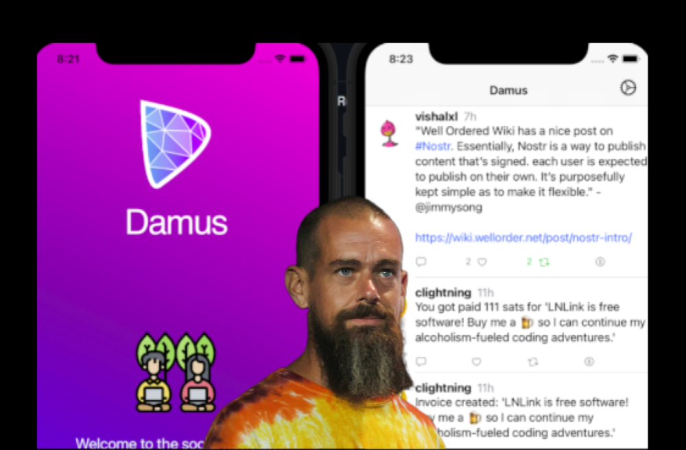
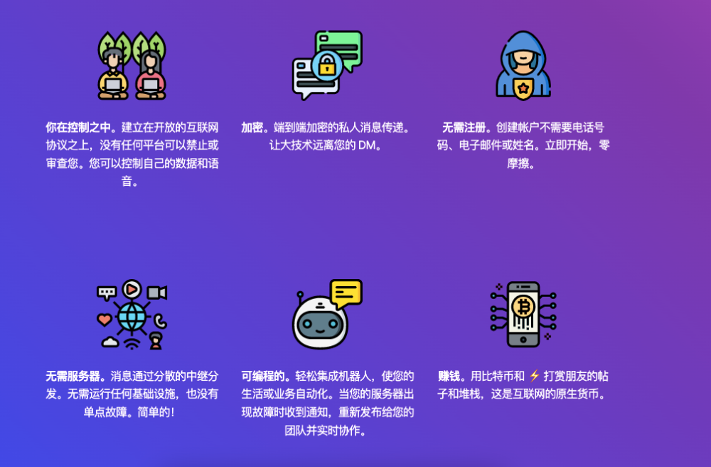

# 这串“神秘代码”在社交媒体火速刷屏，据说还要“搞垮”推特

作者｜凯尔 编辑｜文刀

2023年Web3领域第一个“爆点”由Damus贡献。

2月1日早间，推特前CEO Jack Dorsey
宣布Damus上线苹果、安卓商店，大量的Web3信徒随即涌入。Damus是一个社交App，产品功能类似于推特/微博，它最大的特点是“去中心化”——土生土长在一个去中心化的社交协议“Nostr”
上。

简单理解，基于Nostr协议，每个用户都是一个客户端，人们不再基于官方客户端和中心化服务器通信，而是通过无数个中继器组成通信网络。这使得Damus具备了抗审查特征，同时，无需注册、加密等特性最大程度保证了用户的隐私和自由度。

一时之间，Damus迅速成为Web3领域的社交宠儿，名人、公司、普通网友挪步“占坑”，有人体验后喊出“推特已死”口号。但匿名、抗审查的Damus上也出现了色情图片，可以预测，互联网上存在的不当信息甚至欺诈隐患依然会在Damus上演。如何解决这些问题也考验着社交新“罗马”的建成。

**推特前老板一呼 Web3玩家百应Damus**

2月1日下午，一串“神秘代码”在小部分人的朋友圈刷屏，配合一张二维码，满屏是“话不多说，关注一波”的类似文案。普通人见状可能摸不着头脑，但对于关注Web3的用户、尤其是币圈人来说，这串码如同暗号，快速吸引他们在全新的社交App“Damus”上接头。

暗号最初是推特前CEO Jack Dorsey那传出的，很快，Kingdata、Web3
CN、Binance等加密企业的名字也出现在这个App里，Web3嗅觉敏锐者纷“占坑”，《元宇宙日爆》也去凑了个热闹，想体验一下这个Web3社交软件到底是啥。

那些混着数字和字母的字符，相当于Damus中的个人ID，复制后在该App搜索框中一贴，便可以进入目标用户的主页，查看该用户发布的内容，并进行关注、私信等操作。

Damus的产品设计类似于推特。首页右下方的“+”号标识为发帖入口。Damus 也设置了话题标签功能，用户发布帖子时可以在 “#
”后加上主题，吸引讨论。不过，如果发帖时要加图片，只能将图片先转换为链接才行。

_Damus产品示意图_

在手机App多到“密恐”的时代，社交软件要没点真本事，推出后可能连个响儿都没有，但Damus小范围刷屏了，“邪乎到家必有鬼”。

这个“鬼”就是Damus与推特、微博、微信等社交媒体的最大不同——去中心化，这款App没有依赖中心化服务器部署，而是写在了去中心化社交协议“Nostr”
上。Nostr 全称“Notes and Other Stuff Transmitted by Relays”，可以理解为是社交媒体信息的中继传输协议。

简单理解，Nostr
协议上的每个用户都运行一个客户端，可以是本机客户端、Web客户端等。要发布某些内容，用户只需用个人密钥对其签名，并将其发送到多个中继器（由其他人或自己托管的服务器）便可完成发布。要从其他人那里获得更新，也通过访问中继器得以实现。

没有服务器，每个人都是一个客户端，无数个中继器组成了通信网络，这就是Nostr
协议不依赖中心化服务器的秘诀。而建立在其上的Damus因此具备了去中心化，连带着有了“抗审查”的特征。毕竟，关闭服务器关停某个应用很容易，但逐一清理分布在全球各地的中继器和客户端就有难度了。

这一下就把Damus放在了权力的牢笼之外，表象上，它是一个高度自由的社交世界。因此，当推特前CEO Jack Dorsey
宣布它上线苹果和谷歌商店时，大量Web3信徒蜂拥而至。“Hello
Damus！”、“瞬间充满了自由的味道”，用户们在Damus的公共天地不断发出声音，言语中充满兴奋和期待。

**真正的革命者？**

官网上，Damus给自己的定位是The social network you control
，意为“由你掌控的社交网络”，即用户自己掌控账户、数据以及一切潜在的价值，这也是Web3强调的精神内核。

Damus列举了它的六大产品特点，分别为： **用户所有** ，没有任何平台可以禁止或审查； **加密** ，端到端的私人消息传递； **无需注册**
，是的，注册一个Damus账户不需要电话号码、电子邮箱或实名认证，只需要填写昵称，便可生成一个公钥和个人保管的私钥，公钥便相当于个人的客户端；
**无需服务器** ，消息通过分布式的中继器分发； **可编程** ，可轻松集成机器人； **可获取收入**
，利用比特币的闪电网络，用户可以获得加密货币打赏。

_Damus的六大产品特点_

有人形象地将Damus描述为去中心化的“Telegram+Twitter”的组合，一个加密、匿名的通讯+社交软件结合体。加密行业KOL
Robert更直接了当地以“Twitter 已死，Nostr
新生”为题写了一篇博客文章，他认为，采用Nostr协议的Damus等应用，将彻底颠覆中心化社交巨头。

为什么去中心化、用户自控如此重要？一些传统社媒平台的现存槽点充分反映了为何有人如此渴求Damus的出现。

比如，在豆瓣上，常常有人抱怨发文审核时间过长，甚至不给具体原因直接拒绝通过；在微博、抖音，用户账户可能因为某些原因被限流或封号；自媒体们赖以生存各种公众内容平台，要么文章消失了，要么账号被封禁；推特上，账户被封禁同样大范围存在，美国前总统特朗普的账号到现在也没解封。

加密KOL Robert吐槽称，“如今申请一个推特的 API
都需要层层的障碍和审查，搞得如同入党申请书一样复杂，”他认为，推特过去最大的价值就是开放，不仅仅是言论的开放，也包括
API的自由和开放，这使得Twitter
上长出了无数好玩的应用和生态，使得它成为了社交媒体的战场，使得它成为向大公司吐槽获得客户服务的阵地。不过，推特不久后就开始剥夺其他客户端产品的生存空间，并且一步步走向言论控制和封锁。

人们厌倦了原由不明的审查和小心翼翼的交谈。因此，当Nostr和Damus面世，用户至少获得了选择权，Damus能快速引起一拨人的注意也就不难理解了。

当前，Damus仍是一个待优化的初级版本，很多功能远不如现有的社交应用方便，例如发帖不支持样式编辑，发帖后不可删除，点赞或转推后不可撤销，图片需要转成链接才能发布，此外，趋势、过滤器等高级需求也亟待添加。

“抗审查”同样存在一体两面，自由是自由了，但弊端也很明显，已经有色情图片出现在Damus上，不难想象，以后血腥、暴力甚至欺诈等有可能引发犯罪和受害的信息也会出现，就当下广存的“网络暴力”现象，很可能在匿名背后更张牙舞爪。

抛却产品体验不谈，上述问题是Web3社交应用需要探索解决的重要问题，也是Damus能否走入更广泛的Web2用户群体的关键，否则，“革命者”的角色也演不长。

罗马并非一日建成，Nostr和Damus也并不完美，但它们的意义在于，技术为社交世界提供了新的打开方式。“钥匙”在手，剩下的就是如何将这片世界打造得繁荣又文明了。

**互动时间：你认为Damus能否颠覆传统社交媒体？**

