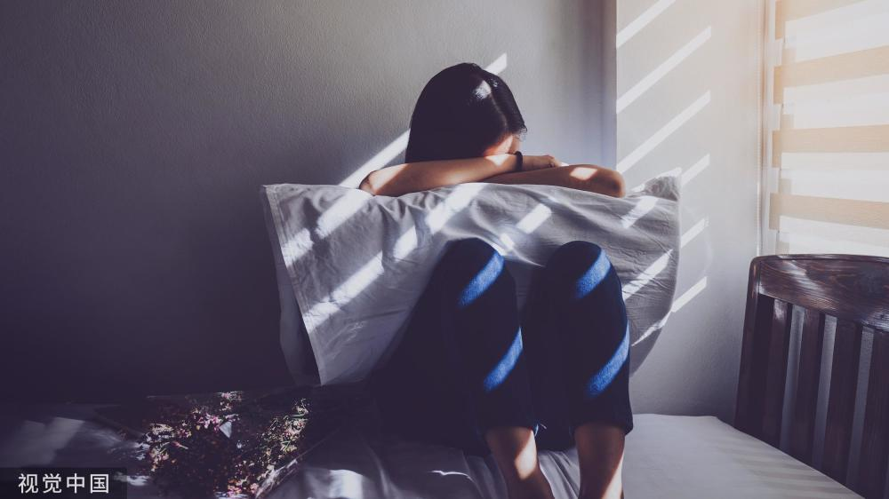

# “想住进精神病医院，但找不到合适的” 开放式病房近三年正在“倒退”

李深很累，她想住进精神病医院，但找不到合适的。

双相情感障碍的病越来越严重，躁狂的兴奋和抑郁的低落交替挑动着敏感的神经，在大学临近毕业的这几个月，李深不得不终止毕业实习。每一段从高峰跌落至低谷的旅途，都像一场场筋疲力尽、做不完的梦魇。

李深想自救，最直接的办法就是去住院。

但她也有个执念：要住精神科的开放式病房。

在国内，绝大多数的精神类病房是封闭式的——不允许探视、没收手机、出行和活动也受限制；而开放式意味着，她既能在医院里进行规律治疗，还能有退休的家人陪护，家属朋友也能来探视。

二者还有个最重要的区别：封闭式病房代表着“特殊”、“约束”、“控制”，而在开放式病房，可以像治其他疾病一样，而非成为一个人们刻板印象中的“精神病人”。

但在国内的设有精神科的医院里，设有开放式病房的医院不多。而近三年，因各种原因，许多开放式病房，在不同程度上也关闭了曾经敞开的大门。

给无数家医院打电话后，李深频繁得到碰壁的消息。

开放式病房消失了，变成了寓言中的住所，“能看到，但触不可及”。

在李深找医院的那半年里，国内的一些精神专科医生也注意到：这三年，精神科的开放式病房、开放式服务正在“倒退”。

一位医生接到家长投诉说：住在病房里的孩子，没有手机，没有探视，就像失联了一样。

难 寻

半年都在“找住院”。

等待治疗的日子里，李深总会想着自杀或者“得一场重病就好了”，进而摆脱复杂的现实世界。她将最近的烦恼归结于病情，“一时脑热觉得自己很行就重新投入实习，躁了；现在又掉入没有动力的漩涡，郁了。”

躁郁症是双相情感障碍的另一个名字。患者既有躁狂发作，也会有抑郁发作。躁狂发作时，他们情感高涨、言语增多、精力充沛；而抑郁发作时，他们又会表现出情绪低落、疲劳迟钝、快感丧失的症状。两种症状反复交替、不规则地出现。

今年23岁的李深，在12岁时第一次自残。那时，她不知道什么是“双相情感障碍”，只是知道自己情绪波动很大。16岁开始，李深的情况越来越严重；直到19岁，李深因为自杀未遂正式确诊双相情感障碍。没有休学治疗的日子，在她眼里就像赶路：“一边上学，一边治疗，效果也不好。”

此前，李深一直在一家二甲专科医院看病。医院小，药物种类更少，很多精神类药物都没有，李深后来觉得，某种程度上限制了治疗。那段时间，她把医院里能开到的药都试了一遍，药量也加到最大，但都没有很好的效果，最后甚至还发生了耐药。

无论如何，李深这一次都想住院。

但现实是，一些医院仍然在严格的管控之下。

武汉一家精神病专科医院的医生说，因为疫情的影响，全国精神专科医院，甚至包括综合医院的精神科、心理科的开放式服务基本都关闭了。家属探视也改成了线上视频探视。

此外，在他所在的医院，新病人入院后，需要在隔离病区观察3~7天不等，才能进入普通病房。“隔离观察这3到7天，对患者来说是非常难受的，因为工作人员都是二级防护，基本上很难交流，”他说。

李深所在的二甲专科医院也是如此。医院告诉李深，想住院，就必须隔离14天才能入住，而且“进去了就不能再出去，是封闭式管理。”李深看见过住在封闭式病房里的人，觉得他们“就像行尸走肉一样”。

找不到医院的李深，并不是个例。

疫情期间，本应增加的开放式病房不仅停滞，而且原有的开放式病房，也陆续因为封院和防止交叉感染，病人自由出入产生了限制。有些也改为了“半开放式”病房：拒绝探视、病人非医疗需要尽量不离开病房。

更有些医院直接关闭了开放式病房。

八点健闻在一月初发现，一些官网显示有开放式病房的医院，在致电咨询时都表示，开放式病房在疫情期间已经关闭了。如果现在想入院，只能住封闭式病房。

在“想治好自己”的执念下，是李深为寻找合适医生和医院的、难熬而坎坷的半年，也是许多与她相同的患者们在寻找中渡过的三年。在过完22岁生日后不久，李深终于住进了广州某三甲医院的开放式病房，并在那里待了半个月。

李深依旧在社交媒体上记录着自己的住院日常和用药情况。她会细心地把每天吃的药分装在盒子里，摆放整齐地拍照；她会写日记、小说、会被催更；她也会给吃过的药画拟人形象，每种药根据作用都有不同的相貌特点：昏睡的药、变瘦的药、会掉发的秃头药……

李深也发了一句话鼓励自己：“悲伤不会相伴一生的。”这句话写在了她入院前夕。

断 裂

对于住在开放式病房里的患者来说，“开放式”三个字更大的意味是：自己和社会的连接。

风颂住过3次精神病医院，其中1次封闭式、2次开放式。但在她眼里，这几年，精神科开放病房的开放度越来越低，种种约束变多，那条“与社会连接的纽带”似乎也在暗处要断了。

17岁的风颂，患有双相情感障碍。最近的一次住院在2022年10月底，住进开放病房的第一天，就被告知要封院。第二天医院封控，风颂不能下楼，也不能有家属在身边陪护。开放病房，瞬间随着医院的封闭，变成了“封闭病房”。

封闭后的开放病房里，微妙的变化不断发生。以前开放式病房里气氛友好，医患也亲密。但封闭后，病房里有个女孩过生日，当大家坐在周围时，风颂发现，病友们还是“各玩各的”，有几个男孩子像被护士喊来凑数的，“他们坐在后面玩手机，觉得差不多了就走了”。

患者间的沟通越来越少。

风颂的病房里，与她年龄相仿或再小一点的孩子，有10个左右。其余都是四五十岁的阿姨、六十多岁的奶奶、和五六十岁的“大爷”。风颂觉得“大爷”们的存在感很高，走到哪都很难不去注意到他们：“大爷们永远都在活动室看电视、永远在茶水间抽烟、永远在走廊里溜达。”

如果说“大爷”们存在感高，那么像风颂这样大的孩子们，就是人们眼中的“小透明”，病房里存在感最弱的一批人。风颂平时看不到这些孩子，从住院一直到出院，她也不知道病区里的其他孩子们都是谁，“大家都不出病房。”

对于轻精神类疾病的患者而言，“开放式”最直接的含义是自我选择、家属探视，各方面与社会生活和活动的互动。而一旦变为“封闭式”，其背后意味着被管制、被约束，甚至被视为自我意识和控制力差的人，再进一步的含义或许是：你很难再回到社会化的生活中。

可以说，开放式病房就像一个没有盖子的精致盒子，这份开放维系着他们与社会化生活的脆弱纽带，而一旦这个盖子被封闭，这条纽带也就彻底宣告断裂，病人们也由此进一步与社会生活脱节。

这是需要住在开放式病房里的大部分焦虑、抑郁、双向情感障碍等精神类患者，最不愿接受的一幕之一。

上海某精神卫生中心封闭式病房医生表示，对患者行动越精细化的管理，越使其丧失应有的权利，这样不利于患者的康复和治疗。除此之外，他认为，如果切断患者与社会的联系，反而会对一些患者的康复形成阻碍。

挽 救

精神类的开放式病房，在中国起步，其实并不算早。

20世纪之前，国外已经有过许多尝试。19世纪的美国，治疗精神病人的场所已经从疯人院到州立医院，又重新回到了社区和家中。1988年的牙买加，一半以上的急性精神病患者住在综合医院的开放式内科病房里，他们和其他患有心脏病、糖尿病等非精神类患者接受一样的管理，同样允许家人陪护。

而在牙买加的大多数精神患者已经住进了开放式病房时，大洋彼岸的中国也开始了这场迷雾中的探索。1984年，四川大学华西医院心理卫生中心创建了国内首个精神科开放式病房。

穿过迷雾，这场探索虽然缓慢，但是未曾停止。

1988年，上海市精神卫生中心在急性治疗病房内对部分病人实施全开放型管理开放式病房，此时，半开放管理已在多数医院实施，全开放管理亦在慢性康复病房中试行探索。

1993年，吉林省神经精神病医院对部分患者进行开放管理。2002年，湖北省十堰市东风汽车公司医院精神科专门设立了开放式病房。2004年，北京大学第六医院实行全开放管理......

直到2013年，中国首部保障精神障碍患者权益的法律——《精神卫生法》颁布，明确了非自愿医疗的概念、标准和程序，最重要的是患者自愿入院的原则被写入法律。

长久以来，由于缺少对于精神类疾病的认识，过于强调精神病的特殊性，精神病患者遭受了不少歧视和冷眼。《精神卫生法》的颁布，是对精神病患者的一次正名，至少是对其尊严的保护。“被精神病的终结”等字眼见诸报端，而传统的高墙铁网，阻止病人和社会接触的治疗模式似乎成为过去式。

阳光驱散眼前的迷雾，一条大道渐渐显现，众多医院开始了开放式病房的尝试。

《精神卫生法》颁布的当年，国内最早一批设立开放式病房的北京回龙观医院就增加了病房的设置，从心理科一个病区，增加到五个“开放式病房”；2015年，张家界市精神病医院的开放式科室投入使用；2017年，珠海市慢性病防治中心住院部开设开放式病房；2019年，杨浦区精神卫生中心首个开放式病区正式使用；2022年，东营鸿港医院心理科开放式病房正式开科......

精神类专科医院开设开放式病房，也有越来越多的综合医院设立了精神科的开放式病房。而与专科医院的病房从只有封闭式病房到出现开放式病房不同，综合医院的开放式病房与生俱来。

山西白求恩医院的精神科医师杨程翔告诉八点健闻，随着经济的发展及患者需求等原因，综合医院也设立了精神科，“刚开始有门诊，后来发现应该设立病房。这个时候设立开放式病房是自然而然的。因为综合医院的病房都是开放的，没道理精神科要专门设立一个封闭式病房。”

但迷雾驱散之后，开放式病房的掣肘也显露出来。

医护人员没有“安全感”、患者病情反复、经济因素成为压在开放式病房发展路上的三座大山。

入住开放式病房的病人在入院前会对其进行自伤自杀、暴力、出走风险评估，评估危险度为低度危险的患者才会允许入住。但精神病患者的病情反复，难以根治。

温州医科大学附属康宁医院精神科医生蔡正茂说自己刚入行时，常有挫败感。因为“在别的科，有些病治好了，就是治好了；在我们这里，今天病人不发病了，看上去好了，过两个月，他又来了。”经过了多年的调整，他才接受目前人类的医学水平不能根治精神疾病的现实。“只能在一定程度上控制住症状”。

在开放式病房的管理当中，医护人员最担心的是病人的安全。杨程翔说，“在我们科（的开放式病房），时不时会有病人偷偷跑出去，家属追也追不上”。

而且，并不是所有专科医院都负担得起开放式病房，它对于医院的经济实力有更高的要求。开放式病房既扩大了患者的活动范围，同时也扩大了医院的管理范围，由此带来更高人力物力成本。

在现有的精神科开放式病房里，不同医院的开放程度也有所参差。2017年，珠海市慢性病防治中心住院部开设开放式病房，预想精神障碍患者入院后可以有家属陪护照料，患者的活动范围不受限制，可自由活动。

但该院的工作人员杨羯告诉八点健闻，在实际管理过程中，由于接收的病人大多是青少年双向、抑郁患者，多为非自愿入院，医生评估后大多存在较高的自伤自杀、外逃等风险，所以只开放了家属陪护，未真正实现开放式的自由进出。

开放式病房的探索还处在走一步退半步的迂回前进中。杨羯说，相较于以往的精神类专科医院而言，现有模式确实是开放了。对家属开放，让家属可以参与到患者的治疗中来。对外界开放，患者可以通过手机或者其他通讯工具跟外界保持联络，外界同行也可以进行参访。但如果是去标签化，将精神科的管理跟其他普通科室类同起来，可以自由进出的话，那确实还没开放到那种程度。

驱散的大雾似有卷土重来之势。近三年，许多开放式病房暂停接收病人。

在供需的天秤上，供给一端高高翘起，需求一端不断加码。据世界卫生组织公布的数据，疫情的第一年，估算全球的焦虑症患者增加了七千万到九千万，抑郁症患者增加了五千万到六千万，失眠障碍的患者增加了1亿以上。

北京大学第六医院的院长陆林曾告诉媒体，全球很多人可能在长达十年、二十年的时间里，面临着应激后焦虑、应激后抑郁、应激后社会交往问题。特别是青少年，因为长期缺少与同伴的交流，将来成人后有可能面临着社会交往的不协调甚至缺陷。

北京回龙观医院儿童心理病房主任杨兴洁也告诉八点健闻，寒暑假期间，儿童病房的床位变得十分紧张，甚至需要提前预约。

供需的天秤失衡，那需要进入开放式病房的李深们要到哪里去住院？

张雨箫、唐卓雅丨撰稿

李 琳丨责编

**本文首发于微信公众号「八点健闻」，未经授权不得转载**

