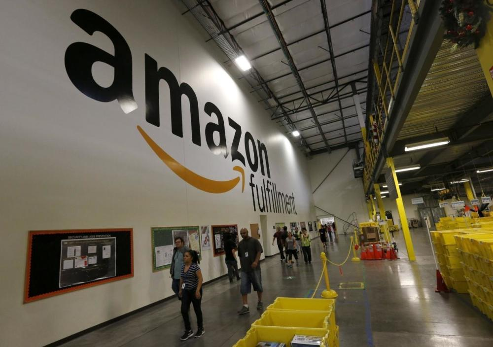
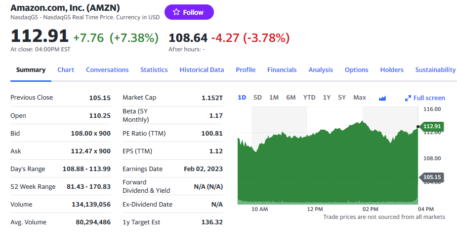

# 亚马逊第四季度净利润仅3亿美元 同比下滑98%

腾讯科技报道
2月3日消息，美国当地时间周四，亚马逊于美股盘后发布了该公司截至2022年12月31日的第四季度及全年未经审计财报。财报显示，亚马逊第四季度净销售额为1492亿美元，比去年同期的1374亿美元增长9%，超出华尔街分析师平均预期的1454亿美元。

亚马逊第四季度净利润降至3亿美元，与上年同期的净利润143.23亿美元相比下降98%，摊薄后每股收益为0.03美元，不及华尔街分析师平均预期的每股收益0.18美元。相比之下，亚马逊2021财年第四季度净利润达143亿美元，摊薄后每股收益1.39美元。财报发布后，亚马逊股价在随后的盘后交易中下跌逾3%。

**划重点：**

**1、亚马逊第四季度净销售额同比增长9%，达到1492亿美元，超出华尔街预期。**

**2、亚马逊第四季度净利润降至3亿美元，合摊薄每股收益0.03美元，不及华尔街预期。**

**3、亚马逊的云计算业务AWS第四季度净销售额低于预期，表明该业务支出放缓的趋势。AWS同期仅增长20%，低于第三季度的27.5%。**

**4、亚马逊广告收入同比增长23%，再次超过了谷歌、Facebook和Snap等在线广告公司。**

**5、 亚马逊预计2023年第一季度净销售额在1210亿美元至1260亿美元之间，分析师平均预期为1251亿美元。**

**一、财报要点**

**1、2022年第四季度财报要点**

—
亚马逊第四季度净销售额增长9%，达到1492亿美元，而2021年第四季度为1374亿美元。扣除本季度汇率同比变化带来的50亿美元不利影响，亚马逊第四季度净销售额比2021年同期增长12%。其中，

● 北美地区销售额同比增长13%至934亿美元，扣除汇率变化影响后增长14%

● 国际部门销售额同比下降8%至345亿美元，扣除汇率变化影响后增长5%

● AWS部门的销售额同比增长20%，达到214亿美元

—
亚马逊第四季度的营业利润降至27亿美元，而2021年第四季度为35亿美元。2022年第四季度营业利润中包括约27亿美元的费用，用于支付与自我保险负债、财产和设备减值以及经营租赁相关的费用，还有裁员遣散费。这些费用主要影响到北美市场。其中，

● 北美地区的运营亏损为2亿美元，与2021年第四季度的运营亏损基本持平

● 国际业务的运营亏损为22亿美元，而2021年第四季度的运营亏损为16亿美元

● AWS部门的营业利润为52亿美元，而2021年第四季度的营业利润为53亿美元

—
亚马逊第四季度净利润降至3亿美元，摊薄后每股收益0.03美元，而2021年第四季度为143亿美元，摊薄后每股收益1.39美元。2022年第四季度的净利润包括23亿美元的税前估值亏损，包括对Rivian
Automotive普通股投资的非营业收入(费用)，而2021年第四季度投资的税前估值收益为118亿美元。

— 亚马逊第四季度总运营支出为1464.67亿美元，相比之下去年同期为1339.52亿美元。其中，

● 营收成本为856.4亿美元，相比之下去年同期为828.35亿美元；

● 履约成本为231亿美元，相比之下去年同期为224.45亿美元；

● 技术和内容支出为208亿美元，相比之下去年同期为153亿美元；

● 销售和营销支出为128.2亿美元，相比之下去年同期为108亿美元；

● 总务和行政支出为33.3亿美元，相比之下去年同期为25.3亿美元；

● 其他运营支出为7.59万美元，相比之下去年同期为2400万美元。

**按照地域划分**

—
亚马逊北美部门（美国、加拿大）第四季度净销售额为933.63亿美元，与去年同期的823.6亿美元相比增长13%；运营亏损为2.4亿美元，相比之下去年同期的运营亏损为2.06亿美元。

—
亚马逊国际部门（英国、德国、法国、日本和中国）第四季度净销售额为344.63亿美元，与去年同期的372.72亿美元相比下降8%；运营亏损为22.28亿美元，相比之下去年同期的运营亏损为16.27亿美元。

—
亚马逊第四季度来自北美部门的收入在总销售额中所占比例为63%，相比之下去年同期为60%；来自国际部门的营收在总营收中所占比例为23%，相比之下去年同期为27%。

—
亚马逊云服务AWS第四季度净销售额为213.78亿美元，与去年同期的177.8亿美元相比增长20%；运营利润为52.05亿美元，相比之下去年同期为52.93亿美元。来自云服务的营收在总销售额中所占比例为14%，高于上年同期的13%。

**按照服务和业务类型划分**

— 亚马逊第四季度来自在线商店的净销售额为645.31亿美元，与去年同期的660.75亿美元相比下降2%；

— 亚马逊第四季度来自体店的净销售额为49.57亿美元，与去年同期的46.88亿美元相比增长6%；

— 亚马逊第四季度来自三方卖家服务的净销售额为363.39亿美元，与去年同期的303.2亿美元相比增长20%；

— 亚马逊第四季度来自订阅服务的净销售额为91.89亿美元，与去年同期的81.23亿美元相比增长13%；

— 亚马逊第四季度来自告服务的净销售额为115.57亿美元，与去年同期的97.16亿美元相比增长19%；

— 亚马逊第四季度来自AWS云服务的净销售额为213.78亿美元，与去年同期的177.8亿美元相比增长20%；

— 亚马逊第四季度来自其他业务的净营收为12.53亿美元，与去年同期的7.1亿美元相比增长77%。

**2、2022年全年财报要点**

—
亚马逊2022年全年净销售额从2021年的4698亿美元增长到5140亿美元，增幅达9%。扣除全年汇率同比变化带来的155亿美元不利影响，亚马逊2022年净销售额较2021年增长13%。其中，

● 北美市场销售额同比增长13%，达到3159亿美元

● 国际部门销售额同比下降8%至1180亿美元，扣除汇率变化后增长4%

● AWS部门的销售额同比增长29%，达到801亿美元

— 亚马逊2022年全年营业利润从2021年的249亿美元降至122亿美元。其中，

● 北美业务的营业亏损为28亿美元，而2021年的营业利润为73亿美元

● 国际业务的运营亏损为77亿美元，而2021年的运营亏损为9亿美元

● AWS部门的营业利润为228亿美元，而2021年的营业利润为185亿美元

—
亚马逊2022年全年净亏损为27亿美元，摊薄后每股亏损0.27美元，而2021年的净利润为334亿美元，摊薄后每股收益3.24美元。亚马逊2022年净亏损包括127亿美元的税前估值亏损，包括对Rivian
Automotive普通股投资的非营业收入(费用)，而2021年投资的税前估值收益为118亿美元。

— 亚马逊2022年全年总运营支出为5017.35亿美元，相比之下2021年为4449.43亿美元。其中，

● 营收成本为2888.31亿美元，2021年为2723.44亿美元；

● 履约成本为842.99亿美元，2021年为751.11亿美元；

● 技术和内容支出为732.13亿美元，2021年为560.52亿美元；

● 销售和营销支出为422.38亿美元，2021年为325.51亿美元；

● 总务和行政支出为118.91亿美元，2021年为88.23亿美元；

● 其他运营支出为12.63万美元，2021年为6200万美元。

**现金流**

—
在截至2022年12月31日的过去12个月里，亚马逊的运营现金流增长1%至468亿美元，而在截至2021年12月31日之前的12个月里，运营现金流为463亿美元；

—
在截至2022年12月31日的过去12个月里，亚马逊的自由现金流流出116亿美元，而在截至2021年12月31日之前的12个月里，自由现金流流出91亿美元；

—
在截至2021年12月31日之后的12个月里，亚马逊自由现金流减去融资租赁和融资义务的本金偿还增加至198亿美元，而在截至2021年12月31日之前的12个月里，自由现金流流出204亿美元；

—
在截至2022年12月31日的过去12个月里，扣除设备融资租赁、所有其他融资租赁和融资义务的本金偿还后，亚马逊的自由现金流增加至128亿美元，而截至2021年12月31日之前的12个月里，流出的现金流为143亿美元；

—
截至2022年12月31日，亚马逊持有的现金、现金等价物总额为538.88亿美元，而截至2021年12月31日为362.2亿美元。同期，亚马逊持有的有价证券价值为161.38亿美元，而截至2021年12月31日为598.29亿美元。

**4、高管点评**

亚马逊首席执行官安迪·贾西表示：“我们坚持不懈地致力于提供最广泛地选择、超凡的价值和快速地送货服务，在第四季度推动了我们商店业务的客户需求，超出了我们的预期。我们感谢所有在刚刚过去的假日季购买亚马逊产品和使用亚马逊服务的客户。令我们感到鼓舞的是，我们在降低为商店业务运营部分服务的成本方面取得了持续性进展。”

贾西继续称：“在短期内，我们的经济面临着许多不确定性，但我们对亚马逊的长期机会仍然相当乐观。全球零售和IT领域的绝大部分细分市场份额仍然位于实体店和内部数据中心，随着这一等式的稳步转变，我们相信，我们在这些领域领先的客户体验，加上我们每天不断努力和不断改进的发明成果，将在未来几年带来显著增长。当你考虑到我们在其他几个客户体验方面的广泛投资和创新(例如流媒体娱乐、客户至上的医疗保健、全球更多社区的宽带卫星连接)，就有更多理由对未来感到乐观。”

**二、财报解读**

在2022年，亚马逊经历了上市25年来增长最慢的一年。由于通胀压力和利率上升抑制了消费者支出，该公司2022年的收入只增长了9%，其股价在2022年下跌了近半。

亚马逊预计，该公司在2023年第一季度的净销售额在1210亿美元至1260亿美元之间，同比增长4%至8%。而分析师平均预计其销售额为1251亿美元。

亚马逊加上苹果和Alphabet的财报，将为大型科技公司喜忧参半的财报季画上句号。苹果公司周四公布了自2016年以来的首次营收下滑，Alphabet的盈利和营收均未达到预期。周三，Facebook母公司Meta报告营收超过预期，并对其支出前景表示乐观。

亚马逊在线商店销售额同比下降2%。由于汽油和食品价格上涨迫使消费者削减可自由支配的支出，该公司始终在努力应对销售放缓的问题。由于消费者越来越多地回到实体零售店，由疫情引发的电子商务热潮也正在消退。

亚马逊首席执行官安迪·雅西于2021年7月接替创始人杰夫·贝索斯执掌公司，过去一年他始终在努力削减成本。今年1月，亚马逊表示，继去年11月大裁员之后，将在公司员工中裁掉1.8万个工作岗位。该公司还冻结了招聘，削减了部分项目，并暂停了仓库扩建，以遏制不断上涨的支出。

贾西在声明中表示，该公司在降低零售成本方面所取得的“持续进展”令人鼓舞。他说：“短期内，我们的经济面临许多不确定性，但我们对亚马逊的长期机会仍然相当乐观。”

亚马逊的云计算业务AWS第四季度净销售额低于预期，反映出业务支出放缓的趋势。AWS同期仅增长20%，低于第三季度的27.5%。

亚马逊广告收入同比增长23%，再次超过了谷歌、Facebook和Snap等在线广告公司。亚马逊最近成为数字广告领域的领导者之一，为品牌和卖家提供了更多付费方式，让他们在该公司的网站、应用程序和媒体资产上推广商品。

**股价表现**

美国当地时间周四，亚马逊股价在纳斯达克证券市场常规交易中上涨7.76美元，涨幅为7.38%，报收于每股112.91美元。在随后的盘后交易中，亚马逊股价下跌逾3%。截至本文发稿，该股每股交易价格为108.64美元。

过去52周，亚马逊最低股价为81.43美元，最高股价为170.83美元。按照周四的收盘价计算，亚马逊市值约为1.152万亿美元。（金鹿）

