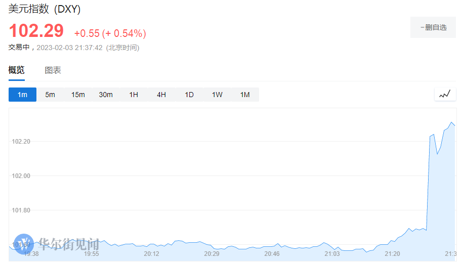
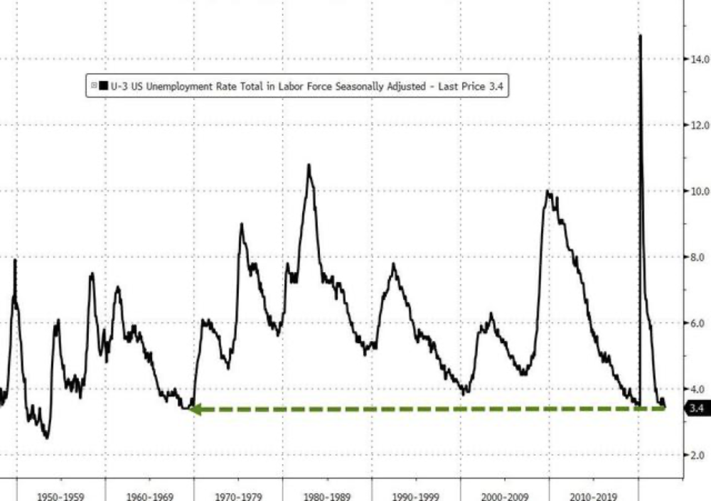
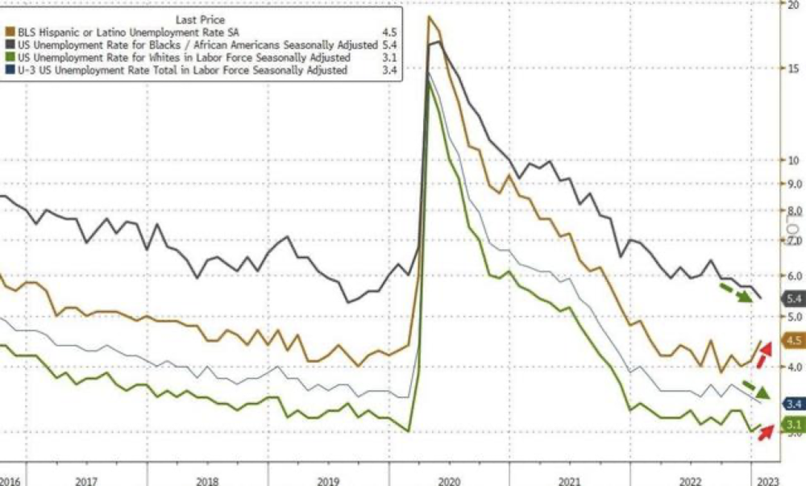

# 大超预期！美国1月非农就业人口猛增51.7万人，失业率创53年新低

火热的就业市场或将再次成为美联储的降息路上的绊脚石。

2月3日周五，美国劳工局公布的数据显示，1月非农新增就业人数51.7万人，远超预期，预期为18.5万人，前值为22.3万人（修正后为26万人）。失业率下降，维持在近50年来的低位，平均时薪同比增长4.4%，略高于预期4.3%，凸显出美国劳动力市场的韧性。

市场普遍认为，美国劳动力市场降温，是美联储使核心通胀放缓至2%的唯一方法。

由于火热的劳动力市场可能首先在工资上得以体现，因此许多美联储官员将其视为潜在通胀压力的代表。如果工资增长能够放缓至4%，距离实现2%的通胀目标就能更近一步。

互换利率市场显示，交易员们对6月份美联储政策利率峰值的预期上升至4.96%，非农就业报告发布前为4.91%。

消息公布后，美元指数短线飙升近60点，报102.29。美国10年期国债收益率短线飙升超10个基点，刷新日高至3.4803%，使得日内整体转而涨约8.40个基点。

新增就业人数激增，刷新2022年7月以来新高

美国1月非农就业人口新增51.7万人，远超普遍预期的18.5万人，约为12月22.3万人（修正值26万）的两倍，为2022年7月以来的最高值。

1月，休闲和酒店业、医疗保健等服务行业就业岗位增幅最大。政府部门就业人数增幅创7月以来最大值，主要是受到12月加州大学超过3.6万名师生大罢工后重新返回工作岗位的提振。

时薪同比增速放缓，但略超预期

工资增速基本符合预期，平均时薪环比上涨0.3%，与12月的增速持平，同比增长4.4%，略高于预期4.3%，低于前值4.6%，为2021年8月以来最低。

分析认为工资通胀的前景对于理解近期的核心PCE非常重要，这将有助于市场预判美联储何时暂停加息，以及通胀是否反弹的风险。

失业率跌至50年来低点，劳动参与率有所上升

失业率继续下降至3.4%，低于预期3.6%，及前值3.5%，刷新 1969 年以来的最低水平。

在主要工人群体中，成年男性（3.2%）、成年女性（3.1%）、青少年（10.3%）、白人（3.1%）、黑人（5.4%）、亚裔（2.8%）和西班牙裔的失业率(4.5%)
在 1 月份几乎没有变化，值得注意的是，黑人的失业率降至历史最低水平。

劳动参与率意外上升，1月数据升至62.4%，略高于市场预期和前值为62.3%。瑞银此前指出，移民的回归将增加劳动力的供应，从而提高劳动参与率。

美联储或将面临棘手的劳动力市场

此外，美国四季度就业成本指数同比飙升至创纪录的5.07%；12月职位空缺数量从前月的1040万增加至略超过1100万的水平，创下五个月最高；上周首次申请失业救济人数也降至九个月以来的最低水平，均表明对劳动力市场仍未降温。

野村证券指出，周期性行业的就业情况已开始降温，但非周期性行业，如医疗保健服务领域的强劲需求仍将持续，劳动力短缺情况仍然存在，劳动力市场需求依然强劲。

在当前美国通胀整体处于高位的形势下，劳动力市场的通胀情况备受关注。被视为“美联储喉舌”、有“新美联储通讯社”之称的华尔街日报记者Nick
Timiraos在前几日的文章中表示，火热的劳动力市场或将助推工资更快上涨，成为点燃通胀的又一“引线”。如果工资继续以近期5%至5.5%的速度增长，并假设生产率每年增长1%-1.5%，将造成通胀远超2%的目标。

此前稍早，摩根士丹利首席经济学家Ellen
Zentner表示，从现在起，劳动力市场或成为关键指标，而不是CPI。美银也直言，让劳动力市场降温是美联储使核心通胀放缓至2%的唯一方法。

