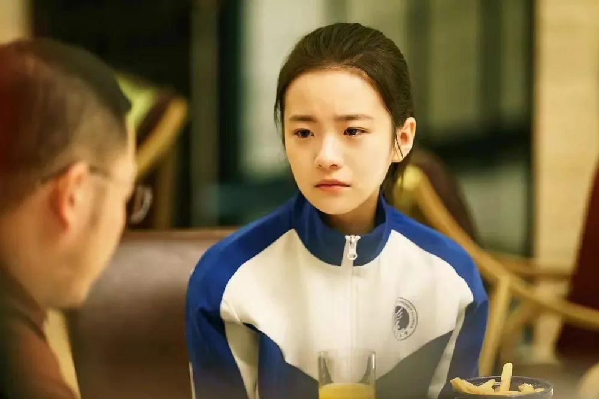
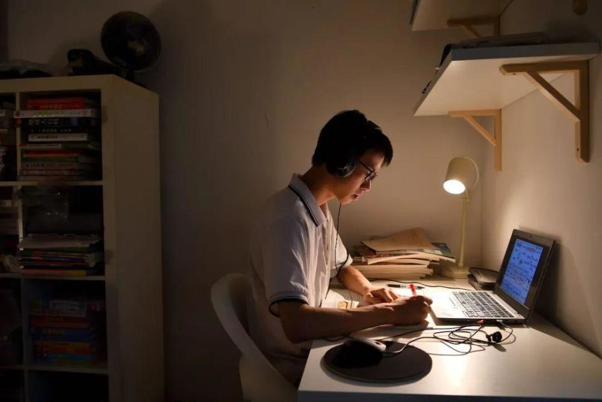
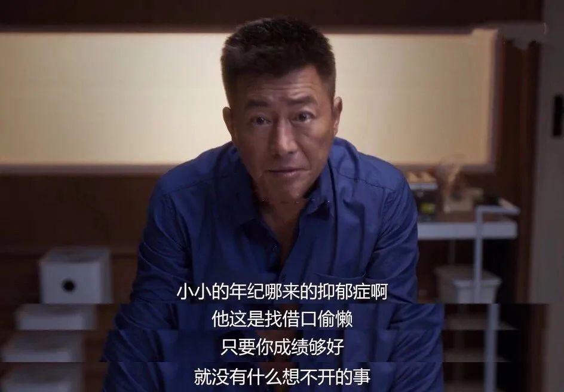
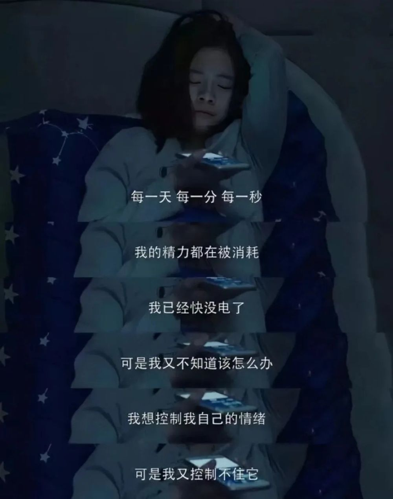
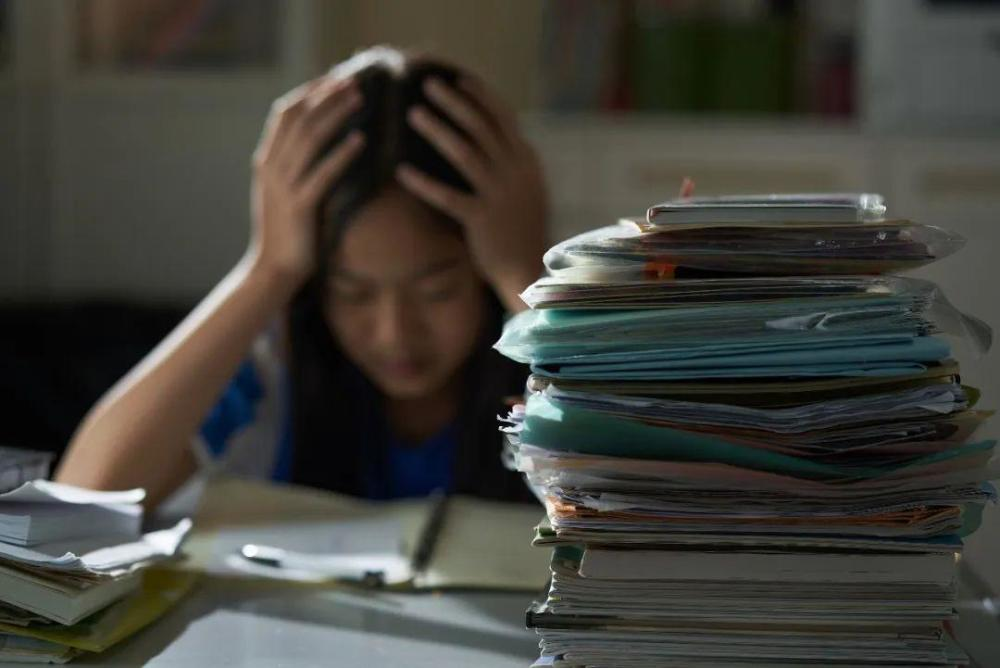

# 当孩子发出求救信号

近年来，尤其疫情三年中，青少年的心理健康问题愈发凸显。在2020年心理健康蓝皮书中，青少年有24.6%的抑郁检出率，并随着年级的增加而攀升，而在《中国儿童青少年精神障碍流行病学调查》中的数据显示，在6到16岁的在校学生当中，约有17.5%的孩子患有精神障碍。

作为一名心理咨询师，陈瑜在2022年接触到很多患有焦虑症、抑郁症、双相情感障碍等心理疾病的青少年，其中很多人采取过自残甚至自杀行为。她说，“做了这么久的家庭教育，2022年是青少年心理问题空前严重，数量最为集中的一年。”

陈瑜原本是一名记者，2016年开始转向做家庭教育。早在疫情出现的2020年，她就发现，封控给孩子的学习、亲子关系和同伴关系带来了一些新的问题和挑战。“如果父母和老师处理方式不当，孩子很容易被卷到漩涡里，心理状况越来越不好。”

在教育的舆论场，更多听到的都是家长和老师的说法，但孩子们的声量很小，他们很少有充分表达的机会。于是2020年6月，陈瑜开启了“少年发声”栏目，想听一听孩子的声音，“他们到底为什么生病？为什么大面积地休学？经历了怎样的痛楚和挣扎？”

三年下来，陈瑜一共接触了64个孩子，几乎涉及了中国绝大部分省份。通过这些访谈，她越来越感觉到，这一代孩子的生存状比成人想象中的更为艰难。很多时候，孩子的主体情感是不快乐的，会经常逼问自己一些终极问题：学习的意义是什么？人为什么活着？我是谁？我该去哪里？“这些问题在他们很小的年龄就被提出来了，可惜的是，成人世界没有给到他们很好的回应。”

在陈瑜看来，当下家长和孩子之间最大的分歧正在这里——家长试图把孩子打造成听话、用功、考高分的“机器”，而孩子则希望自己能被当作
“人”来对待。机器只讲功能，存在的价值是高效地完成任务。但人之所以为人，是因为有情绪、感受、独立意志和自我实现的需要，而后者正是这一代孩子格外看重的。

分歧两端，落差越大，造成的割裂和伤害越重。但陈瑜仍然提出积极的可能：家庭关系一旦得到修正，这些孩子能够复原，再往前走的力量也是无可比拟的。

以下根据陈瑜的讲述和书稿整理而成。

**文｜** 程静之

**编辑｜** 槐杨

**图｜** 视觉中国（除特殊标记外）

警报拉响

做了这么久的家庭教育，我感觉2022年是青少年问题空前严重、数量最为集中的一年，休学甚至变成了这一年的关键词。下半年开学一个月后，我们的线下工作坊迎来了12位求助的家长，很大一部分的开场白是，“我的孩子不去读书了。”

情况大多如此：孩子在经历了一个学期的网课后，厌学情绪比疫情刚开始的时候还要严重。九月开学后，学习问题集中爆发，到了10月期中检验，孩子出现考试焦虑，很多表现为各种身体症状，比如头疼、肚子疼、失眠。为了躲避老师和家长的双重压力，不少孩子就会选择不去考试，提出休学。

家长们不知道怎么办才好。一位爸爸说，矛盾出现是因为孩子到了青春期，封控在家里，成天打游戏。妈妈管不过来了，他才开始介入，最初是限制孩子打游戏的时间，后来干脆没收手机和iPad，甚至把家里搞成断网断电。亲子关系逐渐变得紧张，儿子一度要拉父母去派出所，把自己的身份改成孤儿，失控的时候，儿子甚至开始殴打妈妈。他不明白怎么会把儿子养成这样。

类似这样的孩子休学、亲子冲突问题，我在2020年就开始关注到了。那一年开学季，大到名牌大学的研究生，小到幼儿园小班的孩子，都有家长找我们做咨询。我也从上海精神卫生中心的朋友那儿了解到，上海市青少年精神科和心理咨询的门诊量也增多了，和教育局的老师聊起青少年心理问题，大家都在用“井喷”这个词。

上海精神卫生中心那位朋友说，自己平时做的是成人心理治疗，当时被调去支援青少年这个部门，因为量太大，原本的人手做不过来。即便充实了人力，还有很多青少年咨询预约不上，就导致卫生中心对面的一栋老商务楼里，盘踞了很多心理咨询师，他们不受监管，也不受任何资质审查，每天就在卫生中心门口发小卡片，提供给那些从外地来的家庭。

在这之前，青少年心理咨询量的确在逐年增加，但如此外溢的现象是很少见的。2020年之后，大家都有一种“警报拉响，海啸马上要来了”的感觉。

不得不说，青少年心理问题集中爆发，跟疫情封控引发的亲子矛盾有很大相关。就拿上海来说，2022年上半年，孩子一整个学期都上网课，大人也被困在家里两个多月，没法正常上班，对于亲子关系不好的家庭来说，父母孩子24小时处在同一空间，是一项巨大的考验。以前，孩子白天去上课，父母去上班，还有缓冲地带。但现在，家长看到孩子上课就在眼前，他们要抢菜，要担心会不会被拉去方舱……焦虑情绪叠加起来，就会对孩子的各种行为看不惯，成天大眼瞪小眼，距离已经近到让人窒息的地步。

一些家长情绪出现焦躁不安后，就会跟孩子不停地唠叨，好像孩子变好了，自己才能获得一些心安。但孩子对爸妈带有指责的车轱辘话不胜其烦，他们就会伸张边界感，想获得属于自己的独立空间。他们希望上网课的时候房门是关着的，爸爸妈妈需要敲门再进来。但在我们大多数的家庭里，边界感从来就不是那么清晰，家长似乎没有意识到孩子是一个独立的个体，随意伸手就安排了孩子的一切。

上网课期间，也有很多家长担心孩子管理不好电子产品，采取了强控制，有的不允许孩子关房门，有的在门前走来走去，探头探脑地监视，有的干脆把整个门锁都拆了，有的甚至给孩子的房间装监控。父母的这些行为，其实都是对孩子心理边界的重大侵犯，反而会对他们的学习造成干扰。最后，孩子走不出家门，又失去了房门，没有任何逃避的空间，会感到一种双重的禁锢。

我们工作坊的家长学员中就有一个比较夸张的例子：一家人住别墅，女儿睡在三层，双休日想睡个懒觉补补觉，但爸爸看不惯，有一天早上架了梯子，爬到三楼破窗而入，把女儿的被子掀开，强迫她起床。发展到后来，女儿和爸爸的关系就到了水火不容的地步。

还有一个男孩，他找到我时恰好是封控最严的时候，他问的第一句话就是，“有什么办法可以让我现在就离开家？”他说父亲是一个情绪特别暴躁的人，两人经常为了一些小事发生争执，封控期间，男孩每天躲在自己的房间里，甚至很少喝水，这样就可以不用出房门上厕所，为的就是减少跟爸爸碰面的次数。但爸爸情绪失控时，会砸他的房门，有一次他冲出去，两人扭打起来，甚至弄到报警的程度。

这样极端的例子不在少数。封控之下，一家人通常会生活在一种共生情绪里，坏情绪一旦产生，就会变成一个漩涡，把每个人都往下拽。很多时候，孩子成了承接家长情绪的垃圾桶，每天面对的都是父母指责的冷脸。原本，他们有100分的精力用来学习，现在要拿出50分甚至80分来对抗和父母的关系，就会变得更加无心学习。这是我认为发生在2022年一个突出且独有的问题。

_2021年5月，广州，一位高中生正在家中上网课_

名牌校服的展厅

包括休学的孩子在内，这一年来，找我倾诉的孩子，大多怀着深沉的心事和伤痛，有相当一部分患有焦虑症、抑郁症、厌食症、强迫症、双相情感障碍等常见的青少年心理疾病，其中不少人采取过自残甚至自杀行为。

孩子们很不容易，一方面受到疫情的影响，一方面处在一个内卷的时代，难免会被“学历至上”的价值观所捆绑。但我还是没法具体地了解，孩子们到底为什么生病？为什么大面积地休学？他们经历了怎样的痛楚和挣扎？

可能出乎很多人意料，现在患焦虑症、抑郁症的孩子，不是我们想象中成绩不好的孩子，反而是名牌学校的优等生。从精神科的临床一线反映过来，也是这个状态。一位朋友曾经带孩子去看精神科，之后给我发消息说，简直了，咨询室的走廊就像名牌校服的展厅一样，小孩几乎都来自于北上广深特别好的中学。

我遇到比较典型的案例是一个深圳女孩。2022年高考的前三天，她突然加我的微信，说想把自己十几年的学习经历找人聊一聊。她就读于全国知名的一所高中，她所在的理科重点班，原本一共四十几个学生，但到了高三这一年，有10个已经休学，没办法参加高考。

女孩说，自己一直生活在极端的环境中。从一年级开始，爸妈就告诉她不能浪费任何时间，除了春节和老师批改卷子那两天可以休息，其他的每一天，甚至每一个小时，都排满了学习任务。女孩从小就被灌输一个理念：必须争第一。每次考试结束，如果落后了，爸爸妈妈会拉着她一起复盘，制定下一阶段每门学科的学习计划，以追求真正意义上的完美。

一个普遍的问题是，当这些优等生进入名牌中学，处在强手如林的环境，不再轻易取得好成绩时，很容易就把自己贬低得一无是处。很多优等生来跟我做访谈，会形容自己是垃圾、白痴、笨蛋，尽管他们已经排在相同年龄段的前百分之几了，还是会产生失眠、焦虑、无法集中注意力听课等症状。这时候，如果爸爸妈妈再不理解，依然给他们施加压力，孩子很容易就崩溃了。

比如刚才提到的这个女孩，上到初中，就出现了病理性的强迫症，考试时，会反复检查考卷上的信息有没有写对。后来，她进入了高中理科重点班，就变成“自卷”，每天只睡4个多小时，凌晨四点起来看书，而凌晨五点，学校的中庭会坐好多人，都是孩子在那边挑灯看书，这似乎成了一种风气。

非常可惜，这些最学霸的孩子，三年高中下来，不少人的结果是休学。后来，这个女孩内分泌出现紊乱，她却觉得例假不来更好，这样就不会妨碍自己考试。可以想见，在她的世界里，分数已经凌驾于一切了。

我发现陷入这个状况的孩子，有一个普遍的共性，他们的父母大多数是70、80后的“考一代”，曾经通过读书改变阶层，从农村到城市落户下来。他们会形成一个教育理念，就是把孩子的价值和成绩完全划上等号，会不断地告诉孩子，读书就是为了将来去好学校，找到好工作，挣更多的钱，获得更高的社会地位。这样一来，孩子就被套在好成绩=好孩子=好未来的公式里，把取得好成绩拿来定位目前的人生。

同时，这些家长通常不容许自己的孩子失败，作为衡量标准的考试就显得非常重要，在每一次考试面前，孩子经常感到胆战心惊，一旦遇到失手的时候，就会产生自我怀疑和否定，信念很容易发生垮塌。

所以，当上面那名女孩意识到这一点之后，说自己进入大学，要想办法自救，把自己的强迫症治好。我当时听了非常心痛，就觉得一个孩子长到18岁，是带着一身伤痛的。即便她最后考进了理想的学校，我也不觉得那是教育的成功。

_图源《极限17滑魂》_

这一年采访中，我的另一个发现是，孩子发生心理问题越来越低龄化。之前可能在初中出现的问题，现在是小学阶段就出现了，孩子表现出抽动症或者强迫行为，比如忍不住眨眼睛、耸肩膀、扭脖子、脸部做怪异的表情、反复整理书包、检查门有没有关好……

我采访过好几个强迫症孩子，都过得特别痛苦。其中有一个孩子说，每次上完课之后，她需要花两个小时，在脑子里把老师的语气、语调、知识点全部回想一遍，渐渐养成强迫行为，发展到后来，她上厕所洗手需要花一个多小时，迈步子要先思考迈左脚还是右脚，病症已经影响到正常的学习和生活。

还有一个患有学习障碍的孩子，只有7岁，在电话里，她常常表现得像大人一样，用力地唉声叹气，给人一种“我好难啊”的感觉。每天，她做完学校作业加上课外补习作业，已经到晚上11点，最苦恼的是没有玩的时间。

越来越多的孩子早早表现出厌学的情绪，在教育的马拉松赛道中，他们都起跑得太早，幼儿园时日程表就被家长排满各种培训班。这就相当于孩子消化系统还没有建立起来，家长就天天给喂红烧肉，孩子真的是要厌食的。最后，孩子以出现各种身心疾病作为唤醒家长的代价，但这个教训实在来得太不值得。

其实，很多孩子在生病之后，也曾试图让父母改变，但在所有努力都无法见效之后，他们也就绝望了。有一个男孩，最初找到我的时候是用文字交流，让我震惊的是，他提及自己的爸爸妈妈，用的居然是指代动物的“它”，可见他已经不把爸妈当人对待了。

真的不要忽视当今的小孩子，他们的痛苦和绝望程度或许已经超乎了大人的想象。

被当作 “人”来对待

穿梭于孩子和成年人之间，我越来越感觉到，今天的家长和孩子最大的分歧，在于家长试图把孩子打造成听话、用功、考高分的“机器”，而孩子则希望自己能被当作
“人”来对待。这中间的落差越大，撕裂程度就会越严重。

人和机器的区别是什么？机器只讲功能，存在的价值是高效地完成任务。但人之所以为人，是因为有情绪、感受、独立意志和自我实现的需要，而后者正是这一代孩子格外看重的。

一个孩子曾对我说，自己每回都考年级第一名，但是一点都开心不起来，因为她的成长过程全是在刷题，以至于没有一个朋友。跟父母聊起，父母也只是说，去学校就是为了学习，不用为朋友的事情受干扰。孩子就觉得，父母根本没有理解她，只把她当成一个刷题的机器。每一次，遇到需要跟父母商量的事情，最后都会变成父母做决定，并由她去执行这个决定。

还有一个孩子说，觉得自己像机器一样被冻住了，神经变得紧绷又麻木，干什么都不高兴。她只好选择让自己吃很多东西，吃到肚子痛，让大脑得到痛的反馈，才能感受到自己还作为一个人而活着。

事实上，在这些孩子生病之前，他们曾经多次给家长发出过求救信号，但都被家长忽视了。

信号其实很普通。有的孩子用的是语言，直接跟家长表述，自己动不动就想哭，或者经常睡不着；有的孩子用的是行动，把自己划伤之后，向父母要创口贴，目的是展现自己受伤了。但在大人眼里，小孩的世界很简单，不会有什么心理问题，这都变成了孩子的“情绪”。

_电视剧《小欢喜》中，高中生乔英子患上抑郁症，常常失眠。图源《小欢喜》_

采访的过程中，我遇到过一个患哮喘病的孩子，他的爸爸是一个“非常理工科”
的人，在家庭里只处理事情，没有爱的表达，跟妻子的关系也不好，这使得家里变得像冰窖一样，让孩子感受不到温暖。

初一初二的时候，孩子成绩有所下降，爸妈关注的全部是成绩，而孩子作为一个“人”
本身，却没有被关注到。有一次父母争吵，他一时冲动一口气吞下12粒哮喘药，被救护车送去医院洗胃。哪怕是这样，家长也没有想着坐下来跟孩子谈一谈，只觉得他在闹情绪。

其实，有一部分哮喘病是有心理因素的，它本身释放一种信号，表达对爱和关注的渴望。但在这个案例中，父母多次的疏忽，让孩子感受不到爱的实感。在情绪特别薄弱的时候，这个孩子身边最亲近的是一条毛毯，只能抱着它一直哭，但他也知道，毛毯是一个非生命的东西，不能给他作出任何回应。

这些孩子带着心理疾病去上学，要等到实在撑不住，提出休学了，家长才意识到，孩子确实是病了，来找我们做咨询，开口问的都是“怎么办”，而不是“为什么”。很多家长都只想抓一味速效药，希望我们快点搞定孩子的各种情绪和行为问题，但是仔细问下来，你会发现，问题的根源往往不在孩子，反而是在家长身上，或者在亲子沟通的模式上。

所谓“爸妈生病，孩子吃药”，就是这些家长还没有意识到，孩子生病是因为家长先病了。有些家长自我情绪的管理能力非常差，动不动就歇斯底里；有些家长自己原生家庭的伤害没有清理干净，又传递给下一代；有些家长认知方面很顽固，完全不认为自己有问题，一味责怪孩子。在这些家庭里，如果旧的观念和模式没有被打破重建，孩子要想好起来，就很困难了。

采访过程中，我还接触到一些三四线城市的孩子，会发现他们得到理解是更加困难的。一个孩子本来是抑郁症，因为父母没有就医的意识，后来发展到双向情感障碍。诊断出来后，孩子的父母有病耻感，让她千万不要跟任何人说，孩子实在熬不住，告诉了自己的好朋友。没想到朋友跟她说，你知道吗，在我们村里，“像你这种人”是要被绑起来的。

父母不理解，三四线城市精神疾病治疗的资源也薄弱，没有什么医院或者专业人士可以帮到他们。有一个女孩告诉我，她会把早饭的钱省下来，积累着去买一些让自己开心一点的药，她去药店问过了，好贵，要六十几块钱，也不知道买的是什么药，就在那里自己吃，这个是我非常担心的。

最后，当这些孩子得不到任何支持，就有一种走投无路的感觉，有的孩子会到网络上寻找回应，可能进入一些群，分享自残的照片，刚进来的人不知道怎么下手，会有老手去教他，导致自残的程度越来越深甚至上瘾；或者在各种群聊里寻找“亲人”，认一些比自己年纪大很多的“哥哥姐姐”；还有的孩子会通过打游戏，钻到虚拟空间里，以回避现实世界的一些痛苦。

在不理解的家长看来，这些孩子都在躺平或者摆烂，但其实没有一个孩子在这种状态里是快乐的。就像一个孩子曾经说过，“如果不是真的碰到了难题，谁愿意摆烂？”
我听了非常感慨，孩子们是想上进的，只是他们遇到了凭借自己的能力无法解决的难题了，才会出现这么多的状况，家长非但不给予支持，还一味指责他们的不努力，这正是孩子最大的痛苦所在。

我一直跟家长说，你到底是站在问题的一边去打败孩子，还是站在孩子这一边去打败问题？很多爸爸妈妈的立场就是站在孩子的正对面，去指责孩子，其实家长最应该做的，是和孩子肩并肩站在一起。

流水线外的水果罐头

在对各学龄段的孩子深度采访后，我发现一个规律是：有成长动力的孩子，背后通常站着一对支持型的父母——他们有稳定的价值观，不随波逐流，在养育孩子的过程中，能为孩子注入爱和安全感。他们欣赏孩子的特质，也善于挖掘孩子的潜能，在孩子遇到困难时，能给予最温暖的关切和最有力的托举。

从这种家庭走出来的孩子，会充满发现自我、探索世界的勇气和能量。反映在我接触的64名孩子中，会明显地分出两个极端，一类孩子眼里黯淡无光，还有一类孩子从小见多识广。

每跟一个孩子接触，我最在意就是他的眼里还有没有光芒。那些被学习绑架的孩子，世界只剩下题目，刷得两眼无光，整个人非常贫瘠。而那些带着问题来求索的孩子，就像一口丰富的井，越往下走，越让你惊叹他们的丰富和深刻。

有的孩子十来岁，就研究了阿尔弗雷德·阿德勒的心理学著作，读过加缪的《局外人》；有的数学只考40多分，但认为自己是一个精彩的人，已经在探索戏剧和表演的魅力；有的会谈到人性和哲学问题，经常思考的不是成绩，而是如何成为一个更完整的人。所以，真的不能小看孩子，他们让我感到惊讶，10来岁就有了比成年人还厉害的思考力。

我越来越觉得，2005年后的孩子是完全不一样的一代人，他们是真正在互联网时代，生下来就用一根小手指去滑屏的孩子。他们的自我意识觉醒得更早，如果发现一套游戏的荒谬性，很容易发生的状况是，“我干脆不玩了”
。

比如疫情中，有孩子就对现在的教育提出质疑，到底是为了学习还是为了考试？这个孩子曾经看过一句话，“教育的本质是一棵树摇动另一棵树，一朵云推动另一朵云，一个灵魂唤醒另一个灵魂”
。但在现实中，他感受到的教育显然不是这样，很多同学因为刷题变得无趣，他自己全力以赴，也只是为了让成绩单上的数字看上去更好一点，这样做让他觉得非常愚蠢。

这个孩子还说，如果有什么东西值得他学习，应该是一种新的思维方式，或者一项全新的内容，让他能展开好奇心，去探索未知的事物。

还有一些学习动力非常强的孩子，已经不想做教育流水线上的水果罐头，被压制成统一的标准形状。我接触过一个名校高中生，高一时对鲁迅的研究已经非常深入，除了看《鲁迅全集》，还把中日和西方一些研究鲁迅的书籍拿来看。这名孩子的痛苦在于，听语文老师上课，他会忍不住想去反驳，但老师说教学进度来不及，不允许他分享，这种状况就让他非常不满意。

后来，这个孩子主动选择休学一年。停下来的时间里，他看了100本书，还结识了一位知乎答主，两人合作写了一本关于三国史的书，他参与了其中10万字的写作。

这是我见过学习动力极强的孩子，教材自己找，老师也是自己找，不再一天到晚被刷题包围，而是有自己的思想和求知路径。

所以，疫情也有双面性，网课给一部分孩子创造了脱离学校的机会，让教育样态呈现出多元性。以前，这部分孩子想离校，还得专门去请假，现在只要不进会议室就好了。这也让我感觉到，三年疫情，除了给孩子的学习、亲子关系带来一些困扰，对当下的教育模式也提出了更大的挑战，应试教育的一些弊端更加明显地暴露出来。

以前，老师在学校里上课，孩子看到的是活生生的人，双方能进行互动。但教育被转移到线上，有些孩子连摄像头都不高兴开，教育的无趣就被放大了。互联网时代，知识点弄不透的时候，孩子完全可以通过搜索的方式自学，老师不再是唯一的知识输出端。如何把孩子再吸引回课堂，实际上对老师也提出了更高的要求。

当然，这也是老师感到慌张的地方，当远程的威慑力减弱之后，他们的一些动作会发生变形。我从一个江苏姑娘那儿了解到，每天的晚自习时间，她的班主任会像“老大哥”一样，要求孩子打开摄像头，并且要对准自己的手，让他能看见每一双手都在写字。如果发现谁不专心，老师会立马把话筒打开，点出同学的名字，再把他踢出会议室。

其实，这都是老师虚弱感的表现，他们希望重新找一个方式对孩子进行掌控，但这只是把孩子锁在教育模式里，吸附性是很差的。

在网络资源丰富的当下，这一代孩子学习很多靠的是兴趣。我采访过一个武汉的小学生，特别典型，他从小喜欢看历史书，跟我深入聊了很久的汉武帝，对历史也有自己的评价，之后，再叫他去考这一段历史，其实他不需要背就已经记住了。

因而，这一代孩子已经形成了自己独特的地方，就是没办法再以功利化的教育目标去驱动他们。当教育者再告诉他们，读书是为了改变阶层，改变命运，他们会质疑，爸爸妈妈学历很高，职位也很高，到了四十岁左右，回家以后要么刷手机，要么抱怨工作不顺心，这种生活状态不是他们想要的。

当这些孩子不再被单一的价值观挟持，见识过更广阔的知识世界，未来是可能走得更高远的。比如我接触到的一个孩子，高中就去贵州当过义工，创建了自己的书法公众号，还是B站的视频UP主，通过做游戏教程，已经在网上结交了许多国家的朋友。

这个时代的小孩拥有了更多的可能性。每个孩子都是不一样的生命个体，如果孩子的擅长不在学术，干嘛非要走那条道？他们是一片热带雨林里的万千物种，是广大的分母，如果孩子的特长能够充分发挥，未来可以凭借自己的优势在社会上立足，找到自己的生存空间，那就是最好的成长。

_福建省南平市一中武夷校区初中部，心理咨询老师正在给同学们上团队心理辅导课。_

透出光亮

现在，疫情已经全面放开，最后一轮网课也结束了，回过头再看当初的问题，有的彻底成为了过去，有的或许会给孩子造成长远的影响。

比如封控期间，那些给孩子房间装监控的家庭，亲子的相处方式和信任关系已经改变，这会成为家庭里一个潜藏的雷点，未来随时会引爆。

一个星期后，新的学期开始，孩子们即将正常去学校，可能会立马面临测试、分班问题，又要剑拔弩张地去竞争。这对部分孩子会造成新的伤害，因为他们脱离考试太久，上来就啃硬骨头，会产生畏惧心理，引起新一轮的厌学或休学状况。

如今，休学的孩子想要重返校园，需要的时间变得越来越长，难度也越来越高，原因在于，孩子对自己的期待依然太高，总是觉得自己没有准备好，没有信心取得好成绩，休学历程就会被一拖再拖，我遇到两三年的都有。总体来说，在短期内，我觉得有些孩子没办法一下子回到正常的轨道上，因为疫情造成的余波还在，有的孩子依然是一个低能量的状态。

最近的一个受访者是一个河北的女孩，患有抑郁症，因为害怕即将到来的开学，产生强烈的自杀念头。在刚过去大年三十的晚上，这个女孩给我发消息，说自己在一个衡水模式的学校读书，受不了学校的军事化管理，已经快读不下去了，但父母完全不理解，依然想让她维持好成绩。向好的一面是，女孩在做完危机干预后，自杀意念已经从8分降到了3分，爸爸也意识到问题的严重性，愿意跟她一起做咨询。

对于这个女孩来说，爸爸的觉醒是非常重要的。很多情况下，当父母窒息的教育方式开始松动，光亮得以一点点地透进来，许多孩子的修复力和自愈力是极强的，他们会像枝杈一样伸展开来，展现出生命本该具有的旺盛和活力。

实际上，孩子从第一步躺倒，到后面完全走出来，时间长短很多时候取决于家长。家长如果越着急，越催逼，孩子走出来越慢。家长如果改变越快，能够支持到孩子，孩子走出来的时间就越短。

最初参加线下工作坊的那个爸爸，每次上完课，醒悟得很快，行动力也强。他跟妻子很快达成一致，就是对孩子表达信任，把管理时间的权利交还给孩子本身。孩子刚获自由的时候，通宵打了一两天游戏，但在这之后，他意识到自己真正获得了掌控权，开始对自己负责，每天按时完成作业，打游戏的时间变得越来越短了。

在课程结业的时候，这个爸爸跟孩子已经不吵了，但是聊不起来，他希望跟孩子建立一个更广阔的对话空间，愿意寒假陪孩子一起打游戏。显然，他们的家庭关系已经重启，这特别不容易，但也能看出来，家庭关系一旦得到修正，这些孩子能够复原，再往前走的力量也是无可比拟的。

其实，很多孩子看到爸爸妈妈的改变之后，都特别容易原谅他们。让我特别动容的是一个八年级姑娘的案例，妈妈原来会给她排满功课，一旦发现她的成绩下降，是会拿鞋拔子打的。因为学习压力太大，这个姑娘五年级开始失眠，到八年级就休学了。

后来，女孩的妈妈意识到自己有问题，开始学习家庭教育的相关知识，理念发生很大的转变。她开始跟孩子一起打游戏，开车时播放的是孩子的歌单，母女变得很有话聊。现在，孩子虽然还没有去上学，但跟妈妈的关系已经融洽很多。

采访到最后，我让女孩评价对妈妈的满意度，满分是10分，会打多少分？没想到，她打的是满分。我又问女孩，如果让她跟妈妈说一句话，会想说什么。她想了半天，最后说了一句，“可能就会——谢谢妈妈。”

_图源《小欢喜》_

