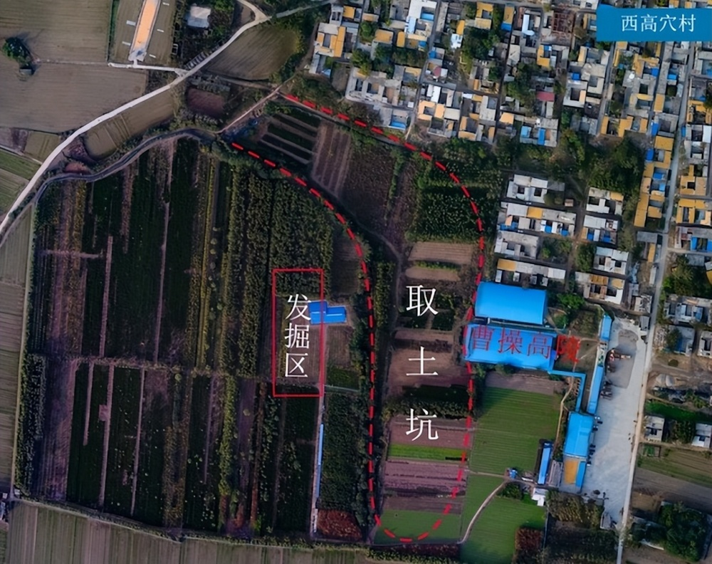
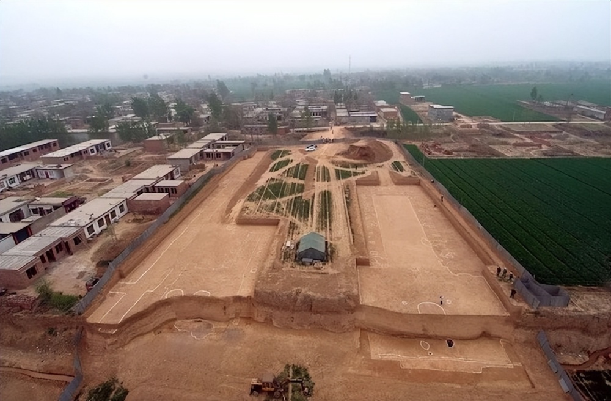
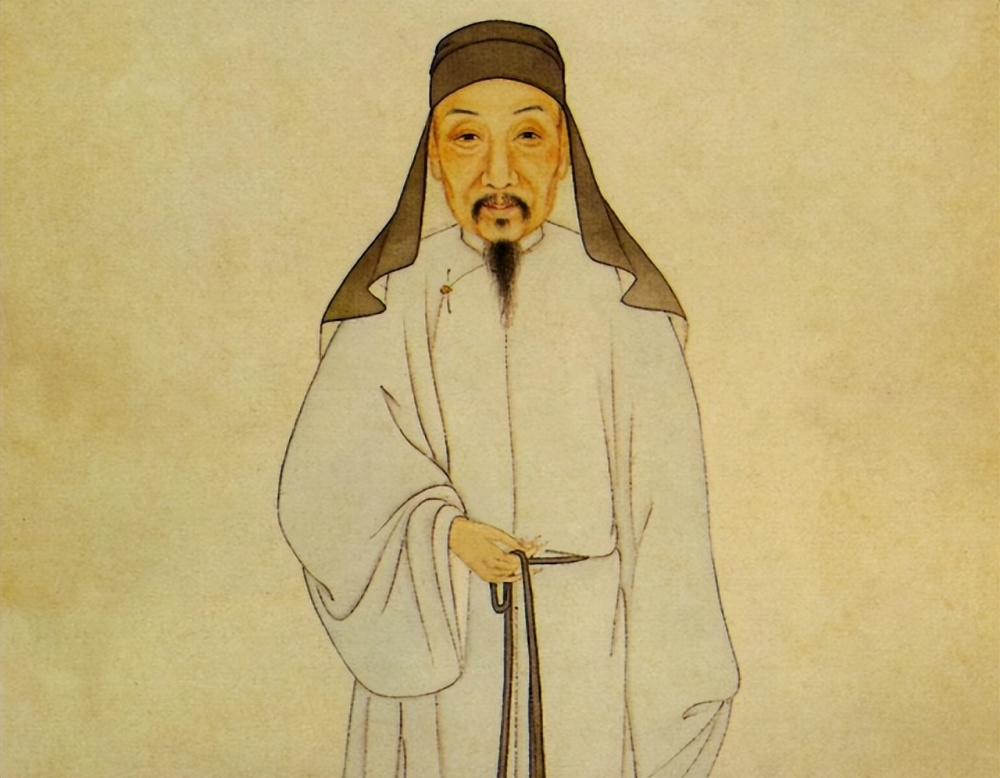
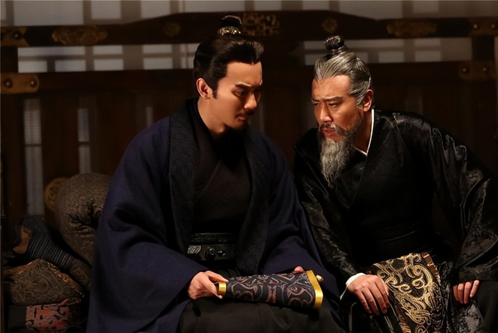
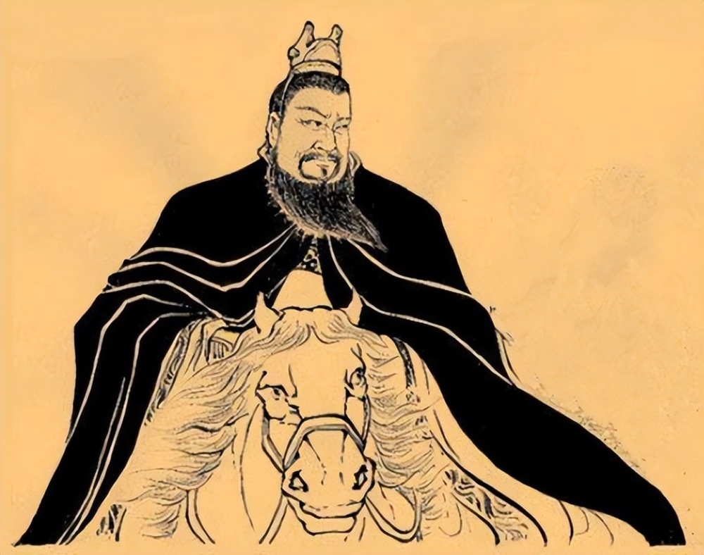
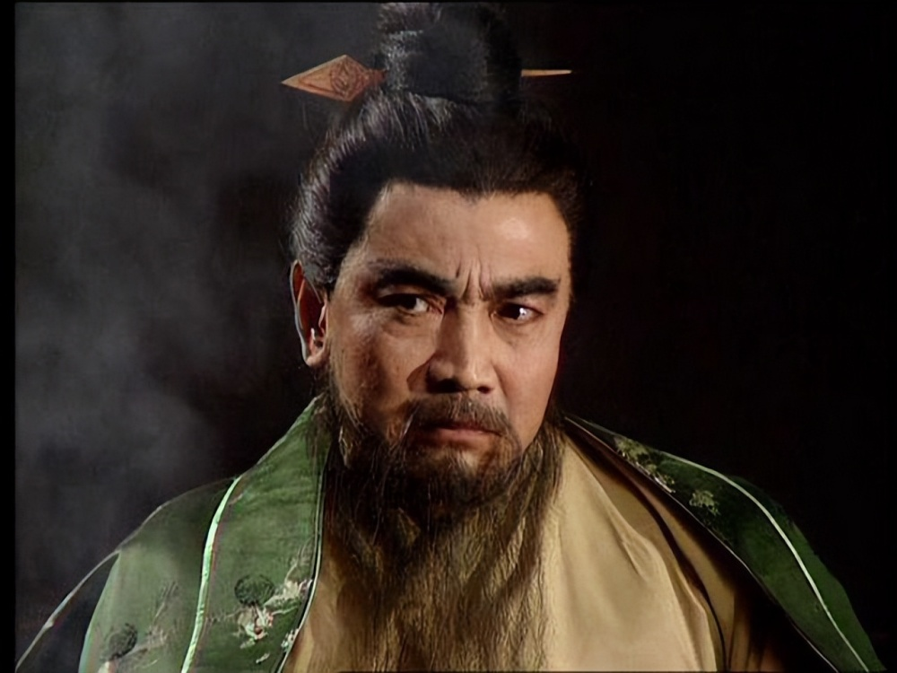
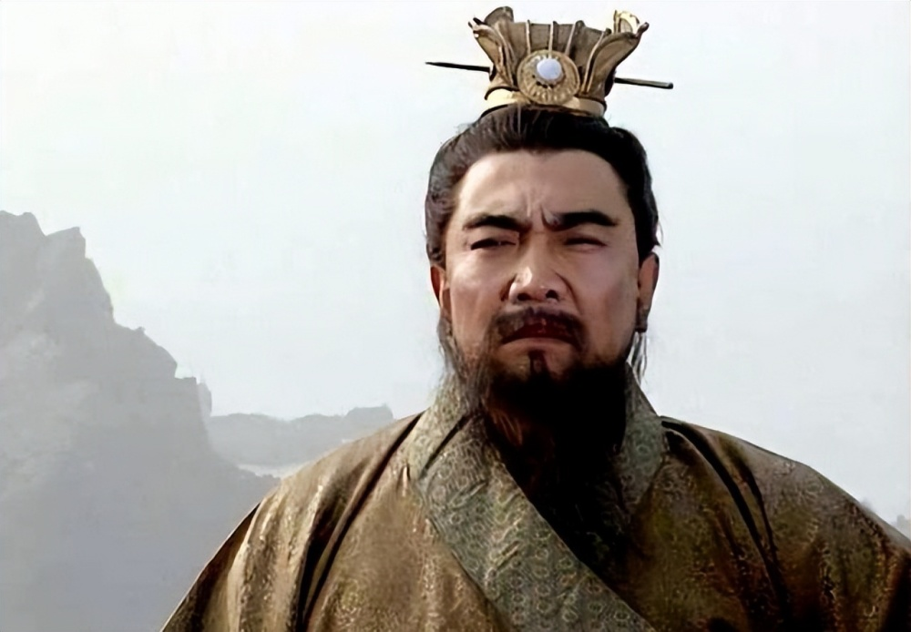
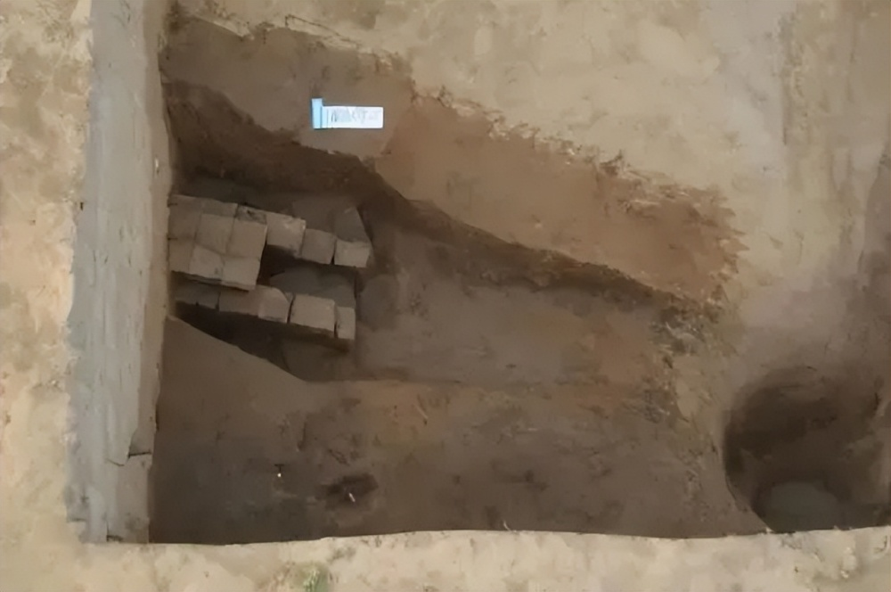
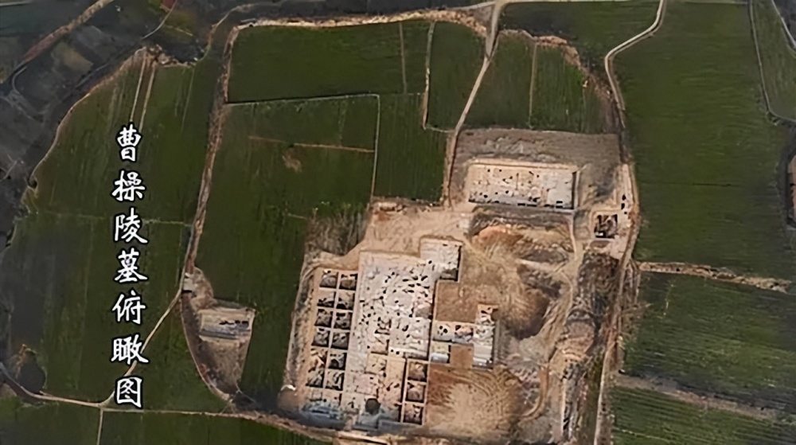

# 曹操高陵有新发现！赵匡胤曾派人守墓，“七十二疑冢”纯属误传

2023年1月30日，河南省文物考古研究院发布关于曹操高陵的最新考古发掘成果。

在陵园西部约200米位置，考古人员发现一条南北向长沟遗迹和一片废弃建筑遗迹。

经过数年反复调研，结合相关史料，工作人员认为，在北宋初年至元朝中期，曹操高陵西部有人居住，或存在大型娱乐设施。

而在曹操高陵西侧发现的这处建筑遗迹，或许是北宋赵匡胤设置的守陵户。

**一、不封不树，曹操高陵发掘始末**

建安二十三年（218年）六月，曹操明令 **：“** 古之葬者，必居瘠薄之地。其规西门豹祠西原上为寿陵，因高为基，不封不树 **。”**

且曹操生前亲自确定自己陵墓的位置，在邺城西门豹祠之西的原上。（大墓位于河南省安阳县安丰乡西高穴村南）

邺城的东部属华北平原，土地肥沃；西部靠太行山的漳河台地，属于曹操所说的“瘠薄之地”。

这里地势较高，满足曹操所提出的“ **广为兆域，使足相容** ”，预留足够大的空间。

建安二十五年正月，一代枭雄曹操撒手人寰。从建安二十三年六月开始动工，他的陵墓修筑时间只有一年半，可谓轻死薄葬。

曹操死后，曹丕以魏太子的身份守邺，未在身边。贾逵、司马懿等主持丧事，群臣商议，尊曹操“ **谥曰武王（魏武王），二月丁卯，葬高陵** ”。

按照曹操生前构想，自己的陵墓曰“寿陵”。曹操安葬之后，陵名正式之称为“高陵”。由于高陵位于邺城之西，又俗称之为“西陵”。

而后司马取代曹氏，南北朝时，各地烽火四起，达官贵人之墓皆遭盗掘，曹操的高陵也未能幸免。

2008年12月，经报请国家文物局批准，河南省文物局组织河南省文物考古研究所开始对墓葬进行抢救性考古发掘。

2009年12月27日，河南省文物局对外发布了曹操高陵重大考古发现。

经权威考古学家和历史学家根据考古资料现场考证研究，认定这座东汉大墓为文献中记载的魏武王曹操高陵。

“魏武王常所用挌虎大戟”“魏武王常所用挌虎大刀”等铭文，包括追缴该墓被盗出土的一件石枕上，刻有“魏武王常所用慰项石”铭文。

这些出土文字材料，成为考古专家研究确定墓主身份最重要的依据。

**二、高陵西侧最新发现，与曹操人物形象转变有密切关联**

按照曹操高陵此次最新发现来看，陵园西侧的这一处遗迹实际使用时间为宋金元三个不同年代。

虽然建筑功能发生多次改变，但不难发现，这对北宋开国皇帝赵匡胤为曹操高陵单独设置“守灵户”提供了重要佐证。

《挥麈录》记载 **：祖宗（宋太祖）朝重先代陵寝，每下诏申樵采之禁，至于再三。置守冢户……魏武帝葬高陵，在邺县西。**

顾炎武在《日知录》节引过这条材料，同时把时间确定于宋太祖乾德四年，即公元966年。

宋初承袭唐制，当时社会上普遍对曹操、曹丕有着较高的评价。

因为唐朝（包括隋朝）是在扫平割据势力的基础上建立的大一统王朝，“逶迤颓靡、风雅不作”的齐梁之风不符合时代要求。

反观曹氏父子和同时期的建安作家，慷慨悲凉的文风与建安风骨，对初唐文化产生重大影响。

唐太宗李世民对曹操评价较高，称他 **“若无多疑猜人之性，几为完人也”。**

就连曹丕都沾了父亲的光，被当时社会推崇。一些唐代大臣在劝谏太子的诗文中，总会提起曹丕，赞扬他的自我砥砺、好学不倦。

**可见，至少在隋唐二朝，曹操、曹丕两父子完全成了正面典型人物，同样反映了当时的政治气候。**

但到了北宋时期，尤其是北宋中后期，“尊刘抑曹”的风气渐盛。北宋建立后，赵匡胤用“杯酒释兵权”的办法解除武将的军权。同时，重用文士制约军人，为封建集权制度的巩固创立新法。

此时的赵匡胤，对于曹操、曹丕无甚太多缅怀，只是出于皇威，才派专人对历史上，且还能找到确切地点的诸位前朝皇陵进行基本管理。

北宋中后期，贬曹的风气渐盛。欧阳修曾说 **：“呜呼 汉魏之事，读其书者可为之流涕也，岂以后世为可欺欤？不然.不知耻者无所不为乎！”**

苏轼虽赞曹操“一世之雄”，却又在《魏武帝论》《诸葛亮论》中说他 **“因衰乘危，得逞其奸。”**

除了欧阳修与苏轼，就连司马光编撰的《资治通鉴》在解释以曹魏纪年继汉的原因时说 **：“以纪诸国之事，非尊此而卑彼，有正闰之辨也。”**

**这就表明，在当时，民间反曹风相当盛行。**

随着统治者思想观念的转变，与程朱理学的兴盛，曹操父子的形象彻底“由盛转衰”。

北宋灭亡后，南宋朝廷偏安江南一隅，出于对金、辽的厌恶，此时的文人干脆将曹操称作“当今女真、蒙古胡虏也”。

以蜀为正统的观念在南宋逐步得到认可和强化，曹操的奸臣形象基本定型。

朱熹作为程朱理学的集大成者，讥讽曹操 **：“他也是做得个贼起，不惟窃国之柄和圣人之法也窃了。”**

经过朱圣人这么一定论，南宋之后的世人皆认可“蜀汉为中华正统”的观点。

南宋末年，萧常因父亲不满《三国志》以魏为正统，乃以蜀为正统撰《续后汉书》。请人作序时曰 **：“揭孔明之盛心，祛曹丕之鬼蜮。”**

蒙元杂剧也痛骂曹操谋反，意在指责汉人不该反蒙古。

后世的明清两朝，更是确定了曹操的奸臣形象。其中又包括朝廷、皇帝对曹操、曹丕父子的形象反转。

还有民间艺人出于对普罗大众心理的揣摩，说一些关于东汉末年的故事时，总是把刘备、诸葛亮比作正统贤人，曹操、曹丕、司马懿、司马昭都是乱臣贼子。

成书于明朝中后期的四大名著之一的《三国演义》，其作者罗贯中就受到当时社会对于曹操、曹丕的评价。所以在小说里，我们能很明显地看到“尊刘抑曹”的现象。

到了近代，以毛泽东主席、鲁迅、郭沫若、翦伯赞等文学家，纷纷试图为曹操“平反”，还原其真实的历史人物形象。

但时至今日，大家还是无法接受曹操的真实形象（偏向正面），其观念仍然掺杂着艺术的成分。

**三、曹操七十二疑冢的说法，最早出自宋代**

前文说过，北宋初年，赵匡胤为曹操高陵设“守陵户”，表明这位宋朝开国皇帝还不至于那么厌恶曹操。

以北宋为界，南宋有了曹操疑冢的传说，文字记载最早出自《鹤林玉露》卷三。

南宋著名诗人范成大说过 **：“一棺何用冢如林，谁复如公负此心。”**

南方人的范成大对北方历史地理知之不多，在奉命使金路过邺时，误信曹操疑冢传说，故写下这首模棱两可的诗，误导了后人。

自南宋以后，曹操疑冢的传说简直成为人们茶余饭后的谈资，传播较广，特别在明清小说中更是描绘生动、活灵活现。

例如罗贯中的《三国演义》、蒲松龄的《聊斋志异》，甚至一些严肃的史学著作，如顾祖禹的《读史方舆纪要》皆提出“七十二疑冢”的说法。

其实，“七十二疑冢”今已被考古证明为北齐墓葬群，与曹操高陵没有任何关联。这或许也印证了那句话：造谣一张嘴，辟谣跑断腿。

关于曹操“七十二疑冢”的错误论点流传了近两千年，直至今日，考古专家通过实际考古发现成果，才驳斥了历史上那些文人墨客的相关错误说法。

**当年范成大若不是被“曹操疑冢”的传说先入为主，稍微动脑想一想，宋太祖赵匡胤已经明确在曹操高陵设置守冢户。一个皇帝，难道会不分青红皂白就派专人去守灵吗？**

甚至关于曹操高陵的地点，南北两宋的记载都有了明显差别。

北宋以前记载明确，就是如今的河南省安阳县，南宋以后则流行疑冢之说。

这下好了，有了曹操高陵西侧这处北宋初年建筑遗迹的发掘，再结合相关史料，更确切了河南安阳就是曹操高陵。

曹操高陵与之陪陵的发现，具有极其重要的意义。这一重大发现，印证了文献中对曹操高陵的位置、谥号，包括他所倡导的薄葬制度等有关记载。

也让我们获取了许多历史信息，为曹操及汉魏历史的研究开启新的篇章。

曹操是中国历史上著名的政治家、军事家、文学家。关于他是忠是奸，是好是坏，不能片面地通过一两本小说和影视作品，便妄下论断。

参考文献：

[1]陈长琦,蒋波.曹操高陵的考察与思考[J].华南师范大学学报(社会科学版),2012(01):100-104+160

