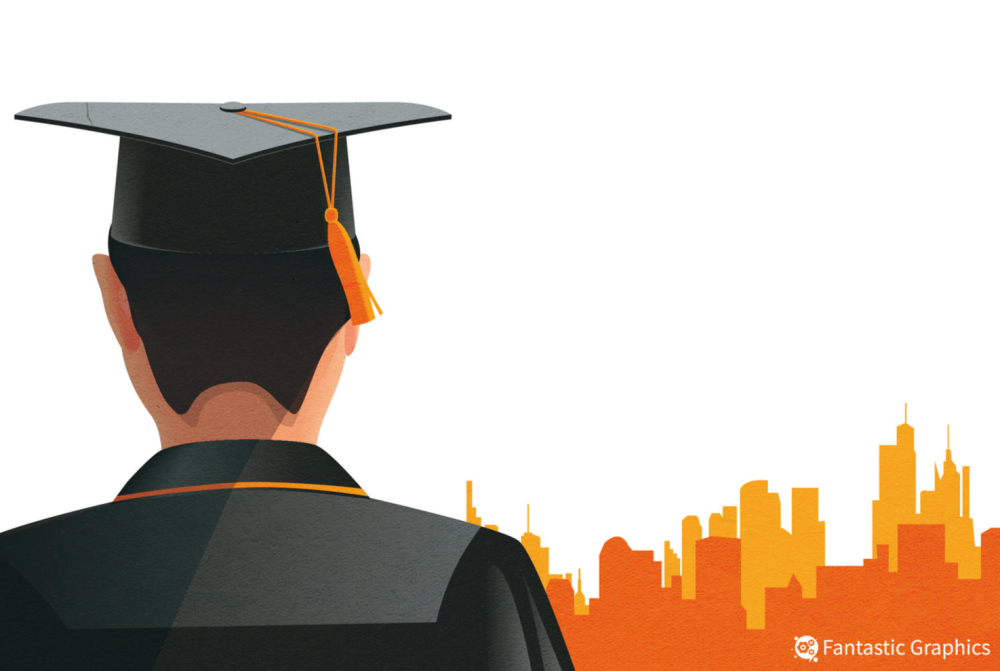
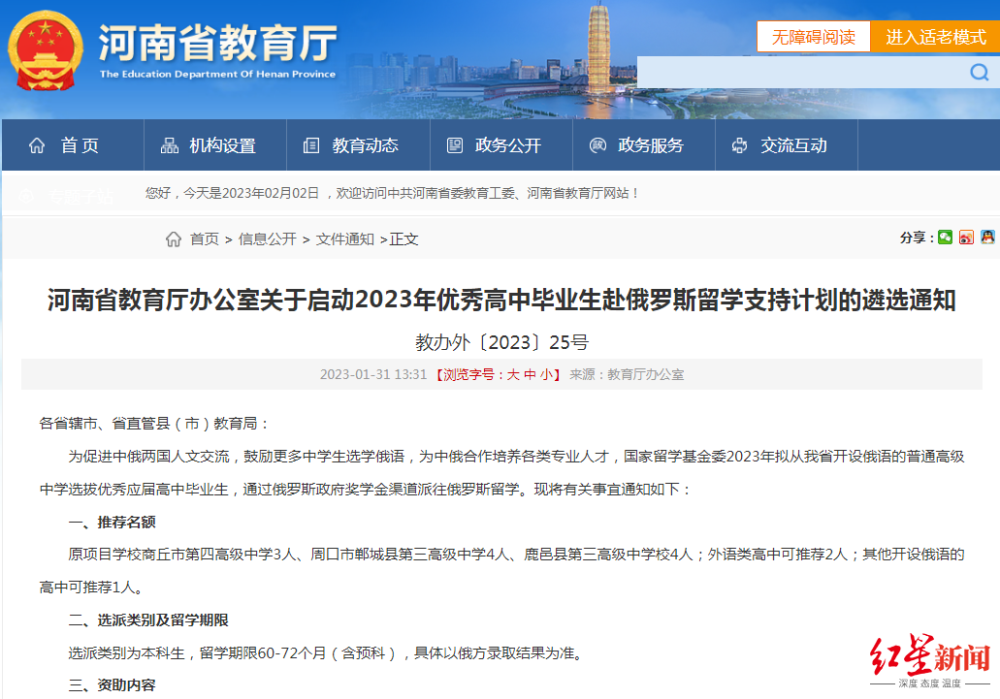

# 河南优秀高中毕业生公费赴俄留学 相关高中：2015年就有公费赴俄留学项目

2月1日，河南省教育厅官方公众号发布《河南启动2023优秀高中毕业生赴俄罗斯留学支持计划》引发关注。其中，留学人员享受俄方提供的政府奖学金（俄方免学费），国家留学基金委为留学人员提供互换奖学金出国留学人员补贴及一次往返国际旅费，被称为“俄方免学费，国家补旅费”。

红星新闻记者致电河南省教育厅对外合作与交流处，一位工作人员表示，通过奖学金渠道支持优秀高中毕业生赴俄罗斯留学早已有之，并非新事。

在赴俄留学之外，国家留学基金委也设置有赴日韩公费留学项目。国家留学网官网显示，2023年，国家留学基金委将从国内高校日语、日本文化专业在校生中选派具有较大发展潜力的优秀人才赴日本学习，日方免收学费，并提供在日留学期限内的奖学金及一次往返国际旅费。与之类似的“韩国互换奖学金”项目中，留学生留学期间享受韩方提供的奖学金，国家留学基金提供留学人员补贴及一次往返国际旅费。

_资料图片 图据IC photo_

红星新闻记者检索河南省教育厅官网发现，2016年4月，官网就发布过《关于遴选2016年优秀高中毕业生赴俄罗斯留学支持计划留学候选人的通知》，那时，留学仅面向商丘市第四高级中学、鹿邑县第三高级中学、郸城县第三高级中学三所学校学习俄语的应届高中毕业生。2023年的留学支持计划中，这一范围扩大至商丘市第四高级中学、周口市郸城县第三高级中学、鹿邑县第三高级中学校、外语类高中和其他开设俄语的高中。

相关通知称，留学支持计划的目的是促进中俄两国人文交流，为中俄合作培养各类专业人才。因此，国家留学基金委2023年拟从河南省开设俄语的普通高级中学选拔优秀应届高中毕业生，通过俄罗斯政府奖学金渠道派往俄罗斯留学。

**相关高中老师：**

**成绩不是推荐的最重要标准，“主要看意愿”**

商丘市第四高级中学负责公费赴俄留学的申老师告诉红星新闻记者，多年来，国家留学基金委的优秀俄语生选拔基本是三个条件，第一必须是学习俄语的应届毕业生，第二是得达到一本分数线，第三是年满18岁。2006年，俄语教学正式入驻商丘市第四高级中学，2007年开始有俄语高考生，2015年起便开始有公费赴俄留学项目。

_河南省教育厅官网截图_

据河南省教育厅官网日前发布的《河南省教育厅办公室关于启动2023年优秀高中毕业生赴俄罗斯留学支持计划的遴选通知》，本次选拔要求候选人满足4个条件：

具有中国国籍、热爱社会主义祖国，具有良好的政治素质，无违法违纪记录，有学成回国为祖国建设服务的事业心和责任感；

国内普通高级中学正式注册的应届毕业生，品学兼优，身心健康。外语为俄语且成绩优秀；

被推荐人须参加高考，原则上高考成绩需达到河南省本科第一批次录取分数线（若高考成绩未达到一本分数线，但俄语成绩达到120分或以上（总分为150分），亦可视为合格）；

被推荐人年满18周岁，具备良好的心理素质、独立生活能力和良好的交往沟通能力。

申老师告诉红星新闻记者，以去年为例，能达到一本线的以俄语为外语的学生大概有100多人，但是考试成绩不是推荐候选的最重要标准，“主要是看留学意愿”，最终是在十多个有赴俄留学意愿又达到标准的学生中，选择3~4个候选人进行推荐。

申老师表示，大部分公费赴俄留学的学生都选择了沿着本硕博的方向继续深造，虽然2015年开始就有公费留学项目，早年去公费留学的学生已经本科毕业，“但没听说谁本科毕业就回来了，都在继续深造。”

据介绍，商丘市第四高级中学2007年第一批俄语高考生中一位姓罗的同学选择自费赴俄留学，博士毕业后回国在河南的一本院校任教。罗同学曾回商丘市第四高级中学做过报告，分享了俄罗斯留学的现状和一些感受。

此次河南省教育厅赴俄留学支持计划中，供参考的俄罗斯高水平院校名单包括圣彼得堡国立大学、莫斯科物理技术学院、莫斯科工程物理学院、莫斯科国立鲍曼技术大学等。

同时，相关通知表示“最终结果待俄方录取后确定”，“奖学金落实和派出存在诸多不确定因素，请被录取人务必做好国内的学习安排”。

商丘市第四高级中学另一位工作人员向红星新闻记者介绍，学校还有日语班、西班牙语班等外语教学班级，但这些语言学习并没有相关的本科留学计划或者项目。

**赴俄公费留学早已有之：**

**2018年中俄两国首个中学联盟成立**

事实上，黑龙江、山东等地有许多高中都开设了俄语学习，在河南以外的其他地方，赴俄公费留学早已有之。

据《光明日报》报道，早在1992年12月，中俄两国政府签署了《中华人民共和国政府和俄罗斯联邦政府文化合作协定》，该协定对中俄教育等领域的交流与合作作出了最初协定，提出要互派专家学者，提供奖学金，签订学位学历互认协议，建立高等院校间直接联系，互换教科书，互相学习对方语言等。

2012年，中俄签署的《中俄人文合作行动计划》提出到2020年两国互派留学学生人数要达到10万人，从国家政策层面对中俄留学生及人员交流给予一系列支持。

2018年1月18日，在哈尔滨，中俄两国首个中学联盟成立，哈尔滨市第六中学与新西伯利亚112中学分别代表中方12所学校和俄方20所学校签署联盟协议，进行中俄两国基础教育领域的沟通交流。

据俄罗斯的统计，2000至2001学年，中国在俄留学生人数为6100人；最新数据显示，2019年，在俄就读的中国留学生接近3万人，就留学生数量而言，中国留学生数量仅次于哈萨克斯坦，占第二位。

学生小森（化名）告诉红星新闻记者，她英语成绩不够理想，转而学习俄语，但是觉得俄语更难学，不过考试的时候发现“试题简单，能答上来，成绩是提高的”。

一培训机构向红星新闻记者表示，教育部明确规定所有高校不能够对考生的高考外语语种作出限制，由考生自由选择。高中学习俄语不影响大学学习其他专业。随着“一带一路”倡议深入，俄语作为沿线国家重要战略语种，近年来选择学习俄语的人越来越多了。

红星新闻记者 王辰元 记者 张炎良

