# 特斯拉发动价格战！席卷全球十个国家

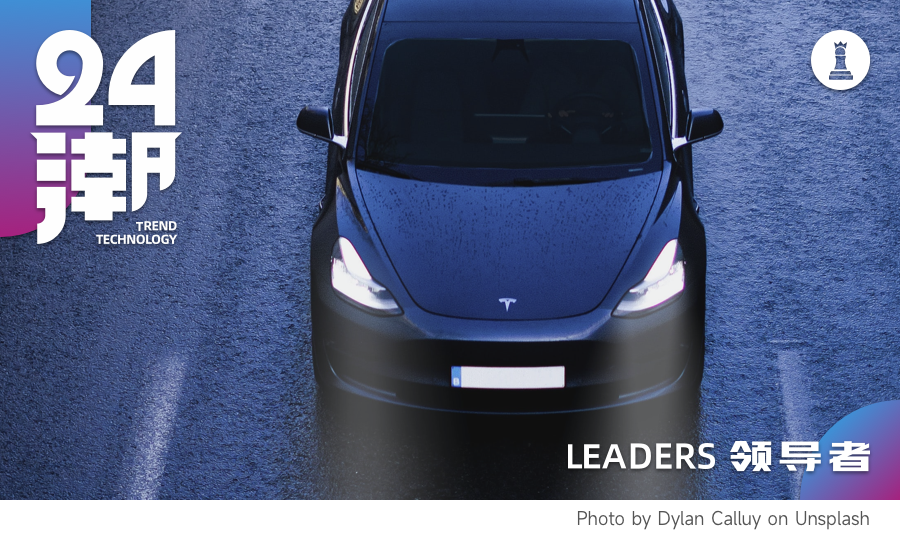

谁也没有想到，2023年初特斯拉会发动如此凶猛的价格战争。

据24潮不完全统计，目前特斯拉发动的价格战至少已席卷全球十个国家。仅在1月6日-13日这短短的七天内，特斯拉就在中美英德等十个国家发动了价格战（降价），其中在7个国家的平均降幅在10%以上，降幅最大的是美国，平均下降14.70%。

此轮降价主要涉及Model 3与Model Y的6款车型，降价后其在中国销售的Model 3后驱版、Model 3高性能版、Model Y后驱版、Model
Y高性能版的起售价格为十个国家中最低值。

众做周知，Model 3与Model Y乃特斯拉主力车型，截至目前，Model 3已上市6年，Model Y已上市4年，Model 3和Model
Y销量约占特斯拉全球销量的95%左右。

当特斯拉举起 “价格屠刀”，愤怒与恐慌的情绪瞬间席卷全球。

回归国内市场，在1月6日特斯拉中国官宣降价后，一时间，各地车主掀起维权潮，他们不满意自己提车三个月就贬值5万元的事实。

最具争议的是，国内新能源车企如何面对此次特斯拉发动的凶猛价格战的冲击？

事实上，特斯拉降价的影响力已经开始显现， “降价之后，我们店平均一天订单量是150辆，最近我们每天都要加班到晚上10点。"
1月11日，上海一位特斯拉销售人员向《每日经济新闻》记者透露。而在宣布降价后，市场有消息称，特斯拉中国三天内就斩获3万辆汽车订单。（注：这一数据尚未得到特斯拉官方证明）

而据西部证券在复盘特斯拉历次降价及对应销量变化后发现，在之前历史最低价格上，特斯拉Model3/Y销量对比至少有翻倍以上的提升。“我们预计，在当前价格国内Model
3稳态月销量2万，Model Y稳态月销量4万。”

在前几日，特斯拉举办的财报会议上马斯克也谈到了 “降价效应”。他表示，大幅降价确实带来了非常多的需求，目前特斯拉手上的订单是1月份产量的两倍之多。

熟悉马斯克的人都知道，在照顾消费者心情还是保销量面前，其会坚定地选择后者。

这一点也深受资本的喜爱，此次特斯拉的降价策略在资本市场掀起了巨大浪潮。自1月6日至今（27日），短短的十五个交易日中，特斯拉总市值暴增了2133亿美元，涨幅达61.23%。马斯克无疑是开年最大赢家。

而在一个月前，其还是全球最失意的人。自2021年11月起，特斯拉股价下滑了7成，市值蒸发了近9000亿美元，相当于跌掉了6个宁德时代或者8个比亚迪。马斯克也成为历史上首位年度身价缩水2000亿美元的人。

为了应对特斯价格战的冲击，国内市场降价风云再起。近日，小鹏汽车、问界等新能源车企纷纷加入降价大潮。其中小鹏汽车最高降3.6万元，问界降幅在3万元左右。

不论外界如何议论，竞争对手如何反击，“硅谷钢铁侠” 的战略宏图早已谋定，降价只不过是一枚战术棋子。

其实，特斯拉的降价是一场早就规划好的 “阳谋”。

2022年12月底，马斯克和特斯拉的多头基金经理们展开了一场讨论，他认为，2023年将会是一场相当严重的经济衰退，而当下的美联储还在继续加息。

这对汽车这类大件消费品来说，无疑是双重打击。经济衰退，人们购车的需求减小，加息则会增加购车成本，因为美国人几乎都是贷款买车。

马斯克直言，“这种情况下，应该降低价格，增加销量，保持稳定，不把公司置于危险境地的情况下尽可能快地增长。这意味着，在经济衰退期间，利润率将很低，甚至为负，只要现金状况保持良好。”

特斯拉的管理层也在2022年表示，特斯拉绝对不会减少生产。

在德州超级工厂的开幕式上，马斯克公开表达了他宏伟的理想：未来特斯拉全球占有率要超过20%。而在他看来，产能不足，是影响该目标的最大阻碍之一。

可见，以价换量、保持销量和规模的快速增长，才是他首要考虑的，而利润已经被放在次要的位置。

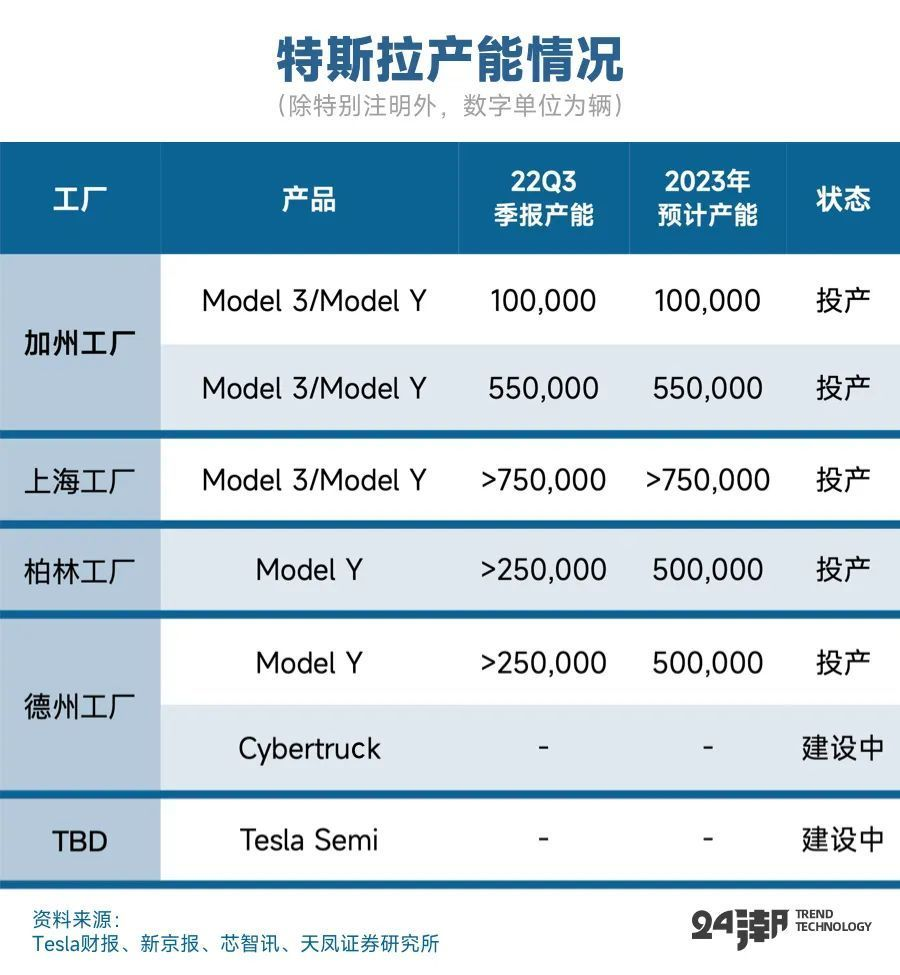

为此，马斯克在全球跑马圈地。目前，特斯拉拥有四大超级工厂——美国加州工厂和德州工厂、上海工厂以及德国柏林工厂，2022年第三季度的产能已经超过190万辆；2023年超过200万辆将是极大概率事件。

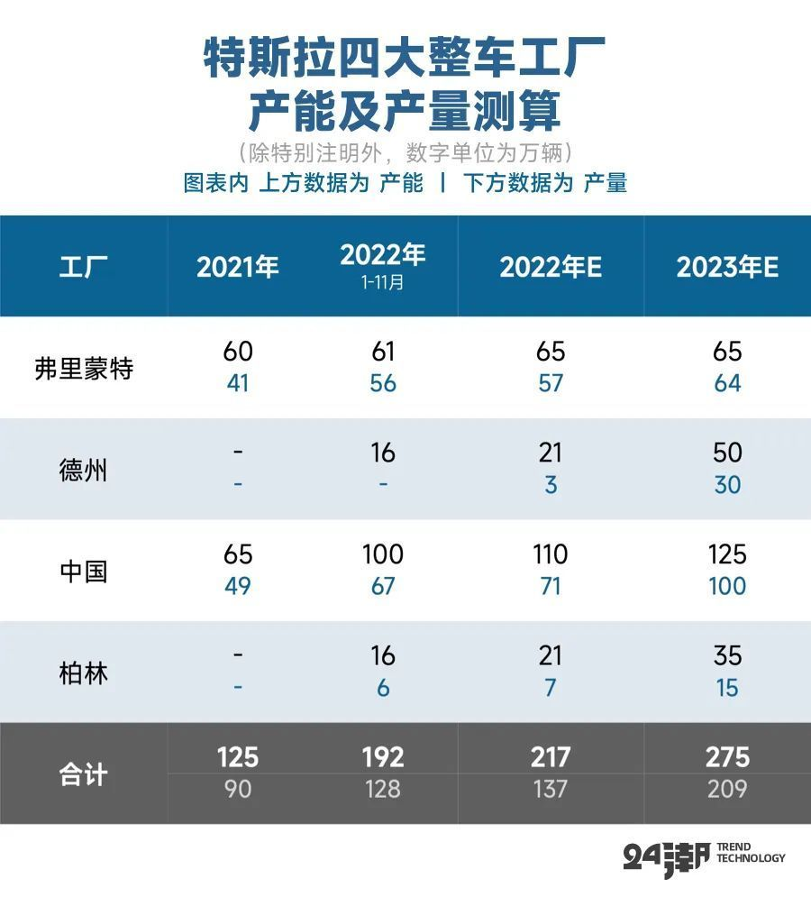

伴随着特斯拉四大工厂的产能提升，特斯拉全球交付周期均有所改善，中国、英国Model 3和Model Y交付周期缩短至1个月内，美国、德国、法国Model
3和Model Y交付周期已缩短至2个月。

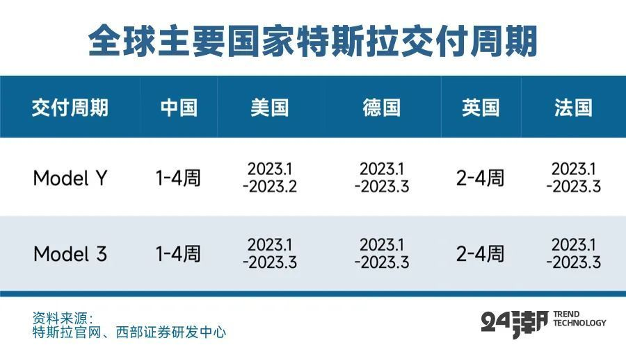

但是，产能快速膨胀，这就意味着特斯拉很可能迎来 “库存危机”。再加上经济衰退和加息带来的需求抑制，降价促销成为马斯克的首要选择。

很长一段时间，外界将特斯拉比作苹果，但从本质上来说，两者存在重大区别。汽车属于重资产和周期性很强的行当，而手机的价格更低，更换频率也更快。

汽车行业 “二八分化” 明显，售价30万以下的汽车在中国市场销量占比达到80%，30万以上汽车销售量不到20%。

这就意味着，苹果可以兼顾高毛利和高销量，但在汽车行业，既要高毛利，又要销量，鱼和熊掌兼而有之是不可能的。

全球最会赚钱的车企丰田，其汽车业务毛利率只有19%，大众集团为17.5%；豪华车阵营的BBA，汽车业务的毛利率在2021年均大幅提升，即便如此，宝马也只有17.6%，奔驰为12.7%，奥迪仅10.7%。

特斯拉 22Q4 毛利率为23.80%，单车毛利润为1.19万美元，单车毛利越是比亚迪的6倍多。

这也就是为什么，马斯克在股东大会上表示，特斯拉是2021年全球利润率最高的汽车，超过其他所有车企。

不过，2022年特斯拉的单季度毛利润一直呈现下降趋势，Q1-Q4毛利润环比降幅分别为1.5%、6.9%、1.3%和13%。

其实马斯克心里非常清楚，特斯拉不是苹果，不需要高达40%的毛利率和25%的净利率，他需要的是规模。

“从我们的视角，我们希望继续生产并销售尽可能多的汽车。我们相信，我们可以继续推动强劲的产量增长。”在2022年第四季度财报电话会议上也如此说道。

而且，特斯拉自创立起就采用了直销模式，而传统汽车则是经销商模式。如彼得·林奇所说，汽车股是周期股，具有很强周期属性。上行周期里，特斯拉把利润全部拿到自己手里，再好不过；但一旦行业进入下行周期，经销商就相当于一个缓冲垫，可以把一部分库存压给经销商，也可以挤压经销商的利润。

那么马斯克现在的问题就比较简单：既没有经销商，又面临宏观经济下行周期，又要实现规模野心，毛利还有压缩空间，那么唯一的选择就是——降价。

供不应求，销量大于产量，这是支持特斯拉万亿美金市值帝国的核心基座。

市场相信，特斯拉的销量只受制于他的产量，只要产量达标，就没有卖不出去的汽车。

由于订单管饱，销路不愁，特斯拉在2021年11月，冲上1.3万亿美金市值的历史巅峰。

但是在2022年下半年，形势开始出现变化，其帝国的核心基座开始出现动摇。从产销差可以明显的发现，自2022第二季度开始，特斯拉的产量开始高于交付量，并且差值在不断提升。

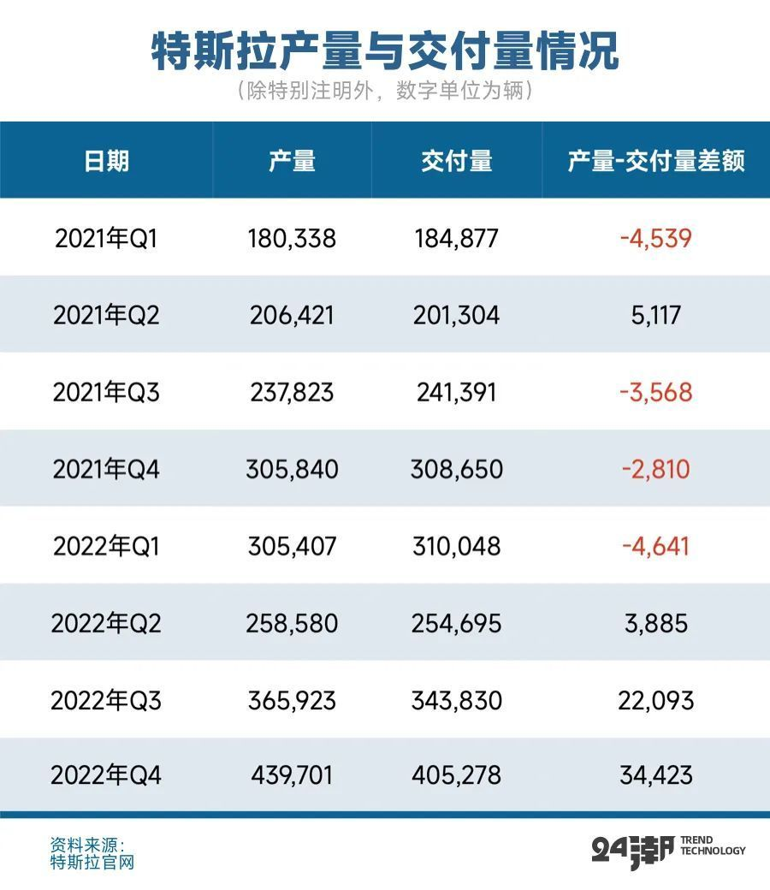

对于 “特斯拉的产量开始大于销量” 这一现象或许可以解释为扩产所致，毕竟特斯拉一直在不遗余力地提升产能。

但订单量则真实地反映了需求的萎靡。根据特斯拉生产与销售数据追踪服务商Troy Teslike的调查，特斯拉订单积压量在去年8份开始快速下滑。

到11月份特斯拉更是首次跌破20万辆订单大关，12月份则继续下滑至16.3万辆。

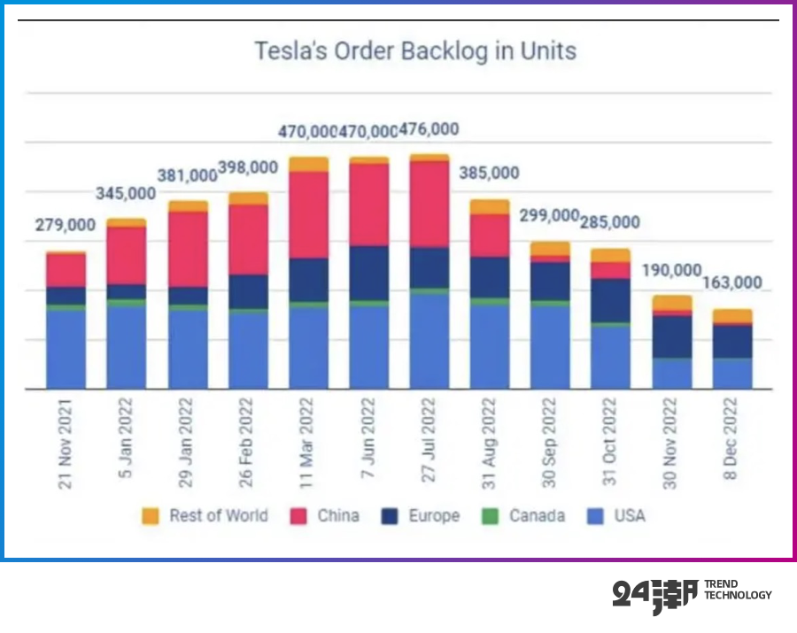

如下表所示，作为特斯拉最重要的市场之一，中国地区7-9月积压订单分别为17万辆、8.6万辆、1.6万辆，11月仅为1.3万辆，不足上海超级工厂一周的产能。而到2022年12月15日，中国区的储备量竟然消失殆尽。

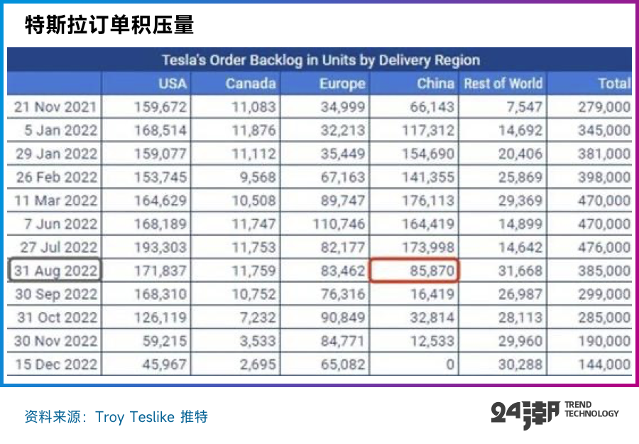

从1-11月累计销量来看，特斯拉国内销量39.8万辆，纯电市场占有率仅为8.4%，同比下降1.8pcts。

乘联会数据显示，12月份，特斯拉在中国地区交付了55796辆汽车，环比下降44%，同比减少了21%，降至近5个月新低。据 “猫眼看车”
分析，从12月份各国订单量来看，美国、欧洲及世界其他地区订单量下滑趋势并不明显，中国区订单量的下滑幅度最大，给特斯拉造成的负面打击也最大。

当前，特斯拉上海工厂周产能已达2.1万辆，但新增产能并没有被需求量 “喂饱”，海外车主提车时间也从原来的几个月缩短到几周。

上海工厂是特斯拉产能最大的基地，而据报道，上海工厂员工轮班工作时长原为11.5个小时，但未来将缩减到9.5个小时。

这些都从侧面印证了特斯拉正在经历 “产能过剩” 和 “销量不济” 的双重压力。

那么，马斯克似乎就只有华山一条路——发动价格战！

1月6日起，在国内市场特斯拉Model 3和Model Y各系车型全线降价，降幅为2万元至4.8万元，这是特斯拉官方降价幅度最高的一次。

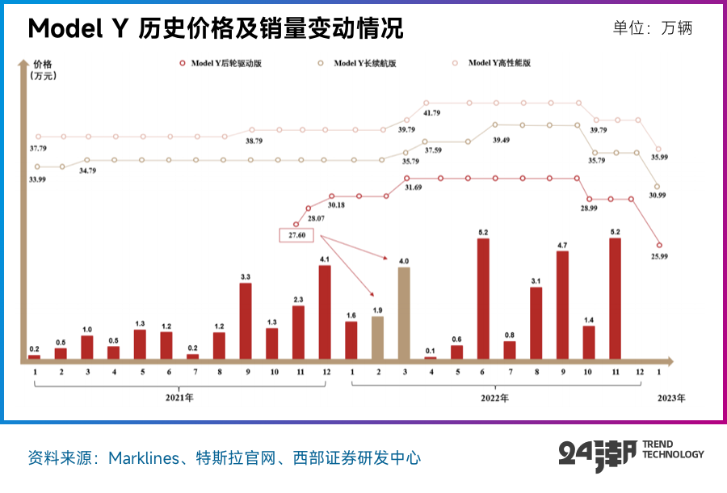

此后一周内，特斯拉还将战争延伸至美国、日本、德国、法国、英国、荷兰、韩国、澳大利亚、挪威等国家，其中在7个国家的平均降幅在10%以上，降幅最大的是美国，平均下降14.70%，降幅最小的是澳大利亚，最高下降3.50%。

此轮降价主要涉及Model 3与Model Y的6款车型，降价后其在中国销售的Model 3后驱版、Model 3高性能版、Model Y后驱版、Model
Y高性能版的价格为十个国家中最低值。

此次发动全球价格战，特斯拉盈利能力无疑将承受重大压力。随着售价降低，特斯拉汽车业务毛利率从第一季度创纪录的32.9%，下滑到第4季度的23.80%，下降了十个百分点。

但对此，特斯拉早有预期。在1月26日特斯拉22Q4财报电话会议中其高管表示，23年公司毛利率有信心维持在20%以上的水平，平均售价会高于 4.7
万美元，相较其他新能源车企，仍处于绝对领先优势。

若维持 20%以上毛利率，以平均售价 4.7 万美元，20%毛利率为基准计算所得单车毛利润在0.94 万美元以上。

供不应求的局面彻底转变后，高毛利率将无法维持。而毛利率正是华尔街投行对特斯拉最为关注的指标。更令他们担忧的是，这并非一次性的问题，而是长期需要警惕的
“雷点”。

因此，投行们纷纷大幅调低特斯拉的目标价，摩根大通甚至给出了 “减持” 评级。

不论外界如何争议，在马斯克心中，“绝不减产，燃油车必须死” 或许才是他追逐的星辰大海。

“我比地球上任何活着的人都更了解制造业。”马斯克在TED2022年大会再放豪言。

从被人质疑、嘲笑，到世界首富，他经历了别人难以想象的坎坷曲折。马斯克曾在弗里蒙特和内华达州的工厂里住了整整三年，连续六周死磕那些机器。

废寝忘食，宵衣旰食的工作，终于让他窥见汽车制造业的奥秘。所以，当他说出这样一句话时，人们并未感觉他太过狂妄，而是思考特斯拉在制造领域到底有何秘诀。

马斯克曾不止一次指出，自己的成功来源于 “第一性原理”(First principle thinking)。

“类比和改良只能对技术或产品产生较小的升级迭代，只有重新回到事物本质，才能带来颠覆性创新。”马斯克认为，应该回归事物本质来解决问题，而不是采用类比或者改良的方法。

特斯拉成立之初，动力电池的价格高达600美元/Kwh，85千瓦电池的价格就要超过5万美元。

如果从类比角度分析，电池组会一直这么昂贵，降价几乎不可能。而马斯克认为，应该从物理学原理角度来分析，电池就是碳、镍、铝和一些聚合物等金属之和。

按照当时伦敦金属交易所的价格计算，只要80美元／Kwh。锂电池成本可以远远低于彼时的市场价，由此他意识到广阔的降本空间。因此，特斯拉在2013年开始自建电池厂，投产之后电池成本下降了30%。

除了特斯拉，从第一性原理出发，马斯克还创办了SpaceX、Hyperloop、SolarCity等企业，并在相关领域取得了突破性的进展。

SpaceX诞生之初同样面临高昂的火箭采购成本，但拆解来看，火箭是由航空级铝合金、钛、铜和碳纤维等材料组成。马斯克认为火箭原材料的成本只占火箭价格的2%，与其花费巨资购买火箭，不如购买便宜的原材料，自己造火箭。于是在此后的几年时间内，SpaceX将发射火箭的成本削减了90%。

目前，人类最快的运输工具还是飞机，如果用 “类比”
思维来分析，不会有更快的运输工具了，但飞机的本质是将人和货物从A点运送至B点。只要降低成本，完成运输，形式并不重要，马斯克由此创办了超级高铁公司Hyperloop。

可以看出，“第一性原理” 思维可以看透复杂问题最本质的核心，绕过锂电池、火箭的高价问题，创造更有效的解决方法。

特斯拉宣布降价后，其对外事务副总裁陶琳就发微博称：“特斯拉价格调整的背后，涵盖了无数工程创新，实质上是独一无二的成本控制之极佳定律：包括不限于整车集成设计、产线设计、供应链管理、甚至以毫秒级优化机械臂协同路线……从‘第一性原理出发’，坚持以成本定价。”

而特斯拉之所以能够实现远高于同行业的毛利率，亦离不开在 “第一性原理” 指导下，采用的一体化压铸和CTC技术。

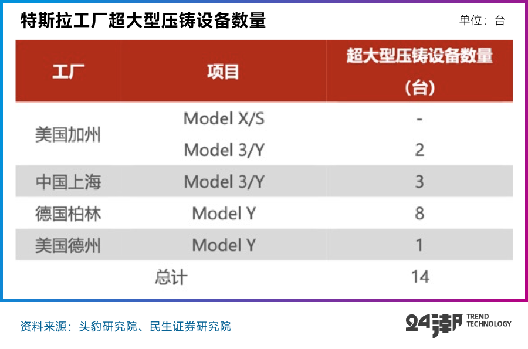

作为业内 “第一个吃螃蟹的人”，通过一体化压铸，2022年一季度，美国工厂生产的Model
Y后地板仅需要一个零部件，前后车身零部件由原来的171个缩减到2个。

如此一来，特斯拉省去了原来数十套模具，工厂面积和人工成本也大幅缩减，Model
Y后车架的制造时间亦从60-120分钟直接缩短60倍，整车制造成本显著降低至少40%。

CTC(Cell to Chassis)则是一种全新的电芯集成工艺，即将电芯直接集成于车辆底盘。

马斯克曾表示，“ CTC工艺+一体化压铸” 可以节省370个零部件，为车身减重10%，将每千瓦时的电池成本降低7%。

2022年3月，采用CTC技术的德国柏林工厂正式开放，特斯拉也因此成为全球首家量产CTC技术的车企。

汽车产业约每四十年出现一次生产制造革命，从福特流水线生产到丰田精益生产，再到大众平台化模块化生产，每一次汽车生产革命的领导者均将在之后的市场竞争中占据明显优势。依靠一体化压铸+4680CTC，特斯拉正在引领汽车产业新一轮的生产制造革命。

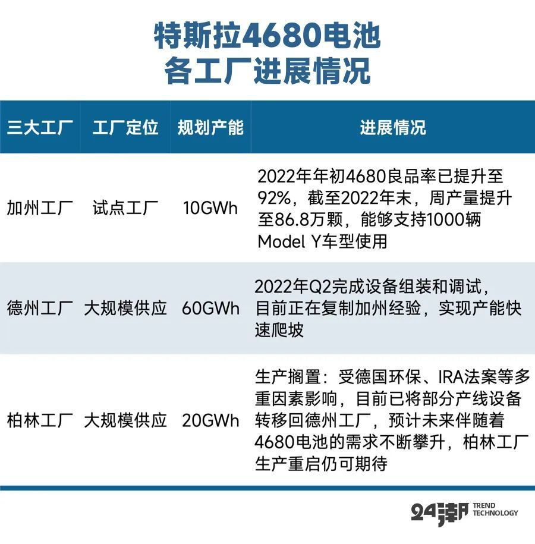

2022年10月，马斯克在第三季度电话会宣布，特斯拉下一款车型Model Q（暂命名）成本将是Model
3/Y的一半，预计售价将在2.5万美元，这也标志着特斯拉将正式进入20万元以下级别市场。

此外，根据特斯拉规划，期计划在2023年推出的Cybertruck、semi等新车型均只使用4680电池，仅以Cybertruck为例，若其于2023年上市交付，全年销量预计9万辆，单车带电量
207KWh，则对4680电池的需求量接近 20GWh，因此4680大圆柱量产快速提升仍是特斯拉销量增长的关键。

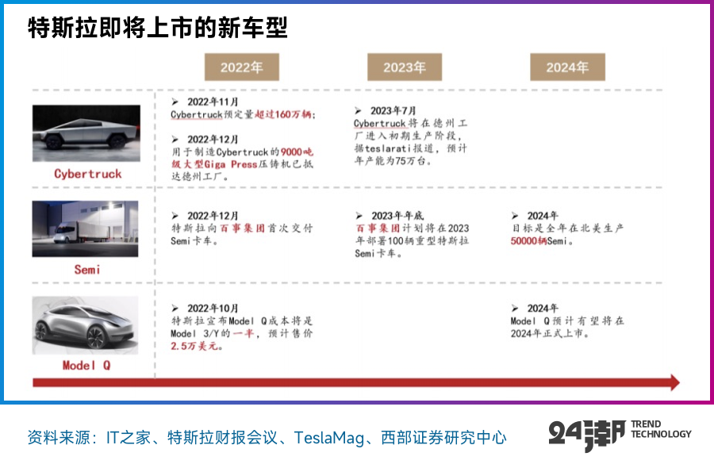

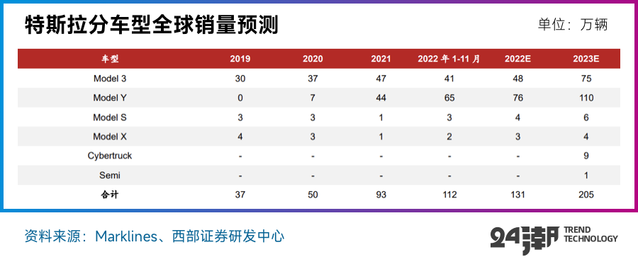

而随着规模的持续提升，以及技术的不断成熟，特斯拉摊销后的边际成本将更加低廉，这也是马斯克悍然发动价格战，在全球范围内攻城略地的底气和杀招。

马斯克入主特斯拉后，便为其制定了“三步走”战略。

2006年8月3日，他在特斯拉官网发布《特斯拉的秘密宏图（你知我知）》，信中描绘了特斯拉的发展规划，马斯克将其总结为 “三步走” 战略。

第一步：面向小众人群生产一款价格高昂且高端的产品(Roadster), 证明特斯拉能够造出纯电动汽车。

第二步：用Roadster赚到的钱，制造中高端车型(Model S/X)，证明特斯拉可以量产好车。

第三步：再用赚到的钱创造更加经济的畅销车型(Model 3)，证明特斯拉能够创造出大规模量产的汽车。

目前看，“Master Plan” 三步走战略基本完成。2008年，交付首款豪华跑车Roadster；2012年和2015年分别推出中高端车型Model
S/X；2016年/2019年发布亲民车型Model 3和Model Y。

时至今日，马斯克心目中的 “三步走” 战略已经达成，“SEXY” 产品矩阵带领特斯拉成为全球最大纯电动车企。

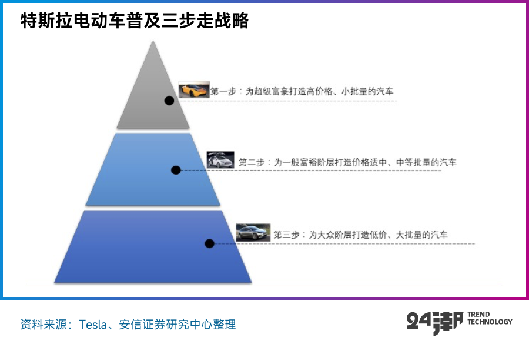

相比比亚迪等国产品牌从低端切入高端的做法，马斯克此举也颇为高明，那就是先通过超高端轿跑 “锚定” 特斯拉的高端和世界先进的品牌定位。

早在2008年就问世的Roadster，是世界上速度最快的电动跑车，它以动感、时尚的外形，极具颠覆性的技术创新，成为特斯拉的门面担当。相比当时的燃油车豪华品牌，马斯克塑造了一个划时代的产物，更让特斯拉的高端印象打入消费者心智。

这也就是为什么，特斯拉在安全事故频发、多次遭投诉、大规模召回后，还能保持火爆销售的一大原因。

继 “三步走” 战略、“SEXY” 产品序列后，马斯克又将目光瞄向了商用车领域。第一批电动半挂式卡车Tesla Semi
已经于2022年12月2日向百事公司交付；电动皮卡 Cybertruck 有望 2023
年投产，Cybertruck发布时间超3年，在手订单已达160万辆。西部证券分析认为，未来在产能充足的背景下，Cybertruck稳态年销量有望超过50万辆。

此外，更为廉价的Model Q（预计售价16-20万）可能于2023年推出，改款后的Model3/Y也即将上市。

由于2022年未能完成50%的增长目标，在马斯克 “销量和市占率为先” 的目标指引下，改款车型和新出车型无疑都肩负着更加严峻的任务。

“未来，特斯拉会在全球建设10~12家超级工厂，每座工厂规划年产能为150万~200万辆，10年后超过1亿辆的交付量。”在2022年的股东大会上，马斯克擎画了自己的
“超级目标”。

乘联会最新数据显示，特斯拉中国在2022年交付量为44万辆，市场份额仅7.8%；2022年，特斯拉全球交付131万辆，以全球943.1万辆（中金预测）销量估算，特斯拉在全球的市场份额也仅为14%。这和马斯克
“全球20%占有率” 的目标还有很大差距。

其实，马斯克早已认清特斯拉并非 “手机界苹果” 的事实，他的 “阳谋” 是利用规模和销量优势，彻底碾压竞争对手。

展望2023，特斯拉预计全年产量180万辆，保持50%的年复合增长率目标。马斯克称，内部目标是接近200万辆，但考虑到供应链等问题，保守预估180万辆。

眼光放长远一些，未来，特斯拉成为电动车领域的丰田，或许才是马斯克的真正目的。

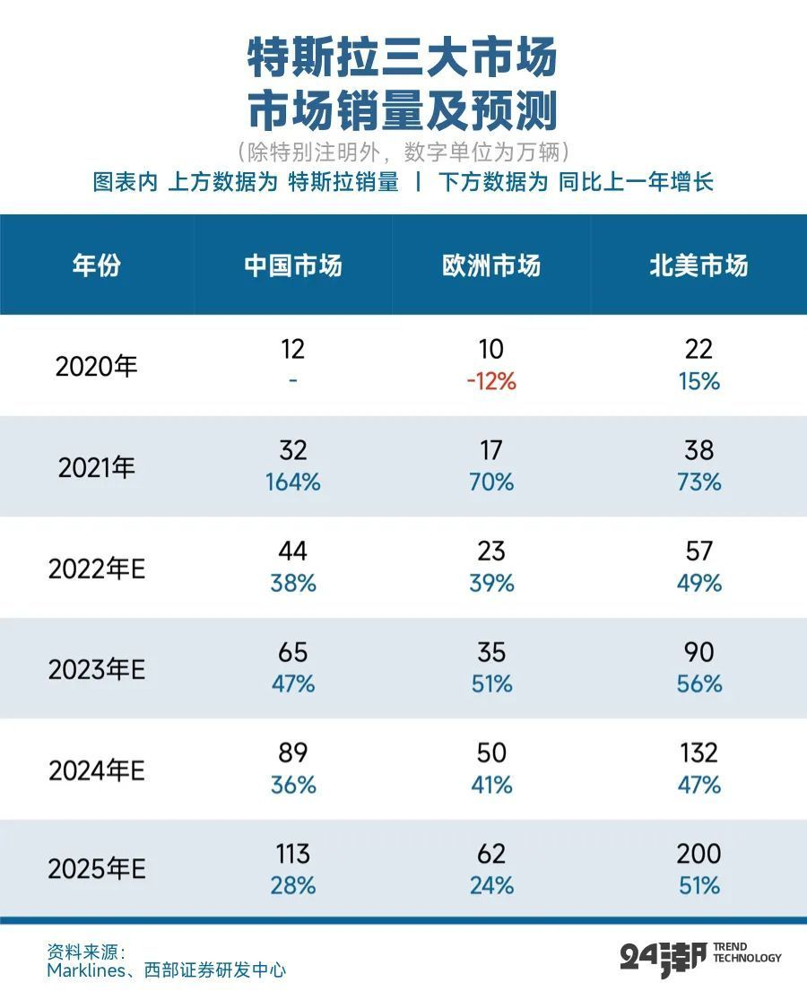

