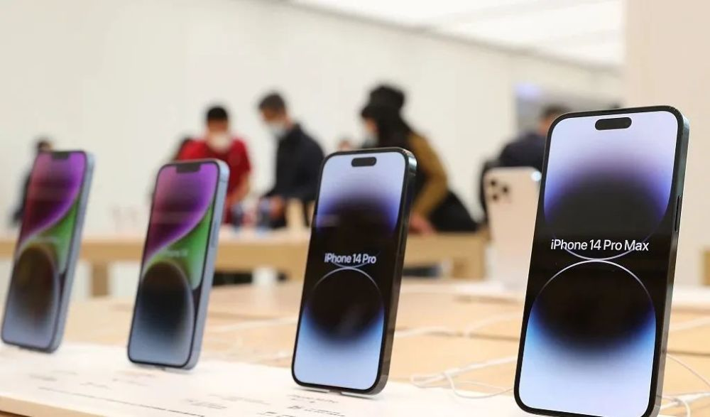
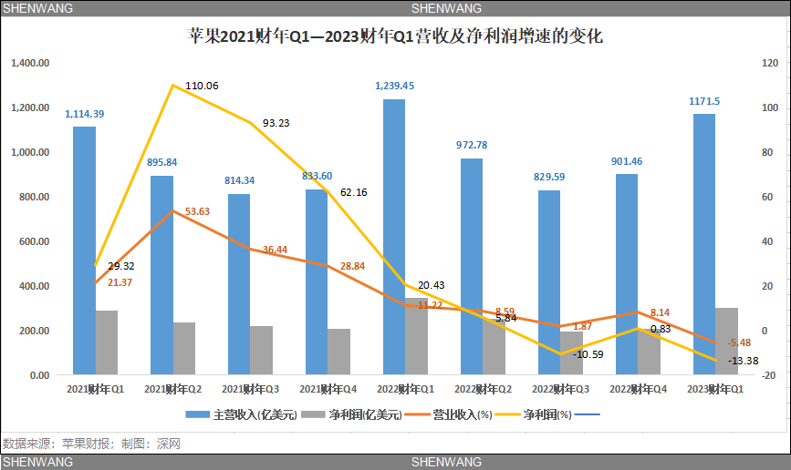
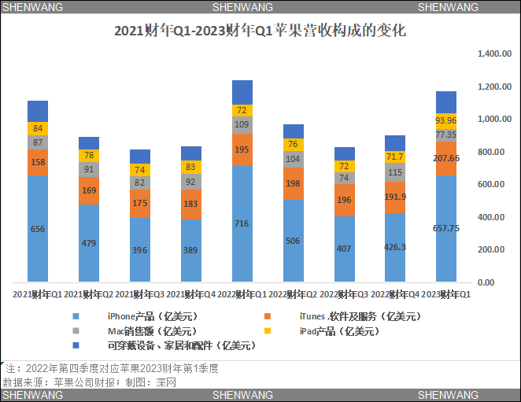
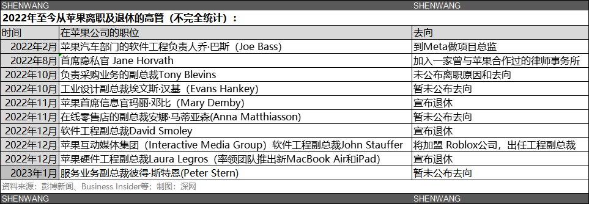

# 苹果分水岭：业绩大滑坡，走向平庸还是重振美股？

_来源：视觉中国_

作者丨张睿

编辑丨康晓

出品丨深网·腾讯新闻小满工作室

电子消费萎靡的严冬影响的不仅是安卓手机阵营，一直被奉为圭臬的苹果也感到了阵阵寒气。

北京时间2月3日，苹果公司发布2023财年第一财季（对应2022年第四季度）报告。据财报显示，该季度苹果营收1171.5亿美元，与上年同期相比下滑5.48%；净利润299.98亿美元，同比下降13.38%，
**营收和净利润同比增速双双下滑。**

对此，苹果公司CEO库克在随后的业绩沟通会上表示， **“收入下滑系汇率和iPhone供应所致，如果没有iPhone 14 Pro和iPhone 14
Pro Max供应链的问题，公司估算iPhone的营收应当能同比上升。”**

从收入构成看，这一季度除服务收入及iPad收入有所增长外，iPhone、Mac和可穿戴设备、家居和配件等收入均同比下降。其中，苹果的“现金牛”业务iPhone收入同比跌幅达8.17%。

由于营收和净利润都不及预期，美股盘后，苹果公司股价开始下滑，盘后股价跌幅一度高达5.7%。作为美股市值第一的公司，硬件业务收入明显下滑的苹果亟需创造新的需求，寻找下一个“印钞机”。

对于美国资本市场而言，苹果更是一个重要的风向标，逐渐走出加息阴霾的纳斯达克近两日连续大涨，但因苹果业绩下滑再次承压，截至发稿前期货下跌1%。

**iPhone“神谕”不再**

自2007年推出以来，iPhone已经成为苹果发展史中最成功的产品，无论是销量还是营收贡献率。苹果的收入分为两大部分，一是硬件，包括iPhone、Mac、iPad及可穿戴设备、家庭设备、配件等其他产品；二是应用商店和Apple
TV+等软件服务，包括广告、AppleCare、数字内容、支付等服务。其中，硬件收入一直是苹果营收的核心。

2023财年第一季度， **苹果业绩为数不多的亮点是服务收入。**
这一季度苹果服务收入为207.66亿美元，同比增长6.49%。对此，苹果CFO卢卡.梅斯特里（Luca
Maestri）在业绩会上表示，2022年底全球激活的苹果设备达到20亿部，较去年1月多出2亿部，Apple Pay在第一财季创下了最高交易记录。

**不过从苹果盘后股价下跌来看，服务收入的增长显然并不能让资本市场满意，因为营收占比不到20%的服务收入并不能撑起苹果未来增长的大盘。苹果未来收入及市值的走向还是受iPhone、Mac、iPad等硬件业务发展的影响较大。**

2023财年第一季度，iPhone营收657.75亿美元，同比2022财年第一季度下滑了8.17%；Mac收入77.4亿美元，同比下滑29%；iPad收入93.96亿美元，同比增长30.5%；可穿戴设备、家居和配件收入134.82亿美元，同比下滑8.29%。

在硬件收入中，iPhone占苹果营收的大头，曾被誉为苹果的“印钞机”。2021年秋季推出的“十三香”（iPhone
13系列）更是为苹果带来了“史上季度收入新高”，当季营收高达1239亿美元，是微软当季营收的2倍多。

**虽然库克解释苹果营收不及预期主要受iPhone供应链中断等因素的影响，但当iPhone收入同比跌幅达8.17%
时，苹果高层或需要考虑，在未来一段时间内，哪些创新产品能顶上iPhone下滑带来的营收空缺。**

库克在2021年年底接受媒体采访时曾给出答案：苹果公司正在专注于三个新方向，AI人工智能、AR增强现实、自动化。其中，AI人工智能是指苹果未来将通过Siri和全新的形式来展现；AR增强现实主要是指眼镜或耳机等穿戴设备；自动化则是针对将于2025年发布的具有自动驾驶功能的苹果汽车。

从The Information近日对苹果MR头显的揭秘看， **未来几年有可能和iPhone并驾齐驱是一款代号为“N301”的MR（混合现实）头显。**

**难寻下一个“印钞机”**

当地时间1月3日，美国媒体《The
Information》曝光了苹果公司MR头显的配置和细节，包括处理器、显示、摄像头、电池、软件及内容等，并透露该MR头显的定价在3000美元（2万元多元人民币）左右或更高。

而据彭博社分析师马克.古尔曼（Mark Gurman）透露，苹果头显设备可能会被命名为“Reality
Pro”，将于今年春季，在苹果全球开发者大会（WWDC）之前发布，于今年秋季开始销售。

苹果对AR/VR
产品的投入始于8年前。据《蒂姆.库克传：苹果公司的反思与商业的未来》记录：2015年苹果发起了代号为T288的AR/VR项目，包含代号为N301的MR头显和代号为N421的AR眼镜。而在2014年，Meta则以20亿美元收购了VR头显制造商Oculus，发力虚拟现实领域。

**与Oculus Quest已占全球VR市场70%以上的市场份额不同，苹果AR/VR项目频繁“跳票”，陷于“雷声大雨点小”的窘境。**
彭博社曾报道，苹果智能眼镜最初计划于2019年宣发，随后多次调整公布时间。

对于苹果头显设备或于今年秋季开售的预测，天风证券分析师郭明錤则表示：“苹果AR/MR头戴装置开发进度因机构件落摔测试不及标准，与软件开发工具的时程晚于预期，大量出货时间可能将自原本的2023年第二季度，延后到2023年第二季度末或2023年第三季度。”

AR/MR产品之外，资本市场也曾对苹果汽车项目寄予厚望。 **这个曾因一场官司而被大众所知的苹果汽车项目同样时乖命蹇。**

2015年3月，美国电动车电池制造商A123公司起诉苹果挖角其高级工程师，以成立大规模电池事业部。A123公司诉讼称，2014年6月前后苹果公司开始从A123公司挖角关键项目的工程师，导致自己被迫关闭了项目，且需要“以极高的成本找到替代人员”。至此，一直在苹果内部秘密开展的无人驾驶项目Titna从幕后走向前台。

有资料显示，早在2008年，乔布斯就对特斯拉及其新型电动车产生了兴趣，但Titan项目2014年才正式获批，由时任苹果产品设计副总裁的史蒂夫·扎德斯基（Steve
Zadesky）负责，库克允许扎德斯基雇用1000人来扩充Titan团队。

当时被挖角的不仅有A123公司，宝马、梅赛德斯.奔驰、特斯拉等知名车企的设计师和工程师都成为苹果公司拉拢的对象。对此，特斯拉CEO埃隆·马斯克（Elon
Musk）曾揶揄苹果汽车是“特斯拉墓地”。“如果你在特斯拉干不下去了就可以去苹果，”马斯克曾在接受德国《商报》采访时表示。

**特斯拉曾几度走到破产边缘的经历告诉同行，造车绝非易事，苹果也是吃尽了苦头才明白造车不是花钱挖人这么简单。**

2016年1月，扎德斯基因“个人原因”离开了为之奋斗16年的苹果，有关Titan团队内部动荡的谣言也流传开来。6个月后，时任苹果硬件工程高级副总裁鲍勃·曼斯菲尔德（Bob
Mansfield）成为Titan项目新一任负责人。3个月后，该项目超过100名员工相继离职。

耐人寻味的是，2017年之前，库克对Titan项目闭口不谈。直至2017年6月，库克才向彭博新闻证实，“苹果专注于无人驾驶系统，我们把它视作一项非常重要的核心技术，甚至可以说它是所有AI项目的源头，其艰巨程度可见一斑。”

**不过库克的“首肯”并没让Titan项目进展的更加顺利。**
2020年年底，Titan项目负责人再度更换，鲍勃·曼斯菲尔德退休，由苹果机器学习及AI战略高级副总裁John
Giannandrea接替前者成为汽车项目负责人，直接向库克汇报。

几度更迭项目负责人成为苹果汽车发展命途多舛的注脚。2022年3月，常年分析和爆料苹果公司信息的郭明錤再度爆出：“苹果汽车团队已经解散了一段时间。如果想要2025年量产汽车，那么苹果需要在3—6个月内重组团队。”

从后来苹果从兰博基尼挖来研发人员看，苹果并不打算放弃这个已经开发8年的汽车项目。

2022年7月，苹果从兰博基尼挖来顶尖汽车研发经理路易吉.塔拉博雷利（Luigi
Taraborrelli）负责未来汽车的设计，后者在兰博基尼已经工作了20年，是底盘和车辆动力学主管。

截至目前，关于苹果汽车概念图长什么样子还没定论，苹果汽车能否在2025年如约量产仍待市场验证。

**核心高管离开带来的隐忧**

**对于苹果来说，未来增长的不确定性因素不仅有头显及汽车等创新项目，频繁更迭的核心管理层也是苹果未来业绩增长的隐忧之一。**

据《深网》不完全统计，过去一年从苹果离职及宣布退休的核心高管位近10位，包括首席信息官Mary Demby、首席隐私官Jane Horvath等。

有消息透露，苹果大约有100多名副总裁，其中30多名副总裁直接向库克汇报。而2022年宣布离开的不少是在苹果工作20多年的“元老级”人物，例如，负责采购业务的副总裁Tony
Blevins在苹果工作了22年，前首席信息官Mary Demby则在苹果度过了30年的岁月。

在多位离职的副总裁中，曾负责苹果采购业务的副总裁Tony Blevins及工业设计副总裁埃文斯.汉基（Evans Hankey）的离开备受关注。

苹果在行业内素有“供应链管理大师”的称号。有数据统计，
**苹果库存周期大约在7天左右，而据wind数据显示，2022年第一季度，小米的存货周转天数为80.54天，是苹果的10倍多。**

**在苹果高效的供应链管理中，Tony Blevins是降低苹果供应链价格成本的“肱骨之臣”，可以直接向库克汇报。**
此外，在苹果与高通的专利费纠纷中，Tony Blevins也发挥了重要作用。

Tony Blevins的离开或将造成苹果供应链关键岗位的空缺。有苹果员工推测： **“考虑到其对苹果供应链的了解程度和优秀的谈判技巧，Tony
Blevins很难被取代。”**

与Tony Blevins相同，前工业设计副总裁埃文斯.汉基（Evans
Hankey）的离开也让苹果遭遇“人才流失”的困扰。埃文斯.汉基是苹果传奇设计师乔尼.艾维（Jony Ive）的继任者。

乔尼.艾维1992年加入苹果，1996年开始领导苹果的设计团队，苹果早期的透明彩色iMac、iPod，以及后期的iPhone、iPad、AirPods、Apple
Watch等产品均出自乔尼.艾维之手。苹果“灵魂人物”乔布斯曾在他的传记中评价： **在苹果，如果我有一个精神上的伙伴的话，那就是乔尼。”**

2019年11月，乔尼.艾维正式从苹果离职，成立自己的设计公司LoveFrom。对于乔尼.艾维的离开，《纽约时报》曾援引十几位与艾维密切合作过的人的说法：“由于库克更加注重运营，专注于销售软件和服务而非设计上的飞跃，艾维已经感到失望，转而担任兼职。”

乔尼.艾维的离开对苹果打击巨大。即使库克在声明中强调“未来苹果将与乔尼.艾维直接合作独家项目并会保持长期合作”，也没能阻挡当天苹果盘后跌去90亿美元市值的损失。

眼下，埃文斯.汉基（Evans
Hankey）的离开意味着，苹果要搜罗能接替埃文斯.汉基岗位的人选。但由于苹果缺乏一个明确的“接班人培养计划”，想短期内找到合适的继任者并非易事。

据外媒报道，在苹果工业设计团队中仅存的两位老将也没有接替埃文斯.汉基的意愿。一位是在苹果工作了26年的理查德·豪沃思（Richard
Howarth），另一位是在苹果工作了30多年的巴特·安德烈（Bart Andre）。

**对于已经47岁的苹果来说，管理层的更迭或许给公司带来了“新鲜血液”。但在营收、净利润增速下滑、创新产品还未问世的2023年，核心人物的离开给苹果增加了更多的不确定性。**

眼下，与头显和汽车等创新项目相比，苹果更相信自身品牌带来的溢价和利润。1月10日，苹果中国官网首页上线单独的“家居”板块，销售摄像头、灯泡、门锁、开关、路由器、插座等第三方品牌产品。在推出下一个爆款产品之前，苹果并不介意从边角领域找利润。

**腾讯新闻出品内容，未经授权，不得复制和转载，否则将追究法律责任。**

