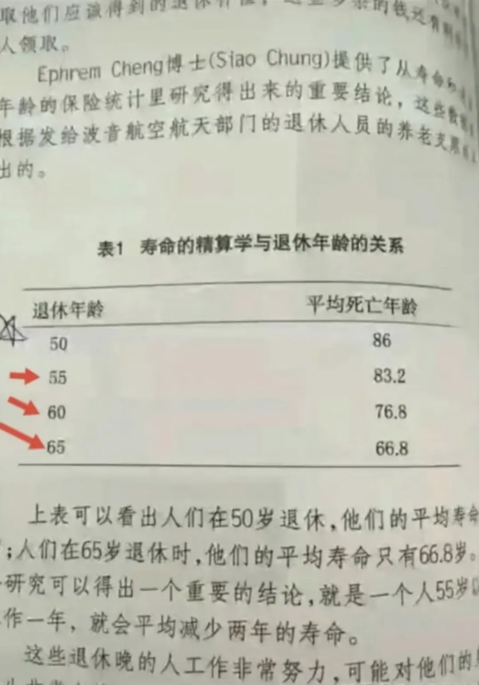
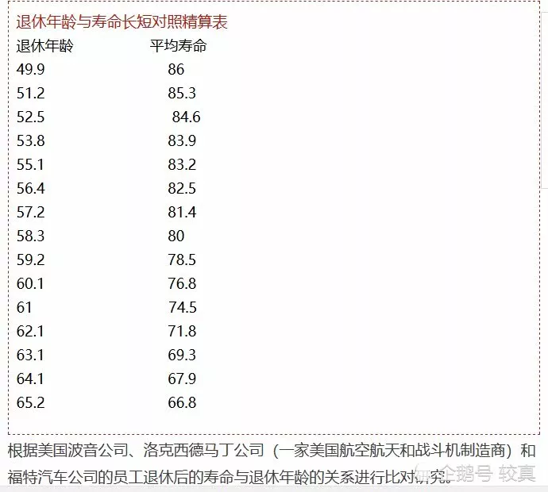
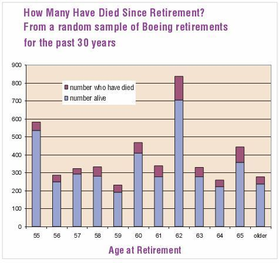

# 较真丨数据显示退休越晚死得越早？该说法极其不靠谱，早已被辟谣

**较真要点：**

1\. 所谓“退休越早、活得越久；退休越晚，死得越早”“65岁才退休的人平均只能活到66.8岁”的说法，极其不靠谱，早已经被波音公司辟谣。

2\.
这个说法的源头，是一份据称于1982年发表的研究报告，但时至今日，波音报告的原文仿佛蒸发了。以至于有国外研究人员在自己的文章中附上这么一句话：如果谁有这篇波音报告原文，一定记得发我邮箱。

**查证者：李填丨社科学术编辑**

最近，一张描述了退休年龄和寿命长短关系的图表在网上流传。里面的数字声称：55岁就退休的人平均可以活到83岁；而可怕的是，65岁才退休的人平均只能活到66.8岁。换句话说，65岁退休的人，退休后只有20个月左右的时间了。

图注:网传的“退休年龄和寿命长短的关系”，疑似来自印刷物

单说这张图表，你可能会难以置信，但网传的文字看起来是来自印刷物，上面还写着是某某博士发现的，并且有说法声称这还是来自美国波音、洛克希西德马丁和福特汽车的研究数据，并且还有英文版本。这是不是就让你心里“咯噔”一下了？

图注：另一个数字更详细的网传版本，且注明数据“来自波音等公司”

图注：该说法的英文版本

其实这张著名的数据表，是近二十年在全世界流行的一个著名谣言——有说法称其为“不死的传奇谣言”。

**一、传播的源头和过程**

这个说法的源头，是一份据称于1982年发表的研究报告（而并非公开发表的论文），因为研究主题是波音公司和洛克希德马丁公司员工退休年龄和寿命的关系，因此被称为“波音报告”（Boeing
Study）。作者据说是一位叫“Ephrem (Siao Chung)
Cheng”博士的美国人（按照威妥玛拼音，中文写法大概是“郑孝忠”一类），但除了作为“波音报告”的作者外，互联网世界再没有这位博士的其他信息了。

并且，即使是“波音报告”的内容本身，人们知道的也只是有上述表格，以及对其研究只言片语的引用。这导致很多人都以为“波音报告”的标题就是“对退休年龄和寿命的精算研究”，殊不知这只是上述表格的标题。

这篇原文已经查不到的波音报告，为什么能产生社会影响力？主要是因为2002年3月的一篇题为《关于创造力和长寿的最优政策》（Optimum Strategies
for Creativity and Longevity）的网络文章，引用了上面提到的表格，并且声称来源是Ephrem Cheng所写的波音报告。

这篇网文的作者署名是“Sing Lin”博士（似乎中文写法是“林星”一类），Sing
Lin博士是沙特法赫德国王石油矿产大学的研究人员，根据学校主页介绍的信息，只知道ta已经退休。文章一共只有4页，分4个部分，列出的作者头衔是“美国中国工程师学会全国理事会成员”和“台大校友会理事”。

这篇网文4个部分的标题分别是：1、人一生中最富创造力的岁月，2、寿命长短和退休年龄的比对关系，3、美国养老金计划的新动向，4、结论和建议。作者想要证明，人的创造力随着年龄逐年下降，延迟退休也对健康不利。文章在第2部分“寿命与退休年龄”引用了Ephrem
Cheng的表格和图。

这篇网文在结论中说：“如果你到了55岁仍能不从高压锅一样的工作场所抽身，或无法离开快节奏、高竞争的环境而必须苦干到65岁以后才退休，你很可能在退休后的18个月内离开人世。这和55岁就退休相比，意味着至少放弃了20年寿命。”

可见，波音报告是Sing
Lin得出结论所依赖的重要证据。但时至今日，波音报告的原文仿佛蒸发了。以至于有国外研究人员在自己的文章中附上这么一句话：如果谁有这篇波音报告原文，一定记得发我邮箱......

经过Sing
Lin引用的波音报告，迅速在不想上班太多年的人们中产生了共鸣，流传得越来越广。随后在各国都有了针对各行各业不同版本的说法，比如称对监狱管理员、教师、外科医生等职业来说，也有类似波音报告的结论。

据一位在新加坡工作的博客作者、数学作家Murray
Bourne在2007年一篇博文的说法，波音公司曾专门在官网发表了一篇文章来澄清“波音报告”，题目叫做《还是让关于预期寿命的谣言先退休吧》（Let’s
Retire the Rumor about Life
Expectancy）。也有其他网站引用过这篇澄清文章。不过这篇澄清文章目前在波音官网已经找不到，无法证实是否曾经存在过。

据前述博文，波音公司在澄清文章中公布了此前的30年中，员工退休年龄和寿命的关系（下图）。可以发现，30年来，以不同年龄退休的波音员工中，退休后的寿命和在多少岁退休并没有多大关系。波音公司声明：“对于波音公司的退休员工，在退休年龄和预期寿命之间没有发现相关关系。”波音公司还有点委屈地说，“没有人关注公司员工实际的健康和福祉，反倒是谣言流传最广”。

图注：波音公司澄清文章中的图表，横坐标是退休者退休时的年龄，纵坐标是人数，其中深色是已经死亡的数量，浅色是仍活着的数量

不过，严格来说波音公司提供的这张图仍然啥也不是。他们只说明是“随机抽样”，样本有多大、统计方法和口径是什么也完全没有介绍（或许是因为这个原因，波音的澄清文档pdf已经在其网站上删除），不过好歹算是有了当事人的口径。

而“波音报告”结论的传播，并没有因波音公司的出面而停止。至少直到2019年，国外还有理财专家和意见领袖，在文章中兴冲冲地将“波音报告”的结论当成新鲜材料来引用，借以向人们灌输“FIRE生活方式”（Financial
Independence and Retire
Early；财务自由，趁早退休）的重要性。针对这类文章，2019年，参与设计洛克希德马丁公司养老金计划精算的Steve
Vernon撰文称，根据围绕1981~2002年该公司的养老金计划的研究，“绝对没有证据支持报告的结论”。

“波音报告”的结论进入中文世界，是通过新加坡这个中转站。

2000年，新加坡65岁及以上人口占全国总人口的比例达到7.4%，正式进入老龄化社会。到了2010年，新加坡65岁以上人口占比已经升到了9.0%。2000~2010年，新加坡政府为了应对适龄劳动力缺口，以及迫于承担养老金支出的“中央公积金”账户压力，将再就业年龄提升至65岁。2010年，新加坡内阁资政李光耀，在自己以88岁高龄宣布退休的前一年，发表演讲谈论延迟退休问题，引起了新加坡社会热议。

这时有人将Sing Lin的文章发在了一个英文论坛Reach上，标题被换成更直白的“退而不休”（Working Beyond
Retirement）。由于新加坡社会中文使用者较多，和中国的联系也很紧密，不久后Sing Lin的文章就被翻译成了中文，进入了中国并流传至今。

**二、结论本身可靠吗？**

“波音报告”的结论经不起推敲。

第一，像上面提到的，流传的结论中，没有提供研究方法，没有介绍数据样本，现在连原文都消失了。

第二，数据太整齐、“太漂亮”了，令人难以置信，除了波音公司自己出面的澄清外，和其他更公开透明、样本更大的研究的结论相比，差异也太大了。

比如以壳牌石油公司员工为对象的类似的研究结果正好相反，他们研究的结论是，55岁退休的员工的平均寿命要比65岁退休的人稍微短一点。不过这一结果本身也不能被简单视为一条规律，因为早早退休的人中，可能有些另有原因比如因为疾病。

在这个话题上，存在很多统计陷阱。比如自主选择较早退休的人，可能财务、健康状况都不错。任何试图简单地在退休年龄和寿命之间建立因果关系的研究，都是值得警惕的。即便两个变量之间有统计相关性，也不能证明二者之间存在因果关系。

比如有的研究人员针对此类研究提出的有点黑色幽默的质疑：55岁退休的人可能没到65岁就死了，而65岁才退休的人不可能死在退休之前，这都是使统计数据扭曲的原因。

关键是，“波音报告”的结果实在过于完美无缺，甚至有些吓人。但对一般的统计数据来说，即使真的符合某种因果关系，也不会出现如此肉眼可见的关系。因此有人提出，根据这个作者（Ephrem）的分析方法，将一个员工“停止接收退休金支票”视为已经去世，那他的数据样本中，肯定只包括这些“已经去世”的员工。现在假如存在这样的情况：员工的退休年龄平均在升高，那么越接近作者写这篇报告的时间，就有越多的退休员工“还没来得及去世”，那么进入数据样本的高龄退休员工，只能是那些过早去世的人，因此整个数据样本中的退休年龄和寿命就出现了这么整齐的负相关关系。

**实际上，研究退休年龄和寿命的关系本身就是不科学的**
，因为无论研究覆盖的时间范围是多大，除非已经过去很久，永远有一些人“还来不及去世”。因此正确的变量不是“寿命”，而应该是“若干年内（比如5年内）的死亡率”。

比如2013年，阿姆斯特丹自由大学的Bloemen等三位学者，研究了提前退休对5年内死亡率的影响。数据样本是全荷兰人口。研究发现，由于荷兰政府2005年降低了领取退休金的年龄门槛，这一政策造成的提前退休，使荷兰男性退休后5年内死亡的概率降低了2.5个百分点。换句话说，这个大样本统计研究的结果，远没有“波音报告”的结果漂亮，但无疑更实际。而且这降低的5年内死亡率，主要体现的是大量政府工作人员提前退休后的结果，其他行业是否符合，尚不清楚。

“波音报告”中经不起推敲的结论之所以能影响力这么大，还是因为切中了人们的心理：没有人想在充满压力的职场中待那么久。根据合理推测，延迟退休很可能会导致压力变大，因此对健康造成不利影响。但实际上健康的生活方式、良好的财务状况、和谐的人际关系才是影响寿命的更直接原因。

为了回应人们的这种焦虑，不是简单地调整法定退休年龄那么容易。这需要政府、企业、社会、个人创新性地思考，为更多的人创造出充满成就感的、健康有保障的工作岗位，从而让更多的人充实投入工作、充分享受生活。当然这就是另一个话题了。

**版权声明：本文系腾讯较真平台独家稿件，未经授权，禁止媒体转载。欢迎个人转发至朋友圈。**

