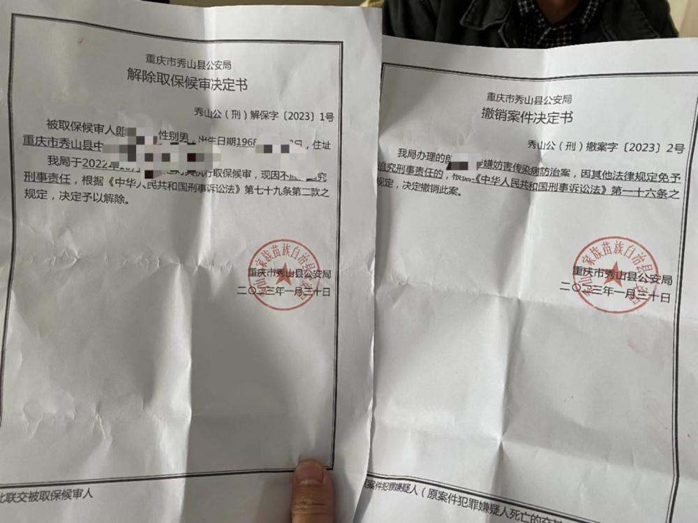

# 返乡未隔离致多人感染被撤案，为何有网友“不宽容”

维护法治尊严不是越严越好，当然也不是越松越好，关键是如何做到依法行事，并力求宽严相济

被以涉嫌妨害传染病防治罪立案侦查的重庆秀山县男子郎隘渝（化名），三个多月后获撤案处理。据报道，去年9月30日，在外务工的郎隘渝等三人自驾返渝，抵达秀山后便到医院做核酸，得到阴性核酸报告后参加聚餐等。而当天深夜，秀山县疾控中心疫情防控人员告知其核酸检测为阳性，与其聚餐和打牌的人员中陆续有人出现感染症状。秀山县公安局以涉嫌妨害传染病防治罪对其立案侦查。

_秀山警方对郎隘渝撤案并解除取保候审。图据澎湃新闻_

当初，郎隘渝被立案侦查，于法有据；如今，相关部门撤案处理，同样符合法治精神。在1月8日国家对新型冠状病毒感染实施“乙类乙管”之前，最高法等部门就发文指出：“犯罪嫌疑人、被告人处于被羁押状态的，各办案机关应当依法及时解除羁押强制措施”。在这种背景下，郎隘渝获得撤案处理，既有法理依据，也属名正言顺。

耐人寻味的是，一些网友对此并不认同。比如有网友称，为什么要撤销，不能因为现在放开，就姑息曾经的违法行为吧？还有的认为，撤案处理有违法律的严肃性。

事实上， **警方作出撤案决定，不仅无损法律严肃性，反而维护了法治尊严**
。正如相关部门所称，随着国家防疫政策的调整，以及两高两部的相关规定，公安机关在考虑案件的法律效果时，也更要考虑到案件的社会效果。这种柔性执法，既合规合法，又维护当事人权益，还具有良好的社会效果，值得点赞。

按刑法规定，依照当时的法律已经作出的生效判决，继续有效。故此，应综合分析那些尚未审判抑或尚未作出生效判决的案件。如果犯罪嫌疑人被采取强制措施，应解除强制措施；如果已立案，应撤销；如果进入了审查起诉阶段，应不再起诉。

有个案例是，去年4月，河南某村支书隐瞒行程回村后，被检测出新冠阳性。最终，因妨害传染病防治罪，被判处有期徒刑两年。日前，当地法院新闻发言人表示，该判决已生效，其现在正在服刑。

经对照可知，司法机关如此处理，亦在遵循法理。

回到郎隘渝一案，重庆警方已将处于公安侦办阶段、与郎隘渝类似情况的涉疫案件全部进行撤案处理。
**这样的处理方式，既吃透了法治精神，也洞察了世道人心，是对法治负责，也有利于塑造公众的法治信仰。维护法治尊严不是越严越好，当然也不是越松越好，关键是如何做到依法行事，并力求宽严相济。**

中国政法大学教授罗翔认为，刚性法律也应有柔软的一面，它应该体会人性的软弱，慰藉被误伤的心灵，带给人们对正义与良善的盼望。诚如斯言，如果过于追求法律的苛严，而无视它所体现的柔性，那么法律将无法给人慰藉。郎隘渝动情地说：“警方的人性化执法，让我苦闷、委屈这么久的心底，总算有了些温暖。”这句朴实的话语，给人无尽思考。

红星新闻特约评论员 秦川

编辑 赵瑜

红星评论投稿邮箱：hxpl2020@qq.com

