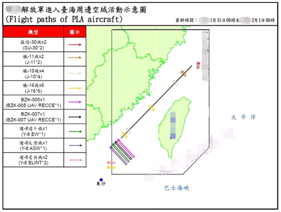
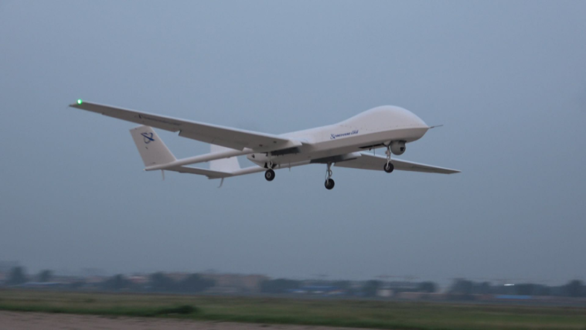
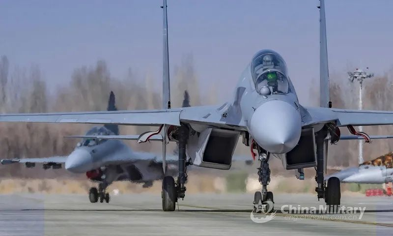

# 连续两天，解放军演练“南北包夹”台湾？

台湾媒体说，解放军的行动就是在“南北包夹”台湾。

根据台军发布的“解放军台海周边海、空域动态统计”，1月31日6时至2月1日6时，解放军出动军机34架次、军舰9艘次持续在台海周边活动。其中越过“海峡中线及其延伸线”20架次，仅次于1月8日解放军东部战区在台湾周边海空域组织诸军兵种联合战备警巡和实战化演练的28架次“越线”纪录。

具体而言，解放军2架苏-30战斗机在“海峡中线”北端延伸线活动，歼-11战斗机2架次、歼-10战斗机4架次、歼-16战斗机6架次分5处越过“中线”；2架次运-8电侦机在东沙附近活动；在“西南防空识别区”活动的还有BZK-005、BZK-007无人机及运-8干扰机、反潜机各1架次。

台湾TVBS网站称，在1日“越线”的解放军军机中，其中一架对应在花东地区，“那里刚好有台湾花莲空军基地”；两架对应台湾北部，一架靠近台湾中部的新竹空军基地，六架对应台湾南部的屏东九鹏基地，两架对应台湾西南的巴士海峡，“包夹意味相当浓厚”。

_BZK-005无人机_

台湾“国防安全研究院专任副研究员兼国防资源与产业研究所所长”苏紫云表示，解放军历来的行动都与国际情势有关。就战术而言，解放军这次出动的机型很多，编队配置带着实际作战演练意图，“北边有苏-30战机，西南有电子作战机和无人机，意在显示对台湾南北都有空中打击能力，既展示肌肉，也让各种军机更熟悉未来作战的地理情况。”

台湾“中华战略前瞻协会”研究员揭仲则表示，解放军出动了歼-16等战斗机、长航程的无人机和干扰机、电子侦察机，可能在进行海空无人机的联合电子作战训练。“解放军军机未来在台海中线，尤其在中线最窄的台北到新竹之间出现的频率更高。”

台媒还猜测，解放军的行动或许也与台湾“中科院”打算在2月6日到7日进行今年首次导弹射击有关。据称，台军导弹将沿着从九鹏基地发射，穿越兰屿、绿岛，再北转往宜兰外海的“倒L”形的轨迹飞行。“去年‘中科院’因为大陆机舰等外在因素干扰，6次取消导弹射击，今年再度出击格外引发关注。”

解放军的演练行动还没有完。台军2日发布的消息称，从2月1日到2日，解放军又有23架次军机、4艘军舰在台海周边活动，其中“17架次越过海峡中线及其延伸线进入台西南空域”，包括苏-30战斗机3架次、歼-16战斗机8架次、运-8反潜机1架次、运-8电侦机1架次、空警-500预警机1架次、歼-11战斗机2架次、BZK-005无人机1架次。

台湾“风传媒”网站认为，从台军发布的“解放军军机航迹示意图”看，苏-30与歼-16战斗机对台军形成“南北夹击”。而运-8反潜机、部分歼-16战斗机、运-8电侦机飞入台“西南防空识别区”，其中运-8反潜机和运-8电侦机均在飞行相当距离后，才循相似航迹飞返，“应有针对特定海、空域实施战场经营意图”。台媒还注意到，BZK-005无人机是直接从台湾南面的巴士海峡飞入台“防空识别区”，和过去解放军军机主要集中在“海峡中线”或“西南空域”活动相比，“扰台”来向持续扩大，航迹更复杂，同时也凸显解放军大型无人机的飞行距离更远。

岛内媒体总结称，解放军在今年1月“扰台”23天，使用14种机型、126架次，出动最多的机型为歼-16（41架次）；同时出动各种无人机16架次，“每次都与侦察机搭配运作，解放军可能正在研拟载人机与无人机搭配使用相关操作准则、模式”。

不管解放军是否真的在准备“南北包夹”，但岛内分析人士早就提出警告，台湾当局越是在“台独”问题上闹得欢，“解放军留给台湾的空间就越小”。“佩洛西窜台已经让台湾海峡中线不复存在，那么下次呢？”

