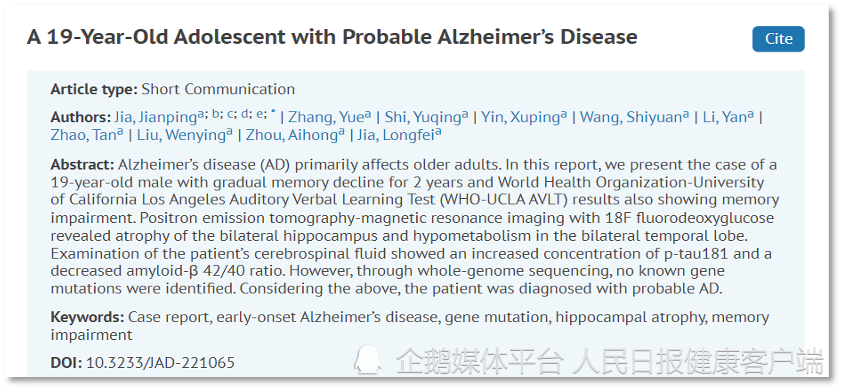

# 19岁患者疑患阿尔茨海默病：“老年痴呆”年轻人也能得

**人民日报健康客户端记者 武星如**

日前，首都医科大学宣武医院贾建平团队在《阿尔茨海默病杂志》（JOURNAL OF ALZHEIMERS
DISEASE）发表研究文章，报道了一位17岁时发生记忆失常，并于19岁诊断为疑似阿尔茨海默病（AD）的病例，是迄今为止最年轻的患者。

根据研究小组提供的资料显示，该患者在就诊前两年开始出现在学习时注意力难以集中，一年后，短期记忆丧失明显，无法回想起前一天发生的事或个人物品的存放位置，阅读困难，反应缓慢。随着病程进展，记忆力进一步下降，经常丢失个人物品，记不清自己是否吃过饭，难以完成学习内容和老师布置的作业。由于记忆下降严重，他的学习成绩从之前的中等以上水平下滑到班内末位，无法完成学业，不得不从高中退学。

贾建平教授是首都医科大学宣武医院神经疾病高创中心主任、首都医科大学神经病学系主任，长期从事神经变性病、阿尔茨海默病和相关痴呆的临床、科研与教学工作。

贾建平团队对该患者进行诊治的过程中发现，患者的主要表现为记忆衰退，尤其是情景性记忆，韦氏记忆量表和听觉词语学习测验评估也支持了这一结果。此外，该患者没有家族遗传病史，找不到其他引起记忆障碍的病因如遗传、感染和系统性疾病。
**经过全基因组测序，未发现该患者携带任何风险或致病基因突变，排除了家族性AD的可能，其发病机制尚需进一步研究。**

研究小组对此病例的诊断为“疑似AD”，原因是仍有部分评估结果不符合AD的国际公认诊断标准（NIA-
AA）。此外，该文章也提出了此项研究的局限性，由于患者比较年轻，不能接受大脑活检，需要长期随访进一步支持该团队的诊断。

该文章结尾表示，这位被诊断AD的19岁患者，改变了我们认知中典型的AD发病年龄。1月23日，该杂志主编同时在该杂志上发表了一篇对此研究的社论，其中也指出，年龄是AD的重要危险因素，自1906年报道了第一例AD病例以来，人们普遍认为AD主要发生在老年人。但实际上，在过去就曾有过小于30岁的AD患者的报道，其中最小发病年龄为21岁。

