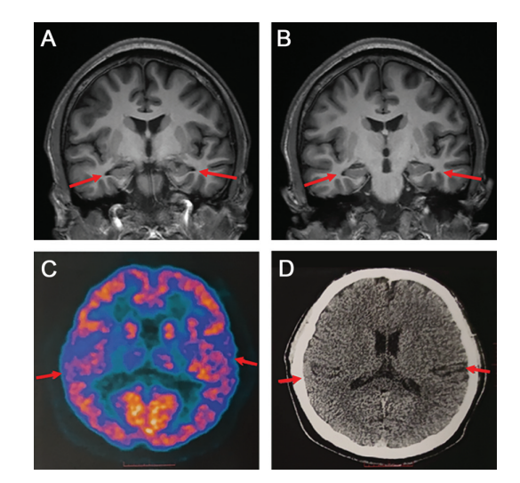

# 中国学者发论文：19岁男生患阿尔兹海默症 研究参与者曾不相信检查结果

“这是目前已知最年轻的临床诊断为阿尔兹海默症的患者。”近日，一篇由首都医科大学宣武医院贾建平团队撰写的论文，发布在了国际知名阿尔兹海默病研究刊物上，文中介绍，一名来医院就诊的19岁男孩被临床诊断为阿尔兹海默症患者。论文的作者之一、宣武医院神经内科主任医师贾龙飞告诉北京青年报记者，该病例的情况非常罕见，以至于他一度不敢相信检查的结果，但医院采取了多种检测方式，包括世界权威的阿尔兹海默症检查手段——脑脊液指标检查以及PET扫描，最终医生们临床诊断该患者为阿尔兹海默症。不过贾龙飞表示，市民不必因为此次发现的罕见病例感到过度担心，“现在发现的一些年轻患者，主要得益于技术的进步，应该说以前也存在一些年轻人患病，只是因为技术的原因没能得到确认而已。”

**中国医生报道一名19岁患者临床诊断为阿尔兹海默症 出现记不得是否吃过东西等症状**

1月31日，国际知名学术刊物《阿尔兹海默症期刊》上刊登了一篇由首都医科大学宣武医院贾建平团队撰写的论文。

文中介绍，一名19岁的患者因为进行性的记忆衰退来宣武医院求医。在来宣武医院两年之前，该患者在高中时就发现难以集中注意力到学习上，此后开始受困于明显的短期记忆缺失，比如他会无法想起一天前发生的事情，或者忘记自己的个人物品放在哪里。

论文中表示，该患者还会出现阅读和反应困难，渐渐地，他的记忆越来越糟，会不时丢东西，甚至记不得自己有没有吃东西。尽管在发病前他的学习表现处于中上水平，但他最终无法完成自己的学业，不得不退学。该患者仍然能独立生活。

论文中表示，医院为患者做了多种检查，包括当前用于诊断阿尔兹海默病的最权威手段——脑脊液指标检测和PET扫描，患者还接受了多种量表测试。扫描影像等显示，患者存在轻度的脑萎缩等症状，部分脑脊液指标也存在异常，最终患者被临床诊断为阿尔兹海默症患者。

论文追溯了此前被报道诊断为阿尔兹海默症的部分病例。比如此前被确诊患上阿尔兹海默症的最年轻患者年龄为21岁，并携带有一种基因突变。此外，有研究报道称曾有一名28岁的患者并未出现PSEN1、PSEN2、APP这三种突变，说明零星的早期阿尔兹海默症患者是可能不携带一些常见的相关基因突变的。

论文称，该患者是目前已被报道的符合阿尔兹海默症诊断标准的最年轻病例，同时该病例没有携带已知的和阿尔兹海默症有关联的基因突变。

**参与论文撰写者：开始有点不相信检查结果 专家全面检查互相印证最终确定临床诊断**

宣武医院神经内科主任医师、博士生导师贾龙飞表示，虽然病人并不在他管理的病房，但因为该病例的发病年龄十分罕见，他曾参与过该病例的讨论，也参与了该篇论文的一些撰写工作。

贾龙飞坦言，开始时他也曾有点不相信检查的结果，因为此前虽然确实发现过20多岁罹患阿尔兹海默症的患者，但这类患者往往会存在基因突变或家族史，“但最终经过全面的检查，我们确认这次的患者没有家族史，以现有的手段也无法查到基因突变。这种情况确实极为罕见。”

贾龙飞介绍，整体而言，对每一位可能罹患阿尔兹海默症的患者，医院都会为其进行全面的检查。他表示，PET扫描和脑脊液指标检查，以及多种量表检测可以相辅相成，互相印证，以此才可以做出准确的临床诊断。

**论文发布后，引发了部分网友热议，有年轻网友担心自己是否存在罹患阿尔兹海默症的可能性。对此，贾龙飞表示，市民不必对此过度担忧。“此次病例的情况仍然是极罕见的。实际上，包括阿尔兹海默症在内的很多疾病，都和患者自身的身体条件、基因的遗传因素以及生活方式等多种因素共同作用有关。但近年来我们发现的一些阿尔兹海默症患者年纪比以前小，可能有40多岁或者20多岁的，其原因一方面在于绝大多数早发性阿尔兹海默症患者都还是有自身的基因突变，另一方面更和技术的进步高度相关。”**

贾龙飞解释说，脑脊液指标检查、PET扫描等用于诊断阿尔兹海默症的权威手段都是近年来逐步得到普及的，“很可能以前也存在一些年轻人患有阿尔兹海默症，但因为技术的限制无法得到诊断。现在一些年轻人被发现患上阿尔兹海默症其实一定程度上也是技术进步的结果。”

针对有网友注意到，论文中提到该患者为“很可能的（probable）”阿尔兹海默病患者的情况，贾龙飞介绍，阿尔茨海默病分为病理诊断和临床诊断，病理确诊的阿尔茨海默病是该病的最终诊断，也是最确定的诊断。没有病理结果时，依据临床资料和其他辅助检测如PET扫描和脑脊液检测结果做出的是临床诊断的阿尔茨海默病，“我们平时所说的患者绝大多数是后者。多数患者不适合脑组织病理检查，从科学的角度在论文中使用的‘很可能的阿尔茨海默病’一词，已经是临床诊断的最高等级，该患者就属于这种情况。”

**此次发现有助于人类进一步了解阿尔兹海默症发病原理等**

贾龙飞表示，实际上记忆和很多因素有关，绝大多数人“忘事”往往是功能性的，并不是大脑真的出了什么问题。“比如有人可能近段时间过于劳累，生活不规律，饮食营养没跟上，认知就会有一定程度的下降，但经过一段时间的休息，状态就会回复。”他表示，对于大多数人来说，选择良好的生活习惯，规律作息就足够了。相比之下，阿尔兹海默症以现在的科技手段无法逆转，如果一个人疲劳、营养没跟上等不利影响因素已经改善了，但在相当长的时间里认知状态仍然没有恢复，那就需要患者及时到医院进行检查了。

贾龙飞说，全世界已经投入了巨大的人力物力在研究阿尔兹海默症的发病原理和治疗手段，此次报道的这名19岁且没有常见基因突变的病例，对于人类进一步去了解阿尔兹海默症的发病原理等，有着巨大的意义。

文/北京青年报记者 屈畅

