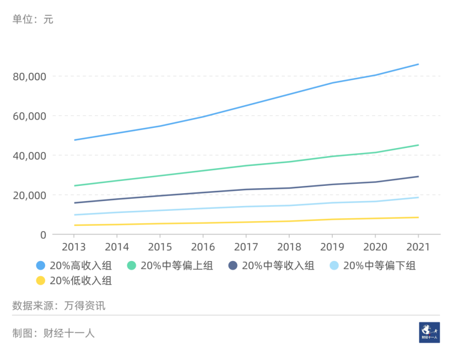

# 中国居民收入的五档划分，从数据看差距

_图/视觉中国_

**文| 陈汐 刘建中**

居民可支配收入是其可以用来自由支配的全部收入，收入的来源可以是工资、经商，也可以是利息、房租、补贴或其他。收入的形式可以是货币，也可以是实物。关于居民可支配收入更详细的解释见尾注1。（下文中的“收入”都指“可支配收入”。）

绝大多数人的收入主要用于消费，而用于投资和储蓄的比例相对较小。平均来说，可支配收入越高，消费支出就越高。所以，一个群体的人均可支配收入越高，这个群体的生活水平就越高。

**居民可支配收入的细致结构以及随时间的变化，可以反映经济发展，可以反映贫富差距，也可以为制定合理的经济政策、民生政策提供依据。**

2023年1月17日，国家统计局发布数据显示，2022年全国居民人均可支配收入36,883元，比上年增长5.0%，扣除价格因素，实际增长2.9%。分城乡看，城镇居民人均可支配收入49,283元，增长3.9%，扣除价格因素，实际增长1.9%；农村居民人均可支配收入20,133元，增长6.3%，扣除价格因素，实际增长4.2%。

**某个群体的人均收入是这个群体收入的“平均值”，而“平均值”不同于“中位数”。“中位数”也非常重要，如果你的收入超过了“中位数”，你的收入就高于一半的人。**

在一个国家、一个城市或者一个地区，财富几乎必然会不成比例地向少量富人集中，所以居民收入的“中位数”几乎必然小于“平均值”。

2022年，全国居民可支配收入中位数31,370元，中位数是平均数的85.1%。其中，城镇居民可支配收入中位数45,123元，中位数是平均数的91.6%；农村居民可支配收入中位数17,734元，中位数是平均数的88.1%。

以上数据给我们呈现出中国城乡居民收入的整体情况，但信息过于粗线条。例如，我们只能判断自己的收入是否属于前50%，但不能更准确地判断自己的位置。而且研究贫富差距、税收标准、扶贫政策等问题时，都需要更细致的信息。

**其实，这可以利用国家统计局发布的全国居民可支配收入的五等分分组数据。每年的数据会在下一年的后半年发布。**

全国居民收入五等分分组，是将所有被调查家庭按照家庭人均收入水平从高到低的顺序排列，然后平均分为五份。每组代表的人口约3亿。处于最高20%的家庭为高收入组，依此类推依次为中等偏上收入组、中等收入组、中等偏下收入组、低收入组。

下文先列出2021年数据，各位读者可以看看自己的家庭属于哪一组。

**居民收入五等分数据**

万得数据库（Wind）收集了2013年以来的相关数据。表1给出了这五组人群的人均可支配收入、收入年复合增长率、高收入组和低收入组在中国居民总收入中的占比等信息。

_表1：中国居民五等分分组人均年收入等数据_

_图1：中国居民五等分分组人均可支配收入_

从表1可以看到，2021年包含约3亿人的低收入家庭，人均可支配收入为8333元，折合每月694元；中等偏下收入家庭，人均可支配收入为18,446元，折合每月1537元。

占人口总数20%的高收入户，2021年人均可支配收入为85,836元，折合每月7153元。高收入组是低收入组的十倍多。

2021年，高收入组的总收入占中国收入总数的46%，而低收入户的占比为4.5%。从2013年以来，这两个占比都基本保持稳定。

**如果某家庭只有一个人，他每月的可支配收入只要达到7153元，他就达到了最高20%的平均数。**
上文说过，在收入统计中，平均值会高于中位数。因此，他的收入也高于高收入组的中位数。因为高收入组占总人口的20%，这意味着7153元/月的收入可以排进全国前10%。

当然，当他结婚生娃，他的收入要被平均。考虑一个典型的三口之家，家里有一对工作的夫妻和一个不工作的孩子。如果要超过90%的家庭，这个家庭夫妻二人的收入之和需要超过21,459元（7153
* 3 = 21459）。

在大城市生活的读者，可能觉得这个标准非常容易达到。但这就是中国的实际情况。

**2021年中国高收入组人均收入85,836元/年，而美国全体居民人均56,065美元/年。按照汇率美元：人民币为6.5：1，则美国人均为364,423元人民币。美国人均是我国最高20%组人均的4.2倍。**

从居民可支配收入看，中国还是发展中国家。中国居民收入水平还有很大的提升空间。

**城镇和农村居民五等分数据**

下面把全国居民数据分成城镇居民和农村居民分别来看。2021年城镇居民总数约为9亿人，农村居民总数约为5亿人。

先看城镇居民的收入情况。

_表2：中国城镇居民五等分分组人均年收入等数据_

城镇居民高收入组的收入是低收入组的6.1倍。城镇居民低收入组人均收入16,746元/年，折合月收入不到1400元。一个三口之家，约为5000元/月。这个收入在小城市基本温饱无忧，在稍大的城市生活会有些紧迫。但是，城镇最低20%的家庭能达到这个水平，还是可以反映城镇生活水平的进步。

北京城市居民的收入分组数据在2018年之后不再公布。2018年全国城镇最高20%的人均收入为84,907元，北京最高20%为130,851元，北京是全国的1.54倍；2018年全国城镇最低20%为14,387元，北京为30,404元，北京是全国的2.11倍。

**2015年-2018年，北京城市高收入组的人均收入一直是低收入组的四倍左右。北京的贫富差距小于全国情况。2010年-2015年，上海城市高收入组也一直是低收入组的四倍左右。**
（上海数据在2015年之后不再公布。）而且2010年广州农村居民数据显示，高收入组也是低收入组的四倍左右。（广州数据缺失，笔者仅找到了2010年农村数据。）

下文还会看到，城镇的贫富差距小于农村。所以城市化是解决贫富差距的一种方法，而大城市化可能是进一步解决贫富差距的方法。

**再看农村居民的收入情况。**

_表3：中国农村居民五等分分组人均年收入等数据_

2021年农村低收入组人均收入仅为4856元/年，而2021年中国的贫困线标准约为4000元/年。2020年底，现行标准下的农村贫困人口全部脱贫。但从数据看，这些人虽然成功脱贫，但没有远离贫困。

2021年农村高收入组年收入为43,082元。高收入组是低收入组的8.9倍。而2021年城镇高收入组是低收入组的6.1倍。有数据以来，城镇居民之间的贫富差距始终小于农村。

农村数据也有令人欣喜的部分。比如，从2013年-2020年农村高收入组的收入一直低于城镇中等组。而2021年农村高收入组超过了城镇中等组。

**数据的启示**

居民可支配收入五等分数据可以给我们四点启示。

**第一，做大蛋糕并没有影响蛋糕的分配比例。**

确切地说，做大蛋糕没有影响99%以上的人如何分配蛋糕。现代社会的进步往往来自于科技进步。这就不可避免地造就了一群人数很少但财富很多的人，比如马斯克、马云、马化腾、曾毓群等。

但很多美国的研究者都发现，美国的贫富差距拉大，不是前面10%的人收入发生飞跃，甚至不是前面那1%，而是最前面的0.1%，甚至是0.01%。

和2013年相比，中国居民收入几乎翻倍。但高收入组在总收入中的占比一直约为46%，低收入组占比一直约为4.3%，其他各组的占比也基本稳定。而且，这个结论单独放到城镇居民或农村居民身上也基本成立。

所以，对于99%以上的人来说，蛋糕的分配比例基本是稳定的。不用担心随着蛋糕做大，贫富差距会变大。

**第二，优先做大蛋糕。**

中国收入最低的40%家庭，人均收入为1100元/月。在如今的物价水平之下，他们的生活水平可想而知。

很多城市居民尤其是大城市的年轻人无法理解拼多多上9元20包的方便面，7元100片的卫生巾为何有那么多人购买。参考以上数据，这些就会变得非常容易理解。

和发达国家比，中国的收入水平很低。即便最高的20%，人均可支配收入还不到美国人均的四分之一。

所以，提高产出效率、加快经济发展仍是重中之重。当前，中国仍要尊重企业家和企业家精神。过早地、过分地强调公平，会影响投资、产出、技术进步。

**第三，解决贫穷要对症下药。**

农村收入最低的20%，这1亿人的人均收入约400元/月。为何他们的收入如此低？主要是因为缺乏打工的能力或机会。一亩地每年只能带来500元的纯收入，只靠农业的家庭就会比较贫穷。这与我们在河北等地的调研结果相吻合。

每月400元的收入，有可能导致温饱出现问题。以中国目前的物质丰富程度，不应该出现食不果腹的情况。但是，如何提高这部分人的收入呢？

不能靠扩大就业，因为这些人无法参与就业。所以，直接发放补助可能是比较有效的方法。

对于农村中等偏下的收入家庭，重点在于提供就业机会。而且城镇应该给他们提供价格低廉的生存方式。同时应该通过职业教育提高他们的技能。

**第四，刺激消费不能治本。**

每当经济减速，“刺激消费”就成为经济学家们经常建议的一副药方。但是，消费的基础是收入以及收入预期。当收入提高，信心增强，消费不用刺激。

**尾注1: 居民可支配收入释义**

可支配收入指调查户在调查期内获得的、可用于最终消费支出和储蓄的总和，即调查户可以用来自由支配的收入。可支配收入既包括现金，也包括实物收入。按照收入的来源，可支配收入包含四项，分别为工资性收入、经营净收入、财产净收入和转移净收入。

计算公式为:

可支配收入 = 工资性收入+经营净收入+财产净收入+转移净收入。

其中:

经营净收入 = 经营收入–经营费用–生产性固定资产折旧–生产税；

财产净收入 = 财产性收入–财产性支出；

转移净收入 = 转移性收入–转移性支出。

（作者为《财经》产业研究中心研究员，编辑：刘建中）

