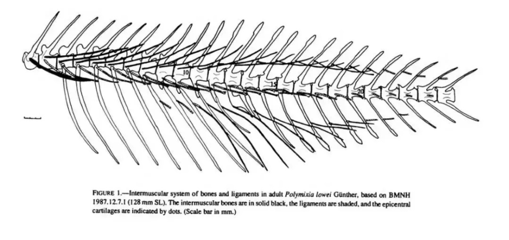
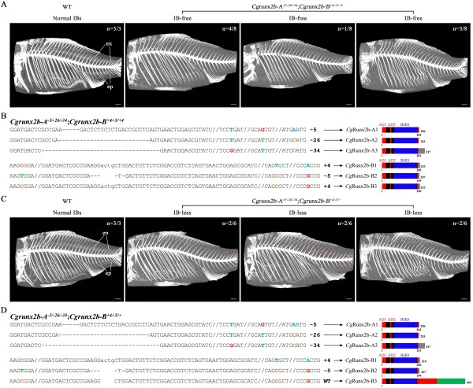

# 中科院水生所培育出了无刺鲫鱼，80余根细刺被去尽，具体原理是什么？

在平常的餐桌上，吃的鱼主要分为两大类，淡水鱼和海水鱼。生活中，我们会发现“四大家鱼”中草鱼或者鲤鱼身上的刺都是比较多的。在餐桌上挑刺的时候会看到有两种刺，一种是大刺，另一种是容易扎到人的小刺。

这个小刺的学名叫肌间骨，也叫肌间刺。肌间骨顾名思义，就是生长在鱼肉肌肉缝隙中的骨骼，它主要是起到支撑鱼体的作用。

深黑色部分为肌间骨。图片来源：Patterson C, Johnson G D.The intermuscular bones and ligaments
of teleostean fishes[J]. Sm ithsonian Contribution toZoology, 1995, 559:1-85.

在大部分淡水鱼和海水鱼中，或多或少地都有肌间骨的存在。肌间骨最主要的作用就是来支撑鱼体的形态。在淡水鱼和海水鱼的进化过程中，因为不同的生存需要，它们的肌间骨数量是有所差异的。海水鱼面临的“生存压力”大，需要每天进行大量游动，所以它的肌肉是紧实的，也就是大家经常吃到的蒜瓣肉，因而不需要过多的肌间骨的支撑。而淡水鱼的肉质通常是比较绵软的，因为淡水鱼通常会滤食浮游动植物和底泥，肌肉并不发达，所以需要肌间骨的支撑。

无肌间刺鱼突变体种质的创制是近年来鱼类遗传育种学研究的热点。异育银鲫以其肉质细嫩鲜美深受消费者青睐，但其体内具有的80多根细小的肌间刺给食用者带来了不少麻烦。近两年来，中国科学院院士、中科院水生生物研究所研究员桂建芳团队经全基因组解析揭示银鲫为双三倍体，即包含有两套三倍体基因组，由此开拓完善了在双三倍体银鲫和双二倍体金鱼中通过基因编辑快速创制关键基因突变体的方法。

基于这些突破，该团队创建了多倍体鱼类精准育种技术，并与已在斑马鱼中鉴定出runx2b为肌间刺主效基因的华中农业大学教授高泽霞合作，在双三倍体银鲫中创制出无肌间刺突变体的新种质。近日，相关研究成果以Creation
of intermuscular bone-free mutants in amphitriploid gibel carp by editing two
duplicated runx2b homeologs为题在线发表于Aquaculture。

研究人员发现双三倍体银鲫runx2b具有两个部分同源基因（Cgrunx2b-A和Cgrunx2b-B），且每个部分同源基因具有3个序列高度一致的等位基因。他们追踪了肌间刺的骨化过程，发现肌间刺在孵化后14天左右开始从鱼体的尾部朝头部骨化，单独敲除CgRunx2b-A或CgRunx2b-B不影响银鲫肌间刺发育，但同时敲除CgRunx2b-A和CgRunx2b-B的所有等位基因会导致肌间刺完全缺失。通过上述研究，研究获得了291尾完全缺失肌间刺的银鲫突变体。

该研究揭示了CgRunx2b-A和CgRunx2b-B协同调节银鲫肌间刺发育。创制的银鲫无肌间刺突变体和少肌间刺突变体为培育无肌间刺异育银鲫新品系奠定了基础。下一步，研究人员将通过雌核生殖建立银鲫无肌间刺克隆系，并在相同饲养条件下，与异育银鲫主养品种进行生长等经济性状评价。

该研究得到中科院战略性先导科技专项、国家重点研发计划项目、湖北洪山实验室、中科院特别研究助理资助项目等的支持。

银鲫Cgrunx2b-A和Cgrunx2b-B突变体的肌间刺表型和基因型

