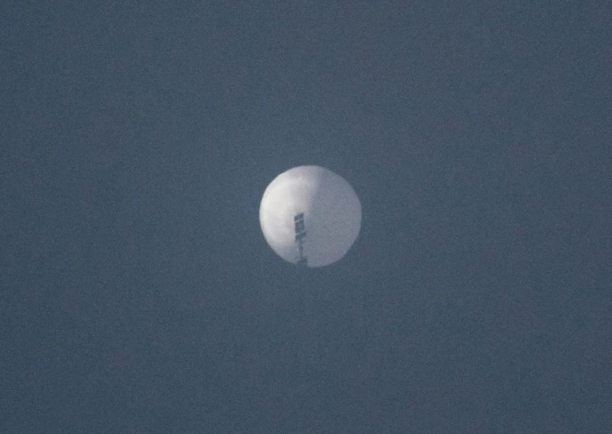
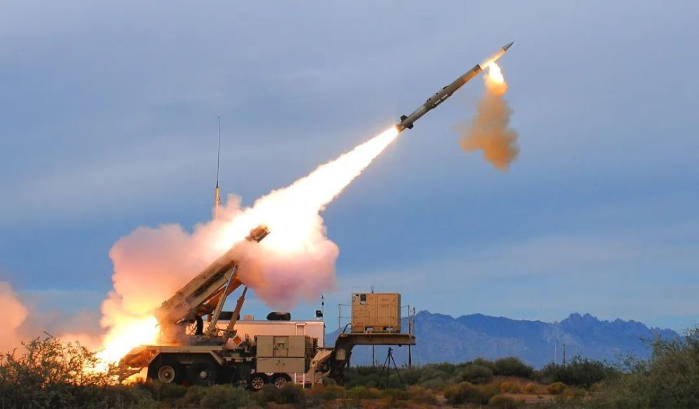

# 五角大楼为何选择不击落中国的“流浪气球”

中国“流浪气球”继续在美国处于新闻爆点的位置。五角大楼3号称，中国的“流浪气球”目前处于美国中部位置并且随气流继续东移，还说该气球“有动力”。五角大楼拒绝给出进一步的详细信息，不过它一再强调该气球不对地面人员和目标构成威胁。很多中国网友感觉很解恨，宁愿把这只“流浪气球”看成中国对美国有史以来的首次“出击”，并且热捧一种说法：美军“缺少击落它的能力”。

中国外交部的声明中对这只“流浪气球”使用了“飞艇”的表述。据了解，2万米以上平流层飞艇目前在全球都处在研发阶段，中国走得比较靠前。通过老胡查阅资料和向专业人士了解，
**这艘飞艇应该是一艘实验艇，并非已经定型的成熟飞艇，现在全世界还没有很成熟的平流层飞艇。这艘飞艇飘到美国上空，肯定是因为失控了。**
中国公司的平流层飞艇，设计目标应该是只用于中国大陆和近海上空，现阶段不可能有让它长途飞行跑到美国上空执行任务的设计，那太超前了，完全不可思议。

美国和欧洲都在搞平流层飞艇研究，但进展并不顺利。中国的这艘平流层飞艇飞到美国上空，虽是被高空气流意外带过去的，但仍可能让美国有的人感到一些震动。因为中国的飞艇毕竟升上去了，长期在空，失控的问题今后应能逐渐解决。

至于美国为何不把这只“流浪气球”打下来，可能有以下几个原因：

第一， **击落它美军应该有能力，但它操作上的难度比较高，不是一件很容易的事情。**
中国的红旗-9和S-300、美国的萨德和爱国者最大射高都在2万米以上，反导导弹有能力击中平流层的飞行物，战斗机的升限虽没有那么高，但是可以通过发射空对空导弹击落3万米左右的物体。总之，反导系统其中的一个拦截段就是平流层。

_美国爱国者-3防空导弹_

但是飞艇体积巨大，必须打到它的关键部位，才能将其击落。如果只是打到巨大的、通常比篮球场还大的气囊上，即使钻出一个洞，飞艇也能继续留空很长时间，一时不起作用。美军之前没有击落过平流层的飞艇，
**如果美军宣布要击落这艘中国的失控飞艇，系他们第一次做这样的事情，存在一开始打了几次打不下来的风险，那对美军将是很丢脸的事情。**

第二，美方很清楚这是一个失控的实验飞艇，确实不构成威胁。另外飞艇上究竟装载了什么，击落后产生的碎片有无危害，他们的确心里没底。

第三， **这只“流浪气球”飘在美国上空一段时间，被美国政治和舆论精英们共同打造成了“中国威胁美国”的活标签，非常有利于煽动美国社会反华仇华情绪。**
如此生动的素材难得一现，
这是美国一些精英一边嘴上骂，一边在心中窃喜的。这个飞艇用不了很久就会飘出美国，在这期间他们营造并享受一番抹黑中国的“嘉年华”，比他们费力气击落“流浪气球”并且冒万一击落不顺利的风险更加划算。

第四， **五角大楼可能抱有通过某种办法“活捉”这艘中国飞艇的一线希望，**
也就是把它完整降落到地面上，这在技术上非常难，美国的五角大楼可能在组织科学家研究办法，但如果他们真的在做这种努力，估计只能是瞎折腾。

_美国共和党激进参议员马克·卢比奥鼓吹该飞艇是“中国的间谍活动”。_

中国飞艇飘到了美国，一方面证明中国的平流层飞艇研究取得很大进展，一方面说明中国相关公司的技术还不成熟，飞艇的失控问题未得到根本解决。技术进展和它的不成熟是飞艇研究现状的两面，有的人为它“吓了美国人一跳”而骄傲，有的人为它不成熟并且惹出外交纠纷而不开心，各有各的道理。
**由于大多数人不了解情况，美国那边一些政治和舆论精英带节奏并展现政治姿态有了巨大表演空间。**

