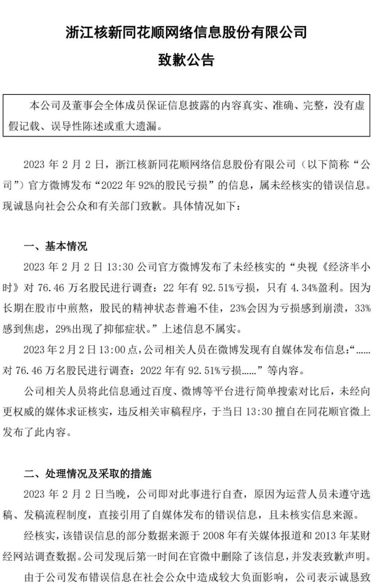
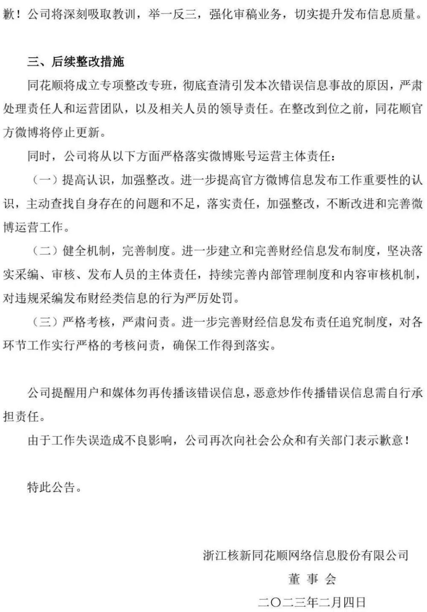
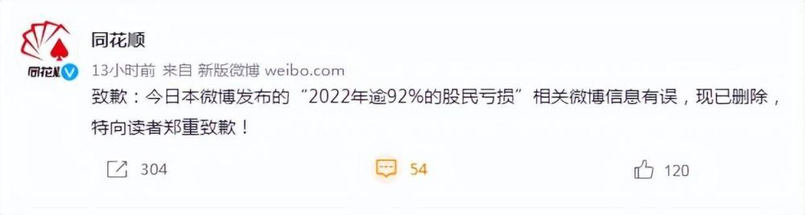

# 同花顺再次道歉：停止更新！

同花顺2月3日晚间发布致歉公告，2月2日，公司官方微博发布“2022年92%的股民亏损”的信息，属未经核实的错误信息。由于公司发布错误信息在社会公众中造成较大负面影响，公司表示诚恳致歉！

同花顺称，将成立专项整改专班，彻底查清引发本次错误信息事故的原因，严肃处理责任人和运营团队，以及相关人员的领导责任。在整改到位之前，同花顺官方微博将停止更新。

据此前报道，2月2日晚间，同花顺（300033.SZ）在官方微博发文道歉称，其早前发布“2022年逾92%的股民亏损”的相关微博信息有误，现已删除，特向读者郑重致歉！

截图自微博

来源：证券时报、同花顺深交所公告、此前报道

