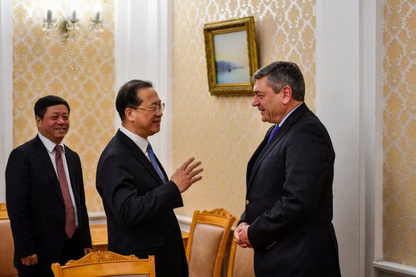
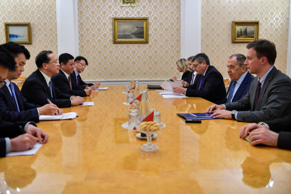
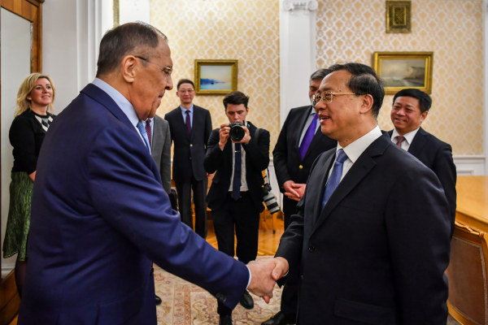

# 外交部副部长马朝旭赴俄罗斯举行中俄外交部门磋商

2023年2月2日至3日，外交部副部长马朝旭赴俄罗斯举行中俄外交部门磋商，其间分别会见俄外长拉夫罗夫，同俄副外长鲁登科、维尔什宁举行磋商。

马朝旭同俄方就中俄关系、两国双多边协作以及共同关心的国际和地区问题深入交换意见，强调在习近平主席和普京总统战略引领下，中俄新时代全面战略协作伙伴关系始终保持高水平发展势头。两国政治互信持续深化，各领域合作稳步推进，国际协作更加紧密。中方愿同俄方一道，认真落实两国元首达成的重要共识，推动双边关系在新的一年取得新进展。

俄方表示，愿同中方加强交流合作，落实好两国元首达成的重要共识，深化双多边层面战略协作，密切在国际和地区事务中的沟通协调，推动俄中关系达到更高水平。

