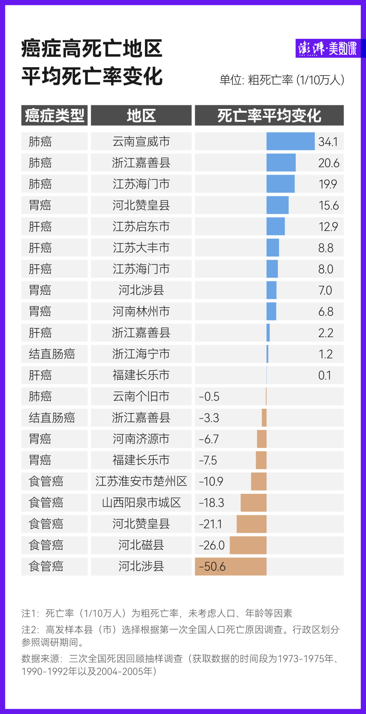
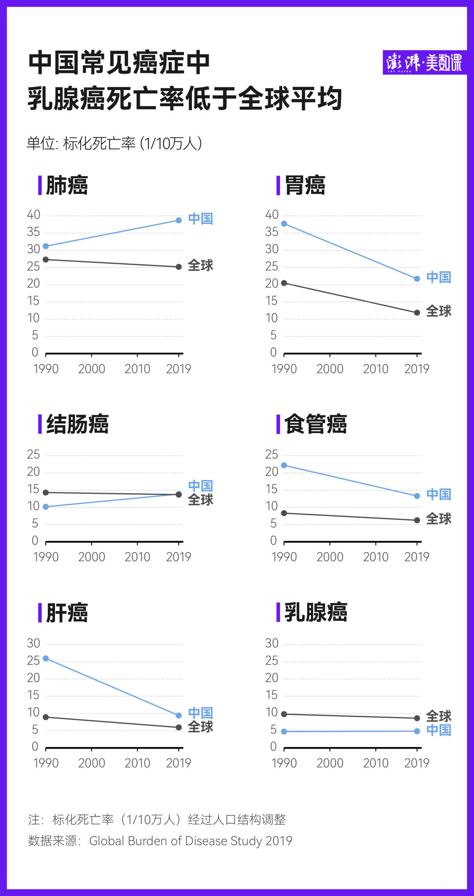

# 数说中国癌症死亡50年：肺癌增长最快，乳腺癌近年低于全球平均

2023年2月4日是第24个世界癌症日。

世界卫生组织指出，全世界有五分之一的人在其一生会患上癌症，预防癌症已成为 21 世纪最重大的公共卫生挑战之一。

1974年以来，中国开展过三次以肿瘤为重点的全国人口死因回顾调查。结合最新发布的中国肿瘤登记年报，澎湃新闻记者尝试解读近50年以来，中国居民癌症（恶性肿瘤）死亡率变化。

**肺癌死亡率近50年涨了快9倍**

在近50年中国居民死因的跟踪调查中，癌症是中国人最主要的三大死因之一。2020年，癌症死亡率在中国人全死因中占到23.87%，仅次于心脏病。相当于每5个死亡的人里就有1个是死于癌症。

在各类癌症中， **肺癌、肝癌、胃癌、食管癌和结直肠癌是中国居民死亡率最高的五大癌症。**
其中，肺癌死亡率的增长速度最快，2017年粗死亡率（不考虑人口等因素）较上世纪70年代涨了快9倍。对比来看，2017年中国肝癌、胃癌的粗死亡率较全国三次死因调查期间（1973年—2005年）出现了回落的趋势。

分性别来看，男性五大癌症的死亡率在历次调查中均高于女性。差异最显著的是肺癌和肝癌，2017年男性粗死亡率几乎是女性的两倍。值得关注的是，女性乳腺癌死亡率近年来有明显的上升趋势，2017年已成为女性第五大癌症死因。

**三种癌症死亡率，农村变得比城市更高**

除了性别差异，中国常见癌症的死亡率还存在城乡流动变化。

上图以对角线为分割，白色区域是农村死亡率高于城市的癌症，紫色区域是城市死亡率高于农村的癌症。2017年较上世纪70年代，中国肺癌、肝癌和胃癌的死亡率从城市更高转向农村更高；结直肠癌的死亡率则从农村更高转向城市更高。

在城市地区，乳腺癌、结直肠癌是主要的死亡率高发癌症，在近期调研中呈上升趋势。在农村地区，食管癌、胃癌、肝癌是主要的死亡率高发癌症，在近期调研中呈下降趋势。

厦门大学附属中山医院肿瘤科副主任医师潘战在光明网发表的分析文章（2022年）中指出， **目前中国癌症的特点是“穷癌”下降，“富癌”上升。**

以前中国低发而发达国家高发的所谓“富癌”，比如结直肠癌、乳腺癌等，呈现持续上升趋势。这些癌症的发病跟现代式“富贵”生活方式有相当的关系，特别是肥胖、久坐缺乏运动、精神压力大等。

而中国传统高发而且预后较差的所谓“穷癌”比如食管癌、胃癌、肝癌等，死亡率则逐年降低。但下降并不明显，仍旧居相对较高位。这种“穷癌”“富癌”并存的局面，导致我国的癌症防治难度巨大。

除了城乡差异，中国癌症死亡率还存在地方性高发的情况。针对不同癌症类型，“高发”指该地区某类癌症死亡率高于全国平均水平1.6倍至5倍。根据第一次全国人口死亡原因调查的结果，专家将18个省的39个地区作为癌症高发样本，并进行了回访。

总体来看，部分癌症高发地区的死亡率变化符合中国总体趋势。在肺癌高发的4个典型县（市）中，有3个县（市）的肺癌死亡率都在上升。而在食管癌高发的5个典型县（市），食管癌死亡率都出现了下降。

**中国乳腺癌死亡率低于全球平均**

全球疾病负担（GBD）1990年至2019年数据显示，肺癌、结肠癌在中国的死亡率逐年上升，呈现了与全球相反的增长趋势。肝癌、胃癌和食管癌的死亡率与全球下降趋势一致，但死亡率均高于全球平均水平。

在中国较常见的六大癌症中，只有乳腺癌的死亡率低于全球平均水平，并且增长趋势平稳。据央视新闻报道，目前我国乳腺癌患者总体的5年生存率已超过80%，北京、上海、广州等城市三甲医院早期乳腺癌的5年生存率甚至达到了90%以上，和西方发达国家基本一致。

（澎湃新闻记者陈良贤对此文亦有贡献）

参考资料：

1、联合国 -《世卫组织新平台促进全球癌症预防》，https://news.un.org/zh/story/2022/02/1098782

2、《中国死因监测数据集2020》，https://ncncd.chinacdc.cn/xzzq_1/202101/t20210111_223706.htm

3、《2020中国肿瘤登记年报》，人民卫生出版社

4、光明网
-《“穷癌”下降，“富癌”上升……最新癌症数据有4个特点》，https://www.toutiao.com/article/7124831221934522910/

5、央视网 -《全国肿瘤防治宣传周
我国年新增乳腺癌患者42万人》，https://tv.cctv.com/2022/04/15/VIDE7pMkdI3bdPNi0O8pzBym220415.shtml

6、李冰、黎均耀 -《中国恶性肿瘤的死亡情况和分布特点》，中国肿瘤杂志1980年第2卷第1期

7、李连弟等 -《1990~1992年中国恶性肿瘤死亡流行分布情况分析》，中国肿瘤杂志1996年11月第18卷第6期

8、陈竺主编 - 《全国三次死因回顾抽样调查报告》，中国协和医科大学出版社

